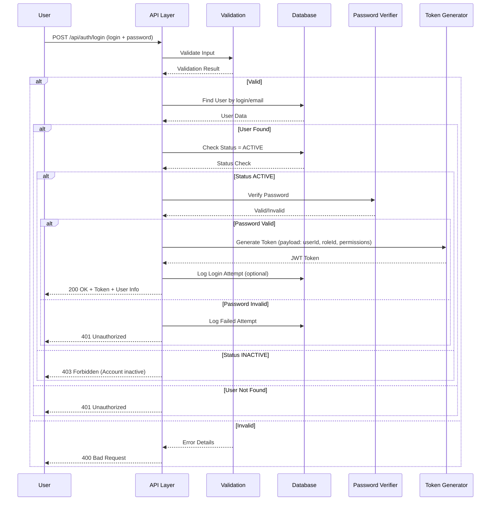
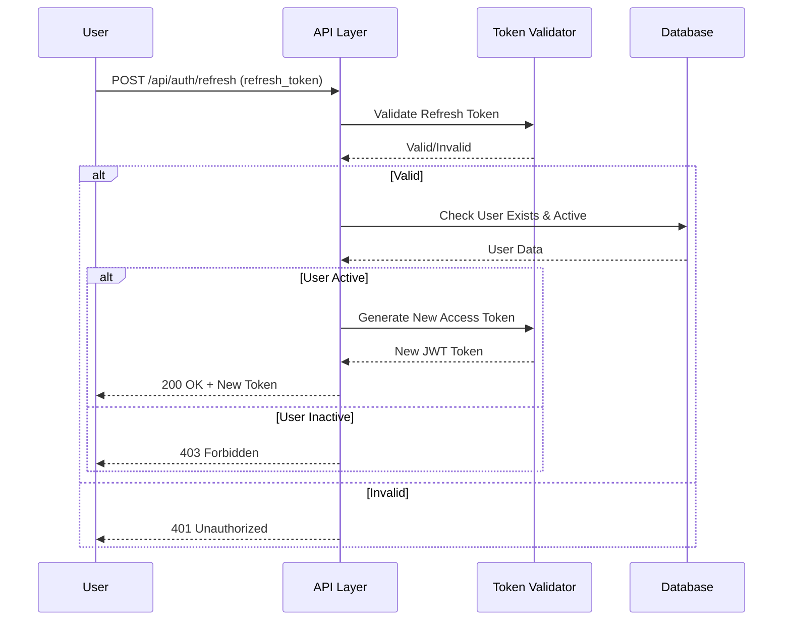
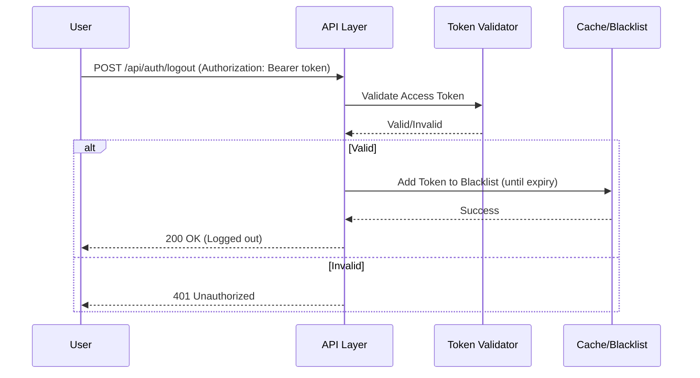
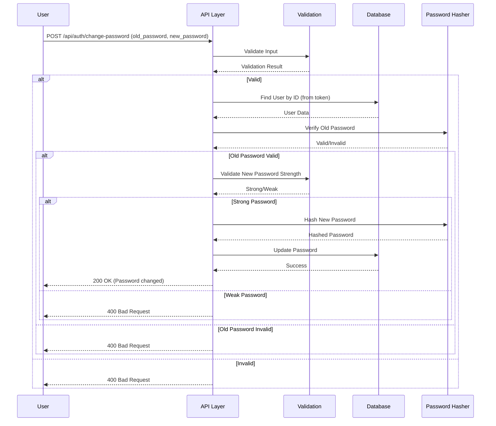
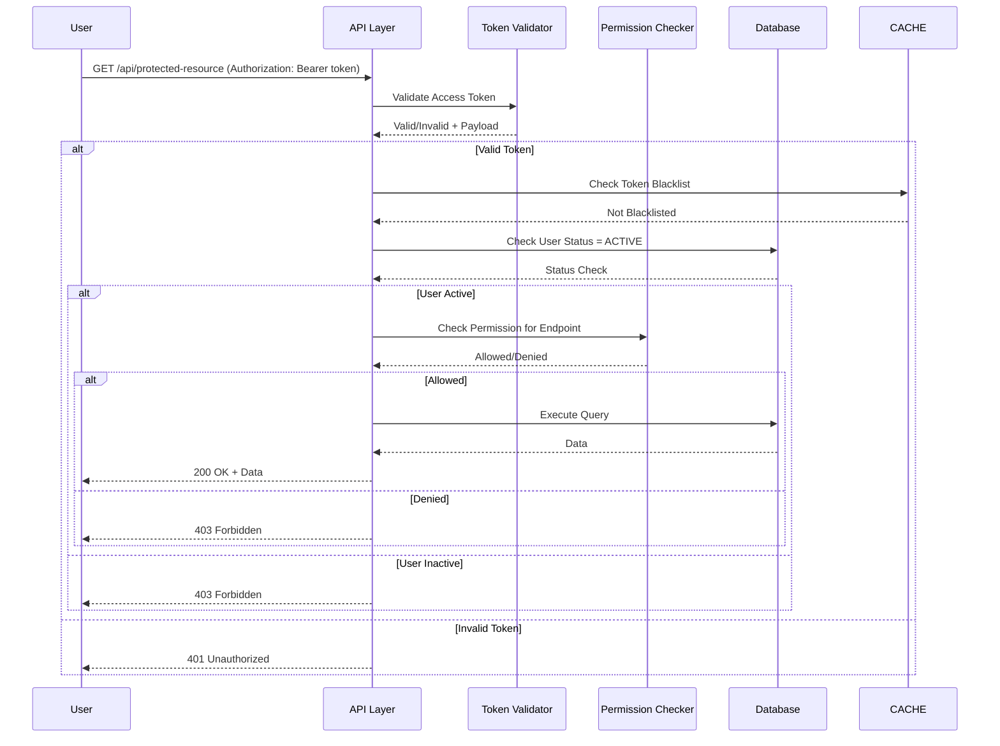

# 📄 FAYL: `08-auth-management.md`

```markdown
# 08. Autentifikatsiya va Avtorizatsiya Boshqaruvi (Auth Management)

---

## 📋 UMUMIY MA'LUMOT

| Maydon | Qiymat |
|--------|--------|
| **Flow ID** | 08 |
| **Phase** | 1 - Foundation |
| **Model** | `User`, `UserRole` |
| **Status** | Draft |
| **Yaratilgan Sana** | 2024-01-15 |
| **Oxirgi Yangilanish** | 2024-01-15 |
| **Mas'ul** | Senior Backend Developer |
| **Bog'liq Model** | `User` (RFC-002), `UserRole` (RFC-001) |

---

## 🎯 MAQSAD

Tizimga xavfsiz kirish (autentifikatsiya) va foydalanuvchi huquqlarini boshqarish (avtorizatsiya). JWT token orqali sessiyani boshqarish, parol xavfsizligini ta'minlash va har bir so'rovni autentifikatsiya qilish.

---

## 👥 MAS'UL ROLLAR

| Rol | Login | Logout | Password Change | Token Refresh | Tavsif |
|-----|-------|--------|-----------------|---------------|--------|
| **Admin** | ✅ | ✅ | ✅ | ✅ | To'liq huquq |
| **Doctor** | ✅ | ✅ | ✅ | ✅ | O'z profilini boshqarish |
| **Nurse** | ✅ | ✅ | ✅ | ✅ | O'z profilini boshqarish |
| **Receptionist** | ✅ | ✅ | ✅ | ✅ | O'z profilini boshqarish |
| **Accountant** | ✅ | ✅ | ✅ | ✅ | O'z profilini boshqarish |

---

## 📊 PRISMA MODEL (Reference: `klinika_prisma.txt`)

### User Model (Auth uchun asosiy)

```prisma
model User {
  id          Int          @id @default(autoincrement())
  role_id     Int?         @map("role_id")
  full_name   String       @db.VarChar(100)
  login       String       @db.VarChar(50)
  password    String       @db.VarChar(255)
  phone       String?      @db.VarChar(20)
  email       String?      @db.VarChar(100)
  description String?      @db.Text
  status      RecordStatus @default(ACTIVE)
  created_at  Timestamptz  @default(now())
  updated_at  Timestamptz  @updatedAt
  deleted_at  Timestamptz?

  // Relations
  role        UserRole?    @relation("fk_user_role", fields: [role_id], references: [id], onDelete: SetNull, onUpdate: Cascade)

  @@index([role_id])
  @@index([login])
  @@index([status])
  @@index([created_at])
  @@index([deleted_at])
  @@unique([login])
  @@unique([email])
  @@map("users")
}
```

### UserRole Model (Permissions uchun)

```prisma
model UserRole {
  id          Int          @id @default(autoincrement())
  name        String       @db.VarChar(50)
  description String?      @db.Text
  permissions Json?        @db.JsonB
  status      RecordStatus @default(ACTIVE)
  created_at  Timestamptz  @default(now())
  updated_at  Timestamptz  @updatedAt
  deleted_at  Timestamptz?

  users User[] @relation("fk_user_role")

  @@index([status])
  @@index([name])
  @@map("user_roles")
}
```

### Model Maydonlari Tafsiloti (Auth uchun muhim)

| Maydon | Tip | Majburiy | Default | DB Tip | Izoh/Tavsif |
|--------|-----|----------|---------|--------|-------------|
| `login` | String | ✅ | - | VARCHAR(50) | **Kirish logini**. Unikal, 3-50 belgi. Autentifikatsiya uchun asosiy maydon |
| `password` | String | ✅ | - | VARCHAR(255) | **Hash qilingan parol**. bcrypt/argon2 bilan shifrlangan. Hech qachon plain text saqlanmaydi |
| `email` | String | ❌ | null | VARCHAR(100) | **Email manzil**. Unikal, valid email format. Login uchun alternativ sifatida ishlatilishi mumkin |
| `status` | Enum | ✅ | ACTIVE | VARCHAR | **Holat**. ACTIVE bo'lmagan userlar kira olmaydi |
| `role_id` | Int | ❌ | null | INTEGER | **Foreign Key**. UserRole jadvaliga bog'lanish. User ruxsatlarini aniqlash uchun |

---

## 🔄 FLOW DIAGRAM

### 1. Login Flow (Autentifikatsiya)



### 2. Token Refresh Flow



### 3. Logout Flow



### 4. Password Change Flow



### 5. Protected Route Access Flow



---

## 📝 BOSQICHMA-BOSQICH JARAYON

### BOSQICH 1: Login (Autentifikatsiya)

#### 1.1. Input Ma'lumotlari

```typescript
interface LoginDto {
  login: string;    // Login yoki email
  password: string; // Parol
}
```

#### 1.2. Validatsiya Qoidalari

```typescript
// Login validatsiya
{
  minLength: 3,
  maxLength: 100,
  required: true
}

// Password validatsiya
{
  minLength: 1,
  maxLength: 255,
  required: true
}

// Rate limiting
{
  maxAttempts: 5,        // 5 ta urinish
  lockoutTime: 900000,   // 15 daqiqa blok
  trackBy: 'ip_address'  // IP address bo'yicha kuzatish
}
```

#### 1.3. Biznes Logika

```typescript
// auth.service.ts
async login(loginDto: LoginDto, ipAddress: string): Promise<{ user: User; token: string; refreshToken: string }> {
  // 1. Rate limit tekshirish
  const attempts = await this.cacheService.get(`login_attempts:${ipAddress}`);
  if (attempts >= 5) {
    throw new TooManyRequestsException('AUTH_010');
  }

  // 2. User topish (login yoki email orqali)
  const user = await this.prisma.user.findFirst({
    where: {
      OR: [
        { login: loginDto.login },
        { email: loginDto.login }
      ],
      deleted_at: null
    },
    include: {
      role: {
        select: { id: true, name: true, permissions: true }
      }
    }
  });

  if (!user) {
    await this.cacheService.increment(`login_attempts:${ipAddress}`, { ttl: 900 });
    throw new UnauthorizedException('AUTH_001');
  }

  // 3. Status tekshirish
  if (user.status !== 'ACTIVE') {
    throw new ForbiddenException('AUTH_002');
  }

  // 4. Password tekshirish
  const isValid = await bcrypt.compare(loginDto.password, user.password);
  if (!isValid) {
    await this.cacheService.increment(`login_attempts:${ipAddress}`, { ttl: 900 });
    throw new UnauthorizedException('AUTH_001');
  }

  // 5. Rate limit reset
  await this.cacheService.del(`login_attempts:${ipAddress}`);

  // 6. JWT Access Token yaratish
  const accessToken = this.jwtService.sign({
    sub: user.id,
    login: user.login,
    role_id: user.role_id,
    role_name: user.role?.name,
    type: 'access',
    iat: Math.floor(Date.now() / 1000),
    exp: Math.floor(Date.now() / 1000) + (24 * 60 * 60) // 24 soat
  });

  // 7. JWT Refresh Token yaratish
  const refreshToken = this.jwtService.sign({
    sub: user.id,
    type: 'refresh',
    iat: Math.floor(Date.now() / 1000),
    exp: Math.floor(Date.now() / 1000) + (7 * 24 * 60 * 60) // 7 kun
  });

  // 8. Refresh token saqlash (Redis)
  await this.cacheService.set(`refresh_token:${user.id}`, refreshToken, { ttl: 604800 });

  // 9. Password response dan olib tashlash
  delete user.password;

  return { user, token: accessToken, refreshToken };
}
```

#### 1.4. JWT Token Struktura

```json
{
  "sub": 1,
  "login": "admin",
  "role_id": 1,
  "role_name": "Admin",
  "type": "access",
  "iat": 1704067200,
  "exp": 1704153600
}
```

---

### BOSQICH 2: Token Refresh

#### 2.1. Input Ma'lumotlari

```typescript
interface RefreshTokenDto {
  refreshToken: string;
}
```

#### 2.2. Biznes Logika

```typescript
async refreshToken(refreshTokenDto: RefreshTokenDto): Promise<{ accessToken: string; refreshToken: string }> {
  // 1. Refresh token validate qilish
  const payload = await this.jwtService.verifyAsync(refreshTokenDto.refreshToken, {
    secret: process.env.JWT_REFRESH_SECRET
  });

  // 2. Token type tekshirish
  if (payload.type !== 'refresh') {
    throw new UnauthorizedException('AUTH_003');
  }

  // 3. Redis dan token tekshirish
  const storedToken = await this.cacheService.get(`refresh_token:${payload.sub}`);
  if (!storedToken || storedToken !== refreshTokenDto.refreshToken) {
    throw new UnauthorizedException('AUTH_004');
  }

  // 4. User mavjudligini va active ekanligini tekshirish
  const user = await this.prisma.user.findUnique({
    where: { id: payload.sub },
    include: { role: true }
  });

  if (!user || user.deleted_at || user.status !== 'ACTIVE') {
    await this.cacheService.del(`refresh_token:${payload.sub}`);
    throw new ForbiddenException('AUTH_002');
  }

  // 5. Yangi access token yaratish
  const accessToken = this.jwtService.sign({
    sub: user.id,
    login: user.login,
    role_id: user.role_id,
    role_name: user.role?.name,
    type: 'access',
    iat: Math.floor(Date.now() / 1000),
    exp: Math.floor(Date.now() / 1000) + (24 * 60 * 60)
  });

  // 6. Yangi refresh token yaratish
  const newRefreshToken = this.jwtService.sign({
    sub: user.id,
    type: 'refresh',
    iat: Math.floor(Date.now() / 1000),
    exp: Math.floor(Date.now() / 1000) + (7 * 24 * 60 * 60)
  });

  // 7. Eski refresh token o'chirish, yangisini saqlash
  await this.cacheService.del(`refresh_token:${payload.sub}`);
  await this.cacheService.set(`refresh_token:${payload.sub}`, newRefreshToken, { ttl: 604800 });

  return { accessToken, refreshToken: newRefreshToken };
}
```

---

### BOSQICH 3: Logout

#### 3.1. Biznes Logika

```typescript
async logout(userId: number, refreshToken?: string): Promise<void> {
  // 1. Refresh token blacklist ga qo'shish
  if (refreshToken) {
    const payload = await this.jwtService.verifyAsync(refreshToken, {
      secret: process.env.JWT_REFRESH_SECRET,
      ignoreExpiration: true
    });
    
    const expiresIn = payload.exp * 1000 - Date.now();
    if (expiresIn > 0) {
      await this.cacheService.set(`blacklist:${refreshToken}`, 'true', { 
        ttl: Math.floor(expiresIn / 1000) 
      });
    }
  }

  // 2. User refresh token o'chirish
  await this.cacheService.del(`refresh_token:${userId}`);
}
```

---

### BOSQICH 4: Password O'zgartirish

#### 4.1. Input Ma'lumotlari

```typescript
interface ChangePasswordDto {
  old_password: string;
  new_password: string;
}
```

#### 4.2. Password Strength Validatsiya

```typescript
private validatePasswordStrength(password: string): { valid: boolean; errors: string[] } {
  const errors = [];
  
  if (password.length < 8) {
    errors.push('Parol kamida 8 belgi bo\'lishi kerak');
  }
  
  if (!/[A-Z]/.test(password)) {
    errors.push('Kamida 1 ta katta harf bo\'lishi kerak');
  }
  
  if (!/[a-z]/.test(password)) {
    errors.push('Kamida 1 ta kichik harf bo\'lishi kerak');
  }
  
  if (!/[0-9]/.test(password)) {
    errors.push('Kamida 1 ta raqam bo\'lishi kerak');
  }
  
  if (!/[!@#$%^&*(),.?":{}|<>]/.test(password)) {
    errors.push('Kamida 1 ta maxsus belgi bo\'lishi kerak');
  }
  
  return {
    valid: errors.length === 0,
    errors
  };
}
```

#### 4.3. Biznes Logika

```typescript
async changePassword(userId: number, changePasswordDto: ChangePasswordDto): Promise<void> {
  // 1. User topish
  const user = await this.prisma.user.findUnique({
    where: { id: userId }
  });

  if (!user || user.deleted_at) {
    throw new NotFoundException('AUTH_005');
  }

  // 2. Eski password tekshirish
  const isValid = await bcrypt.compare(changePasswordDto.old_password, user.password);
  if (!isValid) {
    throw new BadRequestException('AUTH_006');
  }

  // 3. Yangi password strength tekshirish
  const strength = this.validatePasswordStrength(changePasswordDto.new_password);
  if (!strength.valid) {
    throw new BadRequestException({
      code: 'AUTH_007',
      errors: strength.errors
    });
  }

  // 4. Yangi password hash va saqlash
  const hashedPassword = await bcrypt.hash(changePasswordDto.new_password, 10);
  
  await this.prisma.user.update({
    where: { id: userId },
    data: {
      password: hashedPassword,
      updated_at: new Date()
    }
  });

  // 5. Barcha refresh tokenlarni o'chirish (security)
  await this.cacheService.del(`refresh_token:${userId}`);
}
```

---

### BOSQICH 5: Protected Route Guard

#### 5.1. JWT Guard Implementation

```typescript
// jwt-auth.guard.ts
@Injectable()
export class JwtAuthGuard extends AuthGuard('jwt') {
  canActivate(context: ExecutionContext): Observable<boolean> | Promise<boolean> | boolean {
    return super.canActivate(context);
  }

  handleRequest(err: any, user: any, info: any): any {
    if (err || !user) {
      throw err || new UnauthorizedException('AUTH_008');
    }
    return user;
  }
}
```

#### 5.2. Roles Guard Implementation

```typescript
// roles.guard.ts
@Injectable()
export class RolesGuard implements CanActivate {
  constructor(
    private reflector: Reflector,
    private prisma: PrismaService
  ) {}

  async canActivate(context: ExecutionContext): Promise<boolean> {
    const requiredRoles = this.reflector.getAllAndOverride<Role[]>('roles', [
      context.getHandler(),
      context.getClass(),
    ]);

    if (!requiredRoles) {
      return true;
    }

    const { user } = context.switchToHttp().getRequest();
    
    // User status tekshirish
    const dbUser = await this.prisma.user.findUnique({
      where: { id: user.sub },
      include: { role: true }
    });

    if (!dbUser || dbUser.deleted_at || dbUser.status !== 'ACTIVE') {
      throw new ForbiddenException('AUTH_002');
    }

    // Role tekshirish
    const hasRole = requiredRoles.some((role) => dbUser.role?.name === role);
    
    if (!hasRole) {
      throw new ForbiddenException('AUTH_009');
    }

    return true;
  }
}
```

#### 5.3. Permissions Guard Implementation

```typescript
// permissions.guard.ts
@Injectable()
export class PermissionsGuard implements CanActivate {
  constructor(private reflector: Reflector) {}

  canActivate(context: ExecutionContext): boolean {
    const requiredPermissions = this.reflector.getAllAndOverride<string[]>('permissions', [
      context.getHandler(),
      context.getClass(),
    ]);

    if (!requiredPermissions) {
      return true;
    }

    const { user } = context.switchToHttp().getRequest();
    
    // User permissions tekshirish
    const userPermissions = user.permissions || {};
    
    const hasPermission = requiredPermissions.every((permission) => {
      const [module, action] = permission.split('.');
      return userPermissions[module]?.[action] === true;
    });

    if (!hasPermission) {
      throw new ForbiddenException('AUTH_009');
    }

    return true;
  }
}
```

---

## 🔌 API ENDPOINT'LAR

### 1. Login

| Parametr | Qiymat |
|----------|--------|
| **Method** | POST |
| **Endpoint** | `/api/v1/auth/login` |
| **Auth** | ❌ No Auth |
| **Rol** | Barchasi |
| **Rate Limit** | 5 urinish / 15 daqiqa |

**Request Body:**
```json
{
  "login": "admin",
  "password": "Admin@123"
}
```

**Response (200 OK):**
```json
{
  "success": true,
  "message": "Muvaffaqiyatli kirish",
  "data": {
    "user": {
      "id": 1,
      "full_name": "System Administrator",
      "login": "admin",
      "email": "admin@clinic.com",
      "role": {
        "id": 1,
        "name": "Admin",
        "permissions": { ... }
      }
    },
    "accessToken": "eyJhbGciOiJIUzI1NiIsInR5cCI6IkpXVCJ9...",
    "refreshToken": "eyJhbGciOiJIUzI1NiIsInR5cCI6IkpXVCJ9...",
    "expiresIn": 86400,
    "tokenType": "Bearer"
  }
}
```

---

### 2. Refresh Token

| Parametr | Qiymat |
|----------|--------|
| **Method** | POST |
| **Endpoint** | `/api/v1/auth/refresh` |
| **Auth** | ❌ No Auth (refresh token required) |
| **Rol** | Barchasi |

**Request Body:**
```json
{
  "refreshToken": "eyJhbGciOiJIUzI1NiIsInR5cCI6IkpXVCJ9..."
}
```

**Response (200 OK):**
```json
{
  "success": true,
  "data": {
    "accessToken": "eyJhbGciOiJIUzI1NiIsInR5cCI6IkpXVCJ9...",
    "refreshToken": "eyJhbGciOiJIUzI1NiIsInR5cCI6IkpXVCJ9...",
    "expiresIn": 86400,
    "tokenType": "Bearer"
  }
}
```

---

### 3. Logout

| Parametr | Qiymat |
|----------|--------|
| **Method** | POST |
| **Endpoint** | `/api/v1/auth/logout` |
| **Auth** | ✅ JWT Required |
| **Rol** | Barchasi |

**Request Body:**
```json
{
  "refreshToken": "eyJhbGciOiJIUzI1NiIsInR5cCI6IkpXVCJ9..."
}
```

**Response (200 OK):**
```json
{
  "success": true,
  "message": "Muvaffaqiyatli chiqish"
}
```

---

### 4. Change Password

| Parametr | Qiymat |
|----------|--------|
| **Method** | POST |
| **Endpoint** | `/api/v1/auth/change-password` |
| **Auth** | ✅ JWT Required |
| **Rol** | Barchasi |

**Request Body:**
```json
{
  "old_password": "Admin@123",
  "new_password": "NewAdmin@456"
}
```

**Response (200 OK):**
```json
{
  "success": true,
  "message": "Parol muvaffaqiyatli o'zgartirildi"
}
```

---

### 5. Get Current User (Me)

| Parametr | Qiymat |
|----------|--------|
| **Method** | GET |
| **Endpoint** | `/api/v1/auth/me` |
| **Auth** | ✅ JWT Required |
| **Rol** | Barchasi |

**Response (200 OK):**
```json
{
  "success": true,
  "data": {
    "id": 1,
    "full_name": "System Administrator",
    "login": "admin",
    "email": "admin@clinic.com",
    "phone": "+998900000000",
    "role": {
      "id": 1,
      "name": "Admin",
      "permissions": {
        "client": { "create": true, "read": true, "update": true, "delete": true },
        "visit": { "create": true, "read": true, "update": true, "delete": true },
        "payment": { "create": true, "read": true, "update": true, "delete": true }
      }
    },
    "status": "ACTIVE",
    "created_at": "2024-01-15T10:00:00.000Z"
  }
}
```

---

## ⚠️ XATOLIKLAR VA HANDLING

| Kod | HTTP Status | Xabar | Sabab | Yechim |
|-----|-------------|-------|-------|--------|
| `AUTH_001` | 401 Unauthorized | Login yoki parol noto'g'ri | Authentication failed | Ma'lumotlarni tekshiring |
| `AUTH_002` | 403 Forbidden | Account blokirovka qilingan | User status !== ACTIVE | Admin bilan bog'laning |
| `AUTH_003` | 401 Unauthorized | Noto'g'ri token turi | Token type mismatch | To'g'ri token ishlatilsin |
| `AUTH_004` | 401 Unauthorized | Token amal qilish muddati tugagan | Token expired | Refresh token yoki qayta login |
| `AUTH_005` | 404 Not Found | Foydalanuvchi topilmadi | User ID not exists | ID ni tekshiring |
| `AUTH_006` | 400 Bad Request | Eski parol noto'g'ri | Password mismatch | Eski parolni tekshiring |
| `AUTH_007` | 400 Bad Request | Yangi parol juda zaif | Password validation failed | Murakkabroq parol o'ylab toping |
| `AUTH_008` | 401 Unauthorized | Token noto'g'ri yoki amal qilmaydi | Invalid token | Qayta login qiling |
| `AUTH_009` | 403 Forbidden | Ruxsat yo'q | Insufficient permissions | Admin bilan bog'laning |
| `AUTH_010` | 429 Too Many Requests | Juda ko'p urinishlar | Rate limit exceeded | 15 daqiqa kuting |

---

## 🔐 XAVFSIZLIK TALABLARI (Reference: `Klinika.md`)

### 1. Password Hash
```typescript
// bcrypt konfiguratsiya (Reference: Klinika.md 8.1)
const saltRounds = 10;
const hash = await bcrypt.hash(password, saltRounds);
const isValid = await bcrypt.compare(password, hash);
```

**Talablar:**
- ✅ Algorithm: bcrypt
- ✅ Salt rounds: 10
- ✅ Min length: 8 characters
- ✅ Require uppercase: 1+
- ✅ Require lowercase: 1+
- ✅ Require digit: 1+
- ✅ Require special: 1+ (!@#$%^&*)

### 2. JWT Token Configuration
```typescript
// Access Token
{
  algorithm: 'HS256',
  expiresIn: '24h',
  secret: process.env.JWT_SECRET
}

// Refresh Token
{
  algorithm: 'HS256',
  expiresIn: '7d',
  secret: process.env.JWT_REFRESH_SECRET
}
```

### 3. Rate Limiting (Login uchun)
```typescript
// Login attempt limit (Reference: Klinika.md 8.1)
const maxAttempts = 5;
const lockoutTime = 15 * 60 * 1000; // 15 daqiqa

// Redis da saqlash
const key = `login_attempts:${ip_address}`;
const attempts = await redis.get(key);

if (attempts >= maxAttempts) {
  throw new TooManyRequestsException('AUTH_010');
}
```

### 4. Token Blacklist (Logout uchun)
```typescript
// Logout qilingan tokenlarni blacklist ga qo'shish
await redis.set(`blacklist:${token}`, 'true', {
  EX: tokenExpiryTimestamp
});

// Har bir so'rovda blacklist tekshirish
const isBlacklisted = await redis.get(`blacklist:${token}`);
if (isBlacklisted) {
  throw new UnauthorizedException('AUTH_004');
}
```

### 5. HTTPS (Reference: `Klinika.md` 8.1)
- ✅ Barcha so'rovlar HTTPS orqali amalga oshiriladi
- ✅ SSL/TLS sertifikat ishlatiladi
- ✅ HSTS header qo'shiladi

### 6. Audit (Reference: `klinika_prisma.txt` & `Klinika.md` 5.2)
| Maydon | Tavsif | Avtomatik |
|--------|--------|-----------|
| `created_at` | Yaratilgan vaqt | ✅ Prisma @default(now()) |
| `updated_at` | Oxirgi o'zgarish | ✅ Prisma @updatedAt |
| `deleted_at` | Soft delete vaqti | ❌ Manual set |
| `login_attempts` | Login urinishlar | ✅ Redis da saqlanadi |
| `last_login` | Oxirgi kirish | ⏳ Kelajakda qo'shiladi |

---

## 📦 SEED DATA (Reference: `Klinika.md` 3.1)

### Boshlang'ich Admin User

```typescript
// seed/auth.seed.ts
import * as bcrypt from 'bcrypt';

export async function seedAuth(prisma: PrismaClient) {
  // Admin user yaratish
  const adminPassword = await bcrypt.hash('Admin@123', 10);
  
  await prisma.user.upsert({
    where: { login: 'admin' },
    update: {},
    create: {
      full_name: 'System Administrator',
      login: 'admin',
      password: adminPassword,
      phone: '+998900000000',
      email: 'admin@clinic.com',
      role_id: 1, // Admin role (RFC-001 dan)
      description: 'Tizim administratori',
      status: 'ACTIVE'
    }
  });

  console.log('✅ Auth seed completed (Admin user created)');
  console.log('⚠️ Production da default parolni o\'zgartirish majburiy!');
}
```

### Seed Script Ishga Tushirish

```bash
# Development
npm run seed

# Production (ehtiyotkorlik bilan)
npm run seed:prod

# Faqat auth
npm run seed:auth
```

### Production Checklist

- [ ] Default admin parolini birinchi kirishda o'zgartirish
- [ ] JWT_SECRET va JWT_REFRESH_SECRET environment variable larni sozlash
- [ ] HTTPS sertifikat o'rnatish
- [ ] Rate limit konfiguratsiyasini production uchun sozlash

---

## 🔒 XAVFSIZLIK BEST PRACTICES (Reference: `Klinika.md` 8)

### 1. Password Security
- ✅ Hech qachon plain text saqlanmaydi
- ✅ bcrypt bilan hash qilinadi (salt rounds: 10)
- ✅ Password strength validatsiya
- ✅ Password history (kelajakda)

### 2. Token Security
- ✅ Access token: 24 soat
- ✅ Refresh token: 7 kun
- ✅ Token blacklist (logout uchun)
- ✅ HTTPS orqali uzatiladi

### 3. Rate Limiting
- ✅ Login: 5 urinish / 15 daqiqa
- ✅ IP address bo'yicha kuzatuv
- ✅ Redis da saqlash

### 4. Session Management
- ✅ Refresh token Redis da saqlanadi
- ✅ Logout qilinganda token o'chiriladi
- ✅ Password o'zgarganda barcha tokenlar o'chiriladi

### 5. Input Validation
- ✅ Barcha inputlar validatsiya qilinadi
- ✅ SQL Injection oldini olish (Prisma ORM)
- ✅ XSS oldini olish (sanitizatsiya)

---

## ✅ QABUL QILISH MEZONLARI (ACCEPTANCE CRITERIA)

### Functional Requirements
- [ ] Login login yoki email orqali ishlashi
- [ ] Password hash qilingan holda saqlanishi
- [ ] Password strength validatsiyasi ishlashi
- [ ] JWT access token yaratilishi va 24 soat amal qilishi
- [ ] JWT refresh token yaratilishi va 7 kun amal qilishi
- [ ] Token refresh ishlashi
- [ ] Logout qilinganda token blacklist ga qo'shilishi
- [ ] Password o'zgarganda barcha tokenlar o'chirilishi
- [ ] Rate limiting ishlashi (5 urinish / 15 daqiqa)
- [ ] User status !== ACTIVE bo'lsa login qilolmasligi
- [ ] Protected route'lar JWT bilan himoyalangan bo'lishi
- [ ] RBAC (Role-Based Access Control) ishlashi
- [ ] Permissions based access control ishlashi

### Non-Functional Requirements
- [ ] API response time < 200ms
- [ ] Login attempt tracking ishlashi
- [ ] Token validation time < 50ms
- [ ] Security audit o'tkazildi
- [ ] Documentation to'liq

---

## 📝 ESLATMALAR

1. **Password hech qachon plain text da saqlanmaydi** - Har doim bcrypt bilan hash qilinadi
2. **Login attempt limit** - 5 marta noto'g'ri urinish = 15 daqiqa blok (Reference: `Klinika.md` 8.1)
3. **Token expiry** - Access: 24 soat, Refresh: 7 kun
4. **Token blacklist** - Logout qilinganda token blacklist ga qo'shiladi
5. **HTTPS majburiy** - Production da barcha so'rovlar HTTPS orqali amalga oshiriladi
6. **Environment variables** - JWT_SECRET va JWT_REFRESH_SECRET .env da saqlanadi
7. **Default admin** - Production da default admin parolini o'zgartirish majburiy
8. **Audit trail** - Har bir login/logout harakati qayd etiladi (kelajakda)

---

**Hujjat Versiyasi:** 1.0
**Status:** Draft
**Tasdiqlagan:** _______________
**Sana:** _______________
