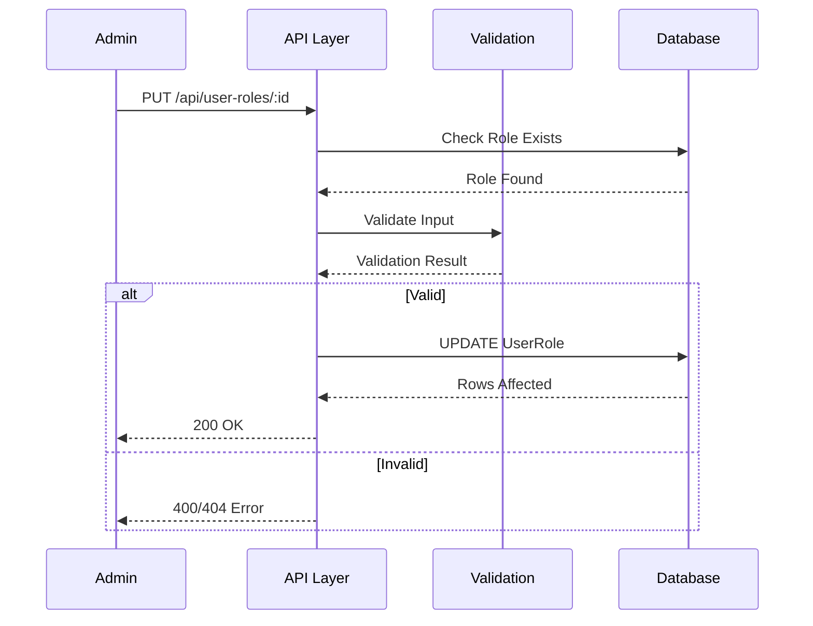
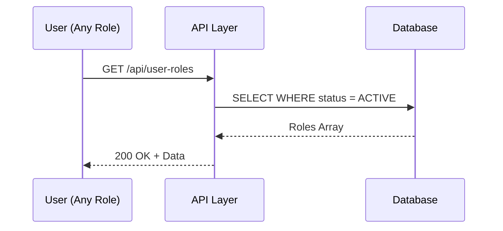
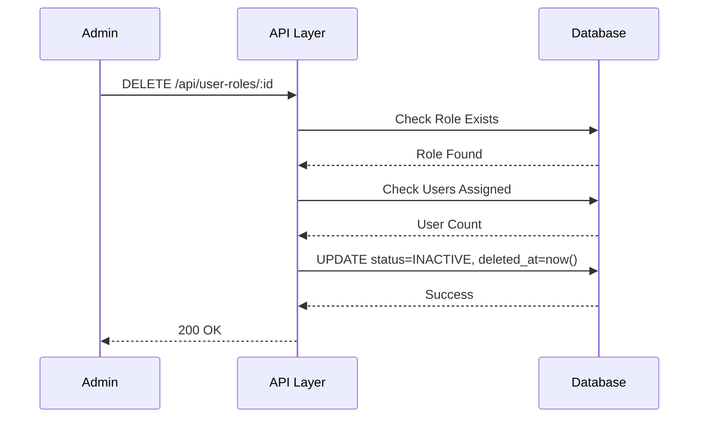

# 📄 FAYL: `01-user-role-management.md`

```markdown
# 01. Foydalanuvchi Rollarini Boshqarish (User Role Management)

---

## 📋 UMUMIY MA'LUMOT

| Maydon | Qiymat |
|--------|--------|
| **Flow ID** | 01 |
| **Phase** | 1 - Foundation |
| **Model** | `UserRole` |
| **Status** | Draft |
| **Yaratilgan Sana** | 2024-01-15 |
| **Oxirgi Yangilanish** | 2024-01-15 |
| **Mas'ul** | Senior Backend Developer |

---

## 🎯 MAQSAD

Tizimdagi foydalanuvchi rollarini yaratish, o'zgartirish, ko'rish va boshqarish. Har bir rolga aniq ruxsatlar (permissions) berish orqali tizim xavfsizligini ta'minlash.

---

## 👥 MAS'UL ROLLAR

| Rol | Create | Read | Update | Delete | Tavsif |
|-----|--------|------|--------|--------|--------|
| **Admin** | ✅ | ✅ | ✅ | ✅ | To'liq huquq |
| **Doctor** | ❌ | ✅ | ❌ | ❌ | Faqat ko'rish |
| **Nurse** | ❌ | ✅ | ❌ | ❌ | Faqat ko'rish |
| **Receptionist** | ❌ | ✅ | ❌ | ❌ | Faqat ko'rish |
| **Accountant** | ❌ | ✅ | ❌ | ❌ | Faqat ko'rish |

---

## 📊 MODEL TUZILISHI (Prisma Schema)

```prisma
model UserRole {
  id          Int          @id @default(autoincrement())
  name        String       @db.VarChar(50)
  description String?      @db.Text
  permissions Json?        @db.JsonB
  status      RecordStatus @default(ACTIVE)
  created_at  Timestamptz  @default(now())
  updated_at  Timestamptz  @updatedAt
  deleted_at  Timestamptz?
  
  users User[] @relation("fk_user_role")
  
  @@index([status])
  @@index([name])
  @@map("user_roles")
}
```

### Maydonlar Tafsiloti

| Maydon | Tip | Majburiy | Default | Cheklov | Tavsif |
|--------|-----|----------|---------|---------|--------|
| `id` | Int | ✅ (Auto) | - | Auto Increment | Unikal ID |
| `name` | String | ✅ | - | 3-50 belgi, Unikal | Rol nomi |
| `description` | String | ❌ | - | 0-255 belgi | Rol tavsifi |
| `permissions` | JSON | ❌ | null | Valid JSON | Ruxsatlar obyekti |
| `status` | Enum | ✅ | ACTIVE | ACTIVE/INACTIVE/ARCHIVED | Holat |
| `created_at` | Timestamptz | ✅ (Auto) | now() | - | Yaratilgan vaqt |
| `updated_at` | Timestamptz | ✅ (Auto) | now() | - | Yangilangan vaqt |
| `deleted_at` | Timestamptz | ❌ | null | - | O'chirilgan vaqt (Soft Delete) |

---

## 🔄 FLOW DIAGRAM

### 1. Rol Yaratish Flow


### 2. Rol Ro'yxatini Olish Flow


### 3. Rol Yangilash Flow


### 4. Rol O'chirish (Soft Delete) Flow


---

## 📝 BOSQICHMA-BOSQICH JARAYON

### BOSQICH 1: Rol Yaratish

#### 1.1. Input Ma'lumotlari
```typescript
interface CreateRoleDto {
  name: string;           // 3-50 belgi
  description?: string;   // 0-255 belgi
  permissions?: object;   // Valid JSON
  status?: string;        // ACTIVE/INACTIVE/ARCHIVED
}
```

#### 1.2. Validatsiya Qoidalari
```typescript
// Name validatsiya
{
  minLength: 3,
  maxLength: 50,
  pattern: /^[a-zA-Z0-9_\s-]+$/,  // Faqat harf, raqam, _, -, space
  unique: true                     // Bazada unikal
}

// Description validatsiya
{
  minLength: 0,
  maxLength: 255
}

// Permissions validatsiya
{
  type: 'object',
  optional: true,
  structure: {
    [module]: {
      create: boolean,
      read: boolean,
      update: boolean,
      delete: boolean
    }
  }
}

// Status validatsiya
{
  enum: ['ACTIVE', 'INACTIVE', 'ARCHIVED'],
  default: 'ACTIVE'
}
```

#### 1.3. Biznes Logika
```typescript
async createRole(data: CreateRoleDto, userId: number) {
  // 1. Name unikal ekanligini tekshirish
  const existing = await prisma.userRole.findFirst({
    where: {
      name: data.name,
      deleted_at: null
    }
  });
  
  if (existing) {
    throw new ConflictException('ROL_001');
  }
  
  // 2. Rol yaratish
  const role = await prisma.userRole.create({
    data: {
      name: data.name,
      description: data.description,
      permissions: data.permissions,
      status: data.status || 'ACTIVE',
      created_at: new Date(),
      updated_at: new Date()
    }
  });
  
  return role;
}
```

#### 1.4. Database Query
```prisma
INSERT INTO user_roles (
  name,
  description,
  permissions,
  status,
  created_at,
  updated_at
) VALUES (
  'Doctor',
  'Shifokor roli',
  '{"client": {"create": true, "read": true, "update": true, "delete": false}}',
  'ACTIVE',
  NOW(),
  NOW()
);
```

---

### BOSQICH 2: Rol Ro'yxatini Olish

#### 2.1. Query Parametrlari
```typescript
interface GetRolesQuery {
  status?: string;      // Filter by status
  search?: string;      // Search by name
  page?: number;        // Pagination page
  limit?: number;       // Items per page
  sortBy?: string;      // Sort field
  sortOrder?: string;   // asc/desc
}
```

#### 2.2. Biznes Logika
```typescript
async getRoles(query: GetRolesQuery) {
  const where: any = {
    deleted_at: null
  };
  
  // Status filter
  if (query.status) {
    where.status = query.status;
  }
  
  // Search filter
  if (query.search) {
    where.name = {
      contains: query.search,
      mode: 'insensitive'
    };
  }
  
  // Pagination
  const skip = (query.page - 1) * query.limit;
  const take = query.limit;
  
  // Sorting
  const orderBy = {
    [query.sortBy || 'created_at']: query.sortOrder || 'desc'
  };
  
  const [roles, total] = await Promise.all([
    prisma.userRole.findMany({
      where,
      skip,
      take,
      orderBy,
      include: {
        _count: {
          select: { users: true }
        }
      }
    }),
    prisma.userRole.count({ where })
  ]);
  
  return {
    data: roles,
    pagination: {
      page: query.page,
      limit: query.limit,
      total,
      totalPages: Math.ceil(total / query.limit)
    }
  };
}
```

#### 2.3. Database Query
```prisma
SELECT 
  id,
  name,
  description,
  permissions,
  status,
  created_at,
  updated_at,
  deleted_at
FROM user_roles
WHERE deleted_at IS NULL
  AND status = 'ACTIVE'
ORDER BY created_at DESC
LIMIT 10 OFFSET 0;
```

---

### BOSQICH 3: Rol Yangilash

#### 3.1. Input Ma'lumotlari
```typescript
interface UpdateRoleDto {
  name?: string;
  description?: string;
  permissions?: object;
  status?: string;
}
```

#### 3.2. Biznes Logika
```typescript
async updateRole(id: number, data: UpdateRoleDto, userId: number) {
  // 1. Rol mavjudligini tekshirish
  const role = await prisma.userRole.findUnique({
    where: { id }
  });
  
  if (!role || role.deleted_at) {
    throw new NotFoundException('ROL_004');
  }
  
  // 2. Name unikal ekanligini tekshirish (agar o'zgarayotgan bo'lsa)
  if (data.name && data.name !== role.name) {
    const existing = await prisma.userRole.findFirst({
      where: {
        name: data.name,
        id: { not: id },
        deleted_at: null
      }
    });
    
    if (existing) {
      throw new ConflictException('ROL_001');
    }
  }
  
  // 3. Rol yangilash
  const updated = await prisma.userRole.update({
    where: { id },
    data: {
      ...data,
      updated_at: new Date(),
      modified_by: userId
    }
  });
  
  return updated;
}
```

#### 3.3. Database Query
```prisma
UPDATE user_roles
SET 
  name = 'Senior Doctor',
  description = 'Katta shifokor roli',
  permissions = '{"client": {"create": true, "read": true, "update": true, "delete": false}}',
  updated_at = NOW()
WHERE id = 2
  AND deleted_at IS NULL;
```

---

### BOSQICH 4: Rol O'chirish (Soft Delete)

#### 4.1. Biznes Logika
```typescript
async deleteRole(id: number, userId: number) {
  // 1. Rol mavjudligini tekshirish
  const role = await prisma.userRole.findUnique({
    where: { id }
  });
  
  if (!role || role.deleted_at) {
    throw new NotFoundException('ROL_004');
  }
  
  // 2. Rolga biriktirilgan userlar sonini tekshirish
  const userCount = await prisma.user.count({
    where: { role_id: id }
  });
  
  // 3. Warning qaytarish (agar userlar bo'lsa)
  if (userCount > 0) {
    // Userlarni role_id = NULL qilish (SetNull)
    // Yoki xatolik qaytarish - biznes qaroriga bog'liq
  }
  
  // 4. Soft Delete
  const deleted = await prisma.userRole.update({
    where: { id },
    data: {
      status: 'INACTIVE',
      deleted_at: new Date()
    }
  });
  
  return deleted;
}
```

#### 4.2. Database Query
```prisma
UPDATE user_roles
SET 
  status = 'INACTIVE',
  deleted_at = NOW()
WHERE id = 2;

-- Userlarni role_id null qilish (SetNull cascade)
UPDATE users
SET role_id = NULL
WHERE role_id = 2;
```

---

## 🔌 API ENDPOINT'LAR

### 1. Rol Yaratish
| Parametr | Qiymat |
|----------|--------|
| **Method** | POST |
| **Endpoint** | `/api/user-roles` |
| **Auth** | ✅ JWT Required |
| **Rol** | Admin |
| **Content-Type** | application/json |

**Request Body:**
```json
{
  "name": "Doctor",
  "description": "Shifokor roli",
  "permissions": {
    "client": {
      "create": true,
      "read": true,
      "update": true,
      "delete": false
    },
    "visit": {
      "create": true,
      "read": true,
      "update": true,
      "delete": false
    },
    "payment": {
      "create": false,
      "read": true,
      "update": false,
      "delete": false
    }
  },
  "status": "ACTIVE"
}
```

**Response (201 Created):**
```json
{
  "success": true,
  "data": {
    "id": 2,
    "name": "Doctor",
    "description": "Shifokor roli",
    "permissions": { ... },
    "status": "ACTIVE",
    "created_at": "2024-01-15T10:00:00Z",
    "updated_at": "2024-01-15T10:00:00Z",
    "deleted_at": null
  }
}
```

---

### 2. Barcha Rollarni Olish
| Parametr | Qiymat |
|----------|--------|
| **Method** | GET |
| **Endpoint** | `/api/user-roles` |
| **Auth** | ✅ JWT Required |
| **Rol** | Barchasi |

**Query Params:**
```
GET /api/user-roles?status=ACTIVE&page=1&limit=10&sortBy=created_at&sortOrder=desc
```

**Response (200 OK):**
```json
{
  "success": true,
  "data": [
    {
      "id": 1,
      "name": "Admin",
      "description": "Tizim administratori",
      "permissions": { ... },
      "status": "ACTIVE",
      "created_at": "2024-01-15T10:00:00Z",
      "_count": { "users": 5 }
    },
    {
      "id": 2,
      "name": "Doctor",
      "description": "Shifokor",
      "permissions": { ... },
      "status": "ACTIVE",
      "created_at": "2024-01-15T10:00:00Z",
      "_count": { "users": 10 }
    }
  ],
  "pagination": {
    "page": 1,
    "limit": 10,
    "total": 5,
    "totalPages": 1
  }
}
```

---

### 3. Bitta Rolni Olish
| Parametr | Qiymat |
|----------|--------|
| **Method** | GET |
| **Endpoint** | `/api/user-roles/:id` |
| **Auth** | ✅ JWT Required |
| **Rol** | Barchasi |

**Response (200 OK):**
```json
{
  "success": true,
  "data": {
    "id": 2,
    "name": "Doctor",
    "description": "Shifokor roli",
    "permissions": { ... },
    "status": "ACTIVE",
    "created_at": "2024-01-15T10:00:00Z",
    "updated_at": "2024-01-15T10:00:00Z",
    "deleted_at": null,
    "users": [
      { "id": 5, "full_name": "Dr. Smith", "login": "drsmith" },
      { "id": 6, "full_name": "Dr. John", "login": "drjohn" }
    ]
  }
}
```

---

### 4. Rol Yangilash
| Parametr | Qiymat |
|----------|--------|
| **Method** | PUT |
| **Endpoint** | `/api/user-roles/:id` |
| **Auth** | ✅ JWT Required |
| **Rol** | Admin |

**Request Body:**
```json
{
  "name": "Senior Doctor",
  "description": "Katta shifokor roli",
  "permissions": { ... },
  "status": "ACTIVE"
}
```

**Response (200 OK):**
```json
{
  "success": true,
  "data": {
    "id": 2,
    "name": "Senior Doctor",
    "description": "Katta shifokor roli",
    "permissions": { ... },
    "status": "ACTIVE",
    "created_at": "2024-01-15T10:00:00Z",
    "updated_at": "2024-01-15T12:00:00Z",
    "deleted_at": null
  }
}
```

---

### 5. Rol O'chirish (Soft Delete)
| Parametr | Qiymat |
|----------|--------|
| **Method** | DELETE |
| **Endpoint** | `/api/user-roles/:id` |
| **Auth** | ✅ JWT Required |
| **Rol** | Admin |

**Response (200 OK):**
```json
{
  "success": true,
  "message": "Rol muvaffaqiyatli o'chirildi",
  "data": {
    "id": 2,
    "name": "Doctor",
    "status": "INACTIVE",
    "deleted_at": "2024-01-15T14:00:00Z"
  }
}
```

---

## ⚠️ XATOLIKLAR VA HANDLING

| Kod | Xabar | HTTP Status | Sabab | Yechim |
|-----|-------|-------------|-------|--------|
| `ROL_001` | Rol nomi allaqachon mavjud | 409 Conflict | Name unique constraint | Boshqa nom tanlang |
| `ROL_002` | Rol nomi juda qisqa (min 3 belgi) | 400 Bad Request | Validation failed | Kamida 3 belgi kiriting |
| `ROL_003` | Rol nomi juda uzun (max 50 belgi) | 400 Bad Request | Validation failed | 50 belgidan oshmasin |
| `ROL_004` | Rol topilmadi | 404 Not Found | ID not exists | ID ni tekshiring |
| `ROL_005` | Ruxsat yo'q | 403 Forbidden | Insufficient permissions | Admin roli kerak |
| `ROL_006` | Noto'g'ri permissions format | 400 Bad Request | Invalid JSON | JSON formatni tekshiring |
| `ROL_007` | Noto'g'ri status qiymati | 400 Bad Request | Invalid enum | ACTIVE/INACTIVE/ARCHIVED |
| `ROL_008` | Rolga biriktirilgan userlar bor | 400 Bad Request | Business rule | Userlarni boshqa rolga o'tkazing |
| `ROL_009` | Tizim xatosi | 500 Internal Server Error | Database error | Admin bilan bog'laning |

---

## 📦 SEED DATA (BOSHLANG'ICH MA'LUMOTLAR)

```prisma
// Tizim o'rnatilganda avtomatik yaratiladi
UserRole.createMany({
  data: [
    {
      id: 1,
      name: "Admin",
      description: "Tizim administratori - to'liq huquq",
      permissions: {
        "client": { "create": true, "read": true, "update": true, "delete": true },
        "visit": { "create": true, "read": true, "update": true, "delete": true },
        "payment": { "create": true, "read": true, "update": true, "delete": true },
        "user": { "create": true, "read": true, "update": true, "delete": true },
        "role": { "create": true, "read": true, "update": true, "delete": true },
        "report": { "create": true, "read": true, "update": true, "delete": true }
      },
      status: "ACTIVE"
    },
    {
      id: 2,
      name: "Doctor",
      description: "Shifokor - qabul va xizmat ko'rsatish",
      permissions: {
        "client": { "create": true, "read": true, "update": true, "delete": false },
        "visit": { "create": true, "read": true, "update": true, "delete": false },
        "payment": { "create": false, "read": true, "update": false, "delete": false },
        "user": { "create": false, "read": true, "update": false, "delete": false },
        "role": { "create": false, "read": false, "update": false, "delete": false },
        "report": { "create": false, "read": true, "update": false, "delete": false }
      },
      status: "ACTIVE"
    },
    {
      id: 3,
      name: "Nurse",
      description: "Hamshira - yordamchi funksiyalar",
      permissions: {
        "client": { "create": false, "read": true, "update": false, "delete": false },
        "visit": { "create": false, "read": true, "update": false, "delete": false },
        "payment": { "create": false, "read": false, "update": false, "delete": false },
        "user": { "create": false, "read": true, "update": false, "delete": false },
        "role": { "create": false, "read": false, "update": false, "delete": false },
        "report": { "create": false, "read": true, "update": false, "delete": false }
      },
      status: "ACTIVE"
    },
    {
      id: 4,
      name: "Receptionist",
      description: "Qabul xonasi - ro'yxatga olish",
      permissions: {
        "client": { "create": true, "read": true, "update": true, "delete": false },
        "visit": { "create": true, "read": true, "update": true, "delete": false },
        "payment": { "create": true, "read": true, "update": false, "delete": false },
        "user": { "create": false, "read": true, "update": false, "delete": false },
        "role": { "create": false, "read": false, "update": false, "delete": false },
        "report": { "create": false, "read": true, "update": false, "delete": false }
      },
      status: "ACTIVE"
    },
    {
      id: 5,
      name: "Accountant",
      description: "Buxgalter - moliya boshqaruvi",
      permissions: {
        "client": { "create": false, "read": true, "update": false, "delete": false },
        "visit": { "create": false, "read": true, "update": false, "delete": false },
        "payment": { "create": true, "read": true, "update": true, "delete": false },
        "user": { "create": false, "read": true, "update": false, "delete": false },
        "role": { "create": false, "read": false, "update": false, "delete": false },
        "report": { "create": true, "read": true, "update": false, "delete": false }
      },
      status: "ACTIVE"
    }
  ],
  skipDuplicates: true
});
```

---

## 🔐 XAVFSIZLIK TALABLARI

### 1. Autentifikatsiya
- Barcha endpoint'lar JWT token talab qiladi
- Token expiry: 24 soat
- Refresh token mexanizmi mavjud

### 2. Avtorizatsiya
- Faqat Admin roli rol yaratish/o'zgartirish/o'chirish huquqiga ega
- Barcha rollar rol ro'yxatini ko'rish huquqiga ega

### 3. Audit
- Har bir o'zgarish `created_at`, `updated_at`, `deleted_at` da qayd etiladi
- Kelajakda `created_by`, `updated_by`, `deleted_by` qo'shilishi mumkin

### 4. Validatsiya
- Barcha input ma'lumotlar server tomonida validatsiya qilinadi
- SQL Injection oldini olish uchun Prisma ORM ishlatiladi
- XSS oldini olish uchun output encoding qo'llaniladi

---

## 📊 PERFORMANCE OPTIMALLASHTIRISH

### 1. Indexlar
```prisma
@@index([status])      // Status bo'yicha filter
@@index([name])         // Name bo'yicha search
```

### 2. Caching
- Rol ro'yxati kam o'zgaradi, Redis cache qilish tavsiya etiladi
- Cache TTL: 1 soat
- Cache invalidation: Rol o'zgarganda

### 3. Pagination
- Default limit: 10
- Max limit: 100
- Cursor-based pagination kelajakda qo'shilishi mumkin

---

## 🔗 BOG'LIQ Hujjatlar

| Hujjat | Link |
|--------|------|
| User Management Flow | `02-user-management.md` |
| RBAC Permissions | `13-user-role-permission.md` |
| Authentication Flow | `02-user-auth.md` |

---

## 📝 ESLATMALAR

1. **Rol o'chirilganda:** Userlarning `role_id` maydoni `NULL` ga o'zgartiriladi (SetNull cascade)
2. **Permissions JSON:** Har bir so'rovda validatsiya qilinadi, noto'g'ri format 400 qaytaradi
3. **Rol nomini o'zgartirish:** Tarixda saqlanmaydi, faqat `updated_at` yangilanadi
4. **Soft Delete:** `deleted_at` NULL bo'lsa - aktiv, bo'lsa - o'chirilgan
5. **Status:** ACTIVE = ishlaydi, INACTIVE = vaqtincha to'xtatilgan, ARCHIVED = arxivlangan
6. **Seed Data:** Production da rollarni o'zgartirishdan oldin backup qilish kerak
7. **Default Rol:** Tizimda kamida 1 ta ACTIVE rol bo'lishi shart

---

## ✅ QABUL QILISH MEZONLARI (ACCEPTANCE CRITERIA)

- [ ] Rol nomi unikal bo'lishi
- [ ] Rol nomi 3-50 belgi orasida bo'lishi
- [ ] Permissions valid JSON formatda bo'lishi
- [ ] Status faqat ACTIVE/INACTIVE/ARCHIVED qiymat qabul qilishi
- [ ] Soft delete ishlaydi (deleted_at set bo'ladi)
- [ ] Faqat Admin rol yaratish/o'zgartirish/o'chirish huquqiga ega
- [ ] Barcha rollar rol ro'yxatini ko'ra oladi
- [ ] Pagination va search ishlaydi
- [ ] Xatoliklar to'g'ri HTTP status va kod bilan qaytariladi
- [ ] Seed data tizim o'rnatilganda avtomatik yuklanadi
