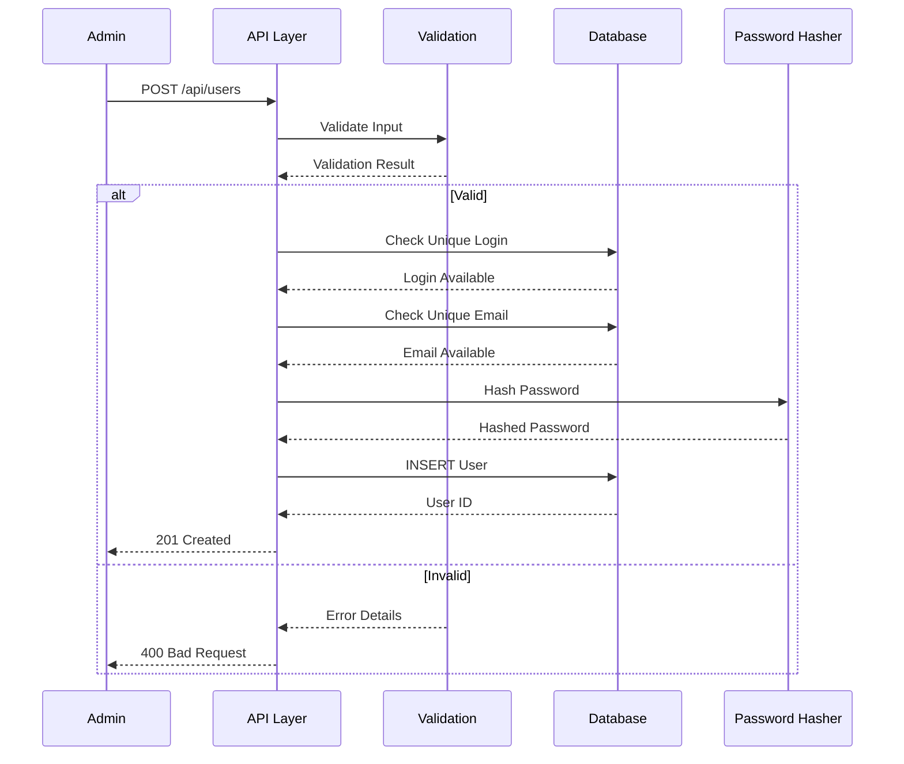
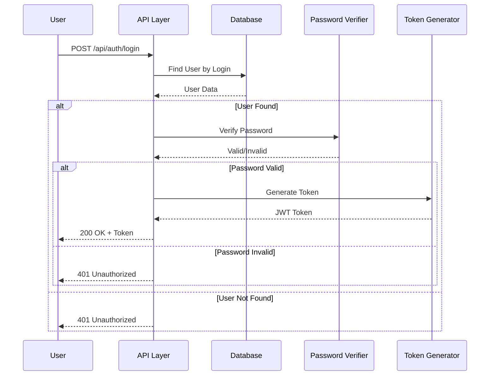
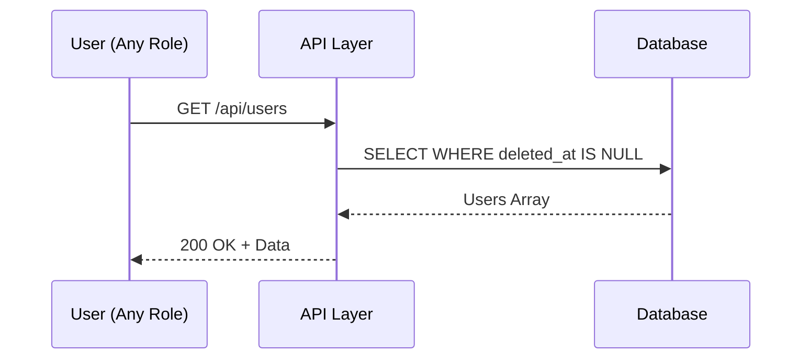
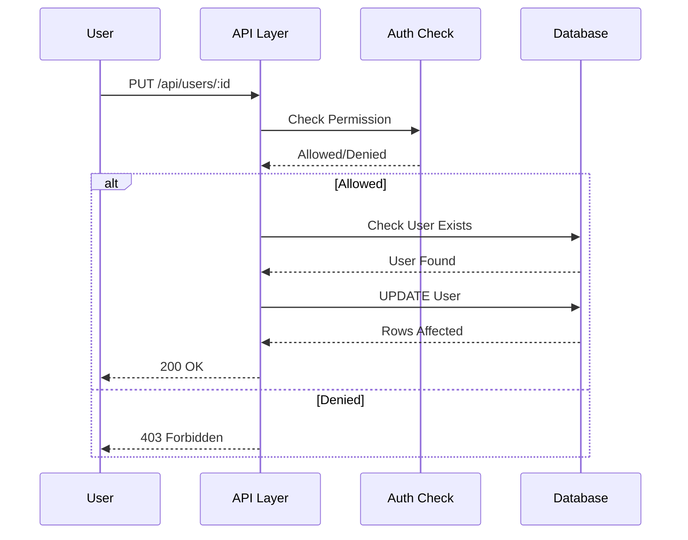
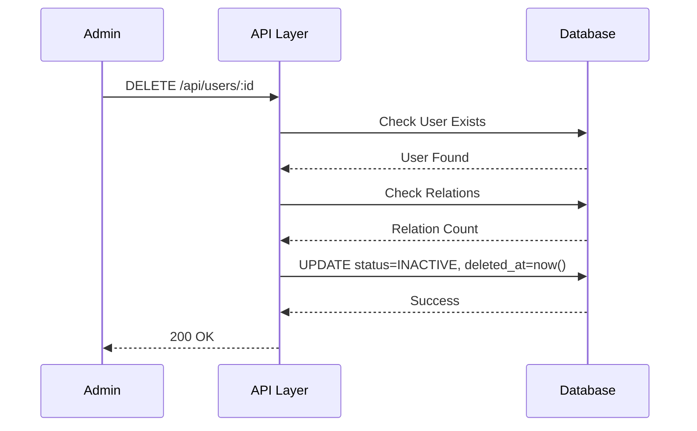

# 📄 FAYL: `02-user-management.md`

```markdown
# 02. Foydalanuvchi Boshqaruvi (User Management)

---

## 📋 UMUMIY MA'LUMOT

| Maydon | Qiymat |
|--------|--------|
| **Flow ID** | 02 |
| **Phase** | 1 - Foundation |
| **Model** | `User` |
| **Status** | Draft |
| **Yaratilgan Sana** | 2024-01-15 |
| **Oxirgi Yangilanish** | 2024-01-15 |
| **Mas'ul** | Senior Backend Developer |
| **Bog'liq Model** | `UserRole` (RFC-001) |

---

## 🎯 MAQSAD

Tizim foydalanuvchilarini (shifokorlar, hamshiralar, administratorlar va boshqa xodimlar) ro'yxatga olish, autentifikatsiya, profil boshqaruvi va ruxsatlarni taqsimlash. Har bir foydalanuvchiga rol biriktirish orqali tizim xavfsizligini ta'minlash.

---

## 👥 MAS'UL ROLLAR

| Rol | Create | Read | Update | Delete | Tavsif |
|-----|--------|------|--------|--------|--------|
| **Admin** | ✅ | ✅ | ✅ | ✅ | To'liq huquq - barcha userlarni boshqaradi |
| **Doctor** | ❌ | ✅ (faqat o'zi) | ✅ (faqat o'zi) | ❌ | Faqat o'z profilini ko'rish/o'zgartirish |
| **Nurse** | ❌ | ✅ (faqat o'zi) | ✅ (faqat o'zi) | ❌ | Faqat o'z profilini ko'rish/o'zgartirish |
| **Receptionist** | ❌ | ✅ (faqat o'zi) | ✅ (faqat o'zi) | ❌ | Faqat o'z profilini ko'rish/o'zgartirish |
| **Accountant** | ❌ | ✅ (faqat o'zi) | ✅ (faqat o'zi) | ❌ | Faqat o'z profilini ko'rish/o'zgartirish |

---

## 📊 PRISMA MODEL

### To'liq Model Schema

```prisma
model User {
  id          Int          @id @default(autoincrement())
  role_id     Int?         @map("role_id")
  full_name   String       @db.VarChar(100)
  login       String       @db.VarChar(50)
  password    String       @db.VarChar(255)
  phone       String?      @db.VarChar(20)
  email       String?      @db.VarChar(100)
  description String?      @db.Text
  status      RecordStatus @default(ACTIVE)
  created_at  Timestamptz  @default(now())
  updated_at  Timestamptz  @updatedAt
  deleted_at  Timestamptz?

  // Relations
  role        UserRole?    @relation("fk_user_role", fields: [role_id], references: [id], onDelete: SetNull, onUpdate: Cascade)

  // Audit relations - Modified
  modified_clients      Client[]      @relation("fk_client_modified_by")
  modified_visits       Visit[]       @relation("fk_visit_modified_by")
  modified_payments     Payment[]     @relation("fk_payment_modified_by")
  modified_client_paid  ClientPaid[]  @relation("fk_client_paid_modified_by")
  modified_other_paid   OtherPaid[]   @relation("fk_other_paid_modified_by")
  modified_visit_services VisitService[] @relation("fk_visit_service_modified_by")
  modified_visit_rooms  VisitRoom[]   @relation("fk_visit_room_modified_by")
  modified_visit_referrals VisitReferral[] @relation("fk_visit_referral_modified_by")
  modified_service_users ServiceUser[] @relation("fk_service_user_modified_by")
  modified_client_groups ClientGroup[] @relation("fk_client_group_modified_by")
  modified_departments  Department[]  @relation("fk_department_modified_by")
  modified_rooms        Room[]        @relation("fk_room_modified_by")
  modified_services     Service[]     @relation("fk_service_modified_by")
  modified_referrals    Referral[]    @relation("fk_referral_modified_by")
  modified_sources      Source[]      @relation("fk_source_modified_by")
  modified_loc_regions  LocRegion[]   @relation("fk_loc_region_modified_by")
  modified_loc_districts LocDistrict[] @relation("fk_loc_district_modified_by")
  modified_other_paid_groups OtherPaidGroup[] @relation("fk_other_paid_group_modified_by")

  // Audit relations - Registered
  registered_clients    Client[]      @relation("fk_client_registered_by")
  registered_visits     Visit[]       @relation("fk_visit_registered_by")
  registered_payments   Payment[]     @relation("fk_payment_registered_by")
  registered_client_paid ClientPaid[] @relation("fk_client_paid_registered_by")
  registered_other_paid OtherPaid[]   @relation("fk_other_paid_registered_by")
  registered_visit_services VisitService[] @relation("fk_visit_service_registered_by")
  registered_visit_rooms VisitRoom[]  @relation("fk_visit_room_registered_by")
  registered_visit_referrals VisitReferral[] @relation("fk_visit_referral_registered_by")
  registered_service_users ServiceUser[] @relation("fk_service_user_registered_by")
  registered_client_groups ClientGroup[] @relation("fk_client_group_registered_by")
  registered_departments Department[]  @relation("fk_department_registered_by")
  registered_rooms      Room[]        @relation("fk_room_registered_by")
  registered_services   Service[]     @relation("fk_service_registered_by")
  registered_referrals  Referral[]    @relation("fk_referral_registered_by")
  registered_sources    Source[]      @relation("fk_source_registered_by")
  registered_loc_regions LocRegion[]  @relation("fk_loc_region_registered_by")
  registered_loc_districts LocDistrict[] @relation("fk_loc_district_registered_by")
  registered_other_paid_groups OtherPaidGroup[] @relation("fk_other_paid_group_registered_by")

  // Business relations
  doctor_visits         Visit[]       @relation("fk_visit_doctor")
  user_payments         Payment[]     @relation("fk_payment_user")
  service_users         ServiceUser[] @relation("fk_service_user_user")

  @@index([role_id])
  @@index([login])
  @@index([status])
  @@index([created_at])
  @@index([deleted_at])
  @@unique([login])
  @@unique([email])
  @@map("users")
}
```

### Model Maydonlari Tafsiloti

| Maydon | Tip | Majburiy | Default | DB Tip | Izoh/Tavsif |
|--------|-----|----------|---------|--------|-------------|
| `id` | Int | ✅ | autoincrement | SERIAL | **Primary Key**. Unikal identifikator, avtomatik oshib boradi |
| `role_id` | Int | ❌ | null | INTEGER | **Foreign Key**. UserRole jadvaliga bog'lanish. SetNull cascade - rol o'chirilganda null bo'ladi |
| `full_name` | String | ✅ | - | VARCHAR(100) | **F.I.O**. Foydalanuvchining to'liq ismi, 3-100 belgi |
| `login` | String | ✅ | - | VARCHAR(50) | **Kirish logini**. Unikal, 3-50 belgi, autentifikatsiya uchun ishlatiladi |
| `password` | String | ✅ | - | VARCHAR(255) | **Hash qilingan parol**. bcrypt/argon2 bilan shifrlangan, 255 belgigacha |
| `phone` | String | ❌ | null | VARCHAR(20) | **Telefon raqam**. +998 formatida, unikal bo'lishi mumkin |
| `email` | String | ❌ | null | VARCHAR(100) | **Email manzil**. Valid email format, unikal |
| `description` | String | ❌ | null | TEXT | **Qo'shimcha ma'lumot**. Foydalanuvchi haqida qo'shimcha ma'lumot |
| `status` | Enum | ✅ | ACTIVE | VARCHAR | **Holat**. ACTIVE (faol), INACTIVE (nofaol), ARCHIVED (arxiv) |
| `created_at` | Timestamptz | ✅ | now() | TIMESTAMPTZ | **Yaratilgan vaqt**. Avtomatik to'ldiriladi, UTC timezone |
| `updated_at` | Timestamptz | ✅ | now() | TIMESTAMPTZ | **Oxirgi o'zgarish**. Har bir update da avtomatik yangilanadi (Prisma @updatedAt) |
| `deleted_at` | Timestamptz | ❌ | null | TIMESTAMPTZ | **Soft Delete**. NULL = aktiv, qiymat bor = o'chirilgan. Fizik delete qilinmaydi |

### Indexlar

| Index | Maydon(lar) | Maqsad |
|-------|-------------|--------|
| `@@index([role_id])` | role_id | Rol bo'yicha filter qilishni tezlashtirish |
| `@@index([login])` | login | Login bo'yicha qidiruvni tezlashtirish |
| `@@index([status])` | status | Status bo'yicha filter qilishni tezlashtirish |
| `@@index([created_at])` | created_at | Yaratilgan vaqt bo'yicha sort/filter |
| `@@index([deleted_at])` | deleted_at | Soft delete filter uchun |
| `@@unique([login])` | login | Login unikal bo'lishini ta'minlash |
| `@@unique([email])` | email | Email unikal bo'lishini ta'minlash |

### Relation'lar

| Relation | Model | Type | onDelete | onUpdate | Tavsif |
|----------|-------|------|----------|----------|--------|
| `fk_user_role` | UserRole | N:1 | SetNull | Cascade | Rol o'chirilganda userning role_id NULL ga o'zgaradi |
| `fk_client_modified_by` | Client | 1:N | SetNull | Cascade | User o'chirilganda client.modified_by NULL ga o'zgaradi |
| `fk_client_registered_by` | Client | 1:N | SetNull | Cascade | User o'chirilganda client.registered_by NULL ga o'zgaradi |
| `fk_visit_doctor` | Visit | 1:N | SetNull | Cascade | User o'chirilganda visit.doctor_id NULL ga o'zgaradi |
| `fk_payment_user` | Payment | 1:N | SetNull | Cascade | User o'chirilganda payment.user_id NULL ga o'zgaradi |
| `fk_service_user_user` | ServiceUser | 1:N | Cascade | Cascade | User o'chirilganda ServiceUser yozuvlari o'chiriladi |

---

## 🔄 FLOW DIAGRAM

### 1. User Yaratish Flow (Admin tomonidan)



### 2. Login Flow (Autentifikatsiya)



### 3. User Ro'yxatini Olish Flow



### 4. User Yangilash Flow



### 5. User O'chirish (Soft Delete) Flow



---

## 📝 BOSQICHMA-BOSQICH JARAYON

### BOSQICH 1: User Yaratish (Admin tomonidan)

#### 1.1. Input Ma'lumotlari

```typescript
interface CreateUserDto {
  full_name: string;      // 3-100 belgi
  login: string;          // 3-50 belgi, unikal
  password: string;       // Min 8 belgi, murakkab
  phone?: string;         // +998 format
  email?: string;         // Valid email, unikal
  role_id?: number;       // Mavjud UserRole ID
  description?: string;   // 0-255 belgi
  status?: string;        // ACTIVE/INACTIVE/ARCHIVED
}
```

#### 1.2. Validatsiya Qoidalari

```typescript
// Full Name validatsiya
{
  minLength: 3,
  maxLength: 100,
  pattern: /^[a-zA-Z\u0400-\u04FF\s'-]+$/,  // Lotin, Kirill, space, ', -
  required: true
}

// Login validatsiya
{
  minLength: 3,
  maxLength: 50,
  pattern: /^[a-zA-Z0-9_]+$/,  // Faqat harf, raqam, _
  unique: true,
  required: true
}

// Password validatsiya
{
  minLength: 8,
  maxLength: 255,
  requireUppercase: true,    // Kamida 1 katta harf
  requireLowercase: true,    // Kamida 1 kichik harf
  requireDigit: true,        // Kamida 1 raqam
  requireSpecial: true,      // Kamida 1 maxsus belgi (!@#$%^&*)
  required: true
}

// Phone validatsiya
{
  pattern: /^\+998[0-9]{9}$/,  // +998901234567 format
  unique: false,               // Email dan farqli o'laroq, phone unikal emas
  required: false
}

// Email validatsiya
{
  pattern: /^[^\s@]+@[^\s@]+\.[^\s@]+$/,
  unique: true,
  required: false
}

// Role validatsiya
{
  type: 'number',
  mustExist: true,           // UserRole jadvalida mavjud bo'lishi kerak
  required: false,
  default: null
}

// Status validatsiya
{
  enum: ['ACTIVE', 'INACTIVE', 'ARCHIVED'],
  default: 'ACTIVE'
}
```

#### 1.3. Biznes Logika

```typescript
// user.service.ts
async create(data: CreateUserDto, adminId: number): Promise<User> {
  // 1. Login unikal ekanligini tekshirish
  const existingLogin = await this.prisma.user.findFirst({
    where: {
      login: data.login,
      deleted_at: null
    }
  });
  
  if (existingLogin) {
    throw new ConflictException('USER_001');
  }
  
  // 2. Email unikal ekanligini tekshirish (agar kiritilgan bo'lsa)
  if (data.email) {
    const existingEmail = await this.prisma.user.findFirst({
      where: {
        email: data.email,
        deleted_at: null
      }
    });
    
    if (existingEmail) {
      throw new ConflictException('USER_002');
    }
  }
  
  // 3. Role mavjudligini tekshirish (agar kiritilgan bo'lsa)
  if (data.role_id) {
    const role = await this.prisma.userRole.findUnique({
      where: { id: data.role_id }
    });
    
    if (!role || role.deleted_at) {
      throw new NotFoundException('USER_003');
    }
  }
  
  // 4. Password hash qilish
  const hashedPassword = await bcrypt.hash(data.password, 10);
  
  // 5. User yaratish
  const user = await this.prisma.user.create({
    data: {
      full_name: data.full_name,
      login: data.login,
      password: hashedPassword,
      phone: data.phone,
      email: data.email,
      role_id: data.role_id,
      description: data.description,
      status: data.status || 'ACTIVE',
      created_at: new Date(),
      updated_at: new Date()
    },
    include: {
      role: {
        select: { id: true, name: true }
      }
    }
  });
  
  // 5. Password ni response dan olib tashlash
  delete user.password;
  
  return user;
}
```

#### 1.4. Database Query

```prisma
INSERT INTO users (
  full_name,
  login,
  password,
  phone,
  email,
  role_id,
  description,
  status,
  created_at,
  updated_at
) VALUES (
  'Dr. John Smith',
  'drjohn',
  '$2b$10$N9qo8uLOickgx2ZMRZoMyeIjZAgcfl7p92ldGxad68LJZdL17lhWy',
  '+998901234567',
  'drjohn@clinic.com',
  2,
  'Tajribali shifokor',
  'ACTIVE',
  NOW(),
  NOW()
);
```

---

### BOSQICH 2: Login (Autentifikatsiya)

#### 2.1. Input Ma'lumotlari

```typescript
interface LoginDto {
  login: string;    // Login yoki email
  password: string; // Parol
}
```

#### 2.2. Biznes Logika

```typescript
// auth.service.ts
async login(data: LoginDto): Promise<{ user: User; token: string }> {
  // 1. User topish (login yoki email orqali)
  const user = await this.prisma.user.findFirst({
    where: {
      OR: [
        { login: data.login },
        { email: data.login }
      ],
      deleted_at: null
    },
    include: {
      role: {
        select: { id: true, name: true, permissions: true }
      }
    }
  });
  
  if (!user) {
    throw new UnauthorizedException('AUTH_001');
  }
  
  // 2. Status tekshirish
  if (user.status !== 'ACTIVE') {
    throw new ForbiddenException('AUTH_002');
  }
  
  // 3. Password tekshirish
  const isValid = await bcrypt.compare(data.password, user.password);
  
  if (!isValid) {
    throw new UnauthorizedException('AUTH_001');
  }
  
  // 4. JWT Token yaratish
  const token = this.jwtService.sign({
    sub: user.id,
    login: user.login,
    role_id: user.role_id,
    role_name: user.role?.name,
    iat: Math.floor(Date.now() / 1000),
    exp: Math.floor(Date.now() / 1000) + (24 * 60 * 60) // 24 soat
  });
  
  // 5. Password ni response dan olib tashlash
  delete user.password;
  
  return { user, token };
}
```

#### 2.3. JWT Token Struktura

```json
{
  "sub": 1,
  "login": "admin",
  "role_id": 1,
  "role_name": "Admin",
  "iat": 1704067200,
  "exp": 1704153600
}
```

---

### BOSQICH 3: User Ro'yxatini Olish

#### 3.1. Query Parametrlari

```typescript
interface GetUsersQuery {
  page?: number;        // Default: 1
  limit?: number;       // Default: 10, Max: 100
  status?: string;      // Filter by status
  role_id?: number;     // Filter by role
  search?: string;      // Search by full_name or login
  sortBy?: string;      // Default: created_at
  sortOrder?: string;   // Default: desc (asc/desc)
}
```

#### 3.2. Biznes Logika

```typescript
async findAll(query: GetUsersQuery, currentUserId: number, currentUserRole: string): Promise<PaginatedResult<User>> {
  const where: any = { deleted_at: null };
  
  // Admin bo'lmasa, faqat o'zini ko'rish
  if (currentUserRole !== 'Admin') {
    where.id = currentUserId;
  }
  
  // Status filter
  if (query.status) {
    where.status = query.status;
  }
  
  // Role filter
  if (query.role_id) {
    where.role_id = query.role_id;
  }
  
  // Search filter
  if (query.search) {
    where.OR = [
      { full_name: { contains: query.search, mode: 'insensitive' } },
      { login: { contains: query.search, mode: 'insensitive' } }
    ];
  }
  
  // Pagination
  const skip = (query.page - 1) * query.limit;
  const take = Math.min(query.limit, 100);
  
  // Sorting
  const orderBy = {
    [query.sortBy || 'created_at']: query.sortOrder || 'desc'
  };
  
  const [data, total] = await Promise.all([
    this.prisma.user.findMany({
      where,
      skip,
      take,
      orderBy,
      select: {
        id: true,
        full_name: true,
        login: true,
        phone: true,
        email: true,
        role: { select: { id: true, name: true } },
        status: true,
        created_at: true,
        updated_at: true
      }
    }),
    this.prisma.user.count({ where })
  ]);
  
  return {
    data,
    pagination: {
      page: query.page,
      limit: take,
      total,
      totalPages: Math.ceil(total / take),
      hasNextPage: skip + take < total,
      hasPrevPage: query.page > 1
    }
  };
}
```

---

### BOSQICH 4: User Yangilash

#### 4.1. Input Ma'lumotlari

```typescript
interface UpdateUserDto {
  full_name?: string;
  phone?: string;
  email?: string;
  role_id?: number;
  description?: string;
  status?: string;
  // Password alohida endpoint orqali o'zgartiriladi
}
```

#### 4.2. Biznes Logika

```typescript
async update(id: number, data: UpdateUserDto, currentUserId: number, currentUserRole: string): Promise<User> {
  // 1. User mavjudligini tekshirish
  const user = await this.prisma.user.findUnique({
    where: { id }
  });
  
  if (!user || user.deleted_at) {
    throw new NotFoundException('USER_004');
  }
  
  // 2. Ruxsat tekshirish (faqat o'zini yoki Admin)
  if (currentUserRole !== 'Admin' && currentUserId !== id) {
    throw new ForbiddenException('USER_005');
  }
  
  // 3. Email unikal ekanligini tekshirish (agar o'zgarayotgan bo'lsa)
  if (data.email && data.email !== user.email) {
    const existingEmail = await this.prisma.user.findFirst({
      where: {
        email: data.email,
        id: { not: id },
        deleted_at: null
      }
    });
    
    if (existingEmail) {
      throw new ConflictException('USER_002');
    }
  }
  
  // 4. Role mavjudligini tekshirish (agar o'zgarayotgan bo'lsa)
  if (data.role_id) {
    const role = await this.prisma.userRole.findUnique({
      where: { id: data.role_id }
    });
    
    if (!role || role.deleted_at) {
      throw new NotFoundException('USER_003');
    }
  }
  
  // 5. User yangilash
  const updated = await this.prisma.user.update({
    where: { id },
    data: {
      ...data,
      updated_at: new Date()
    },
    include: {
      role: { select: { id: true, name: true } }
    }
  });
  
  delete updated.password;
  
  return updated;
}
```

---

### BOSQICH 5: Password O'zgartirish

#### 5.1. Input Ma'lumotlari

```typescript
interface ChangePasswordDto {
  old_password: string;
  new_password: string;
}
```

#### 5.2. Biznes Logika

```typescript
async changePassword(userId: number, data: ChangePasswordDto): Promise<void> {
  // 1. User topish
  const user = await this.prisma.user.findUnique({
    where: { id: userId }
  });
  
  if (!user || user.deleted_at) {
    throw new NotFoundException('USER_004');
  }
  
  // 2. Eski password tekshirish
  const isValid = await bcrypt.compare(data.old_password, user.password);
  
  if (!isValid) {
    throw new BadRequestException('USER_006');
  }
  
  // 3. Yangi password validatsiya
  if (!this.validatePasswordStrength(data.new_password)) {
    throw new BadRequestException('USER_007');
  }
  
  // 4. Yangi password hash va saqlash
  const hashedPassword = await bcrypt.hash(data.new_password, 10);
  
  await this.prisma.user.update({
    where: { id: userId },
    data: {
      password: hashedPassword,
      updated_at: new Date()
    }
  });
}

private validatePasswordStrength(password: string): boolean {
  const minLength = 8;
  const hasUppercase = /[A-Z]/.test(password);
  const hasLowercase = /[a-z]/.test(password);
  const hasDigit = /[0-9]/.test(password);
  const hasSpecial = /[!@#$%^&*(),.?":{}|<>]/.test(password);
  
  return password.length >= minLength && hasUppercase && hasLowercase && hasDigit && hasSpecial;
}
```

---

### BOSQICH 6: User O'chirish (Soft Delete)

#### 6.1. Biznes Logika

```typescript
async remove(id: number, currentUserId: number): Promise<User> {
  // 1. User mavjudligini tekshirish
  const user = await this.prisma.user.findUnique({
    where: { id }
  });
  
  if (!user || user.deleted_at) {
    throw new NotFoundException('USER_004');
  }
  
  // 2. O'zini o'chirishni taqiqlash
  if (id === currentUserId) {
    throw new BadRequestException('USER_008');
  }
  
  // 3. Bog'liq yozuvlarni tekshirish
  const visitCount = await this.prisma.visit.count({
    where: { doctor_id: id, deleted_at: null }
  });
  
  if (visitCount > 0) {
    // Warning log, lekin o'chirishga ruxsat berish
    this.logger.warn(`User ${id} has ${visitCount} visits. Their doctor_id will be set to NULL.`);
  }
  
  // 4. Soft Delete (SetNull cascade avtomatik ishlaydi)
  return this.prisma.user.update({
    where: { id },
    data: {
      status: 'INACTIVE',
      deleted_at: new Date()
    }
  });
}
```

---

## 🔌 API ENDPOINT'LAR

### 1. User Yaratish

| Parametr | Qiymat |
|----------|--------|
| **Method** | POST |
| **Endpoint** | `/api/v1/users` |
| **Auth** | ✅ JWT Required |
| **Rol** | Admin |
| **Content-Type** | application/json |

**Request Body:**

```json
{
  "full_name": "Dr. John Smith",
  "login": "drjohn",
  "password": "SecurePass@123",
  "phone": "+998901234567",
  "email": "drjohn@clinic.com",
  "role_id": 2,
  "description": "Tajribali shifokor",
  "status": "ACTIVE"
}
```

**Response (201 Created):**

```json
{
  "success": true,
  "message": "Foydalanuvchi muvaffaqiyatli yaratildi",
  "data": {
    "id": 5,
    "full_name": "Dr. John Smith",
    "login": "drjohn",
    "phone": "+998901234567",
    "email": "drjohn@clinic.com",
    "role": {
      "id": 2,
      "name": "Doctor"
    },
    "status": "ACTIVE",
    "created_at": "2024-01-15T10:00:00.000Z",
    "updated_at": "2024-01-15T10:00:00.000Z",
    "deleted_at": null
  }
}
```

---

### 2. Login

| Parametr | Qiymat |
|----------|--------|
| **Method** | POST |
| **Endpoint** | `/api/v1/auth/login` |
| **Auth** | ❌ No Auth |
| **Rol** | Barchasi |

**Request Body:**

```json
{
  "login": "drjohn",
  "password": "SecurePass@123"
}
```

**Response (200 OK):**

```json
{
  "success": true,
  "message": "Muvaffaqiyatli kirish",
  "data": {
    "user": {
      "id": 5,
      "full_name": "Dr. John Smith",
      "login": "drjohn",
      "email": "drjohn@clinic.com",
      "role": {
        "id": 2,
        "name": "Doctor",
        "permissions": { ... }
      }
    },
    "token": "eyJhbGciOiJIUzI1NiIsInR5cCI6IkpXVCJ9...",
    "expires_in": 86400
  }
}
```

---

### 3. User Ro'yxatini Olish

| Parametr | Qiymat |
|----------|--------|
| **Method** | GET |
| **Endpoint** | `/api/v1/users` |
| **Auth** | ✅ JWT Required |
| **Rol** | Barchasi (Admin - barchasi, Boshqalar - faqat o'zi) |

**Query Params:**

```
GET /api/v1/users?page=1&limit=10&status=ACTIVE&role_id=2&search=john&sortBy=created_at&sortOrder=desc
```

**Response (200 OK):**

```json
{
  "success": true,
  "data": [
    {
      "id": 5,
      "full_name": "Dr. John Smith",
      "login": "drjohn",
      "phone": "+998901234567",
      "email": "drjohn@clinic.com",
      "role": { "id": 2, "name": "Doctor" },
      "status": "ACTIVE",
      "created_at": "2024-01-15T10:00:00.000Z",
      "updated_at": "2024-01-15T10:00:00.000Z"
    }
  ],
  "pagination": {
    "page": 1,
    "limit": 10,
    "total": 5,
    "totalPages": 1,
    "hasNextPage": false,
    "hasPrevPage": false
  }
}
```

---

### 4. Bitta User Ma'lumotlarini Olish

| Parametr | Qiymat |
|----------|--------|
| **Method** | GET |
| **Endpoint** | `/api/v1/users/:id` |
| **Auth** | ✅ JWT Required |
| **Rol** | Barchasi (Admin - barchasi, Boshqalar - faqat o'zi) |

**Response (200 OK):**

```json
{
  "success": true,
  "data": {
    "id": 5,
    "full_name": "Dr. John Smith",
    "login": "drjohn",
    "phone": "+998901234567",
    "email": "drjohn@clinic.com",
    "role": { "id": 2, "name": "Doctor" },
    "description": "Tajribali shifokor",
    "status": "ACTIVE",
    "created_at": "2024-01-15T10:00:00.000Z",
    "updated_at": "2024-01-15T10:00:00.000Z",
    "deleted_at": null
  }
}
```

---

### 5. User Yangilash

| Parametr | Qiymat |
|----------|--------|
| **Method** | PUT |
| **Endpoint** | `/api/v1/users/:id` |
| **Auth** | ✅ JWT Required |
| **Rol** | Admin (barchasi), Boshqalar (faqat o'zi) |

**Request Body:**

```json
{
  "full_name": "Dr. John Smith Jr.",
  "phone": "+998901234568",
  "email": "drjohn.jr@clinic.com",
  "description": "Katta shifokor"
}
```

**Response (200 OK):**

```json
{
  "success": true,
  "message": "Foydalanuvchi muvaffaqiyatli yangilandi",
  "data": {
    "id": 5,
    "full_name": "Dr. John Smith Jr.",
    "login": "drjohn",
    "phone": "+998901234568",
    "email": "drjohn.jr@clinic.com",
    "role": { "id": 2, "name": "Doctor" },
    "status": "ACTIVE",
    "created_at": "2024-01-15T10:00:00.000Z",
    "updated_at": "2024-01-15T12:00:00.000Z",
    "deleted_at": null
  }
}
```

---

### 6. Password O'zgartirish

| Parametr | Qiymat |
|----------|--------|
| **Method** | POST |
| **Endpoint** | `/api/v1/users/:id/password` |
| **Auth** | ✅ JWT Required |
| **Rol** | Admin (barchasi), Boshqalar (faqat o'zi) |

**Request Body:**

```json
{
  "old_password": "SecurePass@123",
  "new_password": "NewSecurePass@456"
}
```

**Response (200 OK):**

```json
{
  "success": true,
  "message": "Parol muvaffaqiyatli o'zgartirildi"
}
```

---

### 7. User O'chirish (Soft Delete)

| Parametr | Qiymat |
|----------|--------|
| **Method** | DELETE |
| **Endpoint** | `/api/v1/users/:id` |
| **Auth** | ✅ JWT Required |
| **Rol** | Admin |

**Response (200 OK):**

```json
{
  "success": true,
  "message": "Foydalanuvchi muvaffaqiyatli o'chirildi",
  "data": {
    "id": 5,
    "full_name": "Dr. John Smith",
    "status": "INACTIVE",
    "deleted_at": "2024-01-15T14:00:00.000Z"
  }
}
```

---

### 8. O'z Profilini Olish

| Parametr | Qiymat |
|----------|--------|
| **Method** | GET |
| **Endpoint** | `/api/v1/auth/me` |
| **Auth** | ✅ JWT Required |
| **Rol** | Barchasi |

**Response (200 OK):**

```json
{
  "success": true,
  "data": {
    "id": 5,
    "full_name": "Dr. John Smith",
    "login": "drjohn",
    "phone": "+998901234567",
    "email": "drjohn@clinic.com",
    "role": {
      "id": 2,
      "name": "Doctor",
      "permissions": { ... }
    },
    "status": "ACTIVE",
    "created_at": "2024-01-15T10:00:00.000Z"
  }
}
```

---

## ⚠️ XATOLIKLAR VA HANDLING

| Kod | HTTP Status | Xabar | Sabab | Yechim |
|-----|-------------|-------|-------|--------|
| `USER_001` | 409 Conflict | Login allaqachon mavjud | Login unique constraint | Boshqa login tanlang |
| `USER_002` | 409 Conflict | Email allaqachon mavjud | Email unique constraint | Boshqa email tanlang |
| `USER_003` | 404 Not Found | Rol topilmadi | Role ID not exists | Rol ID ni tekshiring |
| `USER_004` | 404 Not Found | Foydalanuvchi topilmadi | ID not exists yoki deleted | ID ni tekshiring |
| `USER_005` | 403 Forbidden | Ruxsat yo'q | Insufficient permissions | Admin roli kerak yoki o'z profilini yangilang |
| `USER_006` | 400 Bad Request | Eski parol noto'g'ri | Password mismatch | Eski parolni tekshiring |
| `USER_007` | 400 Bad Request | Yangi parol juda zaif | Password validation failed | Murakkabroq parol o'ylab toping |
| `USER_008` | 400 Bad Request | O'zini o'chirish mumkin emas | Business rule | Boshqa admin o'chirsin |
| `USER_009` | 500 Internal Server Error | Tizim xatosi | Database error | Admin bilan bog'laning |
| `AUTH_001` | 401 Unauthorized | Login yoki parol noto'g'ri | Authentication failed | Ma'lumotlarni tekshiring |
| `AUTH_002` | 403 Forbidden | Account blokirovka qilingan | User status !== ACTIVE | Admin bilan bog'laning |

---

## 📦 SEED DATA (BOSHLANG'ICH MA'LUMOTLAR)

```typescript
// seed/user.seed.ts
import * as bcrypt from 'bcrypt';

export async function seedUsers(prisma: PrismaClient) {
  // Admin user yaratish
  const adminPassword = await bcrypt.hash('Admin@123', 10);
  
  await prisma.user.upsert({
    where: { login: 'admin' },
    update: {},
    create: {
      full_name: 'System Administrator',
      login: 'admin',
      password: adminPassword,
      phone: '+998900000000',
      email: 'admin@clinic.com',
      role_id: 1, // Admin role
      description: 'Tizim administratori',
      status: 'ACTIVE'
    }
  });

  // Test doctor user
  const doctorPassword = await bcrypt.hash('Doctor@123', 10);
  
  await prisma.user.upsert({
    where: { login: 'doctor1' },
    update: {},
    create: {
      full_name: 'Dr. John Smith',
      login: 'doctor1',
      password: doctorPassword,
      phone: '+998901111111',
      email: 'doctor1@clinic.com',
      role_id: 2, // Doctor role
      description: 'Terapevt',
      status: 'ACTIVE'
    }
  });

  // Test receptionist user
  const receptionistPassword = await bcrypt.hash('Reception@123', 10);
  
  await prisma.user.upsert({
    where: { login: 'receptionist1' },
    update: {},
    create: {
      full_name: 'Jane Doe',
      login: 'receptionist1',
      password: receptionistPassword,
      phone: '+998902222222',
      email: 'receptionist1@clinic.com',
      role_id: 4, // Receptionist role
      description: 'Qabul xonasi',
      status: 'ACTIVE'
    }
  });

  console.log('✅ Users seeded successfully');
}
```

---

## 🔐 XAVFSIZLIK TALABLARI

### 1. Password Hash

```typescript
// bcrypt konfiguratsiya
const saltRounds = 10;
const hash = await bcrypt.hash(password, saltRounds);
const isValid = await bcrypt.compare(password, hash);
```

### 2. JWT Token

```typescript
// Token konfiguratsiya
{
  algorithm: 'HS256',
  expiresIn: '24h',
  secret: process.env.JWT_SECRET
}
```

### 3. Rate Limiting (Login uchun)

```typescript
// 5 ta urinish 15 daqiqada
const maxAttempts = 5;
const lockoutTime = 15 * 60 * 1000; // 15 daqiqa
```

### 4. Audit

- ✅ `created_at` - Yaratilgan vaqt
- ✅ `updated_at` - Oxirgi o'zgarish
- ✅ `deleted_at` - Soft delete vaqti
- ⏳ `registered_by` - Kelajakda (kim yaratdi)
- ⏳ `modified_by` - Kelajakda (kim o'zgartirdi)

---

## 📝 ESLATMALAR

1. **Password hech qachon plain text da saqlanmaydi** - Har doim bcrypt/argon2 bilan hash qilinadi
2. **Login attempt limit** - 5 marta noto'g'ri urinish = 15 daqiqa blok
3. **Token expiry** - 24 soat, refresh token mexanizmi kelajakda qo'shiladi
4. **Soft Delete** - User o'chirilganda `deleted_at` set bo'ladi, fizik delete qilinmaydi
5. **Cascade Rules** - User o'chirilganda bog'liq yozuvlar SetNull yoki Cascade bo'ladi
6. **O'zini o'chirish taqiqlangan** - Admin o'zini o'chira olmaydi (kamida 1 admin bo'lishi kerak)
7. **Email va Login unikal** - Ikkala maydon ham unique constraintga ega
8. **Password strength** - Min 8 belgi, katta/kichik harf, raqam, maxsus belgi

---

## ✅ QABUL QILISH MEZONLARI (ACCEPTANCE CRITERIA)

- [ ] Login unikal bo'lishi
- [ ] Email unikal bo'lishi
- [ ] Password hash qilingan holda saqlanishi
- [ ] Password strength validatsiyasi ishlashi
- [ ] JWT token yaratilishi va 24 soat amal qilishi
- [ ] Soft delete ishlaydi (deleted_at set bo'ladi)
- [ ] Faqat Admin barcha userlarni boshqara olishi
- [ ] Boshqa rollar faqat o'z profilini boshqara olishi
- [ ] Login attempt limit ishlashi (5 urinish = 15 daqiqa blok)
- [ ] O'zini o'chirish taqiqlangan bo'lishi
- [ ] Seed data tizim o'rnatilganda avtomatik yuklanishi
- [ ] Xatoliklar to'g'ri HTTP status va kod bilan qaytarilishi

---
