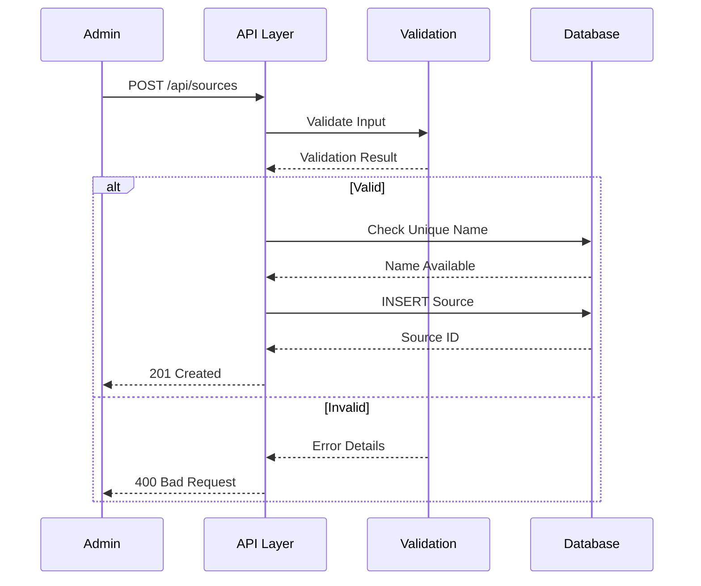
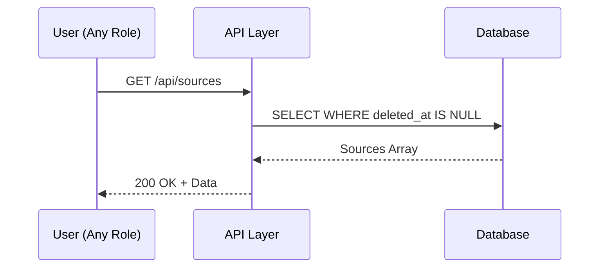
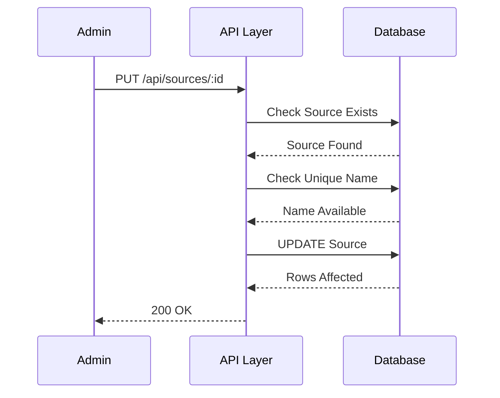
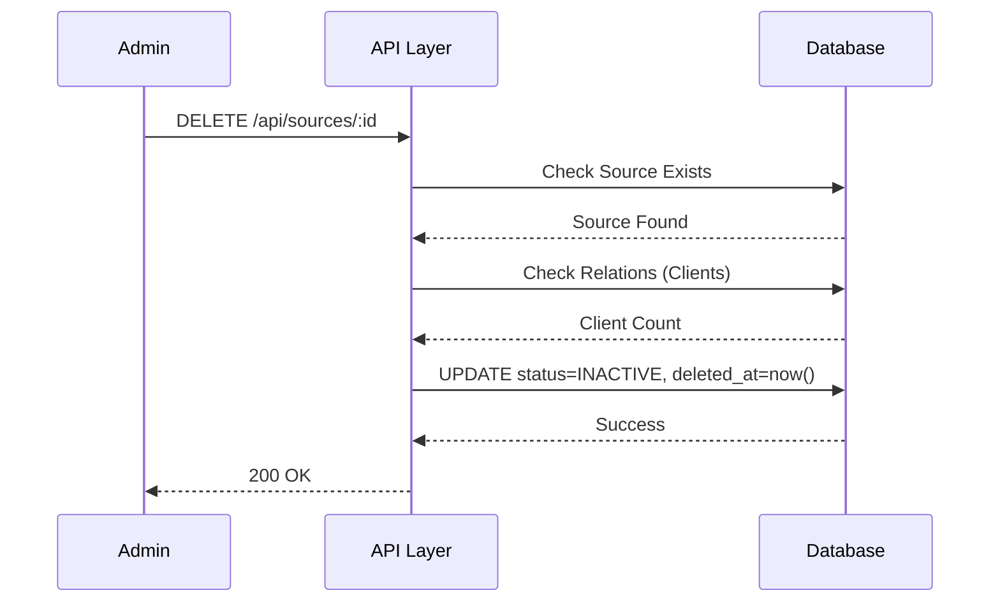

# 📄 FAYL: `05-source-management.md`

# 05. Mijoz Manbalari Boshqaruvi (Source Management)

---

## 📋 UMUMIY MA'LUMOT

| Maydon | Qiymat |
|--------|--------|
| **Flow ID** | 05 |
| **Phase** | 1 - Foundation |
| **Model** | `Source` |
| **Status** | Draft |
| **Yaratilgan Sana** | 2024-01-15 |
| **Oxirgi Yangilanish** | 2024-01-15 |
| **Mas'ul** | Senior Backend Developer |
| **Bog'liq Model** | `User` (RFC-002), `Client` (Keyingi) |

---

## 🎯 MAQSAD

Mijozlar klinikaga qayerdan kelganligini (manba) hisobga olish va boshqarish. Marketing samaradorligini tahlil qilish, mijoz jalb qilish kanallarini aniqlash va hisobotlar tayyorlash uchun reference ma'lumotlar bazasini yaratish.

---

## 👥 MAS'UL ROLLAR

| Rol | Create | Read | Update | Delete | Tavsif |
|-----|--------|------|--------|--------|--------|
| **Admin** | ✅ | ✅ | ✅ | ✅ | To'liq huquq - barcha operatsiyalar |
| **Doctor** | ❌ | ✅ | ❌ | ❌ | Faqat ko'rish (hisobotlar uchun) |
| **Nurse** | ❌ | ✅ | ❌ | ❌ | Faqat ko'rish |
| **Receptionist** | ❌ | ✅ | ❌ | ❌ | Faqat ko'rish (mijoz ro'yxatga olishda) |
| **Accountant** | ❌ | ✅ | ❌ | ❌ | Faqat ko'rish (marketing hisobotlari uchun) |

---

## 📊 PRISMA MODEL

### To'liq Model Schema

```prisma
model Source {
  id           Int          @id @default(autoincrement())
  name         String       @db.VarChar(100)
  description  String?      @db.Text
  status       RecordStatus @default(ACTIVE)
  created_at   Timestamptz  @default(now())
  updated_at   Timestamptz  @updatedAt
  deleted_at   Timestamptz?
  registered_by Int?        @map("registered_by")
  modified_by  Int?         @map("modified_by")

  // Relations
  register_user User?       @relation("fk_source_registered_by", fields: [registered_by], references: [id], onDelete: SetNull, onUpdate: Cascade)
  modify_user   User?       @relation("fk_source_modified_by", fields: [modified_by], references: [id], onDelete: SetNull, onUpdate: Cascade)

  clients      Client[]     @relation("fk_client_source")

  @@index([status])
  @@index([name])
  @@index([deleted_at])
  @@map("sources")
}
```

### Model Maydonlari Tafsiloti

| Maydon | Tip | Majburiy | Default | DB Tip | Izoh/Tavsif |
|--------|-----|----------|---------|--------|-------------|
| `id` | Int | ✅ | autoincrement | SERIAL | **Primary Key**. Unikal identifikator, avtomatik oshib boradi. Client jadvali bilan bog'lanish uchun ishlatiladi |
| `name` | String | ✅ | - | VARCHAR(100) | **Manba nomi**. 3-100 belgi, unikal bo'lishi shart. Misol: "Instagram", "Telegram", "Google", "Tavsiya" |
| `description` | String | ❌ | null | TEXT | **Qo'shimcha tavsif**. 0-255 belgi, manba haqida qo'shimcha ma'lumot |
| `status` | Enum | ✅ | ACTIVE | VARCHAR | **Holat**. ACTIVE (faol), INACTIVE (nofaol), ARCHIVED (arxiv). Yangi manba yaratilganda default ACTIVE |
| `created_at` | Timestamptz | ✅ | now() | TIMESTAMPTZ | **Yaratilgan vaqt**. Avtomatik to'ldiriladi, UTC timezone. Audit uchun muhim |
| `updated_at` | Timestamptz | ✅ | now() | TIMESTAMPTZ | **Oxirgi o'zgarish**. Har bir update da avtomatik yangilanadi (Prisma @updatedAt) |
| `deleted_at` | Timestamptz | ❌ | null | TIMESTAMPTZ | **Soft Delete**. NULL = aktiv, qiymat bor = o'chirilgan. Fizik delete qilinmaydi, audit saqlanadi |
| `registered_by` | Int | ❌ | null | INTEGER | **Foreign Key**. Kim yaratgan (User ID). SetNull cascade - user o'chirilganda null bo'ladi. Audit uchun muhim |
| `modified_by` | Int | ❌ | null | INTEGER | **Foreign Key**. Kim oxirgi o'zgartirgan (User ID). SetNull cascade - user o'chirilganda null bo'ladi. Audit uchun muhim |

### Indexlar

| Index | Maydon(lar) | Maqsad |
|-------|-------------|--------|
| `@@index([status])` | status | Status bo'yicha filter qilishni tezlashtirish (faqat aktiv manbalar) |
| `@@index([name])` | name | Manba nomi bo'yicha qidiruvni tezlashtirish (search/dropdown) |
| `@@index([deleted_at])` | deleted_at | Soft delete filter uchun (o'chirilgan manbalarni ajratish) |

### Relation'lar

| Relation | Model | Type | onDelete | onUpdate | Tavsif |
|----------|-------|------|----------|----------|--------|
| `fk_source_registered_by` | User | N:1 | SetNull | Cascade | User o'chirilganda registered_by NULL ga o'zgaradi. Audit tarixi saqlanadi |
| `fk_source_modified_by` | User | N:1 | SetNull | Cascade | User o'chirilganda modified_by NULL ga o'zgaradi. Audit tarixi saqlanadi |
| `fk_client_source` | Client | 1:N | SetNull | Cascade | Manba o'chirilganda mijozlarning source_id NULL ga o'zgaradi. Mijoz ma'lumoti saqlanadi |

---

## 🔄 FLOW DIAGRAM

### 1. Manba Yaratish Flow (Admin tomonidan)



### 2. Manba Ro'yxatini Olish Flow



### 3. Manba Yangilash Flow



### 4. Manba O'chirish (Soft Delete) Flow



---

## 📝 BOSQICHMA-BOSQICH JARAYON

### BOSQICH 1: Manba Yaratish

#### 1.1. Input Ma'lumotlari

```typescript
interface CreateSourceDto {
  name: string;       // 3-100 belgi, unikal
  description?: string;   // 0-255 belgi
  status?: string;    // ACTIVE/INACTIVE/ARCHIVED
}
```

#### 1.2. Validatsiya Qoidalari

```typescript
// Name validatsiya
{
  minLength: 3,
  maxLength: 100,
  pattern: /^[a-zA-Z\u0400-\u04FF\s'-]+$/,  // Lotin, Kirill, space, ', -
  unique: true,
  required: true
}

// Description validatsiya
{
  minLength: 0,
  maxLength: 255,
  required: false
}

// Status validatsiya
{
  enum: ['ACTIVE', 'INACTIVE', 'ARCHIVED'],
  default: 'ACTIVE',
  required: false
}
```

#### 1.3. Biznes Logika

```typescript
// source.service.ts
async create( CreateSourceDto, userId: number): Promise<Source> {
  // 1. Name unikal ekanligini tekshirish
  const existing = await this.prisma.source.findFirst({
    where: {
      name: data.name,
      deleted_at: null
    }
  });
  
  if (existing) {
    throw new ConflictException('SRC_001');
  }
  
  // 2. Manba yaratish
  const source = await this.prisma.source.create({
     {
      name: data.name,
      description: data.description,
      status: data.status || 'ACTIVE',
      created_at: new Date(),
      updated_at: new Date(),
      registered_by: userId
    }
  });
  
  return source;
}
```

#### 1.4. Database Query

```prisma
INSERT INTO sources (
  name,
  description,
  status,
  created_at,
  updated_at,
  registered_by
) VALUES (
  'Instagram',
  'Ijtimoiy tarmoq',
  'ACTIVE',
  NOW(),
  NOW(),
  1
);
```

---

### BOSQICH 2: Manba Ro'yxatini Olish

#### 2.1. Query Parametrlari

```typescript
interface GetSourcesQuery {
  page?: number;        // Default: 1
  limit?: number;       // Default: 100 (klassifikator uchun ko'p)
  status?: string;      // Filter by status
  search?: string;      // Search by name
  sortBy?: string;      // Default: name
  sortOrder?: string;   // Default: asc
}
```

#### 2.2. Biznes Logika

```typescript
async findAll(query: GetSourcesQuery): Promise<PaginatedResult<Source>> {
  const where: any = { deleted_at: null };
  
  // Status filter
  if (query.status) {
    where.status = query.status;
  }
  
  // Search filter
  if (query.search) {
    where.name = {
      contains: query.search,
      mode: 'insensitive'
    };
  }
  
  // Pagination
  const skip = (query.page - 1) * query.limit;
  const take = Math.min(query.limit, 100);
  
  // Sorting
  const orderBy = {
    [query.sortBy || 'name']: query.sortOrder || 'asc'
  };
  
  const [data, total] = await Promise.all([
    this.prisma.source.findMany({
      where,
      skip,
      take,
      orderBy,
      include: {
        _count: {
          select: { clients: true }
        }
      }
    }),
    this.prisma.source.count({ where })
  ]);
  
  return {
    data,
    pagination: {
      page: query.page,
      limit: take,
      total,
      totalPages: Math.ceil(total / take),
      hasNextPage: skip + take < total,
      hasPrevPage: query.page > 1
    }
  };
}
```

#### 2.3. Database Query

```prisma
SELECT 
  id,
  name,
  description,
  status,
  created_at,
  updated_at,
  deleted_at,
  registered_by,
  modified_by
FROM sources
WHERE deleted_at IS NULL
  AND status = 'ACTIVE'
ORDER BY name ASC
LIMIT 100 OFFSET 0;
```

---

### BOSQICH 3: Manba Yangilash

#### 3.1. Input Ma'lumotlari

```typescript
interface UpdateSourceDto {
  name?: string;
  description?: string;
  status?: string;
}
```

#### 3.2. Biznes Logika

```typescript
async update(id: number,  UpdateSourceDto, userId: number): Promise<Source> {
  // 1. Manba mavjudligini tekshirish
  const source = await this.prisma.source.findUnique({
    where: { id }
  });
  
  if (!source || source.deleted_at) {
    throw new NotFoundException('SRC_003');
  }
  
  // 2. Name unikal ekanligini tekshirish (agar o'zgarayotgan bo'lsa)
  if (data.name && data.name !== source.name) {
    const existing = await this.prisma.source.findFirst({
      where: {
        name: data.name,
        id: { not: id },
        deleted_at: null
      }
    });
    
    if (existing) {
      throw new ConflictException('SRC_001');
    }
  }
  
  // 3. Manba yangilash
  const updated = await this.prisma.source.update({
    where: { id },
     {
      ...data,
      updated_at: new Date(),
      modified_by: userId
    }
  });
  
  return updated;
}
```

#### 3.3. Database Query

```prisma
UPDATE sources
SET 
  name = 'Instagram (Updated)',
  description = 'Ijtimoiy tarmoq - reklama',
  status = 'ACTIVE',
  updated_at = NOW(),
  modified_by = 1
WHERE id = 1
  AND deleted_at IS NULL;
```

---

### BOSQICH 4: Manba O'chirish (Soft Delete)

#### 4.1. Biznes Logika

```typescript
async remove(id: number, userId: number): Promise<Source> {
  // 1. Manba mavjudligini tekshirish
  const source = await this.prisma.source.findUnique({
    where: { id }
  });
  
  if (!source || source.deleted_at) {
    throw new NotFoundException('SRC_003');
  }
  
  // 2. Bog'liq yozuvlarni tekshirish
  const clientCount = await this.prisma.client.count({
    where: { source_id: id, deleted_at: null }
  });
  
  // 3. Warning log (agar bog'liq yozuvlar bo'lsa)
  if (clientCount > 0) {
    this.logger.warn(
      `Source ${id} has ${clientCount} clients. 
       Their source_id will be set to NULL.`
    );
  }
  
  // 4. Soft Delete (SetNull cascade avtomatik ishlaydi)
  return this.prisma.source.update({
    where: { id },
     {
      status: 'INACTIVE',
      deleted_at: new Date()
    }
  });
}
```

#### 4.2. Database Query

```prisma
UPDATE sources
SET 
  status = 'INACTIVE',
  deleted_at = NOW()
WHERE id = 1;

-- Mijozlarning source_id null qilish (SetNull cascade)
UPDATE clients
SET source_id = NULL
WHERE source_id = 1;
```

---

## 🔌 API ENDPOINT'LAR

### 1. Manba Yaratish

| Parametr | Qiymat |
|----------|--------|
| **Method** | POST |
| **Endpoint** | `/api/v1/sources` |
| **Auth** | ✅ JWT Required |
| **Rol** | Admin |
| **Content-Type** | application/json |

**Request Body:**
```json
{
  "name": "Instagram",
  "description": "Ijtimoiy tarmoq",
  "status": "ACTIVE"
}
```

**Response (201 Created):**
```json
{
  "success": true,
  "message": "Manba muvaffaqiyatli yaratildi",
  "data": {
    "id": 1,
    "name": "Instagram",
    "description": "Ijtimoiy tarmoq",
    "status": "ACTIVE",
    "created_at": "2024-01-15T10:00:00.000Z",
    "updated_at": "2024-01-15T10:00:00.000Z",
    "deleted_at": null,
    "registered_by": 1,
    "modified_by": null
  }
}
```

---

### 2. Manba Ro'yxatini Olish

| Parametr | Qiymat |
|----------|--------|
| **Method** | GET |
| **Endpoint** | `/api/v1/sources` |
| **Auth** | ✅ JWT Required |
| **Rol** | Barchasi |

**Query Params:**
```
GET /api/v1/sources?page=1&limit=100&status=ACTIVE&sortBy=name&sortOrder=asc
```

**Response (200 OK):**
```json
{
  "success": true,
  "data": [
    {
      "id": 1,
      "name": "Instagram",
      "description": "Ijtimoiy tarmoq",
      "status": "ACTIVE",
      "created_at": "2024-01-15T10:00:00.000Z",
      "_count": { "clients": 150 }
    },
    {
      "id": 2,
      "name": "Telegram",
      "description": "Messenger ilovasi",
      "status": "ACTIVE",
      "created_at": "2024-01-15T10:00:00.000Z",
      "_count": { "clients": 120 }
    },
    {
      "id": 3,
      "name": "Google",
      "description": "Qidiruv tizimi",
      "status": "ACTIVE",
      "created_at": "2024-01-15T10:00:00.000Z",
      "_count": { "clients": 80 }
    },
    {
      "id": 4,
      "name": "Tavsiya (Referal)",
      "description": "Mijozlar tavsiyasi",
      "status": "ACTIVE",
      "created_at": "2024-01-15T10:00:00.000Z",
      "_count": { "clients": 200 }
    }
  ],
  "pagination": {
    "page": 1,
    "limit": 100,
    "total": 8,
    "totalPages": 1,
    "hasNextPage": false,
    "hasPrevPage": false
  }
}
```

---

### 3. Bitta Manba Ma'lumotlarini Olish

| Parametr | Qiymat |
|----------|--------|
| **Method** | GET |
| **Endpoint** | `/api/v1/sources/:id` |
| **Auth** | ✅ JWT Required |
| **Rol** | Barchasi |

**Response (200 OK):**
```json
{
  "success": true,
  "data": {
    "id": 1,
    "name": "Instagram",
    "description": "Ijtimoiy tarmoq",
    "status": "ACTIVE",
    "created_at": "2024-01-15T10:00:00.000Z",
    "updated_at": "2024-01-15T10:00:00.000Z",
    "deleted_at": null,
    "registered_by": 1,
    "modified_by": null,
    "_count": { "clients": 150 }
  }
}
```

---

### 4. Manba Yangilash

| Parametr | Qiymat |
|----------|--------|
| **Method** | PUT |
| **Endpoint** | `/api/v1/sources/:id` |
| **Auth** | ✅ JWT Required |
| **Rol** | Admin |

**Request Body:**
```json
{
  "name": "Instagram (Updated)",
  "description": "Ijtimoiy tarmoq - reklama",
  "status": "ACTIVE"
}
```

**Response (200 OK):**
```json
{
  "success": true,
  "message": "Manba muvaffaqiyatli yangilandi",
  "data": {
    "id": 1,
    "name": "Instagram (Updated)",
    "description": "Ijtimoiy tarmoq - reklama",
    "status": "ACTIVE",
    "created_at": "2024-01-15T10:00:00.000Z",
    "updated_at": "2024-01-15T12:00:00.000Z",
    "deleted_at": null,
    "registered_by": 1,
    "modified_by": 1
  }
}
```

---

### 5. Manba O'chirish (Soft Delete)

| Parametr | Qiymat |
|----------|--------|
| **Method** | DELETE |
| **Endpoint** | `/api/v1/sources/:id` |
| **Auth** | ✅ JWT Required |
| **Rol** | Admin |

**Response (200 OK):**
```json
{
  "success": true,
  "message": "Manba muvaffaqiyatli o'chirildi",
  "data": {
    "id": 1,
    "name": "Instagram",
    "status": "INACTIVE",
    "deleted_at": "2024-01-15T14:00:00.000Z"
  }
}
```

---

## ⚠️ XATOLIKLAR VA HANDLING

| Kod | HTTP Status | Xabar | Sabab | Yechim |
|-----|-------------|-------|-------|--------|
| `SRC_001` | 409 Conflict | Manba nomi allaqachon mavjud | Name unique constraint | Boshqa nom tanlang |
| `SRC_002` | 400 Bad Request | Manba nomi juda qisqa | Validation failed (min 3) | Kamida 3 belgi kiriting |
| `SRC_003` | 404 Not Found | Manba topilmadi | ID not exists yoki deleted | ID ni tekshiring |
| `SRC_004` | 403 Forbidden | Ruxsat yo'q | Insufficient permissions | Admin roli kerak |
| `SRC_005` | 500 Internal Server Error | Tizim xatosi | Database error | Admin bilan bog'laning |

---

## 📦 SEED DATA (BOSHLANG'ICH MA'LUMOTLAR)

```typescript
// seed/source.seed.ts
export async function seedSources(prisma: PrismaClient) {
  const sources = [
    { name: "Instagram", description: "Ijtimoiy tarmoq" },
    { name: "Telegram", description: "Messenger ilovasi" },
    { name: "Google", description: "Qidiruv tizimi" },
    { name: "Tavsiya (Referal)", description: "Mijozlar tavsiyasi" },
    { name: "Reklama", description: "Pullik reklama" },
    { name: "Telefon", description: "Telefon orqali murojaat" },
    { name: "Sayt", description: "Klinika veb-sayti" },
    { name: "Boshqa", description: "Boshqa manbalar" }
  ];

  for (const source of sources) {
    await prisma.source.upsert({
      where: { name },
      update: {},
      create: {
        name: source.name,
        description: source.description,
        status: 'ACTIVE'
      }
    });
  }

  console.log('✅ Sources seeded successfully (8 sources)');
}
```

### Seed Script Ishga Tushirish

```bash
# Development
npm run seed

# Production (ehtiyotkorlik bilan)
npm run seed:prod

# Faqat manbalar
npm run seed:sources
```

---

## 🔐 XAVFSIZLIK TALABLARI

### 1. Autentifikatsiya
- ✅ Barcha endpoint'lar JWT token talab qiladi
- ✅ Token expiry: 24 soat

### 2. Avtorizatsiya (RBAC)
| Endpoint | Admin | Doctor | Nurse | Receptionist | Accountant |
|----------|-------|--------|-------|--------------|------------|
| POST /sources | ✅ | ❌ | ❌ | ❌ | ❌ |
| GET /sources | ✅ | ✅ | ✅ | ✅ | ✅ |
| GET /sources/:id | ✅ | ✅ | ✅ | ✅ | ✅ |
| PUT /sources/:id | ✅ | ❌ | ❌ | ❌ | ❌ |
| DELETE /sources/:id | ✅ | ❌ | ❌ | ❌ | ❌ |

### 3. Audit
- ✅ `created_at` - Yaratilgan vaqt
- ✅ `updated_at` - Oxirgi o'zgarish
- ✅ `deleted_at` - Soft delete vaqti
- ✅ `registered_by` - Kim yaratdi (User ID)
- ✅ `modified_by` - Kim o'zgartirdi (User ID)

---

## 📝 ESLATMALAR

1. **Manbalar kam o'zgaradi** - Seed data tizim o'rnatilganda avtomatik yuklanadi
2. **Cache qilish tavsiya etiladi** - Redis cache, TTL: 1 soat
3. **Soft Delete** - Manba o'chirilganda `deleted_at` set bo'ladi, fizik delete qilinmaydi
4. **Cascade Rules** - Manba o'chirilganda, bog'liq mijozlarning source_id NULL ga o'zgaradi (SetNull)
5. **Unikal nom** - Manba nomi unikal bo'lishi shart (case-insensitive)
6. **Klassifikator** - Bu reference ma'lumot, tez-tez o'zgartirilmaydi
7. **Marketing analitika** - Har bir manba bo'yicha mijozlar sonini hisoblash mumkin
8. **8 ta standart manba** - Seed data da 8 ta standart manba mavjud

---

## ✅ QABUL QILISH MEZONLARI (ACCEPTANCE CRITERIA)

- [ ] Manba nomi unikal bo'lishi
- [ ] Manba nomi 3-100 belgi orasida bo'lishi
- [ ] Soft delete ishlaydi (deleted_at set bo'ladi)
- [ ] Faqat Admin manba yaratish/o'zgartirish/o'chirish huquqiga ega
- [ ] Barcha rollar manba ro'yxatini ko'ra oladi
- [ ] Pagination va search ishlaydi
- [ ] Xatoliklar to'g'ri HTTP status va kod bilan qaytariladi
- [ ] Seed data tizim o'rnatilganda avtomatik yuklanadi (8 ta manba)
- [ ] Audit maydonlari (registered_by, modified_by) to'ldiriladi
- [ ] Cascade rules ishlaydi (SetNull)

---

**Hujjat Versiyasi:** 1.0
**Status:** Draft
**Tasdiqlagan:** _______________
**Sana:** _______________
