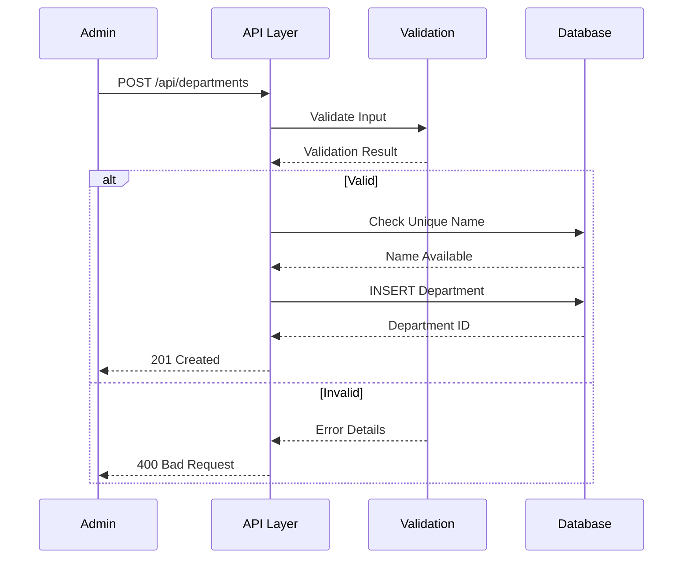
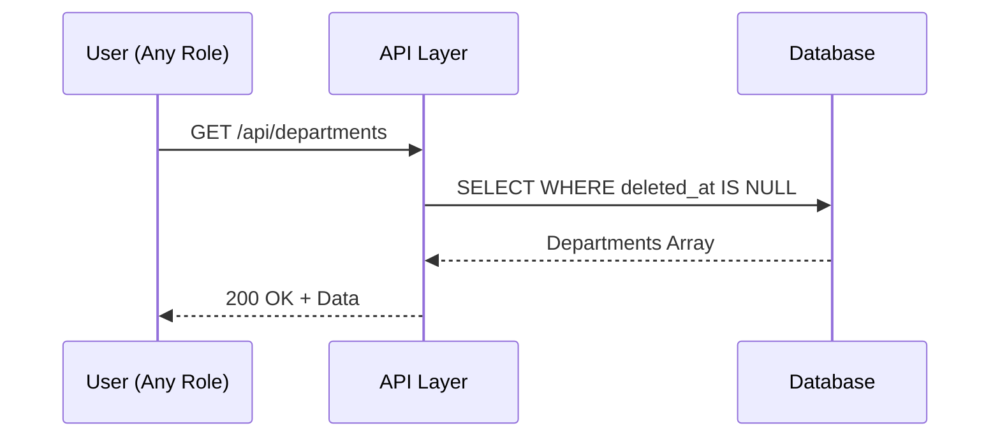
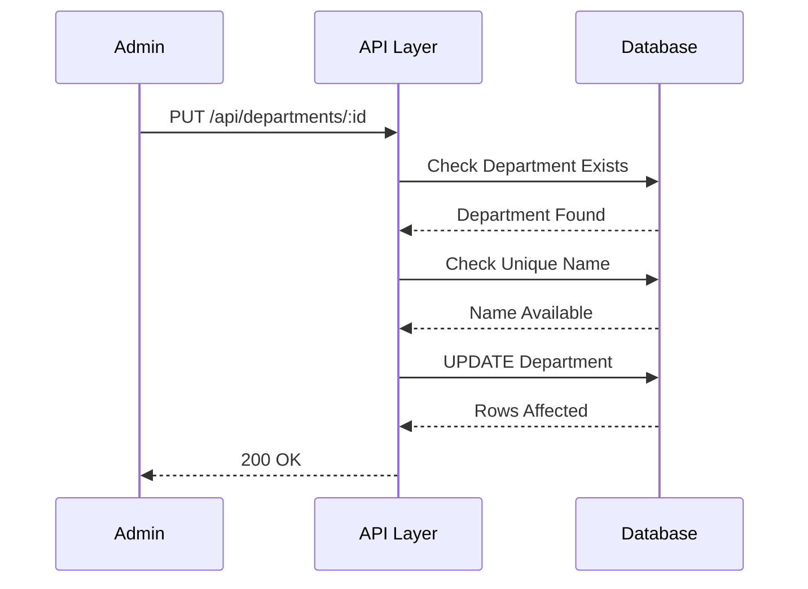
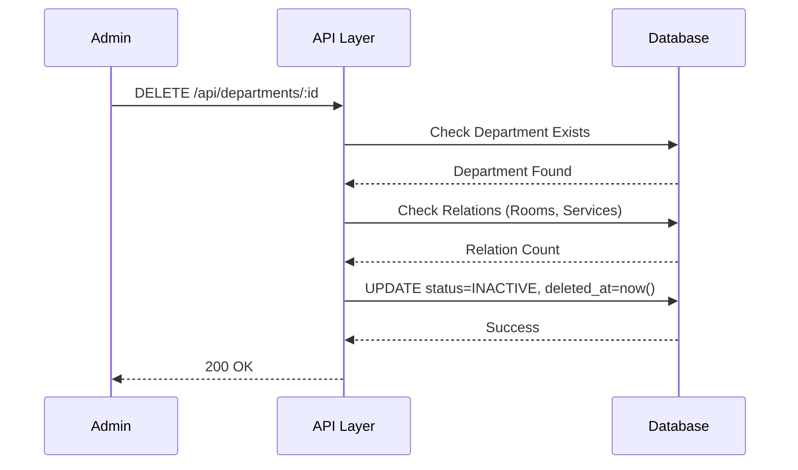

# 📄 FAYL: `07-department-management.md`

```markdown
# 07. Bo'limlar Boshqaruvi (Department Management)

---

## 📋 UMUMIY MA'LUMOT

| Maydon | Qiymat |
|--------|--------|
| **Flow ID** | 07 |
| **Phase** | 1 - Foundation |
| **Model** | `Department` |
| **Status** | Draft |
| **Yaratilgan Sana** | 2024-01-15 |
| **Oxirgi Yangilanish** | 2024-01-15 |
| **Mas'ul** | Senior Backend Developer |
| **Bog'liq Model** | `User` (RFC-002), `Room` (Keyingi), `Service` (Keyingi) |

---

## 🎯 MAQSAD

Klinika bo'limlarini (kafedralarini) boshqarish va tashkil qilish. Har bir bo'lim uchun xizmatlar, xonalar va shifokorlarni biriktirish. Klinikaning tashkiliy tuzilmasini raqamlashtirish va hisobotlarda bo'lim kesimida statistika olish uchun reference ma'lumotlar bazasini yaratish.

---

## 👥 MAS'UL ROLLAR

| Rol | Create | Read | Update | Delete | Tavsif |
|-----|--------|------|--------|--------|--------|
| **Admin** | ✅ | ✅ | ✅ | ✅ | To'liq huquq - barcha operatsiyalar |
| **Doctor** | ❌ | ✅ | ❌ | ❌ | Faqat ko'rish (xizmatlar va xonalar uchun) |
| **Nurse** | ❌ | ✅ | ❌ | ❌ | Faqat ko'rish |
| **Receptionist** | ❌ | ✅ | ❌ | ❌ | Faqat ko'rish (qabul yo'naltirishda) |
| **Accountant** | ❌ | ✅ | ❌ | ❌ | Faqat ko'rish (hisobotlar uchun) |

---

## 📊 PRISMA MODEL

### To'liq Model Schema (Reference: `klinika_prisma.txt`)

```prisma
model Department {
  id           Int          @id @default(autoincrement())
  name         String       @db.VarChar(100)
  description  String?      @db.Text
  status       RecordStatus @default(ACTIVE)
  created_at   Timestamptz  @default(now())
  updated_at   Timestamptz  @updatedAt
  deleted_at   Timestamptz?
  registered_by Int?        @map("registered_by")
  modified_by  Int?         @map("modified_by")

  // Relations
  register_user User?       @relation("fk_department_registered_by", fields: [registered_by], references: [id], onDelete: SetNull, onUpdate: Cascade)
  modify_user   User?       @relation("fk_department_modified_by", fields: [modified_by], references: [id], onDelete: SetNull, onUpdate: Cascade)

  rooms        Room[]       @relation("fk_room_department")
  services     Service[]    @relation("fk_service_department")

  @@index([status])
  @@index([name])
  @@index([deleted_at])
  @@map("departments")
}
```

### Model Maydonlari Tafsiloti

| Maydon | Tip | Majburiy | Default | DB Tip | Izoh/Tavsif |
|--------|-----|----------|---------|--------|-------------|
| `id` | Int | ✅ | autoincrement | SERIAL | **Primary Key**. Unikal identifikator, avtomatik oshib boradi. Room va Service jadvallari bilan bog'lanish uchun ishlatiladi |
| `name` | String | ✅ | - | VARCHAR(100) | **Bo'lim nomi**. 3-100 belgi, unikal bo'lishi shart. Misol: "Terapiya", "Xirurgiya", "Stomatologiya". Lotin va Kirill harflari ruxsat etiladi |
| `description` | String | ❌ | null | TEXT | **Qo'shimcha tavsif**. 0-255 belgi, bo'lim haqida qo'shimcha ma'lumot. Xizmatlar, mutaxassisliklar haqida yozish mumkin |
| `status` | Enum | ✅ | ACTIVE | VARCHAR | **Holat**. ACTIVE (faol), INACTIVE (nofaol), ARCHIVED (arxiv). Yangi bo'lim yaratilganda default ACTIVE |
| `created_at` | Timestamptz | ✅ | now() | TIMESTAMPTZ | **Yaratilgan vaqt**. Avtomatik to'ldiriladi, UTC timezone. Audit uchun muhim |
| `updated_at` | Timestamptz | ✅ | now() | TIMESTAMPTZ | **Oxirgi o'zgarish**. Har bir update da avtomatik yangilanadi (Prisma @updatedAt) |
| `deleted_at` | Timestamptz | ❌ | null | TIMESTAMPTZ | **Soft Delete**. NULL = aktiv, qiymat bor = o'chirilgan. Fizik delete qilinmaydi, audit saqlanadi |
| `registered_by` | Int | ❌ | null | INTEGER | **Foreign Key**. Kim yaratgan (User ID). SetNull cascade - user o'chirilganda null bo'ladi. Audit uchun muhim |
| `modified_by` | Int | ❌ | null | INTEGER | **Foreign Key**. Kim oxirgi o'zgartirgan (User ID). SetNull cascade - user o'chirilganda null bo'ladi. Audit uchun muhim |

### Indexlar

| Index | Maydon(lar) | Maqsad |
|-------|-------------|--------|
| `@@index([status])` | status | Status bo'yicha filter qilishni tezlashtirish (faqat aktiv bo'limlar) |
| `@@index([name])` | name | Bo'lim nomi bo'yicha qidiruvni tezlashtirish (search/dropdown) |
| `@@index([deleted_at])` | deleted_at | Soft delete filter uchun (o'chirilgan bo'limlarni ajratish) |

### Relation'lar

| Relation | Model | Type | onDelete | onUpdate | Tavsif |
|----------|-------|------|----------|----------|--------|
| `fk_department_registered_by` | User | N:1 | SetNull | Cascade | User o'chirilganda registered_by NULL ga o'zgaradi. Audit tarixi saqlanadi |
| `fk_department_modified_by` | User | N:1 | SetNull | Cascade | User o'chirilganda modified_by NULL ga o'zgaradi. Audit tarixi saqlanadi |
| `fk_room_department` | Room | 1:N | SetNull | Cascade | Bo'lim o'chirilganda xonalarning department_id NULL ga o'zgaradi. Xona ma'lumoti saqlanadi |
| `fk_service_department` | Service | 1:N | SetNull | Cascade | Bo'lim o'chirilganda xizmatlarning department_id NULL ga o'zgaradi. Xizmat ma'lumoti saqlanadi |

---

## 🔄 FLOW DIAGRAM

### 1. Bo'lim Yaratish Flow (Admin tomonidan)



### 2. Bo'lim Ro'yxatini Olish Flow



### 3. Bo'lim Yangilash Flow



### 4. Bo'lim O'chirish (Soft Delete) Flow



---

## 📝 BOSQICHMA-BOSQICH JARAYON

### BOSQICH 1: Bo'lim Yaratish

#### 1.1. Input Ma'lumotlari

```typescript
interface CreateDepartmentDto {
  name: string;       // 3-100 belgi, unikal
  description?: string;   // 0-255 belgi
  status?: string;    // ACTIVE/INACTIVE/ARCHIVED
}
```

#### 1.2. Validatsiya Qoidalari

```typescript
// Name validatsiya
{
  minLength: 3,
  maxLength: 100,
  pattern: /^[a-zA-Z\u0400-\u04FF\s'-]+$/,  // Lotin, Kirill, space, ', -
  unique: true,
  required: true
}

// Description validatsiya
{
  minLength: 0,
  maxLength: 255,
  required: false
}

// Status validatsiya
{
  enum: ['ACTIVE', 'INACTIVE', 'ARCHIVED'],
  default: 'ACTIVE',
  required: false
}
```

#### 1.3. Biznes Logika

```typescript
// department.service.ts
async create( CreateDepartmentDto, userId: number): Promise<Department> {
  // 1. Name unikal ekanligini tekshirish
  const existing = await this.prisma.department.findFirst({
    where: {
      name: data.name,
      deleted_at: null
    }
  });
  
  if (existing) {
    throw new ConflictException('DEPT_001');
  }
  
  // 2. Bo'lim yaratish
  const department = await this.prisma.department.create({
     {
      name: data.name,
      description: data.description,
      status: data.status || 'ACTIVE',
      created_at: new Date(),
      updated_at: new Date(),
      registered_by: userId
    }
  });
  
  return department;
}
```

#### 1.4. Database Query

```prisma
INSERT INTO departments (
  name,
  description,
  status,
  created_at,
  updated_at,
  registered_by
) VALUES (
  'Terapiya',
  'Ichki kasalliklar bo''limi',
  'ACTIVE',
  NOW(),
  NOW(),
  1
);
```

---

### BOSQICH 2: Bo'lim Ro'yxatini Olish

#### 2.1. Query Parametrlari

```typescript
interface GetDepartmentsQuery {
  page?: number;        // Default: 1
  limit?: number;       // Default: 100 (klassifikator uchun ko'p)
  status?: string;      // Filter by status
  search?: string;      // Search by name
  sortBy?: string;      // Default: name
  sortOrder?: string;   // Default: asc
}
```

#### 2.2. Biznes Logika

```typescript
async findAll(query: GetDepartmentsQuery): Promise<PaginatedResult<Department>> {
  const where: any = { deleted_at: null };
  
  // Status filter
  if (query.status) {
    where.status = query.status;
  }
  
  // Search filter
  if (query.search) {
    where.name = {
      contains: query.search,
      mode: 'insensitive'
    };
  }
  
  // Pagination
  const skip = (query.page - 1) * query.limit;
  const take = Math.min(query.limit, 100);
  
  // Sorting
  const orderBy = {
    [query.sortBy || 'name']: query.sortOrder || 'asc'
  };
  
  const [data, total] = await Promise.all([
    this.prisma.department.findMany({
      where,
      skip,
      take,
      orderBy,
      include: {
        _count: {
          select: { 
            rooms: true,
            services: true
          }
        }
      }
    }),
    this.prisma.department.count({ where })
  ]);
  
  return {
    data,
    pagination: {
      page: query.page,
      limit: take,
      total,
      totalPages: Math.ceil(total / take),
      hasNextPage: skip + take < total,
      hasPrevPage: query.page > 1
    }
  };
}
```

#### 2.3. Database Query

```prisma
SELECT 
  id,
  name,
  description,
  status,
  created_at,
  updated_at,
  deleted_at,
  registered_by,
  modified_by
FROM departments
WHERE deleted_at IS NULL
  AND status = 'ACTIVE'
ORDER BY name ASC
LIMIT 100 OFFSET 0;
```

---

### BOSQICH 3: Bo'lim Yangilash

#### 3.1. Input Ma'lumotlari

```typescript
interface UpdateDepartmentDto {
  name?: string;
  description?: string;
  status?: string;
}
```

#### 3.2. Biznes Logika

```typescript
async update(id: number,  UpdateDepartmentDto, userId: number): Promise<Department> {
  // 1. Bo'lim mavjudligini tekshirish
  const department = await this.prisma.department.findUnique({
    where: { id }
  });
  
  if (!department || department.deleted_at) {
    throw new NotFoundException('DEPT_003');
  }
  
  // 2. Name unikal ekanligini tekshirish (agar o'zgarayotgan bo'lsa)
  if (data.name && data.name !== department.name) {
    const existing = await this.prisma.department.findFirst({
      where: {
        name: data.name,
        id: { not: id },
        deleted_at: null
      }
    });
    
    if (existing) {
      throw new ConflictException('DEPT_001');
    }
  }
  
  // 3. Bo'lim yangilash
  const updated = await this.prisma.department.update({
    where: { id },
     {
      ...data,
      updated_at: new Date(),
      modified_by: userId
    }
  });
  
  return updated;
}
```

#### 3.3. Database Query

```prisma
UPDATE departments
SET 
  name = 'Terapiya (Updated)',
  description = 'Ichki kasalliklar bo''limi - kengaytirilgan',
  status = 'ACTIVE',
  updated_at = NOW(),
  modified_by = 1
WHERE id = 1
  AND deleted_at IS NULL;
```

---

### BOSQICH 4: Bo'lim O'chirish (Soft Delete)

#### 4.1. Biznes Logika

```typescript
async remove(id: number, userId: number): Promise<Department> {
  // 1. Bo'lim mavjudligini tekshirish
  const department = await this.prisma.department.findUnique({
    where: { id }
  });
  
  if (!department || department.deleted_at) {
    throw new NotFoundException('DEPT_003');
  }
  
  // 2. Bog'liq yozuvlarni tekshirish
  const roomCount = await this.prisma.room.count({
    where: { department_id: id, deleted_at: null }
  });
  
  const serviceCount = await this.prisma.service.count({
    where: { department_id: id, deleted_at: null }
  });
  
  // 3. Warning log (agar bog'liq yozuvlar bo'lsa)
  if (roomCount > 0 || serviceCount > 0) {
    this.logger.warn(
      `Department ${id} has ${roomCount} rooms and ${serviceCount} services. 
       Their department_id will be set to NULL.`
    );
  }
  
  // 4. Soft Delete (SetNull cascade avtomatik ishlaydi)
  return this.prisma.department.update({
    where: { id },
     {
      status: 'INACTIVE',
      deleted_at: new Date()
    }
  });
}
```

#### 4.2. Database Query

```prisma
UPDATE departments
SET 
  status = 'INACTIVE',
  deleted_at = NOW()
WHERE id = 1;

-- Xonalarning department_id null qilish (SetNull cascade)
UPDATE rooms
SET department_id = NULL
WHERE department_id = 1;

-- Xizmatlarning department_id null qilish (SetNull cascade)
UPDATE services
SET department_id = NULL
WHERE department_id = 1;
```

---

## 🔌 API ENDPOINT'LAR

### 1. Bo'lim Yaratish

| Parametr | Qiymat |
|----------|--------|
| **Method** | POST |
| **Endpoint** | `/api/v1/departments` |
| **Auth** | ✅ JWT Required |
| **Rol** | Admin |
| **Content-Type** | application/json |

**Request Body:**
```json
{
  "name": "Terapiya",
  "description": "Ichki kasalliklar bo'limi",
  "status": "ACTIVE"
}
```

**Response (201 Created):**
```json
{
  "success": true,
  "message": "Bo'lim muvaffaqiyatli yaratildi",
  "data": {
    "id": 1,
    "name": "Terapiya",
    "description": "Ichki kasalliklar bo'limi",
    "status": "ACTIVE",
    "created_at": "2024-01-15T10:00:00.000Z",
    "updated_at": "2024-01-15T10:00:00.000Z",
    "deleted_at": null,
    "registered_by": 1,
    "modified_by": null
  }
}
```

---

### 2. Bo'lim Ro'yxatini Olish

| Parametr | Qiymat |
|----------|--------|
| **Method** | GET |
| **Endpoint** | `/api/v1/departments` |
| **Auth** | ✅ JWT Required |
| **Rol** | Barchasi |

**Query Params:**
```
GET /api/v1/departments?page=1&limit=100&status=ACTIVE&sortBy=name&sortOrder=asc
```

**Response (200 OK):**
```json
{
  "success": true,
  "data": [
    {
      "id": 1,
      "name": "Terapiya",
      "description": "Ichki kasalliklar bo'limi",
      "status": "ACTIVE",
      "created_at": "2024-01-15T10:00:00.000Z",
      "_count": { "rooms": 5, "services": 10 }
    },
    {
      "id": 2,
      "name": "Xirurgiya",
      "description": "Xirurgik operatsiyalar bo'limi",
      "status": "ACTIVE",
      "created_at": "2024-01-15T10:00:00.000Z",
      "_count": { "rooms": 3, "services": 8 }
    },
    {
      "id": 3,
      "name": "Stomatologiya",
      "description": "Tish davolash bo'limi",
      "status": "ACTIVE",
      "created_at": "2024-01-15T10:00:00.000Z",
      "_count": { "rooms": 4, "services": 12 }
    }
  ],
  "pagination": {
    "page": 1,
    "limit": 100,
    "total": 12,
    "totalPages": 1,
    "hasNextPage": false,
    "hasPrevPage": false
  }
}
```

---

### 3. Bitta Bo'lim Ma'lumotlarini Olish

| Parametr | Qiymat |
|----------|--------|
| **Method** | GET |
| **Endpoint** | `/api/v1/departments/:id` |
| **Auth** | ✅ JWT Required |
| **Rol** | Barchasi |

**Response (200 OK):**
```json
{
  "success": true,
  "data": {
    "id": 1,
    "name": "Terapiya",
    "description": "Ichki kasalliklar bo'limi",
    "status": "ACTIVE",
    "created_at": "2024-01-15T10:00:00.000Z",
    "updated_at": "2024-01-15T10:00:00.000Z",
    "deleted_at": null,
    "registered_by": 1,
    "modified_by": null,
    "_count": { "rooms": 5, "services": 10 }
  }
}
```

---

### 4. Bo'lim Yangilash

| Parametr | Qiymat |
|----------|--------|
| **Method** | PUT |
| **Endpoint** | `/api/v1/departments/:id` |
| **Auth** | ✅ JWT Required |
| **Rol** | Admin |

**Request Body:**
```json
{
  "name": "Terapiya (Updated)",
  "description": "Ichki kasalliklar bo'limi - kengaytirilgan",
  "status": "ACTIVE"
}
```

**Response (200 OK):**
```json
{
  "success": true,
  "message": "Bo'lim muvaffaqiyatli yangilandi",
  "data": {
    "id": 1,
    "name": "Terapiya (Updated)",
    "description": "Ichki kasalliklar bo'limi - kengaytirilgan",
    "status": "ACTIVE",
    "created_at": "2024-01-15T10:00:00.000Z",
    "updated_at": "2024-01-15T12:00:00.000Z",
    "deleted_at": null,
    "registered_by": 1,
    "modified_by": 1
  }
}
```

---

### 5. Bo'lim O'chirish (Soft Delete)

| Parametr | Qiymat |
|----------|--------|
| **Method** | DELETE |
| **Endpoint** | `/api/v1/departments/:id` |
| **Auth** | ✅ JWT Required |
| **Rol** | Admin |

**Response (200 OK):**
```json
{
  "success": true,
  "message": "Bo'lim muvaffaqiyatli o'chirildi",
  "data": {
    "id": 1,
    "name": "Terapiya",
    "status": "INACTIVE",
    "deleted_at": "2024-01-15T14:00:00.000Z"
  }
}
```

---

## ⚠️ XATOLIKLAR VA HANDLING

| Kod | HTTP Status | Xabar | Sabab | Yechim |
|-----|-------------|-------|-------|--------|
| `DEPT_001` | 409 Conflict | Bo'lim nomi allaqachon mavjud | Name unique constraint | Boshqa nom tanlang |
| `DEPT_002` | 400 Bad Request | Bo'lim nomi juda qisqa | Validation failed (min 3) | Kamida 3 belgi kiriting |
| `DEPT_003` | 404 Not Found | Bo'lim topilmadi | ID not exists yoki deleted | ID ni tekshiring |
| `DEPT_004` | 403 Forbidden | Ruxsat yo'q | Insufficient permissions | Admin roli kerak |
| `DEPT_005` | 500 Internal Server Error | Tizim xatosi | Database error | Admin bilan bog'laning |

---

## 📦 SEED DATA (BOSHLANG'ICH MA'LUMOTLAR)

```typescript
// seed/department.seed.ts
export async function seedDepartments(prisma: PrismaClient) {
  const departments = [
    { 
      name: "Terapiya", 
      description: "Ichki kasalliklar bo'limi" 
    },
    { 
      name: "Xirurgiya", 
      description: "Xirurgik operatsiyalar bo'limi" 
    },
    { 
      name: "Stomatologiya", 
      description: "Tish davolash bo'limi" 
    },
    { 
      name: "Ginekologiya", 
      description: "Ayollar kasalliklari bo'limi" 
    },
    { 
      name: "Urologiya", 
      description: "Erkaklar kasalliklari bo'limi" 
    },
    { 
      name: "Kardiologiya", 
      description: "Yurak kasalliklari bo'limi" 
    },
    { 
      name: "Nevrologiya", 
      description: "Asab tizimi kasalliklari bo'limi" 
    },
    { 
      name: "Dermatologiya", 
      description: "Teri kasalliklari bo'limi" 
    },
    { 
      name: "Oftalmologiya", 
      description: "Ko'z kasalliklari bo'limi" 
    },
    { 
      name: "Laboratoriya", 
      description: "Tahlillar bo'limi" 
    },
    { 
      name: "Rentgen", 
      description: "Rentgen tekshiruvi bo'limi" 
    },
    { 
      name: "Fizioterapiya", 
      description: "Fizioterapiya muolajalari bo'limi" 
    }
  ];

  for (const department of departments) {
    await prisma.department.upsert({
      where: { name },
      update: {},
      create: {
        name: department.name,
        description: department.description,
        status: 'ACTIVE'
      }
    });
  }

  console.log('✅ Departments seeded successfully (12 departments)');
}
```

### Seed Script Ishga Tushirish

```bash
# Development
npm run seed

# Production (ehtiyotkorlik bilan)
npm run seed:prod

# Faqat bo'limlar
npm run seed:departments
```

---

## 🔐 XAVFSIZLIK TALABLARI

### 1. Autentifikatsiya
- ✅ Barcha endpoint'lar JWT token talab qiladi
- ✅ Token expiry: 24 soat

### 2. Avtorizatsiya (RBAC)
| Endpoint | Admin | Doctor | Nurse | Receptionist | Accountant |
|----------|-------|--------|-------|--------------|------------|
| POST /departments | ✅ | ❌ | ❌ | ❌ | ❌ |
| GET /departments | ✅ | ✅ | ✅ | ✅ | ✅ |
| GET /departments/:id | ✅ | ✅ | ✅ | ✅ | ✅ |
| PUT /departments/:id | ✅ | ❌ | ❌ | ❌ | ❌ |
| DELETE /departments/:id | ✅ | ❌ | ❌ | ❌ | ❌ |

### 3. Audit
- ✅ `created_at` - Yaratilgan vaqt
- ✅ `updated_at` - Oxirgi o'zgarish
- ✅ `deleted_at` - Soft delete vaqti
- ✅ `registered_by` - Kim yaratdi (User ID)
- ✅ `modified_by` - Kim o'zgartirdi (User ID)

---

## 📝 ESLATMALAR

1. **Bo'limlar kam o'zgaradi** - Seed data tizim o'rnatilganda avtomatik yuklanadi
2. **Cache qilish tavsiya etiladi** - Redis cache, TTL: 1 soat
3. **Soft Delete** - Bo'lim o'chirilganda `deleted_at` set bo'ladi, fizik delete qilinmaydi
4. **Cascade Rules** - Bo'lim o'chirilganda, bog'liq xona va xizmatlarning department_id NULL ga o'zgaradi (SetNull)
5. **Unikal nom** - Bo'lim nomi unikal bo'lishi shart (case-insensitive)
6. **Klassifikator** - Bu reference ma'lumot, tez-tez o'zgartirilmaydi
7. **12 ta standart bo'lim** - Seed data da 12 ta standart bo'lim mavjud (Reference: `Klinika.md`)
8. **Bog'liqlik** - Room va Service modullari department_id ga bog'liq

---

## ✅ QABUL QILISH MEZONLARI (ACCEPTANCE CRITERIA)

- [ ] Bo'lim nomi unikal bo'lishi
- [ ] Bo'lim nomi 3-100 belgi orasida bo'lishi
- [ ] Soft delete ishlaydi (deleted_at set bo'ladi)
- [ ] Faqat Admin bo'lim yaratish/o'zgartirish/o'chirish huquqiga ega
- [ ] Barcha rollar bo'lim ro'yxatini ko'ra oladi
- [ ] Pagination va search ishlaydi
- [ ] Xatoliklar to'g'ri HTTP status va kod bilan qaytariladi
- [ ] Seed data tizim o'rnatilganda avtomatik yuklanadi (12 ta bo'lim)
- [ ] Audit maydonlari (registered_by, modified_by) to'ldiriladi
- [ ] Cascade rules ishlaydi (SetNull)
