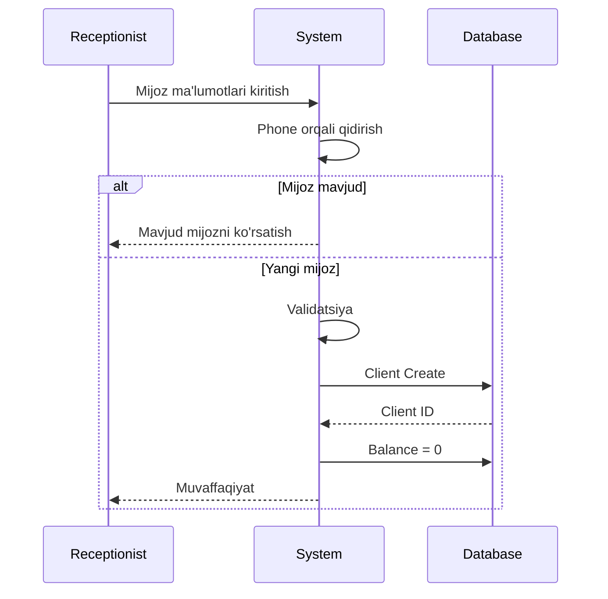
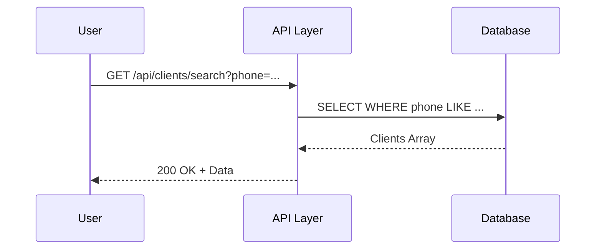
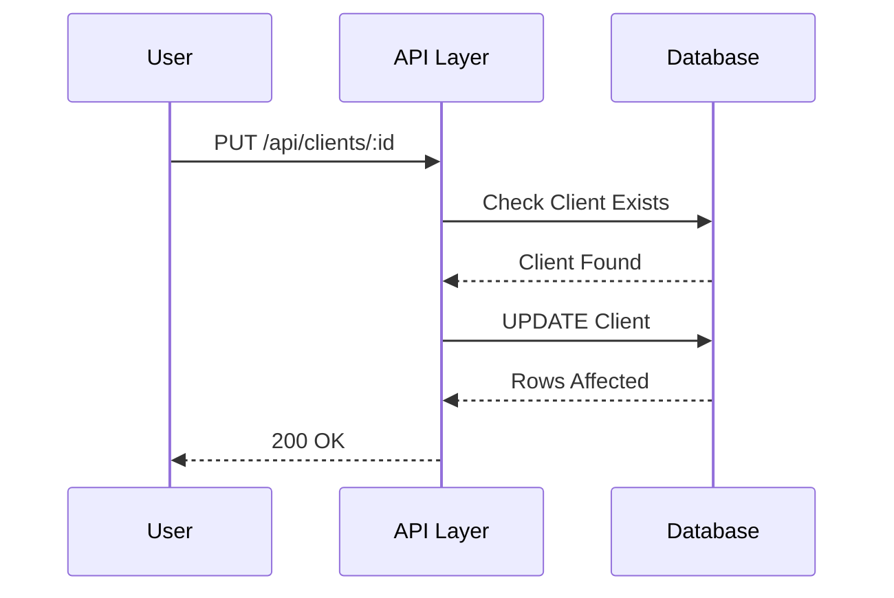
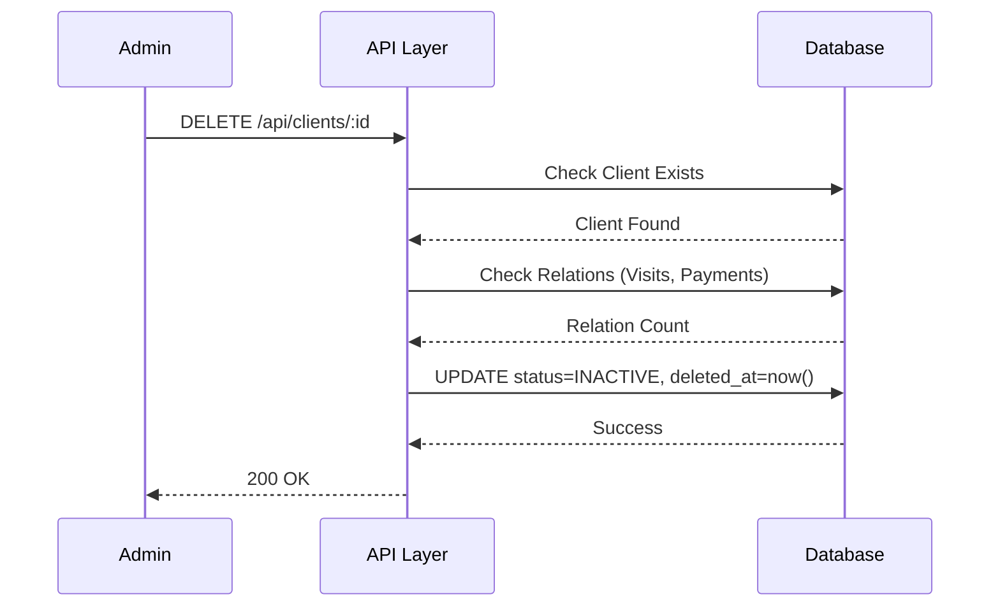
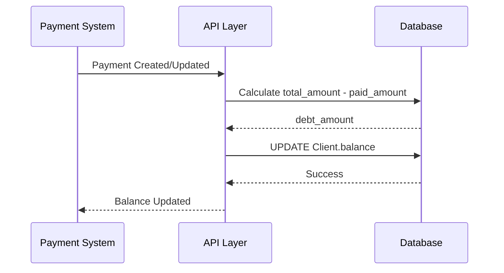

## 📋 PHASE 2A: CORE ENTITIES - Ishlash Tartibi

| # | Model | Priority | Bog'liqlik | Status |
|---|-------|----------|------------|--------|
| 9 | `Client` | 🔴 High | LocRegion, LocDistrict, Source, ClientGroup, User | ⏳ Boshlaymiz |
| 10 | `Room` | 🟡 Medium | Department, User | ⏳ Keyingi |
| 11 | `Service` | 🟡 Medium | Department, User | ⏳ Keyingi |
| 12 | `Referral` | 🟢 Low | User | ⏳ Keyingi |
| 13 | `Visit` | 🔴 High | Client, User (Doctor) | ⏳ Client dan keyin |

---

## 🚀 BOSHLAYMIZ: 09-Client Management Flow

```markdown
# 09. Mijoz Boshqaruvi (Client Management)

---

## 📋 UMUMIY MA'LUMOT

| Maydon | Qiymat |
|--------|--------|
| **Flow ID** | 09 |
| **Phase** | 2A - Core Entities |
| **Model** | `Client` |
| **Status** | Draft |
| **Yaratilgan Sana** | 2024-01-15 |
| **Oxirgi Yangilanish** | 2024-01-15 |
| **Mas'ul** | Senior Backend Developer |
| **Bog'liq Modellar** | `LocRegion` (RFC-003), `LocDistrict` (RFC-004), `Source` (RFC-005), `ClientGroup` (RFC-006), `User` (RFC-002) |

---

## 🎯 MAQSAD

Klinikaga kelgan mijozlarni (bemorlarni) ro'yxatga olish, ularning ma'lumotlarini saqlash va boshqarish. Mijozlar bazasini shakllantirish, ularning moliyaviy holatini (balance, debt) kuzatish va kelajakdagi visitlar uchun asos yaratish.

---

## 👥 MAS'UL ROLLAR

| Rol | Create | Read | Update | Delete | Tavsif |
|-----|--------|------|--------|--------|--------|
| **Admin** | ✅ | ✅ | ✅ | ✅ | To'liq huquq - barcha operatsiyalar |
| **Doctor** | ✅ | ✅ | ✅ | ❌ | Mijoz ma'lumotlarini ko'rish va o'zgartirish |
| **Nurse** | ❌ | ✅ | ❌ | ❌ | Faqat ko'rish |
| **Receptionist** | ✅ | ✅ | ✅ | ❌ | Mijoz ro'yxatga olish va yangilash |
| **Accountant** | ❌ | ✅ | ✅ (balance) | ❌ | Mijoz moliyasini ko'rish va yangilash |

---

## 📊 PRISMA MODEL (Reference: `klinika_prisma.txt`)

### To'liq Model Schema

```prisma
model Client {
  id           Int           @id @default(autoincrement())
  full_name    String        @db.VarChar(100)
  phone        String        @db.VarChar(20)
  group_id     Int?          @map("group_id")
  gender       ClientGender
  date_of_birth Date?        @map("date_of_birth")
  region_id    Int?          @map("region_id")
  district_id  Int?          @map("district_id")
  address      String?       @db.VarChar(255)
  balance      Decimal       @default(0) @db.Decimal(15, 2)
  description  String?       @db.Text
  source_id    Int?          @map("source_id")
  status       RecordStatus  @default(ACTIVE)
  created_at   Timestamptz   @default(now())
  updated_at   Timestamptz   @updatedAt
  deleted_at   Timestamptz?
  registered_by Int?         @map("registered_by")
  modified_by  Int?          @map("modified_by")

  // Relations
  group        ClientGroup?  @relation("fk_client_group", fields: [group_id], references: [id], onDelete: SetNull, onUpdate: Cascade)
  district     LocDistrict?  @relation("fk_client_district", fields: [district_id], references: [id], onDelete: SetNull, onUpdate: Cascade)
  region       LocRegion?    @relation("fk_client_region", fields: [region_id], references: [id], onDelete: SetNull, onUpdate: Cascade)
  source       Source?       @relation("fk_client_source", fields: [source_id], references: [id], onDelete: SetNull, onUpdate: Cascade)
  register_user User?        @relation("fk_client_registered_by", fields: [registered_by], references: [id], onDelete: SetNull, onUpdate: Cascade)
  modify_user  User?         @relation("fk_client_modified_by", fields: [modified_by], references: [id], onDelete: SetNull, onUpdate: Cascade)

  // Business relations
  payments     Payment[]     @relation("fk_payment_client")
  visits       Visit[]       @relation("fk_visit_client")
  client_paid  ClientPaid[]  @relation("fk_client_paid_client")

  @@index([group_id])
  @@index([region_id])
  @@index([district_id])
  @@index([source_id])
  @@index([status])
  @@index([phone])
  @@index([created_at])
  @@index([deleted_at])
  @@index([status, deleted_at])
  @@index([phone, status])
  @@map("clients")
}
```

### Model Maydonlari Tafsiloti

| Maydon | Tip | Majburiy | Default | DB Tip | Izoh/Tavsif |
|--------|-----|----------|---------|--------|-------------|
| `id` | Int | ✅ | autoincrement | SERIAL | **Primary Key**. Unikal identifikator, avtomatik oshib boradi. Visit, Payment jadvallari bilan bog'lanish uchun |
| `full_name` | String | ✅ | - | VARCHAR(100) | **F.I.O**. Mijozning to'liq ismi, 3-100 belgi. Lotin va Kirill harflari ruxsat etiladi |
| `phone` | String | ✅ | - | VARCHAR(20) | **Telefon raqam**. +998 formatida (masalan: +998901234567). Unikal emas, lekin qidiruv uchun ishlatiladi |
| `group_id` | Int | ❌ | null | INTEGER | **Foreign Key**. ClientGroup jadvaliga bog'lanish. Mijoz guruhi (VIP, Oddiy, Korporativ) |
| `gender` | Enum | ✅ | - | ClientGender | **Jinsi**. MALE (erkak), FEMALE (ayol), OTHER (boshqa) |
| `date_of_birth` | Date | ❌ | null | DATE | **Tug'ilgan sana**. Mijoz yoshini hisoblash uchun |
| `region_id` | Int | ❌ | null | INTEGER | **Foreign Key**. LocRegion jadvaliga bog'lanish. Mijoz viloyati |
| `district_id` | Int | ❌ | null | INTEGER | **Foreign Key**. LocDistrict jadvaliga bog'lanish. Mijoz tumani |
| `address` | String | ❌ | null | VARCHAR(255) | **Manzil**. Mijozning yashash manzili, 0-255 belgi |
| `balance` | Decimal | ✅ | 0 | DECIMAL(15,2) | **Hisob balansi**. Mijozning klinikadagi moliyaviy holati. Musbat = oldindan to'lov, Manfiy = qarz |
| `description` | String | ❌ | null | TEXT | **Qo'shimcha ma'lumot**. Mijoz haqida qo'shimcha ma'lumot (kasalliklar, allergiya va h.k.) |
| `source_id` | Int | ❌ | null | INTEGER | **Foreign Key**. Source jadvaliga bog'lanish. Mijoz qayerdan keldi? (Instagram, Telegram, Tavsiya) |
| `status` | Enum | ✅ | ACTIVE | RecordStatus | **Holat**. ACTIVE (faol), INACTIVE (nofaol), ARCHIVED (arxiv) |
| `created_at` | Timestamptz | ✅ | now() | TIMESTAMPTZ | **Yaratilgan vaqt**. Avtomatik to'ldiriladi, UTC timezone |
| `updated_at` | Timestamptz | ✅ | now() | TIMESTAMPTZ | **Oxirgi o'zgarish**. Har bir update da avtomatik yangilanadi |
| `deleted_at` | Timestamptz | ❌ | null | TIMESTAMPTZ | **Soft Delete**. NULL = aktiv, qiymat bor = o'chirilgan |
| `registered_by` | Int | ❌ | null | INTEGER | **Foreign Key**. Kim yaratgan (User ID). Audit uchun |
| `modified_by` | Int | ❌ | null | INTEGER | **Foreign Key**. Kim oxirgi o'zgartirgan (User ID). Audit uchun |

### Indexlar (Reference: `klinika_prisma.txt`)

| Index | Maydon(lar) | Maqsad |
|-------|-------------|--------|
| `@@index([group_id])` | group_id | Guruh bo'yicha filter qilishni tezlashtirish |
| `@@index([region_id])` | region_id | Viloyat bo'yicha filter qilishni tezlashtirish |
| `@@index([district_id])` | district_id | Tuman bo'yicha filter qilishni tezlashtirish |
| `@@index([source_id])` | source_id | Manba bo'yicha filter qilishni tezlashtirish |
| `@@index([status])` | status | Status bo'yicha filter qilishni tezlashtirish |
| `@@index([phone])` | phone | Telefon raqam bo'yicha qidiruvni tezlashtirish (eng ko'p ishlatiladi) |
| `@@index([created_at])` | created_at | Yaratilgan vaqt bo'yicha sort/filter |
| `@@index([deleted_at])` | deleted_at | Soft delete filter uchun |
| `@@index([status, deleted_at])` | status, deleted_at | Qo'shma index - aktiv va o'chirilmagan mijozlar |
| `@@index([phone, status])` | phone, status | Qo'shma index - telefon va status bo'yicha qidiruv |

### Relation'lar

| Relation | Model | Type | onDelete | onUpdate | Tavsif |
|----------|-------|------|----------|----------|--------|
| `fk_client_group` | ClientGroup | N:1 | SetNull | Cascade | Guruh o'chirilganda mijozning group_id NULL ga o'zgaradi |
| `fk_client_district` | LocDistrict | N:1 | SetNull | Cascade | Tuman o'chirilganda mijozning district_id NULL ga o'zgaradi |
| `fk_client_region` | LocRegion | N:1 | SetNull | Cascade | Viloyat o'chirilganda mijozning region_id NULL ga o'zgaradi |
| `fk_client_source` | Source | N:1 | SetNull | Cascade | Manba o'chirilganda mijozning source_id NULL ga o'zgaradi |
| `fk_client_registered_by` | User | N:1 | SetNull | Cascade | User o'chirilganda registered_by NULL ga o'zgaradi |
| `fk_client_modified_by` | User | N:1 | SetNull | Cascade | User o'chirilganda modified_by NULL ga o'zgaradi |
| `fk_payment_client` | Payment | 1:N | SetNull | Cascade | Mijoz o'chirilganda to'lovlar saqlanib qoladi |
| `fk_visit_client` | Visit | 1:N | SetNull | Cascade | Mijoz o'chirilganda visitlar saqlanib qoladi |
| `fk_client_paid_client` | ClientPaid | 1:N | SetNull | Cascade | Mijoz o'chirilganda oldindan to'lovlar saqlanib qoladi |

---

## 🔄 FLOW DIAGRAM

### 1. Mijoz Yaratish Flow



### 2. Mijoz Qidirish Flow



### 3. Mijoz Yangilash Flow



### 4. Mijoz O'chirish (Soft Delete) Flow



### 5. Mijoz Balance Yangilash Flow



---

## 📝 BOSQICHMA-BOSQICH JARAYON

### BOSQICH 1: Mijoz Yaratish

#### 1.1. Input Ma'lumotlari

```typescript
interface CreateClientDto {
  full_name: string;      // 3-100 belgi
  phone: string;          // +998 format
  group_id?: number;      // Mavjud ClientGroup ID
  gender: ClientGender;   // MALE/FEMALE/OTHER
  date_of_birth?: Date;   // Valid date
  region_id?: number;     // Mavjud LocRegion ID
  district_id?: number;   // Mavjud LocDistrict ID
  address?: string;       // 0-255 belgi
  source_id?: number;     // Mavjud Source ID
  description?: string;   // Text
  status?: string;        // ACTIVE/INACTIVE/ARCHIVED
}
```

#### 1.2. Validatsiya Qoidalari

```typescript
// Full Name validatsiya
{
  minLength: 3,
  maxLength: 100,
  pattern: /^[a-zA-Z\u0400-\u04FF\s'-]+$/,
  required: true
}

// Phone validatsiya
{
  pattern: /^\+998[0-9]{9}$/,  // +998901234567
  required: true
}

// Gender validatsiya
{
  enum: ['MALE', 'FEMALE', 'OTHER'],
  required: true
}

// Date of Birth validatsiya
{
  type: 'date',
  max: new Date(),  // Kelajak sana bo'lmasligi kerak
  required: false
}

// Region/District validatsiya
{
  type: 'number',
  mustExist: true,  // LocRegion/LocDistrict jadvalida mavjud bo'lishi kerak
  required: false
}

// Source validatsiya
{
  type: 'number',
  mustExist: true,  // Source jadvalida mavjud bo'lishi kerak
  required: false
}

// Group validatsiya
{
  type: 'number',
  mustExist: true,  // ClientGroup jadvalida mavjud bo'lishi kerak
  required: false
}

// Balance validatsiya
{
  type: 'decimal',
  precision: 15,
  scale: 2,
  default: 0,
  required: false  // Avtomatik hisoblanadi
}

// Status validatsiya
{
  enum: ['ACTIVE', 'INACTIVE', 'ARCHIVED'],
  default: 'ACTIVE',
  required: false
}
```

#### 1.3. Biznes Logika

```typescript
// client.service.ts
async create(createClientDto: CreateClientDto, userId: number): Promise<Client> {
  // 1. Phone formatini tekshirish va normalizatsiya
  const normalizedPhone = this.normalizePhone(createClientDto.phone);
  
  // 2. Mavjud mijozni telefon raqam bo'yicha tekshirish
  const existingClient = await this.prisma.client.findFirst({
    where: {
      phone: normalizedPhone,
      deleted_at: null
    }
  });
  
  if (existingClient) {
    throw new ConflictException('CLI_001');
  }
  
  // 3. Reference ma'lumotlarni tekshirish (agar kiritilgan bo'lsa)
  if (createClientDto.group_id) {
    const group = await this.prisma.clientGroup.findUnique({
      where: { id: createClientDto.group_id }
    });
    if (!group || group.deleted_at) {
      throw new NotFoundException('CLI_002');
    }
  }
  
  if (createClientDto.region_id) {
    const region = await this.prisma.locRegion.findUnique({
      where: { id: createClientDto.region_id }
    });
    if (!region || region.deleted_at) {
      throw new NotFoundException('CLI_003');
    }
  }
  
  if (createClientDto.district_id) {
    const district = await this.prisma.locDistrict.findUnique({
      where: { id: createClientDto.district_id }
    });
    if (!district || district.deleted_at) {
      throw new NotFoundException('CLI_004');
    }
  }
  
  if (createClientDto.source_id) {
    const source = await this.prisma.source.findUnique({
      where: { id: createClientDto.source_id }
    });
    if (!source || source.deleted_at) {
      throw new NotFoundException('CLI_005');
    }
  }
  
  // 4. Mijoz yaratish
  const client = await this.prisma.client.create({
     {
      full_name: createClientDto.full_name,
      phone: normalizedPhone,
      group_id: createClientDto.group_id,
      gender: createClientDto.gender,
      date_of_birth: createClientDto.date_of_birth,
      region_id: createClientDto.region_id,
      district_id: createClientDto.district_id,
      address: createClientDto.address,
      balance: 0,  // Default 0
      source_id: createClientDto.source_id,
      description: createClientDto.description,
      status: createClientDto.status || 'ACTIVE',
      created_at: new Date(),
      updated_at: new Date(),
      registered_by: userId
    },
    include: {
      group: { select: { id: true, name: true } },
      region: { select: { id: true, name: true } },
      district: { select: { id: true, name: true } },
      source: { select: { id: true, name: true } }
    }
  });
  
  return client;
}

// Phone normalizatsiya helper
private normalizePhone(phone: string): string {
  const digits = phone.replace(/\D/g, '');
  
  if (digits.startsWith('998')) {
    return '+' + digits;
  }
  
  if (digits.length === 9) {
    return '+998' + digits;
  }
  
  throw new BadRequestException('CLI_006');
}
```

#### 1.4. Database Query

```prisma
INSERT INTO clients (
  full_name,
  phone,
  group_id,
  gender,
  date_of_birth,
  region_id,
  district_id,
  address,
  balance,
  source_id,
  description,
  status,
  created_at,
  updated_at,
  registered_by
) VALUES (
  'John Doe',
  '+998901234567',
  1,
  'MALE',
  '1990-01-01',
  1,
  1,
  'Toshkent shahar, Chilonzor tumani',
  0,
  1,
  'Doimiy mijoz',
  'ACTIVE',
  NOW(),
  NOW(),
  1
);
```

---

### BOSQICH 2: Mijoz Qidirish

#### 2.1. Query Parametrlari

```typescript
interface GetClientsQuery {
  page?: number;        // Default: 1
  limit?: number;       // Default: 10
  phone?: string;       // Filter by phone
  full_name?: string;   // Search by name
  group_id?: number;    // Filter by group
  region_id?: number;   // Filter by region
  district_id?: number; // Filter by district
  source_id?: number;   // Filter by source
  status?: string;      // Filter by status
  gender?: string;      // Filter by gender
  sortBy?: string;      // Default: created_at
  sortOrder?: string;   // Default: desc
}
```

#### 2.2. Biznes Logika

```typescript
async findAll(query: GetClientsQuery): Promise<PaginatedResult<Client>> {
  const where: any = { deleted_at: null };
  
  // Phone filter (exact match)
  if (query.phone) {
    where.phone = this.normalizePhone(query.phone);
  }
  
  // Full name search (case-insensitive)
  if (query.full_name) {
    where.full_name = {
      contains: query.full_name,
      mode: 'insensitive'
    };
  }
  
  // Group filter
  if (query.group_id) {
    where.group_id = query.group_id;
  }
  
  // Region filter
  if (query.region_id) {
    where.region_id = query.region_id;
  }
  
  // District filter
  if (query.district_id) {
    where.district_id = query.district_id;
  }
  
  // Source filter
  if (query.source_id) {
    where.source_id = query.source_id;
  }
  
  // Status filter
  if (query.status) {
    where.status = query.status;
  }
  
  // Gender filter
  if (query.gender) {
    where.gender = query.gender;
  }
  
  // Pagination
  const skip = (query.page - 1) * query.limit;
  const take = Math.min(query.limit, 100);
  
  // Sorting
  const orderBy = {
    [query.sortBy || 'created_at']: query.sortOrder || 'desc'
  };
  
  const [data, total] = await Promise.all([
    this.prisma.client.findMany({
      where,
      skip,
      take,
      orderBy,
      include: {
        group: { select: { id: true, name: true } },
        region: { select: { id: true, name: true } },
        district: { select: { id: true, name: true } },
        source: { select: { id: true, name: true } },
        _count: {
          select: { 
            visits: { where: { deleted_at: null } },
            payments: { where: { deleted_at: null } }
          }
        }
      }
    }),
    this.prisma.client.count({ where })
  ]);
  
  return {
    data,
    pagination: {
      page: query.page,
      limit: take,
      total,
      totalPages: Math.ceil(total / take),
      hasNextPage: skip + take < total,
      hasPrevPage: query.page > 1
    }
  };
}
```

#### 2.3. Database Query

```prisma
SELECT 
  id,
  full_name,
  phone,
  group_id,
  gender,
  date_of_birth,
  region_id,
  district_id,
  address,
  balance,
  source_id,
  status,
  created_at,
  updated_at,
  deleted_at,
  registered_by,
  modified_by
FROM clients
WHERE deleted_at IS NULL
  AND status = 'ACTIVE'
  AND phone LIKE '+998%'
ORDER BY created_at DESC
LIMIT 10 OFFSET 0;
```

---

### BOSQICH 3: Mijoz Yangilash

#### 3.1. Input Ma'lumotlari

```typescript
interface UpdateClientDto {
  full_name?: string;
  phone?: string;
  group_id?: number;
  gender?: ClientGender;
  date_of_birth?: Date;
  region_id?: number;
  district_id?: number;
  address?: string;
  source_id?: number;
  description?: string;
  status?: string;
  // Balance alohida endpoint orqali yangilanadi
}
```

#### 3.2. Biznes Logika

```typescript
async update(id: number, updateClientDto: UpdateClientDto, userId: number): Promise<Client> {
  // 1. Mijoz mavjudligini tekshirish
  const client = await this.prisma.client.findUnique({
    where: { id }
  });
  
  if (!client || client.deleted_at) {
    throw new NotFoundException('CLI_007');
  }
  
  // 2. Phone unikal ekanligini tekshirish (agar o'zgarayotgan bo'lsa)
  if (updateClientDto.phone && updateClientDto.phone !== client.phone) {
    const normalizedPhone = this.normalizePhone(updateClientDto.phone);
    
    const existingClient = await this.prisma.client.findFirst({
      where: {
        phone: normalizedPhone,
        id: { not: id },
        deleted_at: null
      }
    });
    
    if (existingClient) {
      throw new ConflictException('CLI_001');
    }
    
    updateClientDto.phone = normalizedPhone;
  }
  
  // 3. Reference ma'lumotlarni tekshirish (agar o'zgarayotgan bo'lsa)
  if (updateClientDto.group_id) {
    const group = await this.prisma.clientGroup.findUnique({
      where: { id: updateClientDto.group_id }
    });
    if (!group || group.deleted_at) {
      throw new NotFoundException('CLI_002');
    }
  }
  
  if (updateClientDto.region_id) {
    const region = await this.prisma.locRegion.findUnique({
      where: { id: updateClientDto.region_id }
    });
    if (!region || region.deleted_at) {
      throw new NotFoundException('CLI_003');
    }
  }
  
  if (updateClientDto.district_id) {
    const district = await this.prisma.locDistrict.findUnique({
      where: { id: updateClientDto.district_id }
    });
    if (!district || district.deleted_at) {
      throw new NotFoundException('CLI_004');
    }
  }
  
  if (updateClientDto.source_id) {
    const source = await this.prisma.source.findUnique({
      where: { id: updateClientDto.source_id }
    });
    if (!source || source.deleted_at) {
      throw new NotFoundException('CLI_005');
    }
  }
  
  // 4. Mijoz yangilash
  const updated = await this.prisma.client.update({
    where: { id },
     {
      ...updateClientDto,
      updated_at: new Date(),
      modified_by: userId
    },
    include: {
      group: { select: { id: true, name: true } },
      region: { select: { id: true, name: true } },
      district: { select: { id: true, name: true } },
      source: { select: { id: true, name: true } }
    }
  });
  
  return updated;
}
```

#### 3.3. Database Query

```prisma
UPDATE clients
SET 
  full_name = 'John Doe Updated',
  phone = '+998901234567',
  address = 'Yangi manzil',
  updated_at = NOW(),
  modified_by = 1
WHERE id = 1
  AND deleted_at IS NULL;
```

---

### BOSQICH 4: Mijoz O'chirish (Soft Delete)

#### 4.1. Biznes Logika

```typescript
async remove(id: number, userId: number): Promise<Client> {
  // 1. Mijoz mavjudligini tekshirish
  const client = await this.prisma.client.findUnique({
    where: { id }
  });
  
  if (!client || client.deleted_at) {
    throw new NotFoundException('CLI_007');
  }
  
  // 2. Bog'liq yozuvlarni tekshirish
  const visitCount = await this.prisma.visit.count({
    where: { client_id: id, deleted_at: null }
  });
  
  const paymentCount = await this.prisma.payment.count({
    where: { client_id: id, deleted_at: null }
  });
  
  // 3. Warning log (agar bog'liq yozuvlar bo'lsa)
  if (visitCount > 0 || paymentCount > 0) {
    this.logger.warn(
      `Client ${id} has ${visitCount} visits and ${paymentCount} payments. 
       These records will remain but client will be inactive.`
    );
  }
  
  // 4. Soft Delete (SetNull cascade avtomatik ishlaydi)
  return this.prisma.client.update({
    where: { id },
     {
      status: 'INACTIVE',
      deleted_at: new Date()
    }
  });
}
```

#### 4.2. Database Query

```prisma
UPDATE clients
SET 
  status = 'INACTIVE',
  deleted_at = NOW()
WHERE id = 1;

-- Visit va Paymentlar saqlanib qoladi (SetNull cascade)
-- Client ma'lumoti arxivda saqlanadi
```

---

### BOSQICH 5: Mijoz Balance Yangilash

#### 5.1. Balance Hisoblash Mantigi

```typescript
// Mijoz balance avtomatik hisoblanadi:
// balance = client_paid (oldindan to'lovlar) - debt (qarz)

async updateClientBalance(clientId: number): Promise<void> {
  // 1. Barcha to'lovlarni hisoblash
  const payments = await this.prisma.payment.aggregate({
    where: { client_id: clientId, deleted_at: null },
    _sum: { amount: true }
  });
  
  // 2. Barcha oldindan to'lovlarni hisoblash
  const clientPaid = await this.prisma.clientPaid.aggregate({
    where: { client_id: clientId, deleted_at: null },
    _sum: { amount: true }
  });
  
  // 3. Barcha visitlarning total_amount ni hisoblash
  const visits = await this.prisma.visit.aggregate({
    where: { client_id: clientId, deleted_at: null },
    _sum: { total_amount: true }
  });
  
  // 4. Balance hisoblash
  const totalPaid = (payments._sum.amount || 0) + (clientPaid._sum.amount || 0);
  const totalDebt = (visits._sum.total_amount || 0) - (payments._sum.amount || 0);
  const balance = totalPaid - totalDebt;
  
  // 5. Client balance yangilash
  await this.prisma.client.update({
    where: { id: clientId },
     {
      balance: balance,
      updated_at: new Date()
    }
  });
}
```

---

## 🔌 API ENDPOINT'LAR

### 1. Mijoz Yaratish

| Parametr | Qiymat |
|----------|--------|
| **Method** | POST |
| **Endpoint** | `/api/v1/clients` |
| **Auth** | ✅ JWT Required |
| **Rol** | Admin, Doctor, Receptionist |
| **Content-Type** | application/json |

**Request Body:**
```json
{
  "full_name": "John Doe",
  "phone": "+998901234567",
  "group_id": 1,
  "gender": "MALE",
  "date_of_birth": "1990-01-01",
  "region_id": 1,
  "district_id": 1,
  "address": "Toshkent shahar, Chilonzor tumani",
  "source_id": 1,
  "description": "Doimiy mijoz",
  "status": "ACTIVE"
}
```

**Response (201 Created):**
```json
{
  "success": true,
  "message": "Mijoz muvaffaqiyatli yaratildi",
  "data": {
    "id": 1,
    "full_name": "John Doe",
    "phone": "+998901234567",
    "group": { "id": 1, "name": "Oddiy" },
    "gender": "MALE",
    "date_of_birth": "1990-01-01",
    "region": { "id": 1, "name": "Toshkent viloyati" },
    "district": { "id": 1, "name": "Chilonzor tumani" },
    "address": "Toshkent shahar, Chilonzor tumani",
    "balance": 0,
    "source": { "id": 1, "name": "Instagram" },
    "description": "Doimiy mijoz",
    "status": "ACTIVE",
    "created_at": "2024-01-15T10:00:00.000Z",
    "updated_at": "2024-01-15T10:00:00.000Z",
    "deleted_at": null
  }
}
```

---

### 2. Mijozlar Ro'yxatini Olish

| Parametr | Qiymat |
|----------|--------|
| **Method** | GET |
| **Endpoint** | `/api/v1/clients` |
| **Auth** | ✅ JWT Required |
| **Rol** | Barchasi |

**Query Params:**
```
GET /api/v1/clients?page=1&limit=10&phone=+998901234567&status=ACTIVE&sortBy=created_at&sortOrder=desc
```

**Response (200 OK):**
```json
{
  "success": true,
  "data": [
    {
      "id": 1,
      "full_name": "John Doe",
      "phone": "+998901234567",
      "group": { "id": 1, "name": "Oddiy" },
      "gender": "MALE",
      "balance": 0,
      "status": "ACTIVE",
      "created_at": "2024-01-15T10:00:00.000Z",
      "_count": { "visits": 5, "payments": 3 }
    }
  ],
  "pagination": {
    "page": 1,
    "limit": 10,
    "total": 500,
    "totalPages": 50,
    "hasNextPage": true,
    "hasPrevPage": false
  }
}
```

---

### 3. Mijoz Qidirish

| Parametr | Qiymat |
|----------|--------|
| **Method** | GET |
| **Endpoint** | `/api/v1/clients/search` |
| **Auth** | ✅ JWT Required |
| **Rol** | Barchasi |

**Query Params:**
```
GET /api/v1/clients/search?phone=+99890&full_name=John
```

**Response (200 OK):**
```json
{
  "success": true,
  "data": [
    {
      "id": 1,
      "full_name": "John Doe",
      "phone": "+998901234567",
      "balance": 0,
      "status": "ACTIVE"
    },
    {
      "id": 2,
      "full_name": "John Smith",
      "phone": "+998909876543",
      "balance": 50000,
      "status": "ACTIVE"
    }
  ]
}
```

---

### 4. Bitta Mijoz Ma'lumotlarini Olish

| Parametr | Qiymat |
|----------|--------|
| **Method** | GET |
| **Endpoint** | `/api/v1/clients/:id` |
| **Auth** | ✅ JWT Required |
| **Rol** | Barchasi |

**Response (200 OK):**
```json
{
  "success": true,
  "data": {
    "id": 1,
    "full_name": "John Doe",
    "phone": "+998901234567",
    "group": { "id": 1, "name": "Oddiy" },
    "gender": "MALE",
    "date_of_birth": "1990-01-01",
    "region": { "id": 1, "name": "Toshkent viloyati" },
    "district": { "id": 1, "name": "Chilonzor tumani" },
    "address": "Toshkent shahar, Chilonzor tumani",
    "balance": 0,
    "source": { "id": 1, "name": "Instagram" },
    "description": "Doimiy mijoz",
    "status": "ACTIVE",
    "created_at": "2024-01-15T10:00:00.000Z",
    "updated_at": "2024-01-15T10:00:00.000Z",
    "deleted_at": null,
    "visits": [],
    "payments": [],
    "_count": { "visits": 5, "payments": 3 }
  }
}
```

---

### 5. Mijoz Yangilash

| Parametr | Qiymat |
|----------|--------|
| **Method** | PUT |
| **Endpoint** | `/api/v1/clients/:id` |
| **Auth** | ✅ JWT Required |
| **Rol** | Admin, Doctor, Receptionist |

**Request Body:**
```json
{
  "full_name": "John Doe Updated",
  "phone": "+998901234567",
  "address": "Yangi manzil",
  "group_id": 2
}
```

**Response (200 OK):**
```json
{
  "success": true,
  "message": "Mijoz muvaffaqiyatli yangilandi",
  "data": {
    "id": 1,
    "full_name": "John Doe Updated",
    "phone": "+998901234567",
    "group": { "id": 2, "name": "VIP" },
    "status": "ACTIVE",
    "updated_at": "2024-01-15T12:00:00.000Z"
  }
}
```

---

### 6. Mijoz O'chirish (Soft Delete)

| Parametr | Qiymat |
|----------|--------|
| **Method** | DELETE |
| **Endpoint** | `/api/v1/clients/:id` |
| **Auth** | ✅ JWT Required |
| **Rol** | Admin |

**Response (200 OK):**
```json
{
  "success": true,
  "message": "Mijoz muvaffaqiyatli o'chirildi",
  "data": {
    "id": 1,
    "full_name": "John Doe",
    "status": "INACTIVE",
    "deleted_at": "2024-01-15T14:00:00.000Z"
  }
}
```

---

### 7. Mijoz Balance Yangilash (Internal)

| Parametr | Qiymat |
|----------|--------|
| **Method** | POST |
| **Endpoint** | `/api/v1/clients/:id/balance` |
| **Auth** | ✅ JWT Required |
| **Rol** | Admin, Accountant |

**Response (200 OK):**
```json
{
  "success": true,
  "message": "Balance muvaffaqiyatli yangilandi",
  "data": {
    "id": 1,
    "balance": 50000,
    "updated_at": "2024-01-15T14:00:00.000Z"
  }
}
```

---

## ⚠️ XATOLIKLAR VA HANDLING

| Kod | HTTP Status | Xabar | Sabab | Yechim |
|-----|-------------|-------|-------|--------|
| `CLI_001` | 409 Conflict | Telefon raqam allaqachon mavjud | Phone unique constraint | Boshqa raqam kiriting |
| `CLI_002` | 404 Not Found | Mijoz guruhi topilmadi | Group ID not exists | Group ID ni tekshiring |
| `CLI_003` | 404 Not Found | Viloyat topilmadi | Region ID not exists | Region ID ni tekshiring |
| `CLI_004` | 404 Not Found | Tuman topilmadi | District ID not exists | District ID ni tekshiring |
| `CLI_005` | 404 Not Found | Manba topilmadi | Source ID not exists | Source ID ni tekshiring |
| `CLI_006` | 400 Bad Request | Telefon formati noto'g'ri | Phone validation failed | +998901234567 format |
| `CLI_007` | 404 Not Found | Mijoz topilmadi | ID not exists yoki deleted | ID ni tekshiring |
| `CLI_008` | 403 Forbidden | Ruxsat yo'q | Insufficient permissions | Rol tekshirilsin |
| `CLI_009` | 400 Bad Request | Ism juda qisqa | Validation failed | Min 3 belgi |
| `CLI_010` | 400 Bad Request | Jinsi tanlanmagan | Validation failed | MALE/FEMALE/OTHER |

---

## 📦 SEED DATA

```typescript
// seed/client.seed.ts
export async function seedClients(prisma: PrismaClient) {
  // Test mijozlar yaratish
  const clients = [
    {
      full_name: 'John Doe',
      phone: '+998901111111',
      group_id: 1,  // Oddiy
      gender: 'MALE' as const,
      date_of_birth: new Date('1990-01-01'),
      region_id: 1,  // Toshkent viloyati
      district_id: 1,  // Chilonzor tumani
      address: 'Toshkent shahar',
      source_id: 1,  // Instagram
      balance: 0,
      status: 'ACTIVE' as const
    },
    {
      full_name: 'Jane Smith',
      phone: '+998902222222',
      group_id: 2,  // VIP
      gender: 'FEMALE' as const,
      date_of_birth: new Date('1985-05-15'),
      region_id: 1,
      district_id: 1,
      address: 'Toshkent shahar',
      source_id: 2,  // Telegram
      balance: 100000,  // Oldindan to'lov
      status: 'ACTIVE' as const
    },
    {
      full_name: 'Bob Johnson',
      phone: '+998903333333',
      group_id: 1,
      gender: 'MALE' as const,
      region_id: 2,  // Samarqand
      source_id: 3,  // Google
      balance: -50000,  // Qarz
      status: 'ACTIVE' as const
    }
  ];

  for (const client of clients) {
    await prisma.client.create({ data: client });
  }

  console.log('✅ Clients seeded successfully (3 test clients)');
}
```

---

## 🔐 XAVFSIZLIK TALABLARI (Reference: `Klinika.md` 8)

### 1. Autentifikatsiya
- ✅ Barcha endpoint'lar JWT token talab qiladi
- ✅ Token expiry: 24 soat

### 2. Avtorizatsiya (RBAC) (Reference: `Klinika.md` 6.1)

| Endpoint | Admin | Doctor | Nurse | Receptionist | Accountant |
|----------|-------|--------|-------|--------------|------------|
| POST /clients | ✅ | ✅ | ❌ | ✅ | ❌ |
| GET /clients | ✅ | ✅ | ✅ | ✅ | ✅ |
| GET /clients/:id | ✅ | ✅ | ✅ | ✅ | ✅ |
| PUT /clients/:id | ✅ | ✅ | ❌ | ✅ | ❌ |
| DELETE /clients/:id | ✅ | ❌ | ❌ | ❌ | ❌ |
| POST /clients/:id/balance | ✅ | ❌ | ❌ | ❌ | ✅ |

### 3. Audit (Reference: `Klinika.md` 5.2)
- ✅ `created_at` - Yaratilgan vaqt
- ✅ `updated_at` - Oxirgi o'zgarish
- ✅ `deleted_at` - Soft delete vaqti
- ✅ `registered_by` - Kim yaratdi (User ID)
- ✅ `modified_by` - Kim o'zgartirdi (User ID)

### 4. Ma'lumotlar Xavfsizligi (Reference: `Klinika.md` 8.1)
- ✅ Phone number format validatsiya
- ✅ Personal data encryption (kelajakda)
- ✅ Access log (kim qachon ko'rdi)

---

## 📝 ESLATMALAR

1. **Telefon raqam unikal emas** - Bir telefon raqam bilan bir nechta mijoz bo'lishi mumkin (oilaviy)
2. **Balance avtomatik hisoblanadi** - Payment va ClientPaid o'zgarganda yangilanadi
3. **Soft Delete** - Mijoz o'chirilganda visit va paymentlar saqlanib qoladi
4. **Cascade Rules** - Reference ma'lumotlar o'chirilganda mijoz ma'lumoti saqlanadi (SetNull)
5. **Audit Trail** - Har bir o'zgarish qayd etiladi (registered_by, modified_by)
6. **Phone Normalizatsiya** - Barcha telefon raqamlar +998 formatiga keltiriladi
7. **Gender Enum** - MALE, FEMALE, OTHER (ClientGender enum)
8. **Status Enum** - ACTIVE, INACTIVE, ARCHIVED (RecordStatus enum)

---

## ✅ QABUL QILISH MEZONLARI (ACCEPTANCE CRITERIA)

### Functional Requirements
- [ ] Telefon raqam +998 formatida bo'lishi
- [ ] Telefon raqam bo'yicha dublikat tekshiruvi
- [ ] Full name 3-100 belgi orasida bo'lishi
- [ ] Gender MALE/FEMALE/OTHER qiymat qabul qilishi
- [ ] Balance Decimal(15,2) formatda bo'lishi
- [ ] Soft delete ishlaydi (deleted_at set bo'ladi)
- [ ] Faqat Admin mijoz o'chirish huquqiga ega
- [ ] Doctor va Receptionist mijoz yaratish/o'zgartirish huquqiga ega
- [ ] Barcha rollar mijoz ro'yxatini ko'ra oladi
- [ ] Pagination va search ishlaydi
- [ ] Xatoliklar to'g'ri HTTP status va kod bilan qaytariladi
- [ ] Audit maydonlari (registered_by, modified_by) to'ldiriladi
- [ ] Cascade rules ishlaydi (SetNull)
- [ ] Balance avtomatik hisoblanadi (Payment/ClientPaid o'zgarganda)

### Non-Functional Requirements (Reference: `Klinika.md` 9.1)
- [ ] API response time < 200ms
- [ ] Database query time < 100ms
- [ ] Unit test coverage ≥ 90%
- [ ] E2E test coverage ≥ 70%
- [ ] Security audit o'tkazildi
- [ ] Documentation to'liq

---
