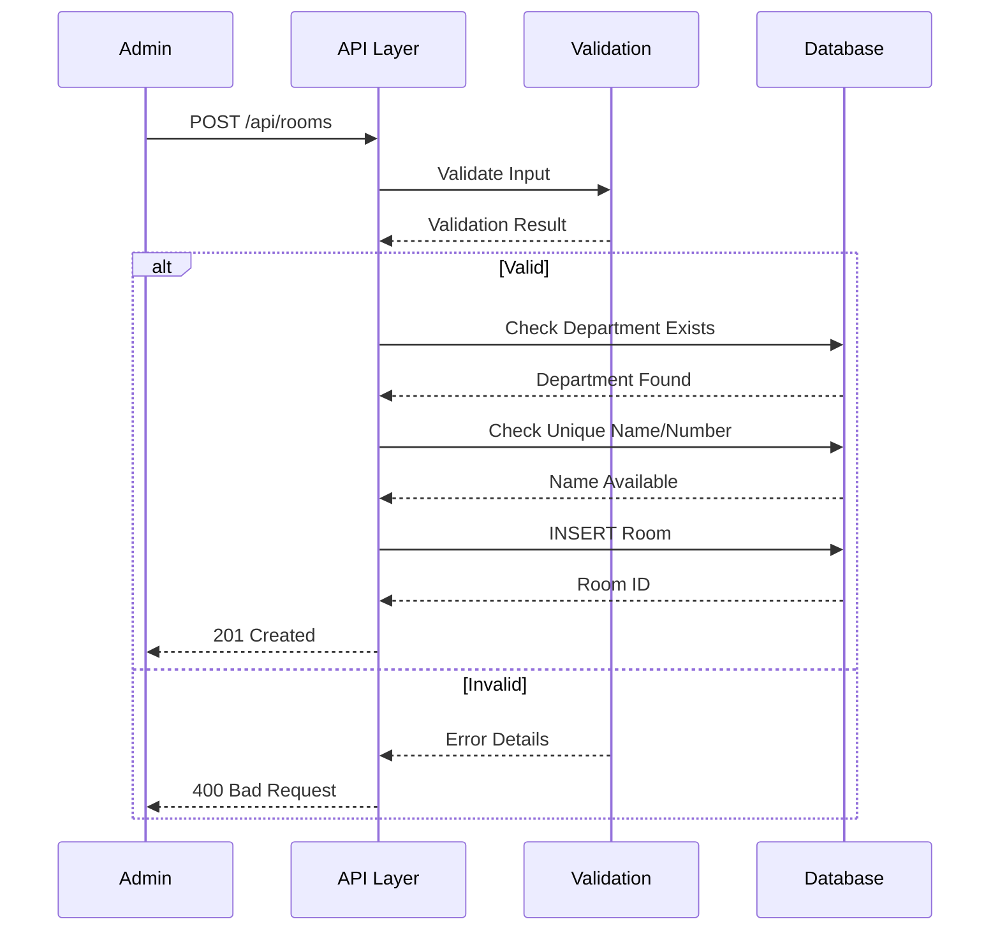
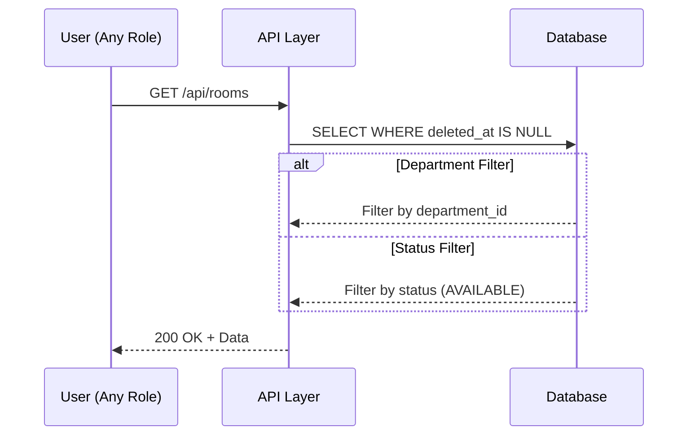
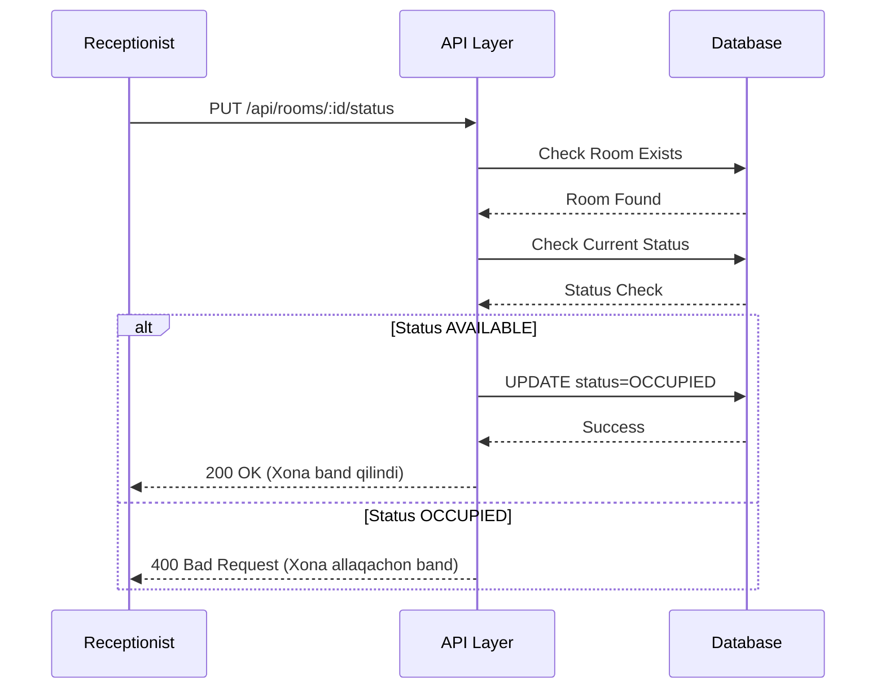
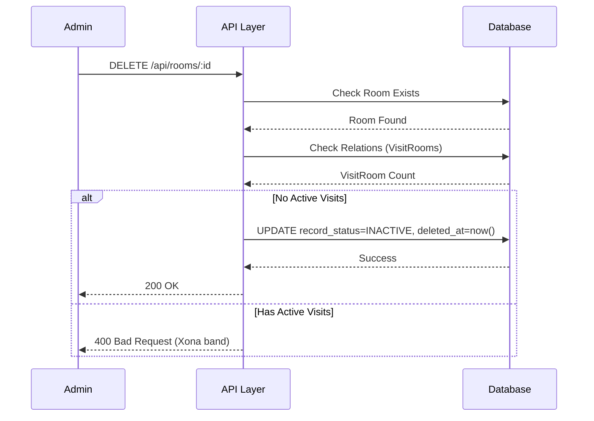

# 📄 FAYL: `10-room-management.md`

```markdown
# 10. Xonalar Boshqaruvi (Room Management)

---

## 📋 UMUMIY MA'LUMOT

| Maydon | Qiymat |
|--------|--------|
| **Flow ID** | 10 |
| **Phase** | 2A - Core Entities |
| **Model** | `Room` |
| **Status** | Draft |
| **Yaratilgan Sana** | 2024-01-15 |
| **Oxirgi Yangilanish** | 2024-01-15 |
| **Mas'ul** | Senior Backend Developer |
| **Bog'liq Modellar** | `Department` (RFC-007), `User` (RFC-002), `VisitRoom` (Keyingi) |

---

## 🎯 MAQSAD

Klinika xonalarini (kabinetlarini) boshqarish, ularning bandlik holatini kuzatish va visitlar uchun xona ajratish. Har bir xonani bo'limga biriktirish, xona statusini real-time kuzatish va hisobotlarda xona bandligi statistikasini olish uchun reference ma'lumotlar bazasini yaratish (Reference: `Klinika.md` 3.6).

---

## 👥 MAS'UL ROLLAR

| Rol | Create | Read | Update | Delete | Tavsif |
|-----|--------|------|--------|--------|--------|
| **Admin** | ✅ | ✅ | ✅ | ✅ | To'liq huquq - barcha operatsiyalar |
| **Doctor** | ❌ | ✅ | ❌ | ❌ | Faqat ko'rish (o'z xonasini bilish uchun) |
| **Nurse** | ❌ | ✅ | ❌ | ❌ | Faqat ko'rish |
| **Receptionist** | ❌ | ✅ | ✅ (status) | ❌ | Xona statusini yangilash (qabulda) |
| **Accountant** | ❌ | ✅ | ❌ | ❌ | Faqat ko'rish (hisobotlar uchun) |

---

## 📊 PRISMA MODEL (Reference: `klinika_prisma.txt`)

### To'liq Model Schema

```prisma
model Room {
  id            Int            @id @default(autoincrement())
  department_id Int?           @map("department_id")
  name          String         @db.VarChar(100)
  room_number   String?        @db.VarChar(20) @map("room_number")
  status        RoomStatus     @default(AVAILABLE)
  description   String?        @db.Text
  record_status RecordStatus   @default(ACTIVE)
  created_at    Timestamptz    @default(now())
  updated_at    Timestamptz    @updatedAt
  deleted_at    Timestamptz?
  registered_by Int?           @map("registered_by")
  modified_by   Int?           @map("modified_by")

  // Relations
  department    Department?    @relation("fk_room_department", fields: [department_id], references: [id], onDelete: SetNull, onUpdate: Cascade)
  register_user User?          @relation("fk_room_registered_by", fields: [registered_by], references: [id], onDelete: SetNull, onUpdate: Cascade)
  modify_user   User?          @relation("fk_room_modified_by", fields: [modified_by], references: [id], onDelete: SetNull, onUpdate: Cascade)

  visit_rooms   VisitRoom[]    @relation("fk_visit_room_room")

  @@index([department_id])
  @@index([status])
  @@index([record_status])
  @@index([deleted_at])
  @@index([department_id, status])
  @@map("rooms")
}
```

### Model Maydonlari Tafsiloti

| Maydon | Tip | Majburiy | Default | DB Tip | Izoh/Tavsif |
|--------|-----|----------|---------|--------|-------------|
| `id` | Int | ✅ | autoincrement | SERIAL | **Primary Key**. Unikal identifikator, avtomatik oshib boradi. VisitRoom jadvali bilan bog'lanish uchun |
| `department_id` | Int | ❌ | null | INTEGER | **Foreign Key**. Department jadvaliga bog'lanish. SetNull cascade - bo'lim o'chirilganda null bo'ladi. Xona qaysi bo'limga tegishli ekanligini ko'rsatadi |
| `name` | String | ✅ | - | VARCHAR(100) | **Xona nomi**. 3-100 belgi. Misol: "Terapiya Kabineti 1", "Operatsiya Xonasi 2". Lotin va Kirill harflari ruxsat etiladi |
| `room_number` | String | ❌ | null | VARCHAR(20) | **Xona raqami**. Binodagi fizik raqam. Misol: "101", "205A". Qidiruv va identifikatsiya uchun |
| `status` | Enum | ✅ | AVAILABLE | RoomStatus | **Xona holati**. AVAILABLE (bo'sh), OCCUPIED (band), MAINTENANCE (ta'mirlash), CLOSED (yopiq). Real-time bandlikni ko'rsatadi (Reference: `Klinika.md` 3.6) |
| `description` | String | ❌ | null | TEXT | **Qo'shimcha tavsif**. 0-255 belgi. Xona haqida qo'shimcha ma'lumot (jihozlar, sig'im va h.k.) |
| `record_status` | Enum | ✅ | ACTIVE | RecordStatus | **Yozuv holati**. ACTIVE (faol), INACTIVE (nofaol), ARCHIVED (arxiv). Xona ro'yxatda ko'rinishi uchun |
| `created_at` | Timestamptz | ✅ | now() | TIMESTAMPTZ | **Yaratilgan vaqt**. Avtomatik to'ldiriladi, UTC timezone. Audit uchun muhim (Reference: `Klinika.md` 5.2) |
| `updated_at` | Timestamptz | ✅ | now() | TIMESTAMPTZ | **Oxirgi o'zgarish**. Har bir update da avtomatik yangilanadi (Prisma @updatedAt) |
| `deleted_at` | Timestamptz | ❌ | null | TIMESTAMPTZ | **Soft Delete**. NULL = aktiv, qiymat bor = o'chirilgan. Fizik delete qilinmaydi, audit saqlanadi (Reference: `Klinika.md` 8.1) |
| `registered_by` | Int | ❌ | null | INTEGER | **Foreign Key**. Kim yaratgan (User ID). SetNull cascade - user o'chirilganda null bo'ladi. Audit uchun |
| `modified_by` | Int | ❌ | null | INTEGER | **Foreign Key**. Kim oxirgi o'zgartirgan (User ID). SetNull cascade - user o'chirilganda null bo'ladi. Audit uchun |

### RoomStatus Enum (Reference: `klinika_prisma.txt`)

```prisma
enum RoomStatus {
  AVAILABLE      // ✅ Bo'sh - foydalanishga tayyor
  OCCUPIED       // ⏸️ Band - bemor bor
  MAINTENANCE    // 🔧 Ta'mirlanmoqda
  CLOSED         // 🚫 Yopiq - foydalanish mumkin emas
}
```

| Status | Tavsif | Qachon Ishlatiladi |
|--------|--------|-------------------|
| `AVAILABLE` | Xona bo'sh, foydalanishga tayyor | Yangi xona yaratilganda default. Receptionist xonani bemorga ajratishi mumkin |
| `OCCUPIED` | Xona band, bemor bor | Visit boshlanganda status OCCUPIED ga o'zgaradi |
| `MAINTENANCE` | Xona ta'mirlanmoqda | Jihozlar buzilganda yoki tozalash ishlarida |
| `CLOSED` | Xona yopiq, foydalanish mumkin emas | Uzoq muddatli ta'mir yoki boshqa sabablar uchun |

### RecordStatus Enum (Reference: `klinika_prisma.txt`)

```prisma
enum RecordStatus {
  ACTIVE      // ✅ Faol - xona ro'yxatda ko'rinadi
  INACTIVE    // ⏸️ Nofaol - xona vaqtincha o'chirilgan
  ARCHIVED    // 📦 Arxiv - xona tarix uchun saqlangan
}
```

### Indexlar (Reference: `klinika_prisma.txt`)

| Index | Maydon(lar) | Maqsad |
|-------|-------------|--------|
| `@@index([department_id])` | department_id | Bo'lim bo'yicha filter qilishni tezlashtirish |
| `@@index([status])` | status | Xona statusi bo'yicha filter qilishni tezlashtirish (eng ko'p ishlatiladi) |
| `@@index([record_status])` | record_status | Yozuv holati bo'yicha filter qilish |
| `@@index([deleted_at])` | deleted_at | Soft delete filter uchun |
| `@@index([department_id, status])` | department_id, status | Qo'shma index - bo'lim va status bo'yicha filter (bo'sh xonalarni qidirish uchun) |

### Relation'lar

| Relation | Model | Type | onDelete | onUpdate | Tavsif |
|----------|-------|------|----------|----------|--------|
| `fk_room_department` | Department | N:1 | SetNull | Cascade | Bo'lim o'chirilganda xonaning department_id NULL ga o'zgaradi. Xona ma'lumoti saqlanib qoladi |
| `fk_room_registered_by` | User | N:1 | SetNull | Cascade | User o'chirilganda registered_by NULL ga o'zgaradi. Audit tarixi saqlanib qoladi |
| `fk_room_modified_by` | User | N:1 | SetNull | Cascade | User o'chirilganda modified_by NULL ga o'zgaradi. Audit tarixi saqlanib qoladi |
| `fk_visit_room_room` | VisitRoom | 1:N | Cascade | Cascade | Xona o'chirilganda VisitRoom yozuvlari o'chiriladi (active visitlar uchun muhim) |

---

## 🔄 FLOW DIAGRAM

### 1. Xona Yaratish Flow (Admin tomonidan)



### 2. Xona Ro'yxatini Olish Flow



### 3. Xona Status O'zgarish Flow (Visit uchun)



### 4. Xona O'chirish (Soft Delete) Flow



---

## 📝 BOSQICHMA-BOSQICH JARAYON

### BOSQICH 1: Xona Yaratish

#### 1.1. Input Ma'lumotlari

```typescript
interface CreateRoomDto {
  name: string;         // 3-100 belgi
  room_number?: string; // 0-20 belgi
  department_id?: number; // Mavjud Department ID
  status?: RoomStatus;  // AVAILABLE/OCCUPIED/MAINTENANCE/CLOSED
  description?: string; // 0-255 belgi
  record_status?: string; // ACTIVE/INACTIVE/ARCHIVED
}
```

#### 1.2. Validatsiya Qoidalari

```typescript
// Name validatsiya
{
  minLength: 3,
  maxLength: 100,
  pattern: /^[a-zA-Z\u0400-\u04FF\s'-]+$/,
  unique: true,  // Bo'lim ichida unikal
  required: true
}

// Room Number validatsiya
{
  minLength: 1,
  maxLength: 20,
  pattern: /^[0-9A-Za-z]+$/,
  required: false
}

// Department validatsiya
{
  type: 'number',
  mustExist: true,  // Department jadvalida mavjud bo'lishi kerak
  required: false
}

// Status validatsiya
{
  enum: ['AVAILABLE', 'OCCUPIED', 'MAINTENANCE', 'CLOSED'],
  default: 'AVAILABLE',
  required: false
}

// Record Status validatsiya
{
  enum: ['ACTIVE', 'INACTIVE', 'ARCHIVED'],
  default: 'ACTIVE',
  required: false
}
```

#### 1.3. Biznes Logika

```typescript
// room.service.ts
async create(createRoomDto: CreateRoomDto, userId: number): Promise<Room> {
  // 1. Department mavjudligini tekshirish (agar kiritilgan bo'lsa)
  if (createRoomDto.department_id) {
    const department = await this.prisma.department.findUnique({
      where: { id: createRoomDto.department_id }
    });
    if (!department || department.deleted_at) {
      throw new NotFoundException('ROOM_001');
    }
  }

  // 2. Name unikal ekanligini tekshirish (bo'lim ichida)
  const existing = await this.prisma.room.findFirst({
    where: {
      name: createRoomDto.name,
      department_id: createRoomDto.department_id || null,
      deleted_at: null
    }
  });

  if (existing) {
    throw new ConflictException('ROOM_002');
  }

  // 3. Room number unikal ekanligini tekshirish (agar kiritilgan bo'lsa)
  if (createRoomDto.room_number) {
    const existingNumber = await this.prisma.room.findFirst({
      where: {
        room_number: createRoomDto.room_number,
        department_id: createRoomDto.department_id || null,
        deleted_at: null
      }
    });

    if (existingNumber) {
      throw new ConflictException('ROOM_003');
    }
  }

  // 4. Xona yaratish
  const room = await this.prisma.room.create({
    data: {
      name: createRoomDto.name,
      room_number: createRoomDto.room_number,
      department_id: createRoomDto.department_id,
      status: createRoomDto.status || 'AVAILABLE',
      description: createRoomDto.description,
      record_status: createRoomDto.record_status || 'ACTIVE',
      created_at: new Date(),
      updated_at: new Date(),
      registered_by: userId
    },
    include: {
      department: { select: { id: true, name: true } }
    }
  });

  return room;
}
```

#### 1.4. Database Query

```prisma
INSERT INTO rooms (
  name,
  room_number,
  department_id,
  status,
  description,
  record_status,
  created_at,
  updated_at,
  registered_by
) VALUES (
  'Terapiya Kabineti 1',
  '101',
  1,
  'AVAILABLE',
  '2 ta karavot, kompyuter',
  'ACTIVE',
  NOW(),
  NOW(),
  1
);
```

---

### BOSQICH 2: Xona Ro'yxatini Olish

#### 2.1. Query Parametrlari

```typescript
interface GetRoomsQuery {
  page?: number;        // Default: 1
  limit?: number;       // Default: 20
  department_id?: number; // Filter by department
  status?: RoomStatus;  // Filter by status (AVAILABLE/OCCUPIED/etc.)
  record_status?: string; // Filter by record_status
  search?: string;      // Search by name or room_number
  sortBy?: string;      // Default: name
  sortOrder?: string;   // Default: asc
}
```

#### 2.2. Biznes Logika

```typescript
async findAll(query: GetRoomsQuery): Promise<PaginatedResult<Room>> {
  const where: any = { deleted_at: null };

  // Department filter
  if (query.department_id) {
    where.department_id = query.department_id;
  }

  // Status filter
  if (query.status) {
    where.status = query.status;
  }

  // Record Status filter
  if (query.record_status) {
    where.record_status = query.record_status;
  }

  // Search filter
  if (query.search) {
    where.OR = [
      { name: { contains: query.search, mode: 'insensitive' } },
      { room_number: { contains: query.search, mode: 'insensitive' } }
    ];
  }

  // Pagination
  const skip = (query.page - 1) * query.limit;
  const take = Math.min(query.limit, 100);

  // Sorting
  const orderBy = {
    [query.sortBy || 'name']: query.sortOrder || 'asc'
  };

  const [data, total] = await Promise.all([
    this.prisma.room.findMany({
      where,
      skip,
      take,
      orderBy,
      include: {
        department: { select: { id: true, name: true } },
        _count: {
          select: { 
            visit_rooms: { 
              where: { 
                status: 'IN_USE',
                deleted_at: null 
              } 
            } 
          }
        }
      }
    }),
    this.prisma.room.count({ where })
  ]);

  return {
    data,
    pagination: {
      page: query.page,
      limit: take,
      total,
      totalPages: Math.ceil(total / take),
      hasNextPage: skip + take < total,
      hasPrevPage: query.page > 1
    }
  };
}
```

#### 2.3. Database Query

```prisma
SELECT 
  id,
  name,
  room_number,
  department_id,
  status,
  description,
  record_status,
  created_at,
  updated_at,
  deleted_at,
  registered_by,
  modified_by
FROM rooms
WHERE deleted_at IS NULL
  AND record_status = 'ACTIVE'
  AND status = 'AVAILABLE'
ORDER BY name ASC
LIMIT 20 OFFSET 0;
```

---

### BOSQICH 3: Xona Status O'zgartirish

#### 3.1. Input Ma'lumotlari

```typescript
interface UpdateRoomStatusDto {
  status: RoomStatus;  // AVAILABLE/OCCUPIED/MAINTENANCE/CLOSED
  reason?: string;     // Status o'zgarish sababi (optional)
}
```

#### 3.2. Biznes Logika

```typescript
async updateStatus(id: number, updateRoomStatusDto: UpdateRoomStatusDto, userId: number): Promise<Room> {
  // 1. Xona mavjudligini tekshirish
  const room = await this.prisma.room.findUnique({
    where: { id }
  });

  if (!room || room.deleted_at) {
    throw new NotFoundException('ROOM_004');
  }

  // 2. Status o'zgarish qoidalarini tekshirish
  const statusTransitions = {
    'AVAILABLE': ['OCCUPIED', 'MAINTENANCE', 'CLOSED'],
    'OCCUPIED': ['AVAILABLE', 'MAINTENANCE'],
    'MAINTENANCE': ['AVAILABLE', 'CLOSED'],
    'CLOSED': ['AVAILABLE', 'MAINTENANCE']
  };

  if (!statusTransitions[room.status].includes(updateRoomStatusDto.status)) {
    throw new BadRequestException('ROOM_005');
  }

  // 3. OCCUPIED ga o'zgartirishda VisitRoom tekshiruvi
  if (updateRoomStatusDto.status === 'OCCUPIED') {
    const activeVisit = await this.prisma.visitRoom.findFirst({
      where: {
        room_id: id,
        status: 'IN_USE',
        deleted_at: null
      }
    });

    if (!activeVisit) {
      // Warning: VisitRoom yozuvisiz OCCUPIED qilinmoqda
      this.logger.warn(`Room ${id} marked as OCCUPIED without active VisitRoom`);
    }
  }

  // 4. Status yangilash
  const updated = await this.prisma.room.update({
    where: { id },
    data: {
      status: updateRoomStatusDto.status,
      updated_at: new Date(),
      modified_by: userId
    },
    include: {
      department: { select: { id: true, name: true } }
    }
  });

  return updated;
}
```

#### 3.3. Database Query

```prisma
UPDATE rooms
SET 
  status = 'OCCUPIED',
  updated_at = NOW(),
  modified_by = 1
WHERE id = 1
  AND deleted_at IS NULL;
```

---

### BOSQICH 4: Xona Yangilash

#### 3.1. Input Ma'lumotlari

```typescript
interface UpdateRoomDto {
  name?: string;
  room_number?: string;
  department_id?: number;
  description?: string;
  record_status?: string;
}
```

#### 3.2. Biznes Logika

```typescript
async update(id: number, updateRoomDto: UpdateRoomDto, userId: number): Promise<Room> {
  // 1. Xona mavjudligini tekshirish
  const room = await this.prisma.room.findUnique({
    where: { id }
  });

  if (!room || room.deleted_at) {
    throw new NotFoundException('ROOM_004');
  }

  // 2. Name unikal ekanligini tekshirish (agar o'zgarayotgan bo'lsa)
  if (updateRoomDto.name && updateRoomDto.name !== room.name) {
    const existing = await this.prisma.room.findFirst({
      where: {
        name: updateRoomDto.name,
        department_id: updateRoomDto.department_id || room.department_id,
        id: { not: id },
        deleted_at: null
      }
    });

    if (existing) {
      throw new ConflictException('ROOM_002');
    }
  }

  // 3. Room number unikal ekanligini tekshirish (agar o'zgarayotgan bo'lsa)
  if (updateRoomDto.room_number && updateRoomDto.room_number !== room.room_number) {
    const existingNumber = await this.prisma.room.findFirst({
      where: {
        room_number: updateRoomDto.room_number,
        department_id: updateRoomDto.department_id || room.department_id,
        id: { not: id },
        deleted_at: null
      }
    });

    if (existingNumber) {
      throw new ConflictException('ROOM_003');
    }
  }

  // 4. Department mavjudligini tekshirish (agar o'zgarayotgan bo'lsa)
  if (updateRoomDto.department_id && updateRoomDto.department_id !== room.department_id) {
    const department = await this.prisma.department.findUnique({
      where: { id: updateRoomDto.department_id }
    });
    if (!department || department.deleted_at) {
      throw new NotFoundException('ROOM_001');
    }
  }

  // 5. Xona yangilash
  const updated = await this.prisma.room.update({
    where: { id },
    data: {
      ...updateRoomDto,
      updated_at: new Date(),
      modified_by: userId
    },
    include: {
      department: { select: { id: true, name: true } }
    }
  });

  return updated;
}
```

---

### BOSQICH 5: Xona O'chirish (Soft Delete)

#### 5.1. Biznes Logika

```typescript
async remove(id: number, userId: number): Promise<Room> {
  // 1. Xona mavjudligini tekshirish
  const room = await this.prisma.room.findUnique({
    where: { id }
  });

  if (!room || room.deleted_at) {
    throw new NotFoundException('ROOM_004');
  }

  // 2. Active VisitRoom yozuvlarini tekshirish
  const activeVisitCount = await this.prisma.visitRoom.count({
    where: {
      room_id: id,
      status: 'IN_USE',
      deleted_at: null
    }
  });

  // 3. Agar active visit bo'lsa, o'chirishni taqiqlash
  if (activeVisitCount > 0) {
    throw new BadRequestException('ROOM_006');
  }

  // 4. Soft Delete (SetNull cascade avtomatik ishlaydi)
  return this.prisma.room.update({
    where: { id },
    data: {
      record_status: 'INACTIVE',
      status: 'CLOSED',
      deleted_at: new Date()
    }
  });
}
```

#### 5.2. Database Query

```prisma
UPDATE rooms
SET 
  record_status = 'INACTIVE',
  status = 'CLOSED',
  deleted_at = NOW()
WHERE id = 1;

-- VisitRoom yozuvlari saqlanib qoladi (Cascade delete faqat physical delete da)
-- Lekin active visitlar tekshiriladi
```

---

## 🔌 API ENDPOINT'LAR

### 1. Xona Yaratish

| Parametr | Qiymat |
|----------|--------|
| **Method** | POST |
| **Endpoint** | `/api/v1/rooms` |
| **Auth** | ✅ JWT Required |
| **Rol** | Admin |
| **Content-Type** | application/json |

**Request Body:**
```json
{
  "name": "Terapiya Kabineti 1",
  "room_number": "101",
  "department_id": 1,
  "status": "AVAILABLE",
  "description": "2 ta karavot, kompyuter",
  "record_status": "ACTIVE"
}
```

**Response (201 Created):**
```json
{
  "success": true,
  "message": "Xona muvaffaqiyatli yaratildi",
  "data": {
    "id": 1,
    "name": "Terapiya Kabineti 1",
    "room_number": "101",
    "department": { "id": 1, "name": "Terapiya" },
    "status": "AVAILABLE",
    "description": "2 ta karavot, kompyuter",
    "record_status": "ACTIVE",
    "created_at": "2024-01-15T10:00:00.000Z",
    "updated_at": "2024-01-15T10:00:00.000Z",
    "deleted_at": null
  }
}
```

---

### 2. Xonalar Ro'yxatini Olish

| Parametr | Qiymat |
|----------|--------|
| **Method** | GET |
| **Endpoint** | `/api/v1/rooms` |
| **Auth** | ✅ JWT Required |
| **Rol** | Barchasi |

**Query Params:**
```
GET /api/v1/rooms?page=1&limit=20&department_id=1&status=AVAILABLE&sortBy=name&sortOrder=asc
```

**Response (200 OK):**
```json
{
  "success": true,
  "data": [
    {
      "id": 1,
      "name": "Terapiya Kabineti 1",
      "room_number": "101",
      "department": { "id": 1, "name": "Terapiya" },
      "status": "AVAILABLE",
      "record_status": "ACTIVE",
      "created_at": "2024-01-15T10:00:00.000Z",
      "_count": { "visit_rooms": 0 }
    },
    {
      "id": 2,
      "name": "Terapiya Kabineti 2",
      "room_number": "102",
      "department": { "id": 1, "name": "Terapiya" },
      "status": "OCCUPIED",
      "record_status": "ACTIVE",
      "created_at": "2024-01-15T10:00:00.000Z",
      "_count": { "visit_rooms": 1 }
    }
  ],
  "pagination": {
    "page": 1,
    "limit": 20,
    "total": 50,
    "totalPages": 3,
    "hasNextPage": true,
    "hasPrevPage": false
  }
}
```

---

### 3. Bo'sh Xonalarni Olish (Receptionist uchun)

| Parametr | Qiymat |
|----------|--------|
| **Method** | GET |
| **Endpoint** | `/api/v1/rooms/available` |
| **Auth** | ✅ JWT Required |
| **Rol** | Admin, Receptionist, Doctor |

**Query Params:**
```
GET /api/v1/rooms/available?department_id=1&limit=10
```

**Response (200 OK):**
```json
{
  "success": true,
  "data": [
    {
      "id": 1,
      "name": "Terapiya Kabineti 1",
      "room_number": "101",
      "status": "AVAILABLE"
    },
    {
      "id": 3,
      "name": "Terapiya Kabineti 3",
      "room_number": "103",
      "status": "AVAILABLE"
    }
  ]
}
```

---

### 4. Bitta Xona Ma'lumotlarini Olish

| Parametr | Qiymat |
|----------|--------|
| **Method** | GET |
| **Endpoint** | `/api/v1/rooms/:id` |
| **Auth** | ✅ JWT Required |
| **Rol** | Barchasi |

**Response (200 OK):**
```json
{
  "success": true,
  "data": {
    "id": 1,
    "name": "Terapiya Kabineti 1",
    "room_number": "101",
    "department": { "id": 1, "name": "Terapiya" },
    "status": "AVAILABLE",
    "description": "2 ta karavot, kompyuter",
    "record_status": "ACTIVE",
    "created_at": "2024-01-15T10:00:00.000Z",
    "updated_at": "2024-01-15T10:00:00.000Z",
    "deleted_at": null,
    "_count": { "visit_rooms": 5 }
  }
}
```

---

### 5. Xona Status O'zgartirish

| Parametr | Qiymat |
|----------|--------|
| **Method** | PUT |
| **Endpoint** | `/api/v1/rooms/:id/status` |
| **Auth** | ✅ JWT Required |
| **Rol** | Admin, Receptionist |

**Request Body:**
```json
{
  "status": "OCCUPIED",
  "reason": "Visit boshlandi"
}
```

**Response (200 OK):**
```json
{
  "success": true,
  "message": "Xona status muvaffaqiyatli o'zgartirildi",
  "data": {
    "id": 1,
    "name": "Terapiya Kabineti 1",
    "status": "OCCUPIED",
    "updated_at": "2024-01-15T12:00:00.000Z"
  }
}
```

---

### 6. Xona Yangilash

| Parametr | Qiymat |
|----------|--------|
| **Method** | PUT |
| **Endpoint** | `/api/v1/rooms/:id` |
| **Auth** | ✅ JWT Required |
| **Rol** | Admin |

**Request Body:**
```json
{
  "name": "Terapiya Kabineti 1 (Updated)",
  "room_number": "101A",
  "description": "3 ta karavot, yangi kompyuter"
}
```

**Response (200 OK):**
```json
{
  "success": true,
  "message": "Xona muvaffaqiyatli yangilandi",
  "data": {
    "id": 1,
    "name": "Terapiya Kabineti 1 (Updated)",
    "room_number": "101A",
    "status": "AVAILABLE",
    "updated_at": "2024-01-15T12:00:00.000Z"
  }
}
```

---

### 7. Xona O'chirish (Soft Delete)

| Parametr | Qiymat |
|----------|--------|
| **Method** | DELETE |
| **Endpoint** | `/api/v1/rooms/:id` |
| **Auth** | ✅ JWT Required |
| **Rol** | Admin |

**Response (200 OK):**
```json
{
  "success": true,
  "message": "Xona muvaffaqiyatli o'chirildi",
  "data": {
    "id": 1,
    "name": "Terapiya Kabineti 1",
    "record_status": "INACTIVE",
    "status": "CLOSED",
    "deleted_at": "2024-01-15T14:00:00.000Z"
  }
}
```

---

## ⚠️ XATOLIKLAR VA HANDLING

| Kod | HTTP Status | Xabar | Sabab | Yechim |
|-----|-------------|-------|-------|--------|
| `ROOM_001` | 404 Not Found | Bo'lim topilmadi | Department ID not exists | Department ID ni tekshiring |
| `ROOM_002` | 409 Conflict | Xona nomi allaqachon mavjud | Name unique constraint | Boshqa nom tanlang |
| `ROOM_003` | 409 Conflict | Xona raqami allaqachon mavjud | Room Number unique constraint | Boshqa raqam tanlang |
| `ROOM_004` | 404 Not Found | Xona topilmadi | ID not exists yoki deleted | ID ni tekshiring |
| `ROOM_005` | 400 Bad Request | Status o'zgarishi mumkin emas | Invalid status transition | To'g'ri status tanlang |
| `ROOM_006` | 400 Bad Request | Xonada aktiv bemor bor | Active VisitRoom exists | Visit yakunlangandan keyin o'chiring |
| `ROOM_007` | 403 Forbidden | Ruxsat yo'q | Insufficient permissions | Rol tekshirilsin |

---

## 📦 SEED DATA

```typescript
// seed/room.seed.ts
export async function seedRooms(prisma: PrismaClient) {
  // Terapiya bo'limi xonalari
  const therapyRooms = [
    { name: 'Terapiya Kabineti 1', room_number: '101', department_id: 1, status: 'AVAILABLE' },
    { name: 'Terapiya Kabineti 2', room_number: '102', department_id: 1, status: 'AVAILABLE' },
    { name: 'Terapiya Kabineti 3', room_number: '103', department_id: 1, status: 'AVAILABLE' }
  ];

  // Xirurgiya bo'limi xonalari
  const surgeryRooms = [
    { name: 'Operatsiya Xonasi 1', room_number: '201', department_id: 2, status: 'AVAILABLE' },
    { name: 'Operatsiya Xonasi 2', room_number: '202', department_id: 2, status: 'MAINTENANCE' },
    { name: 'Post-Operatsiya Palata', room_number: '203', department_id: 2, status: 'AVAILABLE' }
  ];

  // Stomatologiya bo'limi xonalari
  const dentalRooms = [
    { name: 'Stomatologiya Kabineti 1', room_number: '301', department_id: 3, status: 'AVAILABLE' },
    { name: 'Stomatologiya Kabineti 2', room_number: '302', department_id: 3, status: 'AVAILABLE' }
  ];

  const allRooms = [...therapyRooms, ...surgeryRooms, ...dentalRooms];

  for (const room of allRooms) {
    await prisma.room.create({
      data: {
        ...room,
        description: 'Standart xona',
        record_status: 'ACTIVE'
      }
    });
  }

  console.log(`✅ Rooms seeded successfully (${allRooms.length} rooms)`);
}
```

### Seed Script Ishga Tushirish

```bash
# Development
npm run seed

# Production (ehtiyotkorlik bilan)
npm run seed:prod

# Faqat xonalar
npm run seed:rooms
```

---

## 🔐 XAVFSIZLIK TALABLARI (Reference: `Klinika.md` 8)

### 1. Autentifikatsiya
- ✅ Barcha endpoint'lar JWT token talab qiladi
- ✅ Token expiry: 24 soat

### 2. Avtorizatsiya (RBAC) (Reference: `Klinika.md` 6.1)

| Endpoint | Admin | Doctor | Nurse | Receptionist | Accountant |
|----------|-------|--------|-------|--------------|------------|
| POST /rooms | ✅ | ❌ | ❌ | ❌ | ❌ |
| GET /rooms | ✅ | ✅ | ✅ | ✅ | ✅ |
| GET /rooms/available | ✅ | ✅ | ❌ | ✅ | ❌ |
| GET /rooms/:id | ✅ | ✅ | ✅ | ✅ | ✅ |
| PUT /rooms/:id | ✅ | ❌ | ❌ | ❌ | ❌ |
| PUT /rooms/:id/status | ✅ | ❌ | ❌ | ✅ | ❌ |
| DELETE /rooms/:id | ✅ | ❌ | ❌ | ❌ | ❌ |

### 3. Audit (Reference: `Klinika.md` 5.2)
- ✅ `created_at` - Yaratilgan vaqt
- ✅ `updated_at` - Oxirgi o'zgarish
- ✅ `deleted_at` - Soft delete vaqti
- ✅ `registered_by` - Kim yaratdi (User ID)
- ✅ `modified_by` - Kim o'zgartirdi (User ID)

---

## 📝 ESLATMALAR

1. **Xona status real-time** - Visit boshlanganda OCCUPIED, tugaganda AVAILABLE ga o'zgaradi (Reference: `Klinika.md` 3.6)
2. **Soft Delete** - Xona o'chirilganda `deleted_at` set bo'ladi, fizik delete qilinmaydi (Reference: `Klinika.md` 8.1)
3. **Cascade Rules** - Bo'lim o'chirilganda xonalar saqlanib qoladi (SetNull)
4. **Unique Constraints** - Xona nomi va raqami bo'lim ichida unikal bo'lishi kerak
5. **Status Transitions** - Status o'zgarishi qoidaga amal qilishi kerak (AVAILABLE ↔ OCCUPIED ↔ MAINTENANCE ↔ CLOSED)
6. **Active Visit Check** - Aktiv visit bo'lgan xonani o'chirib bo'lmaydi
7. **Receptionist Access** - Receptionist faqat status o'zgartirish huquqiga ega
8. **Department Bog'liqlik** - Xona bo'limga biriktirilishi ixtiyoriy (null bo'lishi mumkin)

---

## ✅ QABUL QILISH MEZONLARI (ACCEPTANCE CRITERIA)

### Functional Requirements
- [ ] Xona nomi 3-100 belgi orasida bo'lishi
- [ ] Xona raqami 1-20 belgi orasida bo'lishi
- [ ] Xona nomi bo'lim ichida unikal bo'lishi
- [ ] Xona raqami bo'lim ichida unikal bo'lishi
- [ ] Status AVAILABLE/OCCUPIED/MAINTENANCE/CLOSED qiymat qabul qilishi
- [ ] Record Status ACTIVE/INACTIVE/ARCHIVED qiymat qabul qilishi
- [ ] Soft delete ishlaydi (deleted_at set bo'ladi)
- [ ] Faqat Admin xona yaratish/o'zgartirish/o'chirish huquqiga ega
- [ ] Receptionist xona status o'zgartirish huquqiga ega
- [ ] Barcha rollar xona ro'yxatini ko'ra oladi
- [ ] Bo'sh xonalarni filterlash ishlaydi
- [ ] Pagination va search ishlaydi
- [ ] Xatoliklar to'g'ri HTTP status va kod bilan qaytariladi
- [ ] Audit maydonlari (registered_by, modified_by) to'ldiriladi
- [ ] Cascade rules ishlaydi (SetNull)
- [ ] Aktiv visit bo'lgan xonani o'chirish taqiqlanadi

### Non-Functional Requirements (Reference: `Klinika.md` 9.1)
- [ ] API response time < 200ms
- [ ] Database query time < 100ms
- [ ] Unit test coverage ≥ 90%
- [ ] E2E test coverage ≥ 70%
- [ ] Security audit o'tkazildi
- [ ] Documentation to'liq

---

**Hujjat Versiyasi:** 1.0
**Status:** Draft
**Tasdiqlagan:** _______________
**Sana:** _______________
```
