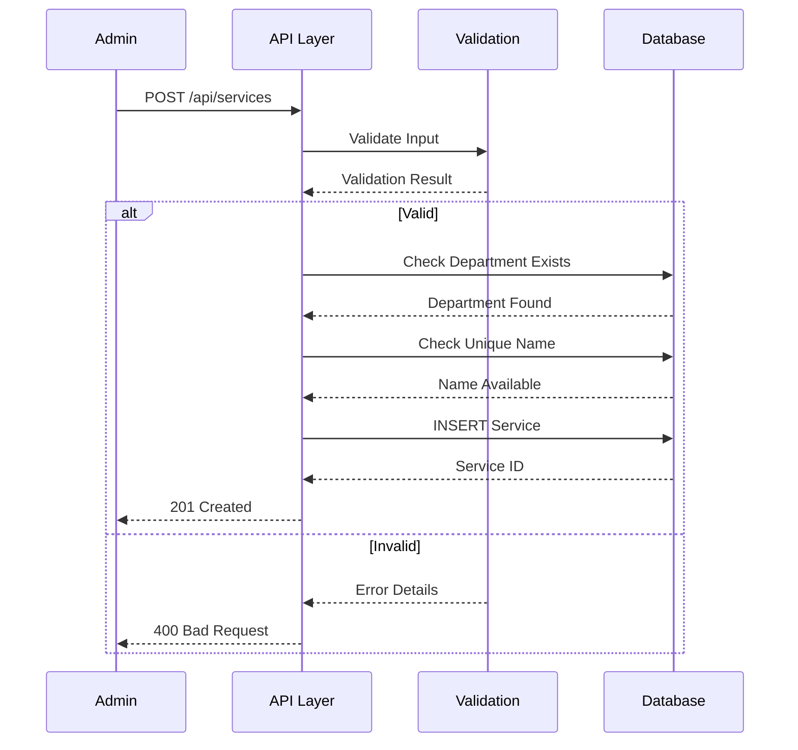
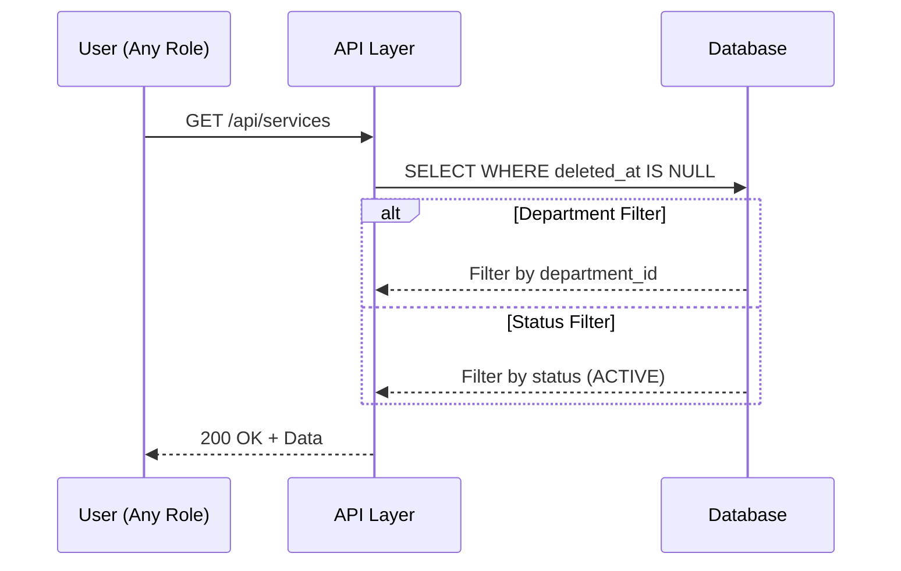
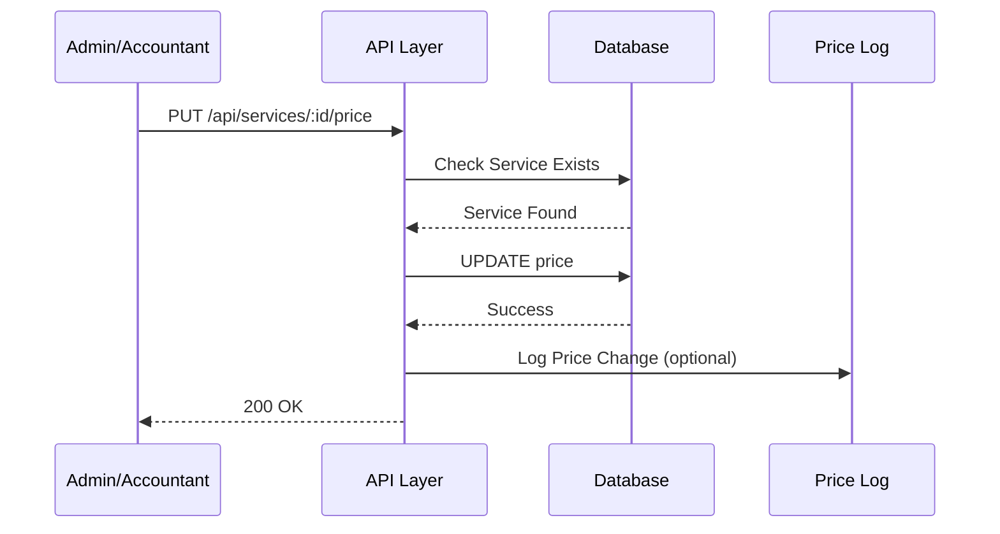
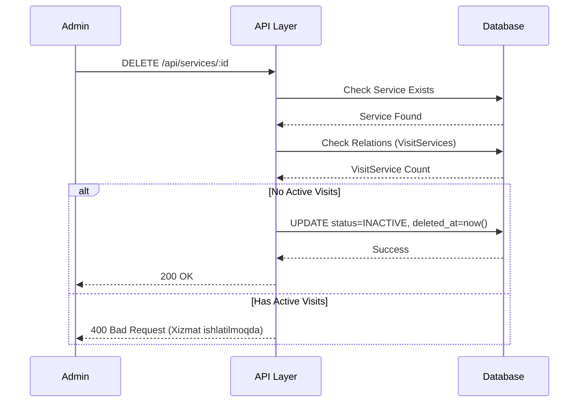

# 📄 FAYL: `11-service-management.md`

```markdown
# 11. Xizmatlar Boshqaruvi (Service Management)

---

## 📋 UMUMIY MA'LUMOT

| Maydon | Qiymat |
|--------|--------|
| **Flow ID** | 11 |
| **Phase** | 2A - Core Entities |
| **Model** | `Service` |
| **Status** | Draft |
| **Yaratilgan Sana** | 2024-01-15 |
| **Oxirgi Yangilanish** | 2024-01-15 |
| **Mas'ul** | Senior Backend Developer |
| **Bog'liq Modellar** | `Department` (RFC-007), `User` (RFC-002), `ServiceUser` (Keyingi), `VisitService` (Keyingi) |

---

## 🎯 MAQSAD

Klinika tomonidan ko'rsatiladigan xizmatlarni boshqarish, narxlar va davomiyligini belgilash, bo'limlarga biriktirish. Har bir xizmat uchun shifokor stavkalarini (ServiceUser) belgilash va Visit jarayonida xizmatlarni qo'shish uchun asos yaratish (Reference: `Klinika.md` 3.4).

---

## 👥 MAS'UL ROLLAR

| Rol | Create | Read | Update | Delete | Tavsif |
|-----|--------|------|--------|--------|--------|
| **Admin** | ✅ | ✅ | ✅ | ✅ | To'liq huquq - barcha operatsiyalar |
| **Doctor** | ❌ | ✅ | ❌ | ❌ | Faqat ko'rish (o'z xizmatlarini bilish uchun) |
| **Nurse** | ❌ | ✅ | ❌ | ❌ | Faqat ko'rish |
| **Receptionist** | ❌ | ✅ | ❌ | ❌ | Faqat ko'rish (qabulda xizmat qo'shish uchun) |
| **Accountant** | ❌ | ✅ | ✅ (narx) | ❌ | Narxlarni ko'rish va yangilash |

---

## 📊 PRISMA MODEL (Reference: `klinika_prisma.txt`)

### To'liq Model Schema

```prisma
model Service {
  id            Int          @id @default(autoincrement())
  department_id Int?         @map("department_id")
  name          String       @db.VarChar(100)
  price         Decimal      @default(0) @db.Decimal(15, 2)
  duration_min  Int?         @default(30) @map("duration_min")
  description   String?      @db.Text
  status        RecordStatus @default(ACTIVE)
  created_at    Timestamptz  @default(now())
  updated_at    Timestamptz  @updatedAt
  deleted_at    Timestamptz?
  registered_by Int?         @map("registered_by")
  modified_by   Int?         @map("modified_by")

  // Relations
  department    Department?  @relation("fk_service_department", fields: [department_id], references: [id], onDelete: SetNull, onUpdate: Cascade)
  register_user User?        @relation("fk_service_registered_by", fields: [registered_by], references: [id], onDelete: SetNull, onUpdate: Cascade)
  modify_user   User?        @relation("fk_service_modified_by", fields: [modified_by], references: [id], onDelete: SetNull, onUpdate: Cascade)

  service_users  ServiceUser[]  @relation("fk_service_user_service")
  visit_services VisitService[] @relation("fk_visit_service_service")

  @@index([department_id])
  @@index([status])
  @@index([deleted_at])
  @@index([department_id, status])
  @@map("services")
}
```

### Model Maydonlari Tafsiloti

| Maydon | Tip | Majburiy | Default | DB Tip | Izoh/Tavsif |
|--------|-----|----------|---------|--------|-------------|
| `id` | Int | ✅ | autoincrement | SERIAL | **Primary Key**. Unikal identifikator, avtomatik oshib boradi. VisitService va ServiceUser jadvallari bilan bog'lanish uchun |
| `department_id` | Int | ❌ | null | INTEGER | **Foreign Key**. Department jadvaliga bog'lanish. SetNull cascade - bo'lim o'chirilganda null bo'ladi. Xizmat qaysi bo'limga tegishli ekanligini ko'rsatadi (Reference: `Klinika.md` 3.4) |
| `name` | String | ✅ | - | VARCHAR(100) | **Xizmat nomi**. 3-100 belgi. Misol: "Terapevt ko'rigi", "UZI tekshiruvi". Lotin va Kirill harflari ruxsat etiladi |
| `price` | Decimal | ✅ | 0 | DECIMAL(15,2) | **Bazaviy narx**. So'mda ifodalanadi. 2 kasr belgigacha. Moliyaviy hisob-kitoblar uchun muhim (Reference: `Klinika.md` 9.2) |
| `duration_min` | Int | ❌ | 30 | INTEGER | **Davomiyligi (daqiqada)**. Xizmat qancha vaqt olishini belgilaydi. Jadval rejalashtirish uchun ishlatiladi (Reference: `Klinika.md` 3.4) |
| `description` | String | ❌ | null | TEXT | **Qo'shimcha tavsif**. Xizmat haqida batafsil ma'lumot. Ko'rsatmalar, tayyorgarlik va h.k. |
| `status` | Enum | ✅ | ACTIVE | RecordStatus | **Holat**. ACTIVE (faol), INACTIVE (nofaol), ARCHIVED (arxiv). Yangi xizmat yaratilganda default ACTIVE |
| `created_at` | Timestamptz | ✅ | now() | TIMESTAMPTZ | **Yaratilgan vaqt**. Avtomatik to'ldiriladi, UTC timezone. Audit uchun muhim (Reference: `Klinika.md` 5.2) |
| `updated_at` | Timestamptz | ✅ | now() | TIMESTAMPTZ | **Oxirgi o'zgarish**. Har bir update da avtomatik yangilanadi (Prisma @updatedAt) |
| `deleted_at` | Timestamptz | ❌ | null | TIMESTAMPTZ | **Soft Delete**. NULL = aktiv, qiymat bor = o'chirilgan. Fizik delete qilinmaydi, audit saqlanadi (Reference: `Klinika.md` 8.1) |
| `registered_by` | Int | ❌ | null | INTEGER | **Foreign Key**. Kim yaratgan (User ID). SetNull cascade - user o'chirilganda null bo'ladi. Audit uchun |
| `modified_by` | Int | ❌ | null | INTEGER | **Foreign Key**. Kim oxirgi o'zgartirgan (User ID). SetNull cascade - user o'chirilganda null bo'ladi. Audit uchun |

### Indexlar (Reference: `klinika_prisma.txt`)

| Index | Maydon(lar) | Maqsad |
|-------|-------------|--------|
| `@@index([department_id])` | department_id | Bo'lim bo'yicha filter qilishni tezlashtirish |
| `@@index([status])` | status | Status bo'yicha filter qilishni tezlashtirish (faqat aktiv xizmatlar) |
| `@@index([deleted_at])` | deleted_at | Soft delete filter uchun |
| `@@index([department_id, status])` | department_id, status | Qo'shma index - bo'lim va status bo'yicha filter (eng ko'p ishlatiladi) |

### Relation'lar

| Relation | Model | Type | onDelete | onUpdate | Tavsif |
|----------|-------|------|----------|----------|--------|
| `fk_service_department` | Department | N:1 | SetNull | Cascade | Bo'lim o'chirilganda xizmatning department_id NULL ga o'zgaradi. Xizmat ma'lumoti saqlanib qoladi |
| `fk_service_registered_by` | User | N:1 | SetNull | Cascade | User o'chirilganda registered_by NULL ga o'zgaradi. Audit tarixi saqlanib qoladi |
| `fk_service_modified_by` | User | N:1 | SetNull | Cascade | User o'chirilganda modified_by NULL ga o'zgaradi. Audit tarixi saqlanib qoladi |
| `fk_service_user_service` | ServiceUser | 1:N | Cascade | Cascade | Xizmat o'chirilganda ServiceUser yozuvlari o'chiriladi (stavka ma'lumotlari) |
| `fk_visit_service_service` | VisitService | 1:N | Cascade | Cascade | Xizmat o'chirilganda VisitService yozuvlari o'chiriladi (visit tarixi saqlanadi) |

---

## 🔄 FLOW DIAGRAM

### 1. Xizmat Yaratish Flow (Admin tomonidan)



### 2. Xizmat Ro'yxatini Olish Flow



### 3. Xizmat Narxini Yangilash Flow



### 4. Xizmat O'chirish (Soft Delete) Flow



---

## 📝 BOSQICHMA-BOSQICH JARAYON

### BOSQICH 1: Xizmat Yaratish

#### 1.1. Input Ma'lumotlari

```typescript
interface CreateServiceDto {
  name: string;         // 3-100 belgi
  price: number;        // Decimal(15,2), musbat son
  department_id?: number; // Mavjud Department ID
  duration_min?: number;  // Daqiqada, default 30
  description?: string;   // 0-1000 belgi
  status?: string;        // ACTIVE/INACTIVE/ARCHIVED
}
```

#### 1.2. Validatsiya Qoidalari

```typescript
// Name validatsiya
{
  minLength: 3,
  maxLength: 100,
  pattern: /^[a-zA-Z\u0400-\u04FF\s'-]+$/,
  unique: true,  // Bo'lim ichida unikal
  required: true
}

// Price validatsiya
{
  type: 'decimal',
  precision: 15,
  scale: 2,
  min: 0,  // Manfiy bo'lmasligi kerak
  required: true
}

// Duration validatsiya
{
  type: 'number',
  min: 5,   // Min 5 daqiqa
  max: 480, // Max 8 soat
  default: 30,
  required: false
}

// Department validatsiya
{
  type: 'number',
  mustExist: true,  // Department jadvalida mavjud bo'lishi kerak
  required: false
}

// Status validatsiya
{
  enum: ['ACTIVE', 'INACTIVE', 'ARCHIVED'],
  default: 'ACTIVE',
  required: false
}
```

#### 1.3. Biznes Logika

```typescript
// service.service.ts
async create(createServiceDto: CreateServiceDto, userId: number): Promise<Service> {
  // 1. Department mavjudligini tekshirish (agar kiritilgan bo'lsa)
  if (createServiceDto.department_id) {
    const department = await this.prisma.department.findUnique({
      where: { id: createServiceDto.department_id }
    });
    if (!department || department.deleted_at) {
      throw new NotFoundException('SRV_001');
    }
  }

  // 2. Name unikal ekanligini tekshirish (bo'lim ichida)
  const existing = await this.prisma.service.findFirst({
    where: {
      name: createServiceDto.name,
      department_id: createServiceDto.department_id || null,
      deleted_at: null
    }
  });

  if (existing) {
    throw new ConflictException('SRV_002');
  }

  // 3. Price validatsiya (musbat son)
  if (createServiceDto.price < 0) {
    throw new BadRequestException('SRV_003');
  }

  // 4. Duration validatsiya
  if (createServiceDto.duration_min && (createServiceDto.duration_min < 5 || createServiceDto.duration_min > 480)) {
    throw new BadRequestException('SRV_004');
  }

  // 5. Xizmat yaratish
  const service = await this.prisma.service.create({
     {
      name: createServiceDto.name,
      price: createServiceDto.price,
      department_id: createServiceDto.department_id,
      duration_min: createServiceDto.duration_min || 30,
      description: createServiceDto.description,
      status: createServiceDto.status || 'ACTIVE',
      created_at: new Date(),
      updated_at: new Date(),
      registered_by: userId
    },
    include: {
      department: { select: { id: true, name: true } }
    }
  });

  return service;
}
```

#### 1.4. Database Query

```prisma
INSERT INTO services (
  name,
  price,
  department_id,
  duration_min,
  description,
  status,
  created_at,
  updated_at,
  registered_by
) VALUES (
  'Terapevt ko''rigi',
  100000,
  1,
  30,
  'Bosh terapevt ko''rigi va maslahati',
  'ACTIVE',
  NOW(),
  NOW(),
  1
);
```

---

### BOSQICH 2: Xizmat Ro'yxatini Olish

#### 2.1. Query Parametrlari

```typescript
interface GetServicesQuery {
  page?: number;        // Default: 1
  limit?: number;       // Default: 20
  department_id?: number; // Filter by department
  status?: string;      // Filter by status (ACTIVE/INACTIVE/ARCHIVED)
  search?: string;      // Search by name
  min_price?: number;   // Min price filter
  max_price?: number;   // Max price filter
  sortBy?: string;      // Default: name
  sortOrder?: string;   // Default: asc
}
```

#### 2.2. Biznes Logika

```typescript
async findAll(query: GetServicesQuery): Promise<PaginatedResult<Service>> {
  const where: any = { deleted_at: null };

  // Department filter
  if (query.department_id) {
    where.department_id = query.department_id;
  }

  // Status filter
  if (query.status) {
    where.status = query.status;
  }

  // Search filter
  if (query.search) {
    where.name = {
      contains: query.search,
      mode: 'insensitive'
    };
  }

  // Price filter
  if (query.min_price !== undefined) {
    where.price = { ...where.price, gte: query.min_price };
  }
  if (query.max_price !== undefined) {
    where.price = { ...where.price, lte: query.max_price };
  }

  // Pagination
  const skip = (query.page - 1) * query.limit;
  const take = Math.min(query.limit, 100);

  // Sorting
  const orderBy = {
    [query.sortBy || 'name']: query.sortOrder || 'asc'
  };

  const [data, total] = await Promise.all([
    this.prisma.service.findMany({
      where,
      skip,
      take,
      orderBy,
      include: {
        department: { select: { id: true, name: true } },
        _count: {
          select: { 
            visit_services: { where: { deleted_at: null } },
            service_users: { where: { deleted_at: null } }
          }
        }
      }
    }),
    this.prisma.service.count({ where })
  ]);

  return {
    data,
    pagination: {
      page: query.page,
      limit: take,
      total,
      totalPages: Math.ceil(total / take),
      hasNextPage: skip + take < total,
      hasPrevPage: query.page > 1
    }
  };
}
```

#### 2.3. Database Query

```prisma
SELECT 
  id,
  name,
  price,
  department_id,
  duration_min,
  description,
  status,
  created_at,
  updated_at,
  deleted_at,
  registered_by,
  modified_by
FROM services
WHERE deleted_at IS NULL
  AND status = 'ACTIVE'
ORDER BY name ASC
LIMIT 20 OFFSET 0;
```

---

### BOSQICH 3: Xizmat Narxini Yangilash

#### 3.1. Input Ma'lumotlari

```typescript
interface UpdateServicePriceDto {
  price: number;        // Decimal(15,2), musbat son
  reason?: string;      // Narx o'zgarish sababi (audit uchun)
}
```

#### 3.2. Biznes Logika

```typescript
async updatePrice(id: number, updateServicePriceDto: UpdateServicePriceDto, userId: number): Promise<Service> {
  // 1. Xizmat mavjudligini tekshirish
  const service = await this.prisma.service.findUnique({
    where: { id }
  });

  if (!service || service.deleted_at) {
    throw new NotFoundException('SRV_005');
  }

  // 2. Price validatsiya (musbat son)
  if (updateServicePriceDto.price < 0) {
    throw new BadRequestException('SRV_003');
  }

  // 3. Narx o'zgarishini log qilish (kelajakda)
  if (service.price !== updateServicePriceDto.price) {
    this.logger.log(
      `Service price changed: ${service.name} from ${service.price} to ${updateServicePriceDto.price}. Reason: ${updateServicePriceDto.reason || 'N/A'}`
    );
  }

  // 4. Narx yangilash
  const updated = await this.prisma.service.update({
    where: { id },
     {
      price: updateServicePriceDto.price,
      updated_at: new Date(),
      modified_by: userId
    },
    include: {
      department: { select: { id: true, name: true } }
    }
  });

  return updated;
}
```

#### 3.3. Database Query

```prisma
UPDATE services
SET 
  price = 120000,
  updated_at = NOW(),
  modified_by = 1
WHERE id = 1
  AND deleted_at IS NULL;
```

---

### BOSQICH 4: Xizmat Yangilash

#### 4.1. Input Ma'lumotlari

```typescript
interface UpdateServiceDto {
  name?: string;
  price?: number;
  department_id?: number;
  duration_min?: number;
  description?: string;
  status?: string;
}
```

#### 4.2. Biznes Logika

```typescript
async update(id: number, updateServiceDto: UpdateServiceDto, userId: number): Promise<Service> {
  // 1. Xizmat mavjudligini tekshirish
  const service = await this.prisma.service.findUnique({
    where: { id }
  });

  if (!service || service.deleted_at) {
    throw new NotFoundException('SRV_005');
  }

  // 2. Name unikal ekanligini tekshirish (agar o'zgarayotgan bo'lsa)
  if (updateServiceDto.name && updateServiceDto.name !== service.name) {
    const existing = await this.prisma.service.findFirst({
      where: {
        name: updateServiceDto.name,
        department_id: updateServiceDto.department_id || service.department_id,
        id: { not: id },
        deleted_at: null
      }
    });

    if (existing) {
      throw new ConflictException('SRV_002');
    }
  }

  // 3. Department mavjudligini tekshirish (agar o'zgarayotgan bo'lsa)
  if (updateServiceDto.department_id && updateServiceDto.department_id !== service.department_id) {
    const department = await this.prisma.department.findUnique({
      where: { id: updateServiceDto.department_id }
    });
    if (!department || department.deleted_at) {
      throw new NotFoundException('SRV_001');
    }
  }

  // 4. Price validatsiya
  if (updateServiceDto.price !== undefined && updateServiceDto.price < 0) {
    throw new BadRequestException('SRV_003');
  }

  // 5. Duration validatsiya
  if (updateServiceDto.duration_min && (updateServiceDto.duration_min < 5 || updateServiceDto.duration_min > 480)) {
    throw new BadRequestException('SRV_004');
  }

  // 6. Xizmat yangilash
  const updated = await this.prisma.service.update({
    where: { id },
     {
      ...updateServiceDto,
      updated_at: new Date(),
      modified_by: userId
    },
    include: {
      department: { select: { id: true, name: true } }
    }
  });

  return updated;
}
```

---

### BOSQICH 5: Xizmat O'chirish (Soft Delete)

#### 5.1. Biznes Logika

```typescript
async remove(id: number, userId: number): Promise<Service> {
  // 1. Xizmat mavjudligini tekshirish
  const service = await this.prisma.service.findUnique({
    where: { id }
  });

  if (!service || service.deleted_at) {
    throw new NotFoundException('SRV_005');
  }

  // 2. Bog'liq yozuvlarni tekshirish
  const visitServiceCount = await this.prisma.visitService.count({
    where: {
      service_id: id,
      deleted_at: null
    }
  });

  const serviceUserCount = await this.prisma.serviceUser.count({
    where: {
      service_id: id,
      deleted_at: null
    }
  });

  // 3. Warning log (agar bog'liq yozuvlar bo'lsa)
  if (visitServiceCount > 0 || serviceUserCount > 0) {
    this.logger.warn(
      `Service ${id} has ${visitServiceCount} visit services and ${serviceUserCount} service users. 
       These records will be cascade deleted.`
    );
  }

  // 4. Soft Delete (Cascade delete for ServiceUser and VisitService)
  return this.prisma.service.update({
    where: { id },
     {
      status: 'INACTIVE',
      deleted_at: new Date()
    }
  });
}
```

#### 5.2. Database Query

```prisma
UPDATE services
SET 
  status = 'INACTIVE',
  deleted_at = NOW()
WHERE id = 1;

-- ServiceUser va VisitService yozuvlari Cascade delete qilinadi
-- Lekin VisitService orqali visit tarixi saqlanib qoladi
```

---

## 🔌 API ENDPOINT'LAR

### 1. Xizmat Yaratish

| Parametr | Qiymat |
|----------|--------|
| **Method** | POST |
| **Endpoint** | `/api/v1/services` |
| **Auth** | ✅ JWT Required |
| **Rol** | Admin |
| **Content-Type** | application/json |

**Request Body:**
```json
{
  "name": "Terapevt ko'rigi",
  "price": 100000,
  "department_id": 1,
  "duration_min": 30,
  "description": "Bosh terapevt ko'rigi va maslahati",
  "status": "ACTIVE"
}
```

**Response (201 Created):**
```json
{
  "success": true,
  "message": "Xizmat muvaffaqiyatli yaratildi",
  "data": {
    "id": 1,
    "name": "Terapevt ko'rigi",
    "price": 100000,
    "department": { "id": 1, "name": "Terapiya" },
    "duration_min": 30,
    "description": "Bosh terapevt ko'rigi va maslahati",
    "status": "ACTIVE",
    "created_at": "2024-01-15T10:00:00.000Z",
    "updated_at": "2024-01-15T10:00:00.000Z",
    "deleted_at": null
  }
}
```

---

### 2. Xizmatlar Ro'yxatini Olish

| Parametr | Qiymat |
|----------|--------|
| **Method** | GET |
| **Endpoint** | `/api/v1/services` |
| **Auth** | ✅ JWT Required |
| **Rol** | Barchasi |

**Query Params:**
```
GET /api/v1/services?page=1&limit=20&department_id=1&status=ACTIVE&sortBy=name&sortOrder=asc
```

**Response (200 OK):**
```json
{
  "success": true,
  "data": [
    {
      "id": 1,
      "name": "Terapevt ko'rigi",
      "price": 100000,
      "department": { "id": 1, "name": "Terapiya" },
      "duration_min": 30,
      "status": "ACTIVE",
      "created_at": "2024-01-15T10:00:00.000Z",
      "_count": { "visit_services": 50, "service_users": 3 }
    },
    {
      "id": 2,
      "name": "UZI tekshiruvi",
      "price": 150000,
      "department": { "id": 4, "name": "Diagnostika" },
      "duration_min": 20,
      "status": "ACTIVE",
      "created_at": "2024-01-15T10:00:00.000Z",
      "_count": { "visit_services": 30, "service_users": 2 }
    }
  ],
  "pagination": {
    "page": 1,
    "limit": 20,
    "total": 100,
    "totalPages": 5,
    "hasNextPage": true,
    "hasPrevPage": false
  }
}
```

---

### 3. Bo'lim Xizmatlarini Olish

| Parametr | Qiymat |
|----------|--------|
| **Method** | GET |
| **Endpoint** | `/api/v1/departments/:departmentId/services` |
| **Auth** | ✅ JWT Required |
| **Rol** | Barchasi |

**Query Params:**
```
GET /api/v1/departments/1/services?status=ACTIVE&limit=50
```

**Response (200 OK):**
```json
{
  "success": true,
  "data": [
    {
      "id": 1,
      "name": "Terapevt ko'rigi",
      "price": 100000,
      "duration_min": 30,
      "status": "ACTIVE"
    },
    {
      "id": 3,
      "name": "Kardiolog ko'rigi",
      "price": 180000,
      "duration_min": 45,
      "status": "ACTIVE"
    }
  ]
}
```

---

### 4. Bitta Xizmat Ma'lumotlarini Olish

| Parametr | Qiymat |
|----------|--------|
| **Method** | GET |
| **Endpoint** | `/api/v1/services/:id` |
| **Auth** | ✅ JWT Required |
| **Rol** | Barchasi |

**Response (200 OK):**
```json
{
  "success": true,
  "data": {
    "id": 1,
    "name": "Terapevt ko'rigi",
    "price": 100000,
    "department": { "id": 1, "name": "Terapiya" },
    "duration_min": 30,
    "description": "Bosh terapevt ko'rigi va maslahati",
    "status": "ACTIVE",
    "created_at": "2024-01-15T10:00:00.000Z",
    "updated_at": "2024-01-15T10:00:00.000Z",
    "deleted_at": null,
    "_count": { "visit_services": 50, "service_users": 3 }
  }
}
```

---

### 5. Xizmat Narxini Yangilash

| Parametr | Qiymat |
|----------|--------|
| **Method** | PUT |
| **Endpoint** | `/api/v1/services/:id/price` |
| **Auth** | ✅ JWT Required |
| **Rol** | Admin, Accountant |

**Request Body:**
```json
{
  "price": 120000,
  "reason": "Narxlar indeksatsiyasi"
}
```

**Response (200 OK):**
```json
{
  "success": true,
  "message": "Xizmat narxi muvaffaqiyatli yangilandi",
  "data": {
    "id": 1,
    "name": "Terapevt ko'rigi",
    "price": 120000,
    "updated_at": "2024-01-15T12:00:00.000Z"
  }
}
```

---

### 6. Xizmat Yangilash

| Parametr | Qiymat |
|----------|--------|
| **Method** | PUT |
| **Endpoint** | `/api/v1/services/:id` |
| **Auth** | ✅ JWT Required |
| **Rol** | Admin |

**Request Body:**
```json
{
  "name": "Terapevt ko'rigi (Updated)",
  "price": 120000,
  "duration_min": 45,
  "description": "Yangilangan tavsif"
}
```

**Response (200 OK):**
```json
{
  "success": true,
  "message": "Xizmat muvaffaqiyatli yangilandi",
  "data": {
    "id": 1,
    "name": "Terapevt ko'rigi (Updated)",
    "price": 120000,
    "duration_min": 45,
    "status": "ACTIVE",
    "updated_at": "2024-01-15T12:00:00.000Z"
  }
}
```

---

### 7. Xizmat O'chirish (Soft Delete)

| Parametr | Qiymat |
|----------|--------|
| **Method** | DELETE |
| **Endpoint** | `/api/v1/services/:id` |
| **Auth** | ✅ JWT Required |
| **Rol** | Admin |

**Response (200 OK):**
```json
{
  "success": true,
  "message": "Xizmat muvaffaqiyatli o'chirildi",
  "data": {
    "id": 1,
    "name": "Terapevt ko'rigi",
    "status": "INACTIVE",
    "deleted_at": "2024-01-15T14:00:00.000Z"
  }
}
```

---

## ⚠️ XATOLIKLAR VA HANDLING

| Kod | HTTP Status | Xabar | Sabab | Yechim |
|-----|-------------|-------|-------|--------|
| `SRV_001` | 404 Not Found | Bo'lim topilmadi | Department ID not exists | Department ID ni tekshiring |
| `SRV_002` | 409 Conflict | Xizmat nomi allaqachon mavjud | Name unique constraint | Boshqa nom tanlang |
| `SRV_003` | 400 Bad Request | Narx manfiy bo'lishi mumkin emas | Price < 0 | Musbat son kiriting |
| `SRV_004` | 400 Bad Request | Davomiylik noto'g'ri | Duration < 5 yoki > 480 | 5-480 daqiqa orasida |
| `SRV_005` | 404 Not Found | Xizmat topilmadi | ID not exists yoki deleted | ID ni tekshiring |
| `SRV_006` | 403 Forbidden | Ruxsat yo'q | Insufficient permissions | Rol tekshirilsin |
| `SRV_007` | 400 Bad Request | Xizmat nomi juda qisqa | Validation failed | Min 3 belgi |
| `SRV_008` | 400 Bad Request | Xizmat nomi juda uzun | Validation failed | Max 100 belgi |

---

## 📦 SEED DATA

```typescript
// seed/service.seed.ts
export async function seedServices(prisma: PrismaClient) {
  // Terapiya bo'limi xizmatlari
  const therapyServices = [
    { name: 'Terapevt ko''rigi', price: 100000, duration_min: 30, department_id: 1 },
    { name: 'Kardiolog ko''rigi', price: 180000, duration_min: 45, department_id: 1 },
    { name: 'Nevrolog ko''rigi', price: 180000, duration_min: 45, department_id: 1 }
  ];

  // Diagnostika bo'limi xizmatlari
  const diagnosticServices = [
    { name: 'UZI tekshiruvi', price: 150000, duration_min: 30, department_id: 4 },
    { name: 'Rentgen', price: 80000, duration_min: 20, department_id: 4 },
    { name: 'EKG', price: 60000, duration_min: 15, department_id: 4 },
    { name: 'Qon tahlili', price: 50000, duration_min: 15, department_id: 4 }
  ];

  // Stomatologiya bo'limi xizmatlari
  const dentalServices = [
    { name: 'Stomatolog ko''rigi', price: 120000, duration_min: 30, department_id: 3 },
    { name: 'Tish tozalash', price: 200000, duration_min: 60, department_id: 3 },
    { name: 'Tish plomba', price: 300000, duration_min: 90, department_id: 3 }
  ];

  const allServices = [...therapyServices, ...diagnosticServices, ...dentalServices];

  for (const service of allServices) {
    await prisma.service.create({
       {
        ...service,
        description: 'Standart xizmat',
        status: 'ACTIVE'
      }
    });
  }

  console.log(`✅ Services seeded successfully (${allServices.length} services)`);
}
```

### Seed Script Ishga Tushirish

```bash
# Development
npm run seed

# Production (ehtiyotkorlik bilan)
npm run seed:prod

# Faqat xizmatlar
npm run seed:services
```

---

## 🔐 XAVFSIZLIK TALABLARI (Reference: `Klinika.md` 8)

### 1. Autentifikatsiya
- ✅ Barcha endpoint'lar JWT token talab qiladi
- ✅ Token expiry: 24 soat

### 2. Avtorizatsiya (RBAC) (Reference: `Klinika.md` 6.1)

| Endpoint | Admin | Doctor | Nurse | Receptionist | Accountant |
|----------|-------|--------|-------|--------------|------------|
| POST /services | ✅ | ❌ | ❌ | ❌ | ❌ |
| GET /services | ✅ | ✅ | ✅ | ✅ | ✅ |
| GET /services/:id | ✅ | ✅ | ✅ | ✅ | ✅ |
| PUT /services/:id | ✅ | ❌ | ❌ | ❌ | ❌ |
| PUT /services/:id/price | ✅ | ❌ | ❌ | ❌ | ✅ |
| DELETE /services/:id | ✅ | ❌ | ❌ | ❌ | ❌ |

### 3. Audit (Reference: `Klinika.md` 5.2)
- ✅ `created_at` - Yaratilgan vaqt
- ✅ `updated_at` - Oxirgi o'zgarish
- ✅ `deleted_at` - Soft delete vaqti
- ✅ `registered_by` - Kim yaratdi (User ID)
- ✅ `modified_by` - Kim o'zgartirdi (User ID)

### 4. Narx Xavfsizligi (Reference: `Klinika.md` 8.1)
- ✅ Narx Decimal(15,2) formatda saqlanadi
- ✅ Manfiy narx ruxsat etilmaydi
- ✅ Narx o'zgarishi log qilinadi (kelajakda)
- ✅ Faqat Admin va Accountant narx o'zgartirish huquqiga ega

---

## 📝 ESLATMALAR

1. **Narx Decimal formatda** - Moliyaviy hisob-kitoblar uchun Decimal(15,2) ishlatiladi (Reference: `Klinika.md` 9.2)
2. **Davomiylik daqiqada** - Jadval rejalashtirish uchun duration_min ishlatiladi (Reference: `Klinika.md` 3.4)
3. **Soft Delete** - Xizmat o'chirilganda `deleted_at` set bo'ladi, fizik delete qilinmaydi (Reference: `Klinika.md` 8.1)
4. **Cascade Rules** - Bo'lim o'chirilganda xizmatlar saqlanib qoladi (SetNull)
5. **Unique Constraints** - Xizmat nomi bo'lim ichida unikal bo'lishi kerak
6. **Price Validation** - Narx manfiy bo'lmasligi kerak, min 0
7. **Duration Validation** - Davomiylik 5-480 daqiqa orasida bo'lishi kerak
8. **ServiceUser Bog'liqlik** - Har bir xizmat uchun shifokor stavkalari belgilanadi (ServiceUser)
9. **VisitService Bog'liqlik** - Visit jarayonida xizmatlar qo'shiladi (VisitService)

---

## ✅ QABUL QILISH MEZONLARI (ACCEPTANCE CRITERIA)

### Functional Requirements
- [ ] Xizmat nomi 3-100 belgi orasida bo'lishi
- [ ] Narx Decimal(15,2) formatda bo'lishi (Reference: `Klinika.md` 9.2)
- [ ] Narx manfiy bo'lmasligi
- [ ] Davomiylik 5-480 daqiqa orasida bo'lishi
- [ ] Xizmat nomi bo'lim ichida unikal bo'lishi
- [ ] Soft delete ishlaydi (deleted_at set bo'ladi)
- [ ] Faqat Admin xizmat yaratish/o'zgartirish/o'chirish huquqiga ega
- [ ] Accountant narx o'zgartirish huquqiga ega
- [ ] Barcha rollar xizmat ro'yxatini ko'ra oladi
- [ ] Bo'lim bo'yicha filterlash ishlaydi
- [ ] Pagination va search ishlaydi
- [ ] Xatoliklar to'g'ri HTTP status va kod bilan qaytariladi
- [ ] Audit maydonlari (registered_by, modified_by) to'ldiriladi
- [ ] Cascade rules ishlaydi (SetNull/Cascade)

### Non-Functional Requirements (Reference: `Klinika.md` 9.1)
- [ ] API response time < 200ms
- [ ] Database query time < 100ms
- [ ] Unit test coverage ≥ 90%
- [ ] E2E test coverage ≥ 70%
- [ ] Security audit o'tkazildi
- [ ] Documentation to'liq

---

**Hujjat Versiyasi:** 1.0
**Status:** Draft
**Tasdiqlagan:** _______________
**Sana:** _______________
```
