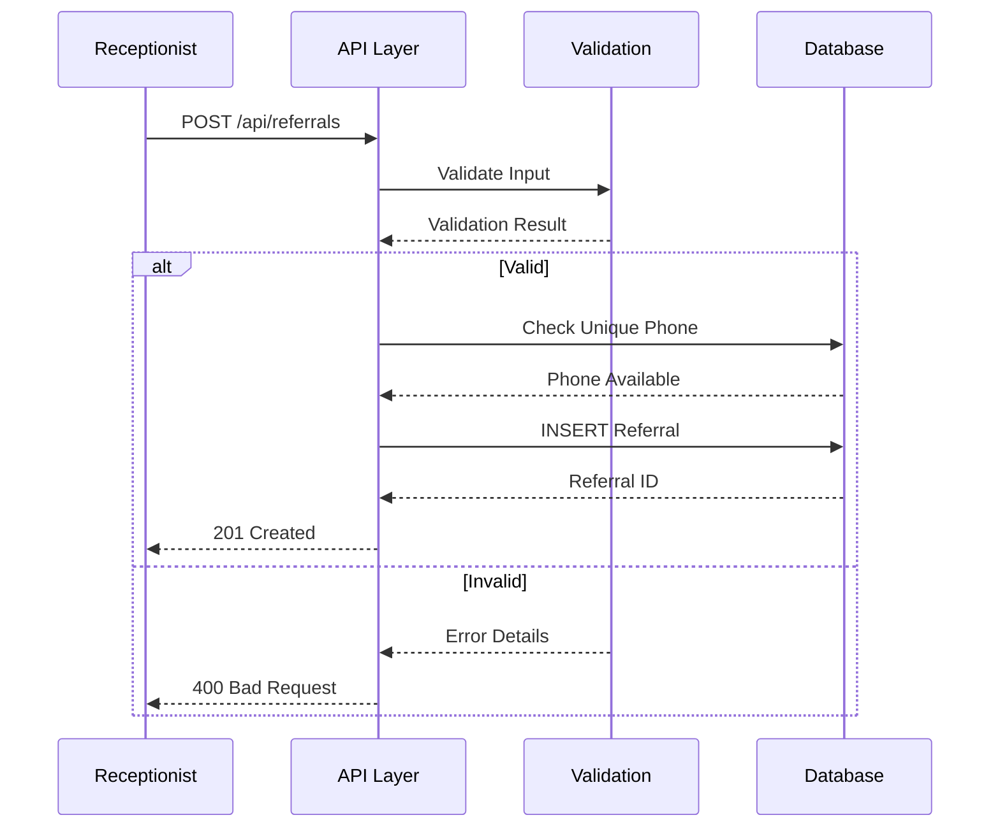
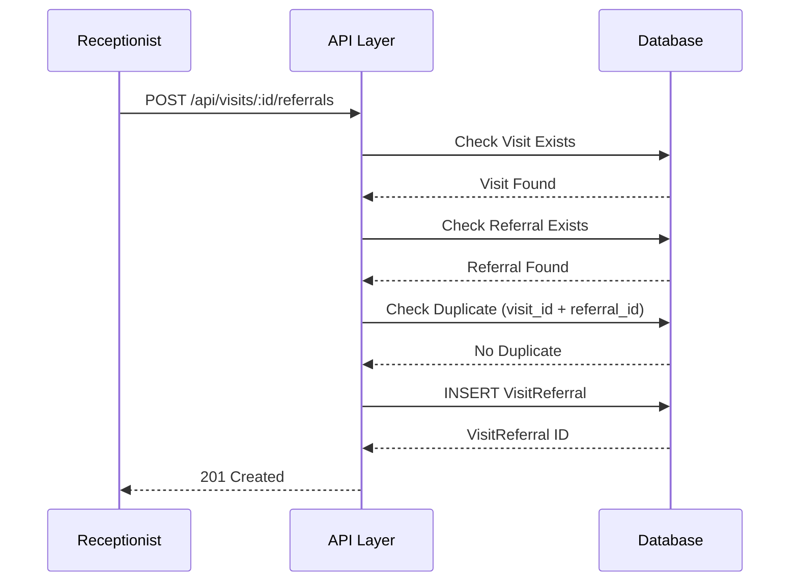
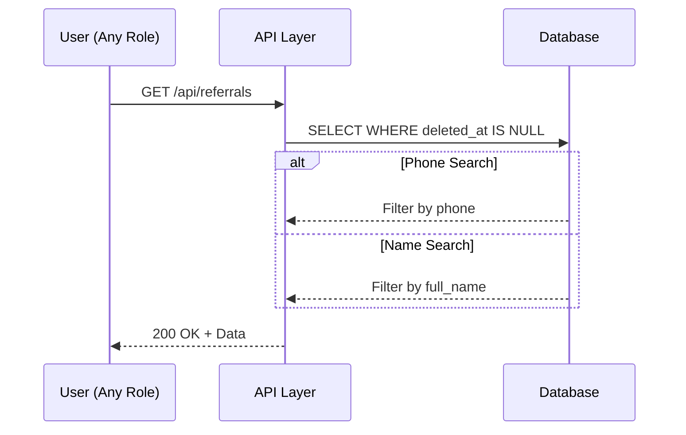
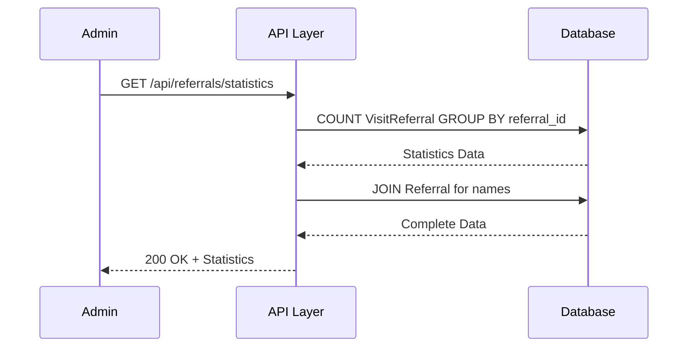

# 📄 FAYL: `12-referral-management.md`

```markdown
# 12. Tavsiya Tizimi Boshqaruvi (Referral Management)

---

## 📋 UMUMIY MA'LUMOT

| Maydon | Qiymat |
|--------|--------|
| **Flow ID** | 12 |
| **Phase** | 2A - Core Entities |
| **Model** | `Referral`, `VisitReferral` |
| **Status** | Draft |
| **Yaratilgan Sana** | 2024-01-15 |
| **Oxirgi Yangilanish** | 2024-01-15 |
| **Mas'ul** | Senior Backend Developer |
| **Bog'liq Modellar** | `User` (RFC-002), `Visit` (Keyingi), `VisitReferral` (Keyingi) |

---

## 🎯 MAQSAD

Klinikaga mijozlarni kim tavsiya qilganligini kuzatish va boshqarish. Tavsiya tizimi orqali marketing samaradorligini o'lchash, tavsiya qilgan shaxslarni rag'batlantirish va mijoz manbailarini tahlil qilish uchun reference ma'lumotlar bazasini yaratish (Reference: `Klinika.md` 4.4).

---

## 👥 MAS'UL ROLLAR

| Rol | Create | Read | Update | Delete | Tavsif |
|-----|--------|------|--------|--------|--------|
| **Admin** | ✅ | ✅ | ✅ | ✅ | To'liq huquq - barcha operatsiyalar |
| **Doctor** | ❌ | ✅ | ❌ | ❌ | Faqat ko'rish (o'z mijozlari tavsiyasi) |
| **Nurse** | ❌ | ✅ | ❌ | ❌ | Faqat ko'rish |
| **Receptionist** | ✅ | ✅ | ✅ | ❌ | Tavsiya ro'yxatga olish va yangilash |
| **Accountant** | ❌ | ✅ | ❌ | ❌ | Faqat ko'rish (hisobotlar uchun) |

---

## 📊 PRISMA MODEL (Reference: `klinika_prisma.txt`)

### Referral Model Schema

```prisma
model Referral {
  id           Int          @id @default(autoincrement())
  full_name    String       @db.VarChar(100)
  phone        String?      @db.VarChar(20)
  description  String?      @db.Text
  status       RecordStatus @default(ACTIVE)
  created_at   Timestamptz  @default(now())
  updated_at   Timestamptz  @updatedAt
  deleted_at   Timestamptz?
  registered_by Int?        @map("registered_by")
  modified_by  Int?         @map("modified_by")

  // Relations
  register_user User?       @relation("fk_referral_registered_by", fields: [registered_by], references: [id], onDelete: SetNull, onUpdate: Cascade)
  modify_user   User?       @relation("fk_referral_modified_by", fields: [modified_by], references: [id], onDelete: SetNull, onUpdate: Cascade)

  visit_referrals VisitReferral[] @relation("fk_visit_referral_referral")

  @@index([status])
  @@index([phone])
  @@index([deleted_at])
  @@map("referrals")
}
```

### VisitReferral Model Schema

```prisma
model VisitReferral {
  id           Int         @id @default(autoincrement())
  visit_id     Int?        @map("visit_id")
  referral_id  Int?        @map("referral_id")
  created_at   Timestamptz @default(now())
  updated_at   Timestamptz @updatedAt
  deleted_at   Timestamptz?
  registered_by Int?       @map("registered_by")
  modified_by  Int?        @map("modified_by")

  // Relations
  referral     Referral?   @relation("fk_visit_referral_referral", fields: [referral_id], references: [id], onDelete: Cascade, onUpdate: Cascade)
  visit        Visit?      @relation("fk_visit_referral_visit", fields: [visit_id], references: [id], onDelete: Cascade, onUpdate: Cascade)
  register_user User?      @relation("fk_visit_referral_registered_by", fields: [registered_by], references: [id], onDelete: SetNull, onUpdate: Cascade)
  modify_user  User?       @relation("fk_visit_referral_modified_by", fields: [modified_by], references: [id], onDelete: SetNull, onUpdate: Cascade)

  @@index([visit_id])
  @@index([referral_id])
  @@index([deleted_at])
  @@index([registered_by])
  @@index([modified_by])
  @@unique([visit_id, referral_id])
  @@map("visit_referrals")
}
```

### Referral Model Maydonlari Tafsiloti

| Maydon | Tip | Majburiy | Default | DB Tip | Izoh/Tavsif |
|--------|-----|----------|---------|--------|-------------|
| `id` | Int | ✅ | autoincrement | SERIAL | **Primary Key**. Unikal identifikator, avtomatik oshib boradi. VisitReferral jadvali bilan bog'lanish uchun |
| `full_name` | String | ✅ | - | VARCHAR(100) | **Tavsiya qiluvchi F.I.O**. 3-100 belgi. Tavsiya qilgan shaxsning to'liq ismi |
| `phone` | String | ❌ | null | VARCHAR(20) | **Telefon raqam**. +998 formatida. Aloqa uchun, qidiruv uchun ishlatiladi |
| `description` | String | ❌ | null | TEXT | **Qo'shimcha tavsif**. Tavsiya qiluvchi haqida qo'shimcha ma'lumot |
| `status` | Enum | ✅ | ACTIVE | RecordStatus | **Holat**. ACTIVE (faol), INACTIVE (nofaol), ARCHIVED (arxiv) |
| `created_at` | Timestamptz | ✅ | now() | TIMESTAMPTZ | **Yaratilgan vaqt**. Avtomatik to'ldiriladi, UTC timezone. Audit uchun muhim (Reference: `Klinika.md` 5.2) |
| `updated_at` | Timestamptz | ✅ | now() | TIMESTAMPTZ | **Oxirgi o'zgarish**. Har bir update da avtomatik yangilanadi (Prisma @updatedAt) |
| `deleted_at` | Timestamptz | ❌ | null | TIMESTAMPTZ | **Soft Delete**. NULL = aktiv, qiymat bor = o'chirilgan. Fizik delete qilinmaydi (Reference: `Klinika.md` 8.1) |
| `registered_by` | Int | ❌ | null | INTEGER | **Foreign Key**. Kim yaratgan (User ID). SetNull cascade - user o'chirilganda null bo'ladi. Audit uchun |
| `modified_by` | Int | ❌ | null | INTEGER | **Foreign Key**. Kim oxirgi o'zgartirgan (User ID). SetNull cascade - user o'chirilganda null bo'ladi. Audit uchun |

### VisitReferral Model Maydonlari Tafsiloti

| Maydon | Tip | Majburiy | Default | DB Tip | Izoh/Tavsif |
|--------|-----|----------|---------|--------|-------------|
| `id` | Int | ✅ | autoincrement | SERIAL | **Primary Key**. Unikal identifikator, avtomatik oshib boradi |
| `visit_id` | Int | ✅ | - | INTEGER | **Foreign Key**. Visit jadvaliga bog'lanish. Qaysi visit tavsiya orqali kelganligini ko'rsatadi |
| `referral_id` | Int | ✅ | - | INTEGER | **Foreign Key**. Referral jadvaliga bog'lanish. Kim tavsiya qilganligini ko'rsatadi |
| `created_at` | Timestamptz | ✅ | now() | TIMESTAMPTZ | **Yaratilgan vaqt**. Avtomatik to'ldiriladi, UTC timezone |
| `updated_at` | Timestamptz | ✅ | now() | TIMESTAMPTZ | **Oxirgi o'zgarish**. Har bir update da avtomatik yangilanadi |
| `deleted_at` | Timestamptz | ❌ | null | TIMESTAMPTZ | **Soft Delete**. NULL = aktiv, qiymat bor = o'chirilgan |
| `registered_by` | Int | ❌ | null | INTEGER | **Foreign Key**. Kim yaratgan (User ID). Audit uchun (Reference: `Klinika.md` 5.2) |
| `modified_by` | Int | ❌ | null | INTEGER | **Foreign Key**. Kim oxirgi o'zgartirgan (User ID). Audit uchun |

### Indexlar (Reference: `klinika_prisma.txt`)

| Index | Maydon(lar) | Maqsad |
|-------|-------------|--------|
| `@@index([status])` | status | Status bo'yicha filter qilishni tezlashtirish |
| `@@index([phone])` | phone | Telefon raqam bo'yicha qidiruvni tezlashtirish |
| `@@index([deleted_at])` | deleted_at | Soft delete filter uchun |
| `@@index([visit_id])` | visit_id | Visit bo'yicha filter qilishni tezlashtirish |
| `@@index([referral_id])` | referral_id | Referral bo'yicha filter qilishni tezlashtirish |
| `@@unique([visit_id, referral_id])` | visit_id, referral_id | Bir visitga bir tavsiya (duplicate oldini olish) |

### Relation'lar

| Relation | Model | Type | onDelete | onUpdate | Tavsif |
|----------|-------|------|----------|----------|--------|
| `fk_referral_registered_by` | User | N:1 | SetNull | Cascade | User o'chirilganda registered_by NULL ga o'zgaradi. Audit tarixi saqlanadi |
| `fk_referral_modified_by` | User | N:1 | SetNull | Cascade | User o'chirilganda modified_by NULL ga o'zgaradi. Audit tarixi saqlanadi |
| `fk_visit_referral_referral` | Referral | N:1 | Cascade | Cascade | Referral o'chirilganda VisitReferral yozuvlari o'chiriladi |
| `fk_visit_referral_visit` | Visit | N:1 | Cascade | Cascade | Visit o'chirilganda VisitReferral yozuvlari o'chiriladi |
| `fk_visit_referral_registered_by` | User | N:1 | SetNull | Cascade | User o'chirilganda registered_by NULL ga o'zgaradi |
| `fk_visit_referral_modified_by` | User | N:1 | SetNull | Cascade | User o'chirilganda modified_by NULL ga o'zgaradi |

---

## 🔄 FLOW DIAGRAM

### 1. Tavsiya Yaratish Flow (Receptionist/Admin tomonidan)



### 2. Tavsiyani Visitga Biriktirish Flow



### 3. Tavsiya Ro'yxatini Olish Flow



### 4. Tavsiya Statistikasi Flow



---

## 📝 BOSQICHMA-BOSQICH JARAYON

### BOSQICH 1: Tavsiya Yaratish

#### 1.1. Input Ma'lumotlari

```typescript
interface CreateReferralDto {
  full_name: string;    // 3-100 belgi
  phone?: string;       // +998 format
  description?: string; // 0-255 belgi
  status?: string;      // ACTIVE/INACTIVE/ARCHIVED
}
```

#### 1.2. Validatsiya Qoidalari

```typescript
// Full Name validatsiya
{
  minLength: 3,
  maxLength: 100,
  pattern: /^[a-zA-Z\u0400-\u04FF\s'-]+$/,
  required: true
}

// Phone validatsiya
{
  pattern: /^\+998[0-9]{9}$/,
  required: false,
  unique: true  // Agar kiritilgan bo'lsa, unikal bo'lishi kerak
}

// Status validatsiya
{
  enum: ['ACTIVE', 'INACTIVE', 'ARCHIVED'],
  default: 'ACTIVE',
  required: false
}
```

#### 1.3. Biznes Logika

```typescript
// referral.service.ts
async create(createReferralDto: CreateReferralDto, userId: number): Promise<Referral> {
  // 1. Phone unikal ekanligini tekshirish (agar kiritilgan bo'lsa)
  if (createReferralDto.phone) {
    const existing = await this.prisma.referral.findFirst({
      where: {
        phone: createReferralDto.phone,
        deleted_at: null
      }
    });

    if (existing) {
      throw new ConflictException('REF_001');
    }
  }

  // 2. Tavsiya yaratish
  const referral = await this.prisma.referral.create({
     {
      full_name: createReferralDto.full_name,
      phone: createReferralDto.phone,
      description: createReferralDto.description,
      status: createReferralDto.status || 'ACTIVE',
      created_at: new Date(),
      updated_at: new Date(),
      registered_by: userId
    }
  });

  return referral;
}
```

#### 1.4. Database Query

```prisma
INSERT INTO referrals (
  full_name,
  phone,
  description,
  status,
  created_at,
  updated_at,
  registered_by
) VALUES (
  'Dr. John Smith',
  '+998901234567',
  'Doimiy tavsiya qiluvchi',
  'ACTIVE',
  NOW(),
  NOW(),
  1
);
```

---

### BOSQICH 2: Tavsiyani Visitga Biriktirish

#### 2.1. Input Ma'lumotlari

```typescript
interface CreateVisitReferralDto {
  referral_id: number;  // Mavjud Referral ID
}
```

#### 2.2. Biznes Logika

```typescript
async linkToVisit(visitId: number, createVisitReferralDto: CreateVisitReferralDto, userId: number): Promise<VisitReferral> {
  // 1. Visit mavjudligini tekshirish
  const visit = await this.prisma.visit.findUnique({
    where: { id: visitId }
  });

  if (!visit || visit.deleted_at) {
    throw new NotFoundException('REF_002');
  }

  // 2. Referral mavjudligini tekshirish
  const referral = await this.prisma.referral.findUnique({
    where: { id: createVisitReferralDto.referral_id }
  });

  if (!referral || referral.deleted_at) {
    throw new NotFoundException('REF_003');
  }

  // 3. Duplicate tekshiruvi (bir visitga bir tavsiya)
  const existing = await this.prisma.visitReferral.findFirst({
    where: {
      visit_id: visitId,
      deleted_at: null
    }
  });

  if (existing) {
    throw new ConflictException('REF_004');
  }

  // 4. VisitReferral yaratish
  const visitReferral = await this.prisma.visitReferral.create({
     {
      visit_id: visitId,
      referral_id: createVisitReferralDto.referral_id,
      created_at: new Date(),
      updated_at: new Date(),
      registered_by: userId
    },
    include: {
      referral: { select: { id: true, full_name: true, phone: true } }
    }
  });

  return visitReferral;
}
```

#### 2.3. Database Query

```prisma
INSERT INTO visit_referrals (
  visit_id,
  referral_id,
  created_at,
  updated_at,
  registered_by
) VALUES (
  1,
  1,
  NOW(),
  NOW(),
  1
);
```

---

### BOSQICH 3: Tavsiya Ro'yxatini Olish

#### 3.1. Query Parametrlari

```typescript
interface GetReferralsQuery {
  page?: number;        // Default: 1
  limit?: number;       // Default: 20
  phone?: string;       // Filter by phone
  full_name?: string;   // Search by name
  status?: string;      // Filter by status
  sortBy?: string;      // Default: created_at
  sortOrder?: string;   // Default: desc
}
```

#### 3.2. Biznes Logika

```typescript
async findAll(query: GetReferralsQuery): Promise<PaginatedResult<Referral>> {
  const where: any = { deleted_at: null };

  // Phone filter
  if (query.phone) {
    where.phone = {
      contains: query.phone.replace(/\D/g, ''),
      mode: 'insensitive'
    };
  }

  // Full name search
  if (query.full_name) {
    where.full_name = {
      contains: query.full_name,
      mode: 'insensitive'
    };
  }

  // Status filter
  if (query.status) {
    where.status = query.status;
  }

  // Pagination
  const skip = (query.page - 1) * query.limit;
  const take = Math.min(query.limit, 100);

  // Sorting
  const orderBy = {
    [query.sortBy || 'created_at']: query.sortOrder || 'desc'
  };

  const [data, total] = await Promise.all([
    this.prisma.referral.findMany({
      where,
      skip,
      take,
      orderBy,
      include: {
        _count: {
          select: { visit_referrals: { where: { deleted_at: null } } }
        }
      }
    }),
    this.prisma.referral.count({ where })
  ]);

  return {
    data,
    pagination: {
      page: query.page,
      limit: take,
      total,
      totalPages: Math.ceil(total / take),
      hasNextPage: skip + take < total,
      hasPrevPage: query.page > 1
    }
  };
}
```

---

### BOSQICH 4: Tavsiya Statistikasi

#### 4.1. Biznes Logika

```typescript
async getStatistics(): Promise<ReferralStatistics[]> {
  const statistics = await this.prisma.visitReferral.groupBy({
    by: ['referral_id'],
    _count: {
      visit_id: true
    },
    where: {
      deleted_at: null
    }
  });

  // Referral ma'lumotlarini qo'shish
  const result = await Promise.all(
    statistics.map(async (stat) => {
      const referral = await this.prisma.referral.findUnique({
        where: { id: stat.referral_id },
        select: {
          id: true,
          full_name: true,
          phone: true
        }
      });

      return {
        referral_id: stat.referral_id,
        full_name: referral?.full_name || 'Noma\'lum',
        phone: referral?.phone || null,
        visit_count: stat._count.visit_id
      };
    })
  );

  // Sort by visit count (descending)
  return result.sort((a, b) => b.visit_count - a.visit_count);
}
```

---

### BOSQICH 5: Tavsiya Yangilash

#### 5.1. Input Ma'lumotlari

```typescript
interface UpdateReferralDto {
  full_name?: string;
  phone?: string;
  description?: string;
  status?: string;
}
```

#### 5.2. Biznes Logika

```typescript
async update(id: number, updateReferralDto: UpdateReferralDto, userId: number): Promise<Referral> {
  // 1. Tavsiya mavjudligini tekshirish
  const referral = await this.prisma.referral.findUnique({
    where: { id }
  });

  if (!referral || referral.deleted_at) {
    throw new NotFoundException('REF_003');
  }

  // 2. Phone unikal ekanligini tekshirish (agar o'zgarayotgan bo'lsa)
  if (updateReferralDto.phone && updateReferralDto.phone !== referral.phone) {
    const existing = await this.prisma.referral.findFirst({
      where: {
        phone: updateReferralDto.phone,
        id: { not: id },
        deleted_at: null
      }
    });

    if (existing) {
      throw new ConflictException('REF_001');
    }
  }

  // 3. Tavsiya yangilash
  const updated = await this.prisma.referral.update({
    where: { id },
     {
      ...updateReferralDto,
      updated_at: new Date(),
      modified_by: userId
    }
  });

  return updated;
}
```

---

### BOSQICH 6: Tavsiya O'chirish (Soft Delete)

#### 6.1. Biznes Logika

```typescript
async remove(id: number, userId: number): Promise<Referral> {
  // 1. Tavsiya mavjudligini tekshirish
  const referral = await this.prisma.referral.findUnique({
    where: { id }
  });

  if (!referral || referral.deleted_at) {
    throw new NotFoundException('REF_003');
  }

  // 2. Bog'liq VisitReferral yozuvlarini tekshirish
  const visitReferralCount = await this.prisma.visitReferral.count({
    where: {
      referral_id: id,
      deleted_at: null
    }
  });

  // 3. Warning log (agar bog'liq yozuvlar bo'lsa)
  if (visitReferralCount > 0) {
    this.logger.warn(
      `Referral ${id} has ${visitReferralCount} visit referrals. 
       These records will be cascade deleted.`
    );
  }

  // 4. Soft Delete (Cascade delete for VisitReferral)
  return this.prisma.referral.update({
    where: { id },
     {
      status: 'INACTIVE',
      deleted_at: new Date()
    }
  });
}
```

---

## 🔌 API ENDPOINT'LAR

### 1. Tavsiya Yaratish

| Parametr | Qiymat |
|----------|--------|
| **Method** | POST |
| **Endpoint** | `/api/v1/referrals` |
| **Auth** | ✅ JWT Required |
| **Rol** | Admin, Receptionist |
| **Content-Type** | application/json |

**Request Body:**
```json
{
  "full_name": "Dr. John Smith",
  "phone": "+998901234567",
  "description": "Doimiy tavsiya qiluvchi",
  "status": "ACTIVE"
}
```

**Response (201 Created):**
```json
{
  "success": true,
  "message": "Tavsiya muvaffaqiyatli yaratildi",
  "data": {
    "id": 1,
    "full_name": "Dr. John Smith",
    "phone": "+998901234567",
    "description": "Doimiy tavsiya qiluvchi",
    "status": "ACTIVE",
    "created_at": "2024-01-15T10:00:00.000Z",
    "updated_at": "2024-01-15T10:00:00.000Z",
    "deleted_at": null
  }
}
```

---

### 2. Tavsiyalar Ro'yxatini Olish

| Parametr | Qiymat |
|----------|--------|
| **Method** | GET |
| **Endpoint** | `/api/v1/referrals` |
| **Auth** | ✅ JWT Required |
| **Rol** | Barchasi |

**Query Params:**
```
GET /api/v1/referrals?page=1&limit=20&phone=+99890&status=ACTIVE&sortBy=created_at&sortOrder=desc
```

**Response (200 OK):**
```json
{
  "success": true,
  "data": [
    {
      "id": 1,
      "full_name": "Dr. John Smith",
      "phone": "+998901234567",
      "description": "Doimiy tavsiya qiluvchi",
      "status": "ACTIVE",
      "created_at": "2024-01-15T10:00:00.000Z",
      "_count": { "visit_referrals": 15 }
    },
    {
      "id": 2,
      "full_name": "Jane Doe",
      "phone": "+998909876543",
      "description": null,
      "status": "ACTIVE",
      "created_at": "2024-01-15T11:00:00.000Z",
      "_count": { "visit_referrals": 8 }
    }
  ],
  "pagination": {
    "page": 1,
    "limit": 20,
    "total": 50,
    "totalPages": 3,
    "hasNextPage": true,
    "hasPrevPage": false
  }
}
```

---

### 3. Visitga Tavsiya Biriktirish

| Parametr | Qiymat |
|----------|--------|
| **Method** | POST |
| **Endpoint** | `/api/v1/visits/:visitId/referrals` |
| **Auth** | ✅ JWT Required |
| **Rol** | Admin, Receptionist |

**Request Body:**
```json
{
  "referral_id": 1
}
```

**Response (201 Created):**
```json
{
  "success": true,
  "message": "Tavsiya visitga muvaffaqiyatli biriktirildi",
  "data": {
    "id": 1,
    "visit_id": 1,
    "referral_id": 1,
    "referral": {
      "id": 1,
      "full_name": "Dr. John Smith",
      "phone": "+998901234567"
    },
    "created_at": "2024-01-15T12:00:00.000Z"
  }
}
```

---

### 4. Tavsiya Statistikasini Olish

| Parametr | Qiymat |
|----------|--------|
| **Method** | GET |
| **Endpoint** | `/api/v1/referrals/statistics` |
| **Auth** | ✅ JWT Required |
| **Rol** | Admin, Accountant |

**Response (200 OK):**
```json
{
  "success": true,
  "data": [
    {
      "referral_id": 1,
      "full_name": "Dr. John Smith",
      "phone": "+998901234567",
      "visit_count": 15
    },
    {
      "referral_id": 2,
      "full_name": "Jane Doe",
      "phone": "+998909876543",
      "visit_count": 8
    },
    {
      "referral_id": 3,
      "full_name": "Bob Johnson",
      "phone": null,
      "visit_count": 5
    }
  ]
}
```

---

### 5. Bitta Tavsiya Ma'lumotlarini Olish

| Parametr | Qiymat |
|----------|--------|
| **Method** | GET |
| **Endpoint** | `/api/v1/referrals/:id` |
| **Auth** | ✅ JWT Required |
| **Rol** | Barchasi |

**Response (200 OK):**
```json
{
  "success": true,
  "data": {
    "id": 1,
    "full_name": "Dr. John Smith",
    "phone": "+998901234567",
    "description": "Doimiy tavsiya qiluvchi",
    "status": "ACTIVE",
    "created_at": "2024-01-15T10:00:00.000Z",
    "updated_at": "2024-01-15T10:00:00.000Z",
    "deleted_at": null,
    "_count": { "visit_referrals": 15 }
  }
}
```

---

### 6. Tavsiya Yangilash

| Parametr | Qiymat |
|----------|--------|
| **Method** | PUT |
| **Endpoint** | `/api/v1/referrals/:id` |
| **Auth** | ✅ JWT Required |
| **Rol** | Admin, Receptionist |

**Request Body:**
```json
{
  "full_name": "Dr. John Smith Updated",
  "phone": "+998901234567",
  "description": "Yangilangan tavsif"
}
```

**Response (200 OK):**
```json
{
  "success": true,
  "message": "Tavsiya muvaffaqiyatli yangilandi",
  "data": {
    "id": 1,
    "full_name": "Dr. John Smith Updated",
    "phone": "+998901234567",
    "status": "ACTIVE",
    "updated_at": "2024-01-15T12:00:00.000Z"
  }
}
```

---

### 7. Tavsiya O'chirish (Soft Delete)

| Parametr | Qiymat |
|----------|--------|
| **Method** | DELETE |
| **Endpoint** | `/api/v1/referrals/:id` |
| **Auth** | ✅ JWT Required |
| **Rol** | Admin |

**Response (200 OK):**
```json
{
  "success": true,
  "message": "Tavsiya muvaffaqiyatli o'chirildi",
  "data": {
    "id": 1,
    "full_name": "Dr. John Smith",
    "status": "INACTIVE",
    "deleted_at": "2024-01-15T14:00:00.000Z"
  }
}
```

---

## ⚠️ XATOLIKLAR VA HANDLING

| Kod | HTTP Status | Xabar | Sabab | Yechim |
|-----|-------------|-------|-------|--------|
| `REF_001` | 409 Conflict | Telefon raqam allaqachon mavjud | Phone unique constraint | Boshqa raqam kiriting |
| `REF_002` | 404 Not Found | Visit topilmadi | Visit ID not exists | Visit ID ni tekshiring |
| `REF_003` | 404 Not Found | Tavsiya topilmadi | Referral ID not exists | ID ni tekshiring |
| `REF_004` | 409 Conflict | Visitga allaqachon tavsiya biriktirilgan | Duplicate visit_referral | Avval biriktirilgan tavsiyani o'chiring |
| `REF_005` | 403 Forbidden | Ruxsat yo'q | Insufficient permissions | Rol tekshirilsin |
| `REF_006` | 400 Bad Request | Tavsiya nomi juda qisqa | Validation failed | Min 3 belgi |

---

## 📦 SEED DATA

```typescript
// seed/referral.seed.ts
export async function seedReferrals(prisma: PrismaClient) {
  // Test tavsiyalar yaratish
  const referrals = [
    {
      full_name: 'Dr. John Smith',
      phone: '+998901111111',
      description: 'Doimiy tavsiya qiluvchi shifokor',
      status: 'ACTIVE'
    },
    {
      full_name: 'Jane Doe',
      phone: '+998902222222',
      description: 'Sobiq mijoz, doim tavsiya qiladi',
      status: 'ACTIVE'
    },
    {
      full_name: 'Bob Johnson',
      phone: null,
      description: 'Telefon raqami yo\'q',
      status: 'ACTIVE'
    }
  ];

  for (const referral of referrals) {
    await prisma.referral.create({  referral });
  }

  console.log(`✅ Referrals seeded successfully (${referrals.length} referrals)`);
}
```

### Seed Script Ishga Tushirish

```bash
# Development
npm run seed

# Production (ehtiyotkorlik bilan)
npm run seed:prod

# Faqat tavsiyalar
npm run seed:referrals
```

---

## 🔐 XAVFSIZLIK TALABLARI (Reference: `Klinika.md` 8)

### 1. Autentifikatsiya
- ✅ Barcha endpoint'lar JWT token talab qiladi
- ✅ Token expiry: 24 soat

### 2. Avtorizatsiya (RBAC) (Reference: `Klinika.md` 6.1)

| Endpoint | Admin | Doctor | Nurse | Receptionist | Accountant |
|----------|-------|--------|-------|--------------|------------|
| POST /referrals | ✅ | ❌ | ❌ | ✅ | ❌ |
| GET /referrals | ✅ | ✅ | ✅ | ✅ | ✅ |
| GET /referrals/:id | ✅ | ✅ | ✅ | ✅ | ✅ |
| PUT /referrals/:id | ✅ | ❌ | ❌ | ✅ | ❌ |
| DELETE /referrals/:id | ✅ | ❌ | ❌ | ❌ | ❌ |
| POST /visits/:id/referrals | ✅ | ❌ | ❌ | ✅ | ❌ |
| GET /referrals/statistics | ✅ | ❌ | ❌ | ❌ | ✅ |

### 3. Audit (Reference: `Klinika.md` 5.2)
- ✅ `created_at` - Yaratilgan vaqt
- ✅ `updated_at` - Oxirgi o'zgarish
- ✅ `deleted_at` - Soft delete vaqti
- ✅ `registered_by` - Kim yaratdi (User ID)
- ✅ `modified_by` - Kim o'zgartirdi (User ID)

---

## 📝 ESLATMALAR

1. **Telefon raqam unikal** - Agar kiritilgan bo'lsa, unikal bo'lishi kerak
2. **Bir visitga bir tavsiya** - VisitReferral unique constraint (visit_id, referral_id)
3. **Soft Delete** - Tavsiya o'chirilganda `deleted_at` set bo'ladi, fizik delete qilinmaydi (Reference: `Klinika.md` 8.1)
4. **Cascade Rules** - Referral o'chirilganda VisitReferral yozuvlari o'chiriladi (Cascade)
5. **Statistika** - Har bir tavsiya qiluvchi uchun visit_count hisoblanadi
6. **Audit Trail** - Har bir o'zgarish qayd etiladi (registered_by, modified_by) (Reference: `Klinika.md` 5.2)
7. **Marketing Analitika** - Tavsiya tizimi marketing samaradorligini o'lchash uchun ishlatiladi (Reference: `Klinika.md` 4.4)

---

## ✅ QABUL QILISH MEZONLARI (ACCEPTANCE CRITERIA)

### Functional Requirements
- [ ] Tavsiya nomi 3-100 belgi orasida bo'lishi
- [ ] Telefon raqam +998 formatida bo'lishi
- [ ] Telefon raqam unikal bo'lishi (agar kiritilgan bo'lsa)
- [ ] Soft delete ishlaydi (deleted_at set bo'ladi)
- [ ] Faqat Admin va Receptionist tavsiya yaratish/o'zgartirish huquqiga ega
- [ ] Barcha rollar tavsiya ro'yxatini ko'ra oladi
- [ ] Visitga tavsiya biriktirish ishlaydi
- [ ] Bir visitga faqat bitta tavsiya biriktirilishi
- [ ] Tavsiya statistikasi ishlaydi
- [ ] Pagination va search ishlaydi
- [ ] Xatoliklar to'g'ri HTTP status va kod bilan qaytariladi
- [ ] Audit maydonlari (registered_by, modified_by) to'ldiriladi
- [ ] Cascade rules ishlaydi (Cascade delete for VisitReferral)

### Non-Functional Requirements (Reference: `Klinika.md` 9.1)
- [ ] API response time < 200ms
- [ ] Database query time < 100ms
- [ ] Unit test coverage ≥ 90%
- [ ] E2E test coverage ≥ 70%
- [ ] Security audit o'tkazildi
- [ ] Documentation to'liq

---

**Hujjat Versiyasi:** 1.0
**Status:** Draft
**Tasdiqlagan:** _______________
**Sana:** _______________