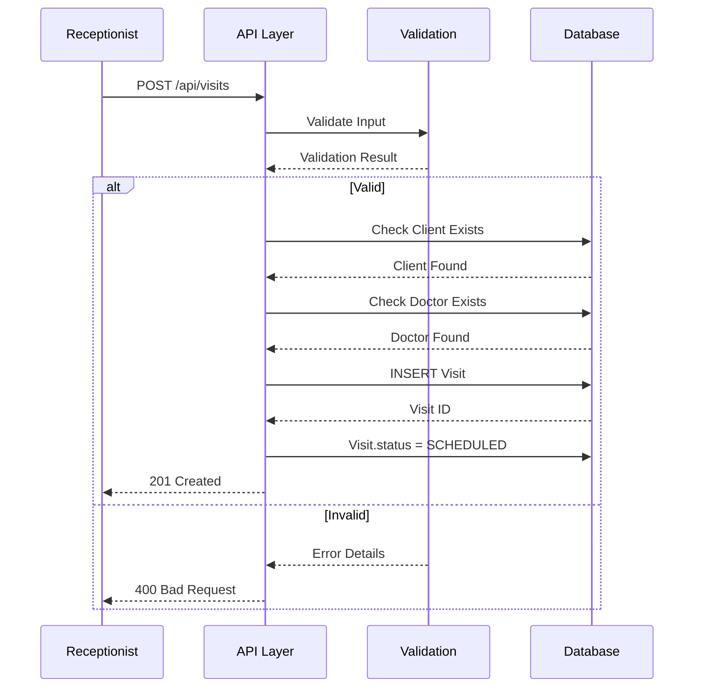
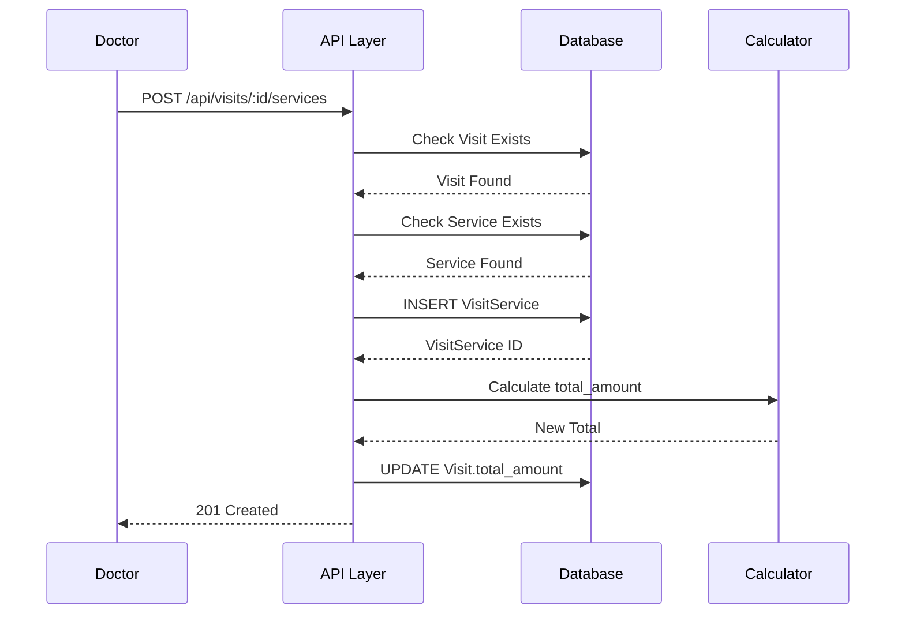
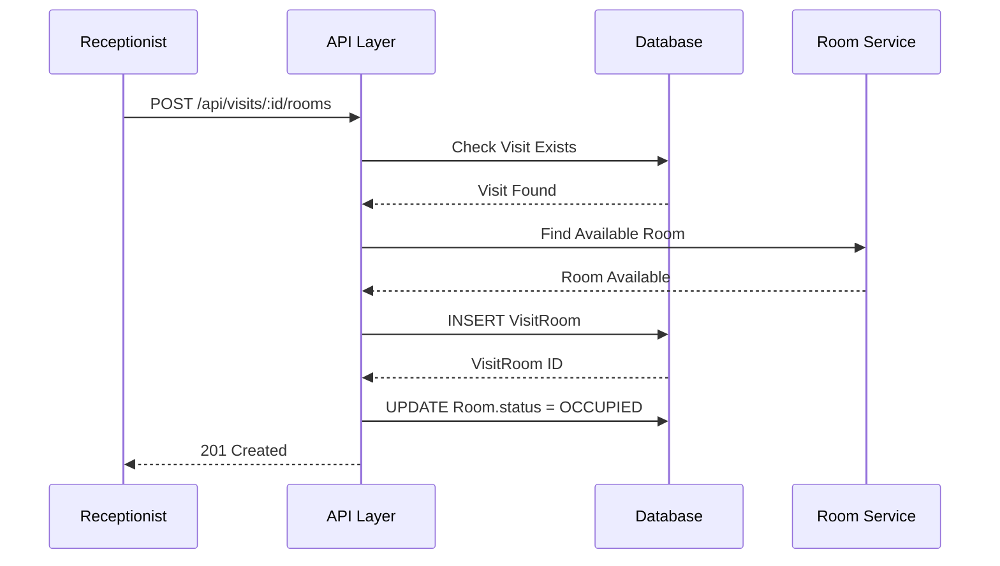
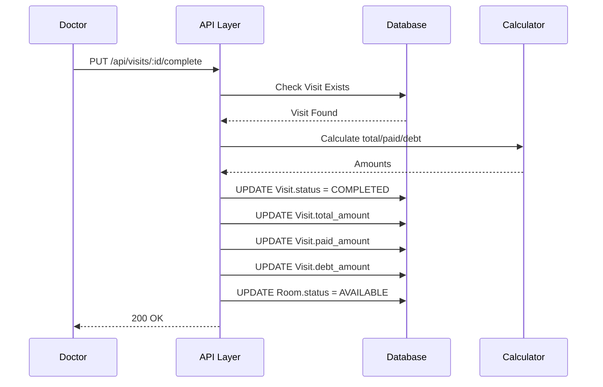
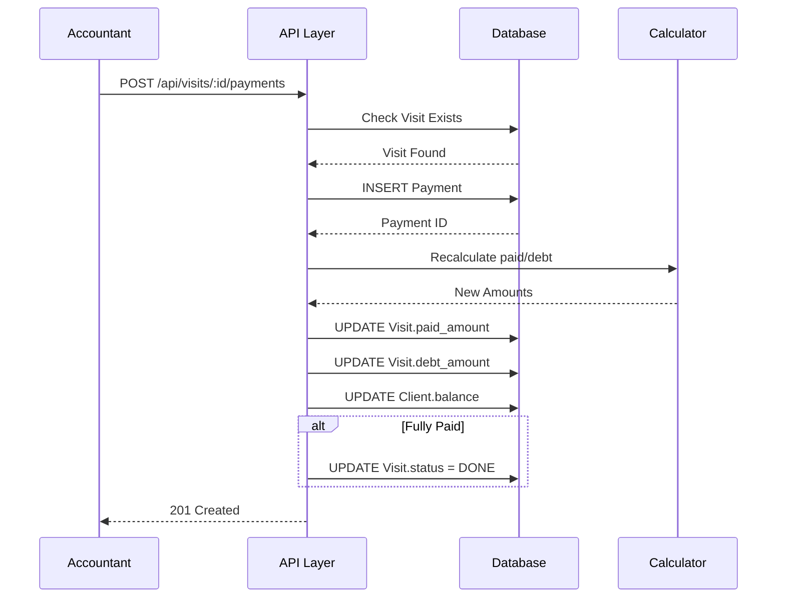

# 📄 FAYL: `13-visit-management.md`

# 13. Qabul Jarayoni Boshqaruvi (Visit Management)

## 📋 UMUMIY MA'LUMOT

| Maydon | Qiymat |
|--------|--------|
| **Flow ID** | 13 |
| **Phase** | 2A - Core Entities |
| **Model** | `Visit`, `VisitService`, `VisitRoom`, `VisitReferral` |
| **Status** | Draft |
| **Yaratilgan Sana** | 2024-01-15 |
| **Oxirgi Yangilanish** | 2024-01-15 |
| **Mas'ul** | Senior Backend Developer |
| **Bog'liq Modellar** | `Client` (RFC-009), `User` (RFC-002), `Room` (RFC-010), `Service` (RFC-011), `Referral` (RFC-012) |
---

## 🎯 MAQSAD

Klinikaga kelgan mijozlarning qabul jarayonini boshqarish. Visit (qabul) yaratish, xizmatlar qo'shish, xona ajratish, tavsiya biriktirish, to'lov jarayonini boshqarish va qabulni yakunlash. Har bir visit uchun moliyaviy hisob-kitobni avtomatlashtirish va tibbiy tarixni shakllantirish (Reference: `Klinika.md` 3.3, 4.1).

---

## 👥 MAS'UL ROLLAR

| Rol | Create | Read | Update | Delete | Complete | Tavsif |
|-----|--------|------|--------|--------|----------|--------|
| **Admin** | ✅ | ✅ | ✅ | ✅ | ✅ | To'liq huquq - barcha operatsiyalar |
| **Doctor** | ✅ | ✅ | ✅ | ❌ | ✅ | Visit yaratish, xizmat qo'shish, visit yakunlash |
| **Nurse** | ❌ | ✅ | ❌ | ❌ | ❌ | Faqat ko'rish |
| **Receptionist** | ✅ | ✅ | ✅ | ❌ | ❌ | Visit yaratish, xona ajratish |
| **Accountant** | ❌ | ✅ | ✅ (to'lov) | ❌ | ❌ | To'lov jarayoni |

---

## 📊 PRISMA MODEL (Reference: `klinika_prisma.txt`)

### Visit Model Schema

```prisma
model Visit {
  id           Int         @id @default(autoincrement())
  client_id    Int?        @map("client_id")
  doctor_id    Int?        @map("doctor_id")
  status       VisitStatus
  total_amount Decimal     @default(0) @db.Decimal(15, 2) @map("total_amount")
  paid_amount  Decimal     @default(0) @db.Decimal(15, 2) @map("paid_amount")
  debt_amount  Decimal     @default(0) @db.Decimal(15, 2) @map("debt_amount")
  description  String?     @db.Text
  visit_date   Timestamptz @default(now()) @map("visit_date")
  created_at   Timestamptz @default(now())
  updated_at   Timestamptz @updatedAt
  deleted_at   Timestamptz?
  registered_by Int?       @map("registered_by")
  modified_by  Int?        @map("modified_by")

  // Relations
  client       Client?     @relation("fk_visit_client", fields: [client_id], references: [id], onDelete: SetNull, onUpdate: Cascade)
  doctor       User?       @relation("fk_visit_doctor", fields: [doctor_id], references: [id], onDelete: SetNull, onUpdate: Cascade)
  register_user User?      @relation("fk_visit_registered_by", fields: [registered_by], references: [id], onDelete: SetNull, onUpdate: Cascade)
  modify_user  User?       @relation("fk_visit_modified_by", fields: [modified_by], references: [id], onDelete: SetNull, onUpdate: Cascade)

  visit_referrals VisitReferral[] @relation("fk_visit_referral_visit")
  visit_rooms     VisitRoom[]     @relation("fk_visit_room_visit")
  visit_services  VisitService[]  @relation("fk_visit_service_visit")
  payments        Payment[]       @relation("fk_payment_visit")
  client_paid     ClientPaid[]    @relation("fk_client_paid_visit")

  @@index([client_id])
  @@index([doctor_id])
  @@index([status])
  @@index([visit_date])
  @@index([deleted_at])
  @@index([client_id, visit_date])
  @@index([doctor_id, visit_date])
  @@index([status, visit_date])
  @@index([visit_date, deleted_at])
  @@map("visits")
}
```

### VisitService Model Schema

```prisma
model VisitService {
  id           Int         @id @default(autoincrement())
  visit_id     Int?        @map("visit_id")
  service_id   Int?        @map("service_id")
  price        Decimal     @default(0) @db.Decimal(15, 2)
  quantity     Int         @default(1)
  total        Decimal     @default(0) @db.Decimal(15, 2)
  created_at   Timestamptz @default(now())
  updated_at   Timestamptz @updatedAt
  deleted_at   Timestamptz?
  registered_by Int?       @map("registered_by")
  modified_by  Int?        @map("modified_by")

  // Relations
  service      Service?    @relation("fk_visit_service_service", fields: [service_id], references: [id], onDelete: Cascade, onUpdate: Cascade)
  visit        Visit?      @relation("fk_visit_service_visit", fields: [visit_id], references: [id], onDelete: Cascade, onUpdate: Cascade)
  register_user User?      @relation("fk_visit_service_registered_by", fields: [registered_by], references: [id], onDelete: SetNull, onUpdate: Cascade)
  modify_user  User?       @relation("fk_visit_service_modified_by", fields: [modified_by], references: [id], onDelete: SetNull, onUpdate: Cascade)

  @@index([visit_id])
  @@index([service_id])
  @@index([deleted_at])
  @@index([visit_id, service_id])
  @@index([registered_by])
  @@index([modified_by])
  @@map("visit_services")
}
```

### VisitRoom Model Schema

```prisma
model VisitRoom {
  id           Int            @id @default(autoincrement())
  visit_id     Int?           @map("visit_id")
  room_id      Int?           @map("room_id")
  status       VisitRoomStatus
  started_at   Timestamptz?   @map("started_at")
  ended_at     Timestamptz?   @map("ended_at")
  created_at   Timestamptz    @default(now())
  updated_at   Timestamptz    @updatedAt
  deleted_at   Timestamptz?
  registered_by Int?          @map("registered_by")
  modified_by  Int?           @map("modified_by")

  // Relations
  room         Room?          @relation("fk_visit_room_room", fields: [room_id], references: [id], onDelete: Cascade, onUpdate: Cascade)
  visit        Visit?         @relation("fk_visit_room_visit", fields: [visit_id], references: [id], onDelete: Cascade, onUpdate: Cascade)
  register_user User?         @relation("fk_visit_room_registered_by", fields: [registered_by], references: [id], onDelete: SetNull, onUpdate: Cascade)
  modify_user  User?          @relation("fk_visit_room_modified_by", fields: [modified_by], references: [id], onDelete: SetNull, onUpdate: Cascade)

  @@index([visit_id])
  @@index([room_id])
  @@index([status])
  @@index([deleted_at])
  @@index([visit_id, status])
  @@index([registered_by])
  @@index([modified_by])
  @@map("visit_rooms")
}
```

### VisitReferral Model Schema

```prisma
model VisitReferral {
  id           Int         @id @default(autoincrement())
  visit_id     Int?        @map("visit_id")
  referral_id  Int?        @map("referral_id")
  created_at   Timestamptz @default(now())
  updated_at   Timestamptz @updatedAt
  deleted_at   Timestamptz?
  registered_by Int?       @map("registered_by")
  modified_by  Int?        @map("modified_by")

  // Relations
  referral     Referral?   @relation("fk_visit_referral_referral", fields: [referral_id], references: [id], onDelete: Cascade, onUpdate: Cascade)
  visit        Visit?      @relation("fk_visit_referral_visit", fields: [visit_id], references: [id], onDelete: Cascade, onUpdate: Cascade)
  register_user User?      @relation("fk_visit_referral_registered_by", fields: [registered_by], references: [id], onDelete: SetNull, onUpdate: Cascade)
  modify_user  User?       @relation("fk_visit_referral_modified_by", fields: [modified_by], references: [id], onDelete: SetNull, onUpdate: Cascade)

  @@index([visit_id])
  @@index([referral_id])
  @@index([deleted_at])
  @@index([registered_by])
  @@index([modified_by])
  @@unique([visit_id, referral_id])
  @@map("visit_referrals")
}
```

### VisitStatus Enum (Reference: `klinika_prisma.txt`)

```prisma
enum VisitStatus {
  SCHEDULED      // 📅 Rejalashtirilgan
  IN_PROGRESS    // ⏳ Jarayonda
  COMPLETED      // ✅ Yakunlangan
  CANCELLED      // ❌ Bekor qilingan
  NO_SHOW        // 🚫 Kelmadi
  DONE           // 🏁 To'liq yakunlangan (to'lov bilan)
}
```

| Status | Tavsif | Qachon Ishlatiladi |
|--------|--------|-------------------|
| `SCHEDULED` | Qabul rejalashtirilgan | Receptionist visit yaratganda (Reference: `Klinika.md` 3.3) |
| `IN_PROGRESS` | Qabul jarayonda | Doctor bemorni ko'rayotganda |
| `COMPLETED` | Qabul yakunlangan | Doctor xizmatlarni qo'shib, visitni yakunlaganda |
| `CANCELLED` | Qabul bekor qilingan | Mijoz kelmaydigan bo'lsa |
| `NO_SHOW` | Mijoz kelmadi | Rejalashtirilgan vaqtda mijoz kelmasa |
| `DONE` | To'liq yakunlangan | To'lov to'liq amalga oshirilganda (Reference: `Klinika.md` 4.1) |

### VisitRoomStatus Enum (Reference: `klinika_prisma.txt`)

```prisma
enum VisitRoomStatus {
  ASSIGNED     // 🏷️ Xona ajratildi
  IN_USE       // 🔑 Xona ishlatilmoqda
  COMPLETED    // ✅ Xona bo'shatildi
}
```

---

## 🔄 FLOW DIAGRAM

### 1. Visit Yaratish Flow (Receptionist/Doctor tomonidan)



### 2. Visitga Xizmat Qo'shish Flow (Doctor tomonidan)



### 3. Visitga Xona Ajratish Flow (Receptionist tomonidan)



### 4. Visit Yakunlash Flow (Doctor tomonidan)



### 5. Visit To'lov Jarayoni Flow (Accountant/Receptionist tomonidan)



---

## 📝 BOSQICHMA-BOSQICH JARAYON

### BOSQICH 1: Visit Yaratish

#### 1.1. Input Ma'lumotlari

```typescript
interface CreateVisitDto {
  client_id: number;      // Mavjud Client ID
  doctor_id?: number;     // Mavjud User ID (Doctor)
  visit_date?: Date;      // Qabul sanasi (default: now)
  description?: string;   // Shikoyat/tavsif
  status?: VisitStatus;   // Default: SCHEDULED
}
```

#### 1.2. Validatsiya Qoidalari

```typescript
// Client validatsiya
{
  type: 'number',
  mustExist: true,  // Client jadvalida mavjud bo'lishi kerak
  required: true
}

// Doctor validatsiya
{
  type: 'number',
  mustExist: true,  // User jadvalida mavjud bo'lishi kerak
  role: 'Doctor',   // Doctor roli bo'lishi kerak
  required: false   // Keyinroq biriktirish mumkin
}

// Visit Date validatsiya
{
  type: 'date',
  min: new Date(),  // Kelajak sana bo'lishi mumkin
  required: false,
  default: now()
}

// Status validatsiya
{
  enum: ['SCHEDULED', 'IN_PROGRESS', 'COMPLETED', 'CANCELLED', 'NO_SHOW', 'DONE'],
  default: 'SCHEDULED',
  required: false
}
```

#### 1.3. Biznes Logika

```typescript
// visit.service.ts
async create(createVisitDto: CreateVisitDto, userId: number): Promise<Visit> {
  // 1. Client mavjudligini tekshirish
  const client = await this.prisma.client.findUnique({
    where: { id: createVisitDto.client_id }
  });

  if (!client || client.deleted_at) {
    throw new NotFoundException('VISIT_001');
  }

  // 2. Doctor mavjudligini tekshirish (agar kiritilgan bo'lsa)
  if (createVisitDto.doctor_id) {
    const doctor = await this.prisma.user.findUnique({
      where: { id: createVisitDto.doctor_id },
      include: { role: true }
    });

    if (!doctor || doctor.deleted_at || doctor.role?.name !== 'Doctor') {
      throw new NotFoundException('VISIT_002');
    }
  }

  // 3. Visit yaratish
  const visit = await this.prisma.visit.create({
     {
      client_id: createVisitDto.client_id,
      doctor_id: createVisitDto.doctor_id,
      status: createVisitDto.status || 'SCHEDULED',
      visit_date: createVisitDto.visit_date || new Date(),
      description: createVisitDto.description,
      total_amount: 0,
      paid_amount: 0,
      debt_amount: 0,
      created_at: new Date(),
      updated_at: new Date(),
      registered_by: userId
    },
    include: {
      client: { select: { id: true, full_name: true, phone: true } },
      doctor: { select: { id: true, full_name: true } }
    }
  });

  return visit;
}
```

#### 1.4. Database Query

```prisma
INSERT INTO visits (
  client_id,
  doctor_id,
  status,
  visit_date,
  description,
  total_amount,
  paid_amount,
  debt_amount,
  created_at,
  updated_at,
  registered_by
) VALUES (
  1,
  2,
  'SCHEDULED',
  NOW(),
  'Bosh og''rig''i, harorat',
  0,
  0,
  0,
  NOW(),
  NOW(),
  1
);
```

---

### BOSQICH 2: Visitga Xizmat Qo'shish

#### 2.1. Input Ma'lumotlari

```typescript
interface AddVisitServiceDto {
  service_id: number;   // Mavjud Service ID
  quantity?: number;    // Miqdor (default: 1)
  price?: number;       // Narx (default: Service.price)
}
```

#### 2.2. Biznes Logika

```typescript
async addService(visitId: number, addVisitServiceDto: AddVisitServiceDto, userId: number): Promise<VisitService> {
  // 1. Visit mavjudligini tekshirish
  const visit = await this.prisma.visit.findUnique({
    where: { id: visitId }
  });

  if (!visit || visit.deleted_at) {
    throw new NotFoundException('VISIT_003');
  }

  // 2. Visit status tekshirish (faqat SCHEDULED yoki IN_PROGRESS)
  if (!['SCHEDULED', 'IN_PROGRESS'].includes(visit.status)) {
    throw new BadRequestException('VISIT_004');
  }

  // 3. Service mavjudligini tekshirish
  const service = await this.prisma.service.findUnique({
    where: { id: addVisitServiceDto.service_id }
  });

  if (!service || service.deleted_at) {
    throw new NotFoundException('VISIT_005');
  }

  // 4. VisitService yaratish
  const quantity = addVisitServiceDto.quantity || 1;
  const price = addVisitServiceDto.price || service.price;
  const total = price * quantity;

  const visitService = await this.prisma.visitService.create({
     {
      visit_id: visitId,
      service_id: addVisitServiceDto.service_id,
      price: price,
      quantity: quantity,
      total: total,
      created_at: new Date(),
      updated_at: new Date(),
      registered_by: userId
    },
    include: {
      service: { select: { id: true, name: true } }
    }
  });

  // 5. Visit total_amount yangilash
  await this.recalculateVisitAmounts(visitId);

  return visitService;
}

// Visit miqdorlarini qayta hisoblash
private async recalculateVisitAmounts(visitId: number): Promise<void> {
  // Barcha VisitService yozuvlarini yig'ish
  const services = await this.prisma.visitService.aggregate({
    where: { visit_id: visitId, deleted_at: null },
    _sum: { total: true }
  });

  // Barcha Payment yozuvlarini yig'ish
  const payments = await this.prisma.payment.aggregate({
    where: { visit_id: visitId, deleted_at: null },
    _sum: { amount: true }
  });

  const total_amount = services._sum.total || 0;
  const paid_amount = payments._sum.amount || 0;
  const debt_amount = total_amount - paid_amount;

  // Visit yangilash
  await this.prisma.visit.update({
    where: { id: visitId },
     {
      total_amount,
      paid_amount,
      debt_amount,
      updated_at: new Date()
    }
  });
}
```

#### 2.3. Database Query

```prisma
-- VisitService qo'shish
INSERT INTO visit_services (
  visit_id,
  service_id,
  price,
  quantity,
  total,
  created_at,
  updated_at,
  registered_by
) VALUES (
  1,
  1,
  100000,
  1,
  100000,
  NOW(),
  NOW(),
  1
);

-- Visit total_amount yangilash
UPDATE visits
SET 
  total_amount = (SELECT COALESCE(SUM(total), 0) FROM visit_services WHERE visit_id = 1 AND deleted_at IS NULL),
  debt_amount = total_amount - paid_amount,
  updated_at = NOW()
WHERE id = 1;
```

---

### BOSQICH 3: Visitga Xona Ajratish

#### 3.1. Input Ma'lumotlari

```typescript
interface AssignVisitRoomDto {
  room_id?: number;     // Mavjud Room ID (optional - avtomatik topish)
  started_at?: Date;    // Boshlanish vaqti
}
```

#### 3.2. Biznes Logika

```typescript
async assignRoom(visitId: number, assignVisitRoomDto: AssignVisitRoomDto, userId: number): Promise<VisitRoom> {
  // 1. Visit mavjudligini tekshirish
  const visit = await this.prisma.visit.findUnique({
    where: { id: visitId }
  });

  if (!visit || visit.deleted_at) {
    throw new NotFoundException('VISIT_003');
  }

  // 2. Xona topish (agar room_id kiritilgan bo'lmasa, AVAILABLE xonani topish)
  let roomId = assignVisitRoomDto.room_id;

  if (!roomId) {
    const availableRoom = await this.prisma.room.findFirst({
      where: {
        status: 'AVAILABLE',
        record_status: 'ACTIVE',
        deleted_at: null
      }
    });

    if (!availableRoom) {
      throw new BadRequestException('VISIT_006');
    }

    roomId = availableRoom.id;
  }

  // 3. VisitRoom yaratish
  const visitRoom = await this.prisma.visitRoom.create({
     {
      visit_id: visitId,
      room_id: roomId,
      status: 'ASSIGNED',
      started_at: assignVisitRoomDto.started_at || new Date(),
      created_at: new Date(),
      updated_at: new Date(),
      registered_by: userId
    },
    include: {
      room: { select: { id: true, name: true, room_number: true } }
    }
  });

  // 4. Room status yangilash (OCCUPIED)
  await this.prisma.room.update({
    where: { id: roomId },
     {
      status: 'OCCUPIED',
      updated_at: new Date()
    }
  });

  return visitRoom;
}
```

---

### BOSQICH 4: Visit Yakunlash

#### 4.1. Biznes Logika

```typescript
async complete(visitId: number, userId: number): Promise<Visit> {
  // 1. Visit mavjudligini tekshirish
  const visit = await this.prisma.visit.findUnique({
    where: { id: visitId }
  });

  if (!visit || visit.deleted_at) {
    throw new NotFoundException('VISIT_003');
  }

  // 2. Status tekshirish
  if (visit.status === 'COMPLETED' || visit.status === 'DONE') {
    throw new BadRequestException('VISIT_007');
  }

  // 3. Visit miqdorlarini qayta hisoblash
  await this.recalculateVisitAmounts(visitId);

  // 4. Visit status COMPLETED ga o'zgartirish
  const updatedVisit = await this.prisma.visit.update({
    where: { id: visitId },
     {
      status: 'COMPLETED',
      updated_at: new Date(),
      modified_by: userId
    },
    include: {
      client: { select: { id: true, full_name: true } },
      doctor: { select: { id: true, full_name: true } }
    }
  });

  // 5. VisitRoom status COMPLETED ga o'zgartirish va Room bo'shatish
  await this.prisma.visitRoom.updateMany({
    where: { visit_id: visitId, deleted_at: null },
     {
      status: 'COMPLETED',
      ended_at: new Date(),
      updated_at: new Date()
    }
  });

  // 6. Room status AVAILABLE ga qaytarish
  await this.prisma.room.updateMany({
    where: {
      id: {
        in: (await this.prisma.visitRoom.findMany({
          where: { visit_id: visitId },
          select: { room_id: true }
        })).map(r => r.room_id)
      }
    },
     {
      status: 'AVAILABLE',
      updated_at: new Date()
    }
  });

  return updatedVisit;
}
```

---

### BOSQICH 5: Visit To'lov Jarayoni

#### 5.1. Input Ma'lumotlari

```typescript
interface CreateVisitPaymentDto {
  amount: number;       // To'lov summasi
  payment_type?: string; // INCOME/OUTCOME (default: INCOME)
  description?: string; // To'lov tavsifi
}
```

#### 5.2. Biznes Logika

```typescript
async createPayment(visitId: number, createVisitPaymentDto: CreateVisitPaymentDto, userId: number): Promise<Payment> {
  // 1. Visit mavjudligini tekshirish
  const visit = await this.prisma.visit.findUnique({
    where: { id: visitId }
  });

  if (!visit || visit.deleted_at) {
    throw new NotFoundException('VISIT_003');
  }

  // 2. To'lov yaratish
  const payment = await this.prisma.payment.create({
     {
      visit_id: visitId,
      client_id: visit.client_id,
      user_id: userId,
      amount: createVisitPaymentDto.amount,
      payment_type: createVisitPaymentDto.payment_type || 'INCOME',
      description: createVisitPaymentDto.description,
      payment_date: new Date(),
      created_at: new Date(),
      updated_at: new Date(),
      registered_by: userId
    },
    include: {
      visit: { select: { id: true, total_amount: true } }
    }
  });

  // 3. Visit miqdorlarini qayta hisoblash
  await this.recalculateVisitAmounts(visitId);

  // 4. Client balance yangilash
  await this.updateClientBalance(visit.client_id);

  // 5. Agar to'liq to'langan bo'lsa, Visit status DONE ga o'zgartirish
  const updatedVisit = await this.prisma.visit.findUnique({
    where: { id: visitId }
  });

  if (updatedVisit.debt_amount <= 0 && updatedVisit.status === 'COMPLETED') {
    await this.prisma.visit.update({
      where: { id: visitId },
       {
        status: 'DONE',
        updated_at: new Date()
      }
    });
  }

  return payment;
}

// Client balance yangilash
private async updateClientBalance(clientId: number): Promise<void> {
  // Barcha visitlarning debt_amount yig'indisi
  const visits = await this.prisma.visit.aggregate({
    where: { client_id: clientId, deleted_at: null },
    _sum: { debt_amount: true }
  });

  // Barcha ClientPaid yozuvlarining amount yig'indisi
  const clientPaid = await this.prisma.clientPaid.aggregate({
    where: { client_id: clientId, deleted_at: null },
    _sum: { amount: true }
  });

  const totalDebt = visits._sum.debt_amount || 0;
  const totalPrepaid = clientPaid._sum.amount || 0;
  const balance = totalPrepaid - totalDebt;

  // Client yangilash
  await this.prisma.client.update({
    where: { id: clientId },
     {
      balance,
      updated_at: new Date()
    }
  });
}
```

---

## 🔌 API ENDPOINT'LAR

### 1. Visit Yaratish

| Parametr | Qiymat |
|----------|--------|
| **Method** | POST |
| **Endpoint** | `/api/v1/visits` |
| **Auth** | ✅ JWT Required |
| **Rol** | Admin, Doctor, Receptionist |
| **Content-Type** | application/json |

**Request Body:**
```json
{
  "client_id": 1,
  "doctor_id": 2,
  "visit_date": "2024-01-15T10:00:00.000Z",
  "description": "Bosh og'rig'i, harorat",
  "status": "SCHEDULED"
}
```

**Response (201 Created):**
```json
{
  "success": true,
  "message": "Visit muvaffaqiyatli yaratildi",
  "data": {
    "id": 1,
    "client": { "id": 1, "full_name": "John Doe", "phone": "+998901234567" },
    "doctor": { "id": 2, "full_name": "Dr. Smith" },
    "status": "SCHEDULED",
    "total_amount": 0,
    "paid_amount": 0,
    "debt_amount": 0,
    "visit_date": "2024-01-15T10:00:00.000Z",
    "created_at": "2024-01-15T10:00:00.000Z"
  }
}
```

---

### 2. Visitga Xizmat Qo'shish

| Parametr | Qiymat |
|----------|--------|
| **Method** | POST |
| **Endpoint** | `/api/v1/visits/:visitId/services` |
| **Auth** | ✅ JWT Required |
| **Rol** | Admin, Doctor |

**Request Body:**
```json
{
  "service_id": 1,
  "quantity": 1,
  "price": 100000
}
```

**Response (201 Created):**
```json
{
  "success": true,
  "message": "Xizmat muvaffaqiyatli qo'shildi",
  "data": {
    "id": 1,
    "visit_id": 1,
    "service": { "id": 1, "name": "Terapevt ko'rigi" },
    "price": 100000,
    "quantity": 1,
    "total": 100000
  }
}
```

---

### 3. Visitga Xona Ajratish

| Parametr | Qiymat |
|----------|--------|
| **Method** | POST |
| **Endpoint** | `/api/v1/visits/:visitId/rooms` |
| **Auth** | ✅ JWT Required |
| **Rol** | Admin, Receptionist |

**Request Body:**
```json
{
  "room_id": 1,
  "started_at": "2024-01-15T10:00:00.000Z"
}
```

**Response (201 Created):**
```json
{
  "success": true,
  "message": "Xona muvaffaqiyatli ajratildi",
  "data": {
    "id": 1,
    "visit_id": 1,
    "room": { "id": 1, "name": "Terapiya Kabineti 1", "room_number": "101" },
    "status": "ASSIGNED",
    "started_at": "2024-01-15T10:00:00.000Z"
  }
}
```

---

### 4. Visit Yakunlash

| Parametr | Qiymat |
|----------|--------|
| **Method** | PUT |
| **Endpoint** | `/api/v1/visits/:visitId/complete` |
| **Auth** | ✅ JWT Required |
| **Rol** | Admin, Doctor |

**Response (200 OK):**
```json
{
  "success": true,
  "message": "Visit muvaffaqiyatli yakunlandi",
  "data": {
    "id": 1,
    "status": "COMPLETED",
    "total_amount": 250000,
    "paid_amount": 0,
    "debt_amount": 250000,
    "updated_at": "2024-01-15T12:00:00.000Z"
  }
}
```

---

### 5. Visit To'lov Yaratish

| Parametr | Qiymat |
|----------|--------|
| **Method** | POST |
| **Endpoint** | `/api/v1/visits/:visitId/payments` |
| **Auth** | ✅ JWT Required |
| **Rol** | Admin, Receptionist, Accountant |

**Request Body:**
```json
{
  "amount": 250000,
  "payment_type": "INCOME",
  "description": "Naqd to'lov"
}
```

**Response (201 Created):**
```json
{
  "success": true,
  "message": "To'lov muvaffaqiyatli yaratildi",
  "data": {
    "id": 1,
    "visit_id": 1,
    "amount": 250000,
    "payment_type": "INCOME",
    "payment_date": "2024-01-15T12:00:00.000Z"
  }
}
```

---

### 6. Visitlar Ro'yxatini Olish

| Parametr | Qiymat |
|----------|--------|
| **Method** | GET |
| **Endpoint** | `/api/v1/visits` |
| **Auth** | ✅ JWT Required |
| **Rol** | Barchasi |

**Query Params:**
```
GET /api/v1/visits?page=1&limit=20&client_id=1&doctor_id=2&status=SCHEDULED&visit_date=2024-01-15
```

**Response (200 OK):**
```json
{
  "success": true,
  "data": [
    {
      "id": 1,
      "client": { "id": 1, "full_name": "John Doe" },
      "doctor": { "id": 2, "full_name": "Dr. Smith" },
      "status": "SCHEDULED",
      "total_amount": 250000,
      "paid_amount": 250000,
      "debt_amount": 0,
      "visit_date": "2024-01-15T10:00:00.000Z",
      "_count": { "visit_services": 3, "payments": 1 }
    }
  ],
  "pagination": {
    "page": 1,
    "limit": 20,
    "total": 100,
    "totalPages": 5,
    "hasNextPage": true,
    "hasPrevPage": false
  }
}
```

---

### 7. Bitta Visit Ma'lumotlarini Olish

| Parametr | Qiymat |
|----------|--------|
| **Method** | GET |
| **Endpoint** | `/api/v1/visits/:id` |
| **Auth** | ✅ JWT Required |
| **Rol** | Barchasi |

**Response (200 OK):**
```json
{
  "success": true,
  "data": {
    "id": 1,
    "client": { "id": 1, "full_name": "John Doe", "phone": "+998901234567" },
    "doctor": { "id": 2, "full_name": "Dr. Smith" },
    "status": "COMPLETED",
    "total_amount": 250000,
    "paid_amount": 250000,
    "debt_amount": 0,
    "description": "Bosh og'rig'i, harorat",
    "visit_date": "2024-01-15T10:00:00.000Z",
    "visit_services": [
      { "id": 1, "service": { "name": "Terapevt ko'rigi" }, "price": 100000, "quantity": 1, "total": 100000 },
      { "id": 2, "service": { "name": "Qon tahlili" }, "price": 150000, "quantity": 1, "total": 150000 }
    ],
    "visit_rooms": [
      { "id": 1, "room": { "name": "Terapiya Kabineti 1" }, "status": "COMPLETED" }
    ],
    "payments": [
      { "id": 1, "amount": 250000, "payment_type": "INCOME", "payment_date": "2024-01-15T12:00:00.000Z" }
    ]
  }
}
```

---

### 8. Visit Status O'zgartirish

| Parametr | Qiymat |
|----------|--------|
| **Method** | PATCH |
| **Endpoint** | `/api/v1/visits/:visitId/status` |
| **Auth** | ✅ JWT Required |
| **Rol** | Admin, Doctor, Receptionist |

**Request Body:**
```json
{
  "status": "IN_PROGRESS"
}
```

**Response (200 OK):**
```json
{
  "success": true,
  "message": "Visit status muvaffaqiyatli o'zgartirildi",
  "data": {
    "id": 1,
    "status": "IN_PROGRESS",
    "updated_at": "2024-01-15T11:00:00.000Z"
  }
}
```

---

### 9. Visit Bekor Qilish

| Parametr | Qiymat |
|----------|--------|
| **Method** | DELETE |
| **Endpoint** | `/api/v1/visits/:visitId` |
| **Auth** | ✅ JWT Required |
| **Rol** | Admin |

**Response (200 OK):**
```json
{
  "success": true,
  "message": "Visit muvaffaqiyatli bekor qilindi",
  "data": {
    "id": 1,
    "status": "CANCELLED",
    "deleted_at": "2024-01-15T14:00:00.000Z"
  }
}
```

---

## ⚠️ XATOLIKLAR VA HANDLING

| Kod | HTTP Status | Xabar | Sabab | Yechim |
|-----|-------------|-------|-------|--------|
| `VISIT_001` | 404 Not Found | Mijoz topilmadi | Client ID not exists | Client ID ni tekshiring |
| `VISIT_002` | 404 Not Found | Shifokor topilmadi | Doctor ID not exists yoki role !== Doctor | Doctor ID ni tekshiring |
| `VISIT_003` | 404 Not Found | Visit topilmadi | Visit ID not exists yoki deleted | Visit ID ni tekshiring |
| `VISIT_004` | 400 Bad Request | Visit status xizmat qo'shishga ruxsat bermaydi | Status !== SCHEDULED/IN_PROGRESS | Visit status tekshirilsin |
| `VISIT_005` | 404 Not Found | Xizmat topilmadi | Service ID not exists | Service ID ni tekshiring |
| `VISIT_006` | 400 Bad Request | Bo'sh xona topilmadi | No AVAILABLE room | Boshqa vaqt tanlang |
| `VISIT_007` | 400 Bad Request | Visit allaqachon yakunlangan | Status === COMPLETED/DONE | Visit status tekshirilsin |
| `VISIT_008` | 403 Forbidden | Ruxsat yo'q | Insufficient permissions | Rol tekshirilsin (Reference: `Klinika.md` 6.1) |
| `VISIT_009` | 400 Bad Request | To'lov summasi noto'g'ri | Amount <= 0 yoki > debt_amount | Summa tekshirilsin |
| `VISIT_010` | 400 Bad Request | Visit date noto'g'ri | Date format yoki kelajak sana | Date format tekshirilsin |

---

## 📦 SEED DATA

```typescript
// seed/visit.seed.ts
export async function seedVisits(prisma: PrismaClient) {
  // Test visit yaratish
  const visits = [
    {
      client_id: 1,
      doctor_id: 2,
      status: 'COMPLETED',
      total_amount: 250000,
      paid_amount: 250000,
      debt_amount: 0,
      description: 'Bosh og''rig''i, harorat',
      visit_date: new Date('2024-01-15T10:00:00Z')
    },
    {
      client_id: 2,
      doctor_id: 3,
      status: 'SCHEDULED',
      total_amount: 0,
      paid_amount: 0,
      debt_amount: 0,
      description: 'Rejalashtirilgan ko''rik',
      visit_date: new Date('2024-01-20T14:00:00Z')
    },
    {
      client_id: 3,
      doctor_id: 2,
      status: 'IN_PROGRESS',
      total_amount: 150000,
      paid_amount: 0,
      debt_amount: 150000,
      description: 'Tish og''rig''i',
      visit_date: new Date('2024-01-15T11:00:00Z')
    }
  ];

  for (const visit of visits) {
    await prisma.visit.create({  visit });
  }

  console.log(`✅ Visits seeded successfully (${visits.length} visits)`);
}
```

### Seed Script Ishga Tushirish

```bash
# Development
npm run seed

# Production (ehtiyotkorlik bilan)
npm run seed:prod

# Faqat visitlar
npm run seed:visits
```

---

## 🔐 XAVFSIZLIK TALABLARI (Reference: `Klinika.md` 8)

### 1. Autentifikatsiya
- ✅ Barcha endpoint'lar JWT token talab qiladi
- ✅ Token expiry: 24 soat

### 2. Avtorizatsiya (RBAC) (Reference: `Klinika.md` 6.1)

| Endpoint | Admin | Doctor | Nurse | Receptionist | Accountant |
|----------|-------|--------|-------|--------------|------------|
| POST /visits | ✅ | ✅ | ❌ | ✅ | ❌ |
| GET /visits | ✅ | ✅ | ✅ | ✅ | ✅ |
| GET /visits/:id | ✅ | ✅ | ✅ | ✅ | ✅ |
| POST /visits/:id/services | ✅ | ✅ | ❌ | ❌ | ❌ |
| POST /visits/:id/rooms | ✅ | ❌ | ❌ | ✅ | ❌ |
| PUT /visits/:id/complete | ✅ | ✅ | ❌ | ❌ | ❌ |
| POST /visits/:id/payments | ✅ | ❌ | ❌ | ✅ | ✅ |
| PATCH /visits/:id/status | ✅ | ✅ | ❌ | ✅ | ❌ |
| DELETE /visits/:id | ✅ | ❌ | ❌ | ❌ | ❌ |

### 3. Audit (Reference: `Klinika.md` 5.2)
| Maydon | Tavsif | Avtomatik |
|--------|--------|-----------|
| `created_at` | Yaratilgan vaqt | ✅ Prisma @default(now()) |
| `updated_at` | Oxirgi o'zgarish | ✅ Prisma @updatedAt |
| `deleted_at` | Soft delete vaqti | ❌ Manual set |
| `registered_by` | Kim yaratdi (User ID) | ✅ Manual set |
| `modified_by` | Kim o'zgartirdi (User ID) | ✅ Manual set |

### 4. Moliyaviy Xavfsizlik (Reference: `Klinika.md` 8.1, 9.2)
- ✅ Barcha summalar Decimal(15,2) formatda
- ✅ To'lov miqdori visit debt_amount dan oshmasligi kerak
- ✅ Client balance avtomatik yangilanadi
- ✅ Moliyaviy operatsiyalar audit qilinadi

---

## 📝 ESLATMALAR

1. **Visit Status Machine** - SCHEDULED → IN_PROGRESS → COMPLETED → DONE (Reference: `Klinika.md` 3.3)
2. **Automatic Calculation** - total_amount, paid_amount, debt_amount avtomatik hisoblanadi
3. **Room Management** - Visit boshlanganda OCCUPIED, tugaganda AVAILABLE ga o'zgaradi (Reference: `Klinika.md` 3.6)
4. **Cascade Delete** - Visit o'chirilganda VisitService, VisitRoom, VisitReferral Cascade delete qilinadi
5. **Client Balance** - Har bir to'lovdan keyin Client balance avtomatik yangilanadi
6. **Audit Trail** - Har bir o'zgarish qayd etiladi (registered_by, modified_by) (Reference: `Klinika.md` 5.2)
7. **Soft Delete** - Visit o'chirilganda `deleted_at` set bo'ladi, fizik delete qilinmaydi (Reference: `Klinika.md` 8.1)
8. **Status Transitions** - Status o'zgarishi qoidaga amal qilishi kerak (SCHEDULED → IN_PROGRESS → COMPLETED → DONE)

---

## ✅ QABUL QILISH MEZONLARI (ACCEPTANCE CRITERIA)

### Functional Requirements
- [ ] Visit yaratish mijoz va shifokor bilan bog'lanishi
- [ ] Visit status SCHEDULED/IN_PROGRESS/COMPLETED/CANCELLED/NO_SHOW/DONE qiymat qabul qilishi
- [ ] Visitga xizmat qo'shish ishlaydi
- [ ] Visitga xona ajratish ishlaydi
- [ ] Visitga tavsiya biriktirish ishlaydi
- [ ] Visit miqdorlari avtomatik hisoblanadi (total/paid/debt)
- [ ] Visit yakunlash Room statusni AVAILABLE ga qaytaradi
- [ ] To'lov yaratish Client balance ni yangilaydi
- [ ] To'liq to'langan visit DONE statusga o'tadi
- [ ] Soft delete ishlaydi (deleted_at set bo'ladi)
- [ ] Faqat Admin visit o'chirish huquqiga ega
- [ ] Doctor visit yaratish/xizmat qo'shish/yakunlash huquqiga ega
- [ ] Receptionist visit yaratish/xona ajratish huquqiga ega
- [ ] Accountant to'lov yaratish huquqiga ega
- [ ] Pagination va filterlash ishlaydi
- [ ] Xatoliklar to'g'ri HTTP status va kod bilan qaytariladi
- [ ] Audit maydonlari (registered_by, modified_by) to'ldiriladi
- [ ] Cascade rules ishlaydi

### Non-Functional Requirements (Reference: `Klinika.md` 9.1)
- [ ] API response time < 200ms
- [ ] Database query time < 100ms
- [ ] Unit test coverage ≥ 90%
- [ ] E2E test coverage ≥ 70%
- [ ] Security audit o'tkazildi
- [ ] Documentation to'liq
- [ ] Concurrent users 50+ qo'llab-quvvatlanadi
- [ ] Data retention 5 yil

