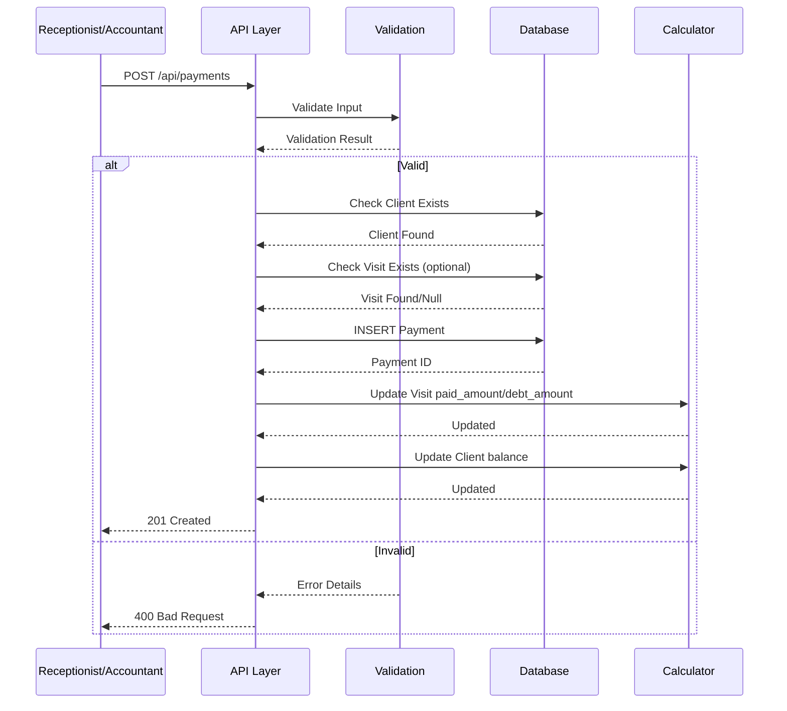
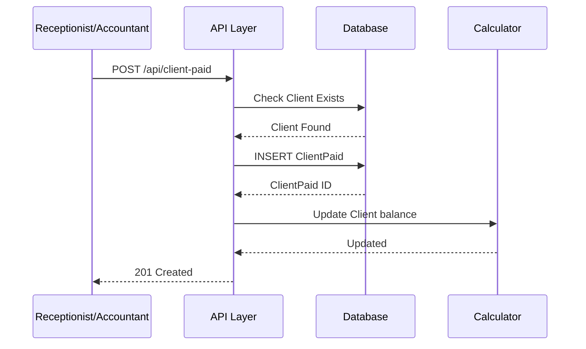
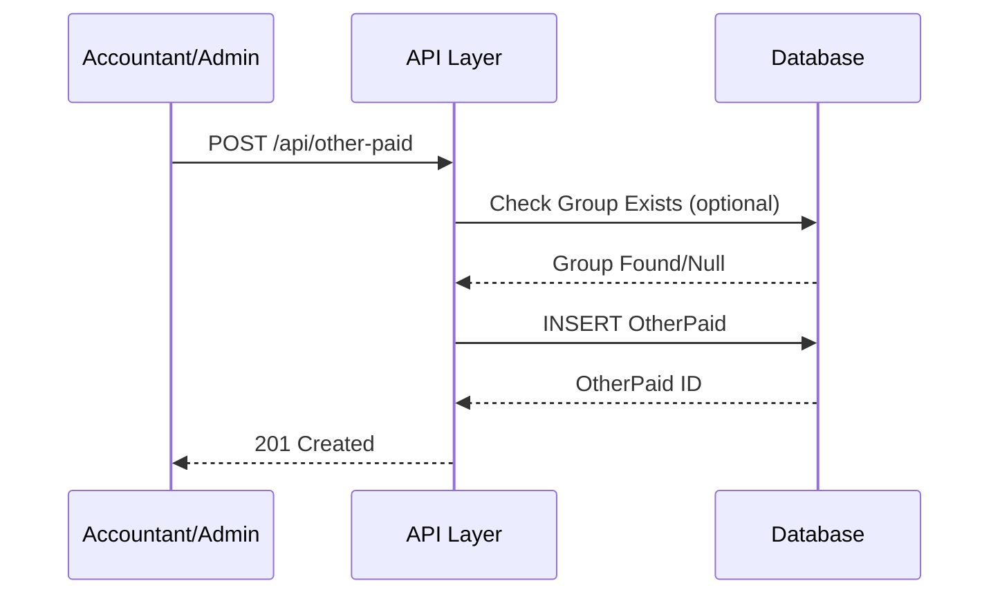
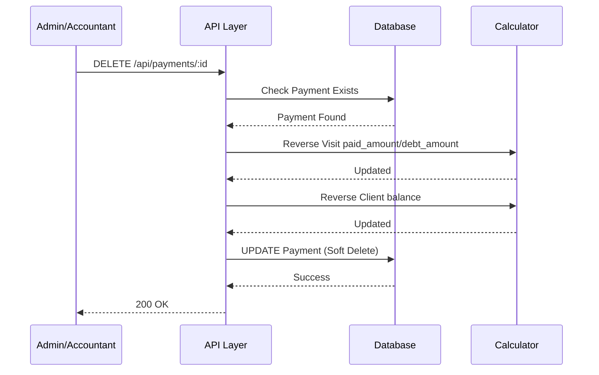

# 📄 FAYL: `14-payment-management.md`

# 14. To'lovlar Boshqaruvi (Payment Management)

## 📋 UMUMIY MA'LUMOT

| Maydon | Qiymat |
|--------|--------|
| **Flow ID** | 14 |
| **Phase** | 2B - Finance |
| **Model** | `Payment`, `ClientPaid`, `OtherPaid`, `OtherPaidGroup` |
| **Status** | Draft |
| **Yaratilgan Sana** | 2024-01-15 |
| **Oxirgi Yangilanish** | 2024-01-15 |
| **Mas'ul** | Senior Backend Developer |
| **Bog'liq Modellar** | `Client` (RFC-009), `Visit` (RFC-013), `User` (RFC-002) |

---

## 🎯 MAQSAD

Klinikaga kelib tushadigan to'lovlarni (kirim) va chiqimlarni boshqarish. Mijozlardan olingan to'lovlarni, oldindan to'lovlarni, boshqa kirim/chiqimlarni hisobga olish va moliyaviy hisobotlar uchun asos yaratish. Har bir to'lovni Visit, Client va User bilan bog'lash va Client balance ni avtomatik yangilash (Reference: `Klinika.md` 3.5, 4.2).

---

## 👥 MAS'UL ROLLAR

| Rol | Create | Read | Update | Delete | Tavsif |
|-----|--------|------|--------|--------|--------|
| **Admin** | ✅ | ✅ | ✅ | ✅ | To'liq huquq - barcha operatsiyalar |
| **Doctor** | ❌ | ✅ | ❌ | ❌ | Faqat ko'rish (o'z visitlari to'lovlari) |
| **Nurse** | ❌ | ✅ | ❌ | ❌ | Faqat ko'rish |
| **Receptionist** | ✅ | ✅ | ✅ | ❌ | To'lov qabul qilish va qaytarish |
| **Accountant** | ✅ | ✅ | ✅ | ✅ | Moliyaviy operatsiyalar boshqaruvi |

---

## 📊 PRISMA MODEL (Reference: `klinika_prisma.txt`)

### Payment Model Schema

```prisma
model Payment {
  id           Int         @id @default(autoincrement())
  client_id    Int?        @map("client_id")
  user_id      Int?        @map("user_id")
  visit_id     Int?        @map("visit_id")
  amount       Decimal     @default(0) @db.Decimal(15, 2)
  payment_type PaymentType @default(INCOME) @map("payment_type")
  description  String?     @db.Text
  payment_date Timestamptz @default(now()) @map("payment_date")
  created_at   Timestamptz @default(now())
  updated_at   Timestamptz @updatedAt
  deleted_at   Timestamptz?
  registered_by Int?       @map("registered_by")
  modified_by  Int?        @map("modified_by")

  // Relations
  client       Client?     @relation("fk_payment_client", fields: [client_id], references: [id], onDelete: SetNull, onUpdate: Cascade)
  user         User?       @relation("fk_payment_user", fields: [user_id], references: [id], onDelete: SetNull, onUpdate: Cascade)
  visit        Visit?      @relation("fk_payment_visit", fields: [visit_id], references: [id], onDelete: SetNull, onUpdate: Cascade)
  register_user User?      @relation("fk_payment_registered_by", fields: [registered_by], references: [id], onDelete: SetNull, onUpdate: Cascade)
  modify_user  User?       @relation("fk_payment_modified_by", fields: [modified_by], references: [id], onDelete: SetNull, onUpdate: Cascade)

  @@index([client_id])
  @@index([user_id])
  @@index([visit_id])
  @@index([payment_type])
  @@index([payment_date])
  @@index([deleted_at])
  @@index([client_id, payment_date])
  @@index([payment_type, payment_date])
  @@index([payment_date, deleted_at])
  @@map("payments")
}
```

### ClientPaid Model Schema

```prisma
model ClientPaid {
  id           Int         @id @default(autoincrement())
  client_id    Int?        @map("client_id")
  visit_id     Int?        @map("visit_id")
  amount       Decimal     @default(0) @db.Decimal(15, 2)
  description  String?     @db.Text
  payment_date Timestamptz @default(now()) @map("payment_date")
  created_at   Timestamptz @default(now())
  updated_at   Timestamptz @updatedAt
  deleted_at   Timestamptz?
  registered_by Int?       @map("registered_by")
  modified_by  Int?        @map("modified_by")

  // Relations
  client       Client?     @relation("fk_client_paid_client", fields: [client_id], references: [id], onDelete: SetNull, onUpdate: Cascade)
  visit        Visit?      @relation("fk_client_paid_visit", fields: [visit_id], references: [id], onDelete: SetNull, onUpdate: Cascade)
  register_user User?      @relation("fk_client_paid_registered_by", fields: [registered_by], references: [id], onDelete: SetNull, onUpdate: Cascade)
  modify_user  User?       @relation("fk_client_paid_modified_by", fields: [modified_by], references: [id], onDelete: SetNull, onUpdate: Cascade)

  @@index([client_id])
  @@index([visit_id])
  @@index([payment_date])
  @@index([deleted_at])
  @@index([client_id, payment_date])
  @@index([visit_id, payment_date])
  @@map("client_paid")
}
```

### OtherPaid Model Schema

```prisma
model OtherPaid {
  id           Int          @id @default(autoincrement())
  group_id     Int?         @map("group_id")
  type         PaymentType
  amount       Decimal      @default(0) @db.Decimal(15, 2)
  description  String?      @db.Text
  payment_date Timestamptz  @default(now()) @map("payment_date")
  created_at   Timestamptz  @default(now())
  updated_at   Timestamptz  @updatedAt
  deleted_at   Timestamptz?
  registered_by Int?        @map("registered_by")
  modified_by  Int?         @map("modified_by")

  // Relations
  group        OtherPaidGroup? @relation("fk_other_paid_group", fields: [group_id], references: [id], onDelete: SetNull, onUpdate: Cascade)
  register_user User?        @relation("fk_other_paid_registered_by", fields: [registered_by], references: [id], onDelete: SetNull, onUpdate: Cascade)
  modify_user  User?         @relation("fk_other_paid_modified_by", fields: [modified_by], references: [id], onDelete: SetNull, onUpdate: Cascade)

  @@index([group_id])
  @@index([type])
  @@index([payment_date])
  @@index([deleted_at])
  @@index([type, payment_date])
  @@map("other_paid")
}
```

### OtherPaidGroup Model Schema

```prisma
model OtherPaidGroup {
  id           Int          @id @default(autoincrement())
  name         String       @db.VarChar(100)
  description  String?      @db.Text
  status       RecordStatus @default(ACTIVE)
  created_at   Timestamptz  @default(now())
  updated_at   Timestamptz  @updatedAt
  deleted_at   Timestamptz?
  registered_by Int?        @map("registered_by")
  modified_by  Int?         @map("modified_by")

  // Relations
  register_user User?       @relation("fk_other_paid_group_registered_by", fields: [registered_by], references: [id], onDelete: SetNull, onUpdate: Cascade)
  modify_user   User?       @relation("fk_other_paid_group_modified_by", fields: [modified_by], references: [id], onDelete: SetNull, onUpdate: Cascade)

  other_paid   OtherPaid[]  @relation("fk_other_paid_group")

  @@index([status])
  @@index([name])
  @@index([deleted_at])
  @@map("other_paid_groups")
}
```

### PaymentType Enum (Reference: `klinika_prisma.txt`)

```prisma
enum PaymentType {
  INCOME   // ✅ Kirim (Mijozdan to'lov)
  OUTCOME  // 💸 Chiqim (Xarajatlar)
}
```

| Type | Tavsif | Misol |
|------|--------|-------|
| `INCOME` | Klinikaga kelib tushadigan mablag'lar | Mijoz to'lovi, oldindan to'lov |
| `OUTCOME` | Klinikadan chiqadigan mablag'lar | Xodim maoshi, kommunal to'lovlar, ijaralar |

---

## 🔄 FLOW DIAGRAM

### 1. Payment Yaratish Flow (Mijozdan to'lov qabul qilish)



### 2. ClientPaid Yaratish Flow (Oldindan to'lov)



### 3. OtherPaid Yaratish Flow (Boshqa kirim/chiqim)



### 4. To'lov Bekor Qilish Flow (Refund)



---

## 📝 BOSQICHMA-BOSQICH JARAYON

### BOSQICH 1: Payment Yaratish (Mijozdan to'lov)

#### 1.1. Input Ma'lumotlari

```typescript
interface CreatePaymentDto {
  client_id: number;      // Mavjud Client ID
  visit_id?: number;      // Mavjud Visit ID (optional)
  amount: number;         // To'lov summasi (musbat)
  payment_type?: string;  // INCOME/OUTCOME (default: INCOME)
  payment_date?: Date;    // To'lov sanasi (default: now)
  description?: string;   // To'lov tavsifi
}
```

#### 1.2. Validatsiya Qoidalari

```typescript
// Amount validatsiya
{
  type: 'decimal',
  precision: 15,
  scale: 2,
  min: 1,  // Musbat son bo'lishi kerak
  required: true
}

// Client validatsiya
{
  type: 'number',
  mustExist: true,  // Client jadvalida mavjud bo'lishi kerak
  required: true
}

// Visit validatsiya
{
  type: 'number',
  mustExist: true,  // Agar kiritilgan bo'lsa, Visit jadvalida mavjud bo'lishi kerak
  required: false
}

// Payment Type validatsiya
{
  enum: ['INCOME', 'OUTCOME'],
  default: 'INCOME',
  required: false
}

// Payment Date validatsiya
{
  type: 'date',
  max: new Date(),  // Kelajak sana bo'lmasligi kerak
  required: false,
  default: now()
}
```

#### 1.3. Biznes Logika

```typescript
// payment.service.ts
async create(createPaymentDto: CreatePaymentDto, userId: number): Promise<Payment> {
  // 1. Client mavjudligini tekshirish
  const client = await this.prisma.client.findUnique({
    where: { id: createPaymentDto.client_id }
  });

  if (!client || client.deleted_at) {
    throw new NotFoundException('PAY_001');
  }

  // 2. Visit mavjudligini tekshirish (agar kiritilgan bo'lsa)
  if (createPaymentDto.visit_id) {
    const visit = await this.prisma.visit.findUnique({
      where: { id: createPaymentDto.visit_id }
    });

    if (!visit || visit.deleted_at) {
      throw new NotFoundException('PAY_002');
    }

    // 3. Visit client_id bilan Payment client_id mosligini tekshirish
    if (visit.client_id !== createPaymentDto.client_id) {
      throw new BadRequestException('PAY_003');
    }

    // 4. To'lov summasi visit debt_amount dan oshmasligi kerak (INCOME uchun)
    if (createPaymentDto.payment_type === 'INCOME') {
      if (createPaymentDto.amount > visit.debt_amount) {
        throw new BadRequestException('PAY_004');
      }
    }
  }

  // 5. Amount validatsiya (musbat son)
  if (createPaymentDto.amount <= 0) {
    throw new BadRequestException('PAY_005');
  }

  // 6. Payment yaratish
  const payment = await this.prisma.payment.create({
     {
      client_id: createPaymentDto.client_id,
      visit_id: createPaymentDto.visit_id,
      user_id: userId,
      amount: createPaymentDto.amount,
      payment_type: createPaymentDto.payment_type || 'INCOME',
      payment_date: createPaymentDto.payment_date || new Date(),
      description: createPaymentDto.description,
      created_at: new Date(),
      updated_at: new Date(),
      registered_by: userId
    },
    include: {
      client: { select: { id: true, full_name: true, balance: true } },
      visit: { select: { id: true, total_amount: true, paid_amount: true, debt_amount: true } }
    }
  });

  // 7. Agar visit_id bo'lsa, Visit miqdorlarini yangilash
  if (createPaymentDto.visit_id && createPaymentDto.payment_type === 'INCOME') {
    await this.updateVisitAmounts(createPaymentDto.visit_id);
  }

  // 8. Client balance ni yangilash
  await this.updateClientBalance(createPaymentDto.client_id);

  return payment;
}

// Visit miqdorlarini yangilash
private async updateVisitAmounts(visitId: number): Promise<void> {
  // Barcha Payment yozuvlarini yig'ish
  const payments = await this.prisma.payment.aggregate({
    where: { visit_id: visitId, deleted_at: null, payment_type: 'INCOME' },
    _sum: { amount: true }
  });

  // Barcha VisitService yozuvlarini yig'ish
  const services = await this.prisma.visitService.aggregate({
    where: { visit_id: visitId, deleted_at: null },
    _sum: { total: true }
  });

  const total_amount = services._sum.total || 0;
  const paid_amount = payments._sum.amount || 0;
  const debt_amount = total_amount - paid_amount;

  // Visit yangilash
  await this.prisma.visit.update({
    where: { id: visitId },
     {
      total_amount,
      paid_amount,
      debt_amount,
      updated_at: new Date()
    }
  });

  // Agar to'liq to'langan bo'lsa, Visit status DONE ga o'zgartirish
  if (debt_amount <= 0) {
    const visit = await this.prisma.visit.findUnique({
      where: { id: visitId }
    });

    if (visit && visit.status === 'COMPLETED') {
      await this.prisma.visit.update({
        where: { id: visitId },
         {
          status: 'DONE',
          updated_at: new Date()
        }
      });
    }
  }
}

// Client balance ni yangilash
private async updateClientBalance(clientId: number): Promise<void> {
  // Barcha visitlarning debt_amount yig'indisi
  const visits = await this.prisma.visit.aggregate({
    where: { client_id: clientId, deleted_at: null },
    _sum: { debt_amount: true }
  });

  // Barcha ClientPaid yozuvlarining amount yig'indisi
  const clientPaid = await this.prisma.clientPaid.aggregate({
    where: { client_id: clientId, deleted_at: null },
    _sum: { amount: true }
  });

  // Barcha Payment (INCOME) yozuvlarining amount yig'indisi
  const payments = await this.prisma.payment.aggregate({
    where: { client_id: clientId, deleted_at: null, payment_type: 'INCOME' },
    _sum: { amount: true }
  });

  const totalDebt = visits._sum.debt_amount || 0;
  const totalPrepaid = clientPaid._sum.amount || 0;
  const totalPaid = payments._sum.amount || 0;
  const balance = (totalPrepaid + totalPaid) - totalDebt;

  // Client yangilash
  await this.prisma.client.update({
    where: { id: clientId },
     {
      balance,
      updated_at: new Date()
    }
  });
}
```

#### 1.4. Database Query

```prisma
-- Payment yaratish
INSERT INTO payments (
  client_id,
  visit_id,
  user_id,
  amount,
  payment_type,
  payment_date,
  description,
  created_at,
  updated_at,
  registered_by
) VALUES (
  1,
  1,
  2,
  250000,
  'INCOME',
  NOW(),
  'Naqd to''lov',
  NOW(),
  NOW(),
  2
);

-- Visit paid_amount va debt_amount yangilash
UPDATE visits
SET 
  paid_amount = (SELECT COALESCE(SUM(amount), 0) FROM payments WHERE visit_id = 1 AND deleted_at IS NULL AND payment_type = 'INCOME'),
  debt_amount = total_amount - paid_amount,
  updated_at = NOW()
WHERE id = 1;

-- Client balance yangilash
UPDATE clients
SET 
  balance = (
    (SELECT COALESCE(SUM(amount), 0) FROM client_paid WHERE client_id = 1 AND deleted_at IS NULL) +
    (SELECT COALESCE(SUM(amount), 0) FROM payments WHERE client_id = 1 AND deleted_at IS NULL AND payment_type = 'INCOME') -
    (SELECT COALESCE(SUM(debt_amount), 0) FROM visits WHERE client_id = 1 AND deleted_at IS NULL)
  ),
  updated_at = NOW()
WHERE id = 1;
```

---

### BOSQICH 2: ClientPaid Yaratish (Oldindan to'lov)

#### 2.1. Input Ma'lumotlari

```typescript
interface CreateClientPaidDto {
  client_id: number;      // Mavjud Client ID
  visit_id?: number;      // Mavjud Visit ID (optional - qaysi visit uchun)
  amount: number;         // To'lov summasi (musbat)
  payment_date?: Date;    // To'lov sanasi (default: now)
  description?: string;   // To'lov tavsifi
}
```

#### 2.2. Biznes Logika

```typescript
async createClientPaid(createClientPaidDto: CreateClientPaidDto, userId: number): Promise<ClientPaid> {
  // 1. Client mavjudligini tekshirish
  const client = await this.prisma.client.findUnique({
    where: { id: createClientPaidDto.client_id }
  });

  if (!client || client.deleted_at) {
    throw new NotFoundException('PAY_001');
  }

  // 2. Visit mavjudligini tekshirish (agar kiritilgan bo'lsa)
  if (createClientPaidDto.visit_id) {
    const visit = await this.prisma.visit.findUnique({
      where: { id: createClientPaidDto.visit_id }
    });

    if (!visit || visit.deleted_at) {
      throw new NotFoundException('PAY_002');
    }

    // 3. Visit client_id bilan ClientPaid client_id mosligini tekshirish
    if (visit.client_id !== createClientPaidDto.client_id) {
      throw new BadRequestException('PAY_003');
    }
  }

  // 4. Amount validatsiya (musbat son)
  if (createClientPaidDto.amount <= 0) {
    throw new BadRequestException('PAY_005');
  }

  // 5. ClientPaid yaratish
  const clientPaid = await this.prisma.clientPaid.create({
     {
      client_id: createClientPaidDto.client_id,
      visit_id: createClientPaidDto.visit_id,
      amount: createClientPaidDto.amount,
      payment_date: createClientPaidDto.payment_date || new Date(),
      description: createClientPaidDto.description,
      created_at: new Date(),
      updated_at: new Date(),
      registered_by: userId
    },
    include: {
      client: { select: { id: true, full_name: true, balance: true } }
    }
  });

  // 6. Client balance ni yangilash
  await this.updateClientBalance(createClientPaidDto.client_id);

  return clientPaid;
}
```

---

### BOSQICH 3: OtherPaid Yaratish (Boshqa kirim/chiqim)

#### 3.1. Input Ma'lumotlari

```typescript
interface CreateOtherPaidDto {
  group_id?: number;      // Mavjud OtherPaidGroup ID
  type: PaymentType;      // INCOME/OUTCOME
  amount: number;         // Summa (musbat)
  payment_date?: Date;    // To'lov sanasi (default: now)
  description?: string;   // To'lov tavsifi
}
```

#### 3.2. Biznes Logika

```typescript
async createOtherPaid(createOtherPaidDto: CreateOtherPaidDto, userId: number): Promise<OtherPaid> {
  // 1. Group mavjudligini tekshirish (agar kiritilgan bo'lsa)
  if (createOtherPaidDto.group_id) {
    const group = await this.prisma.otherPaidGroup.findUnique({
      where: { id: createOtherPaidDto.group_id }
    });

    if (!group || group.deleted_at) {
      throw new NotFoundException('PAY_006');
    }
  }

  // 2. Amount validatsiya (musbat son)
  if (createOtherPaidDto.amount <= 0) {
    throw new BadRequestException('PAY_005');
  }

  // 3. OtherPaid yaratish
  const otherPaid = await this.prisma.otherPaid.create({
     {
      group_id: createOtherPaidDto.group_id,
      type: createOtherPaidDto.type,
      amount: createOtherPaidDto.amount,
      payment_date: createOtherPaidDto.payment_date || new Date(),
      description: createOtherPaidDto.description,
      created_at: new Date(),
      updated_at: new Date(),
      registered_by: userId
    },
    include: {
      group: { select: { id: true, name: true } }
    }
  });

  return otherPaid;
}
```

---

### BOSQICH 4: To'lov Bekor Qilish (Refund)

#### 4.1. Biznes Logika

```typescript
async refund(paymentId: number, userId: number): Promise<Payment> {
  // 1. Payment mavjudligini tekshirish
  const payment = await this.prisma.payment.findUnique({
    where: { id: paymentId }
  });

  if (!payment || payment.deleted_at) {
    throw new NotFoundException('PAY_007');
  }

  // 2. Faqat Admin yoki Accountant refund qilish huquqiga ega
  // (Role check middleware orqali amalga oshiriladi)

  // 3. Agar visit_id bo'lsa, Visit miqdorlarini qayta hisoblash
  if (payment.visit_id && payment.payment_type === 'INCOME') {
    await this.updateVisitAmounts(payment.visit_id);
  }

  // 4. Client balance ni qayta hisoblash
  if (payment.client_id) {
    await this.updateClientBalance(payment.client_id);
  }

  // 5. Soft Delete
  const refunded = await this.prisma.payment.update({
    where: { id: paymentId },
     {
      deleted_at: new Date(),
      modified_by: userId,
      updated_at: new Date()
    }
  });

  return refunded;
}
```

---

## 🔌 API ENDPOINT'LAR

### 1. Payment Yaratish

| Parametr | Qiymat |
|----------|--------|
| **Method** | POST |
| **Endpoint** | `/api/v1/payments` |
| **Auth** | ✅ JWT Required |
| **Rol** | Admin, Receptionist, Accountant |
| **Content-Type** | application/json |

**Request Body:**
```json
{
  "client_id": 1,
  "visit_id": 1,
  "amount": 250000,
  "payment_type": "INCOME",
  "payment_date": "2024-01-15T12:00:00.000Z",
  "description": "Naqd to'lov"
}
```

**Response (201 Created):**
```json
{
  "success": true,
  "message": "To'lov muvaffaqiyatli yaratildi",
  "data": {
    "id": 1,
    "client": { "id": 1, "full_name": "John Doe", "balance": 0 },
    "visit": { "id": 1, "total_amount": 250000, "paid_amount": 250000, "debt_amount": 0 },
    "amount": 250000,
    "payment_type": "INCOME",
    "payment_date": "2024-01-15T12:00:00.000Z",
    "description": "Naqd to'lov",
    "created_at": "2024-01-15T12:00:00.000Z"
  }
}
```

---

### 2. Payment Ro'yxatini Olish

| Parametr | Qiymat |
|----------|--------|
| **Method** | GET |
| **Endpoint** | `/api/v1/payments` |
| **Auth** | ✅ JWT Required |
| **Rol** | Barchasi |

**Query Params:**
```
GET /api/v1/payments?page=1&limit=20&client_id=1&payment_type=INCOME&date_from=2024-01-01&date_to=2024-01-31
```

**Response (200 OK):**
```json
{
  "success": true,
  "data": [
    {
      "id": 1,
      "client": { "id": 1, "full_name": "John Doe" },
      "visit": { "id": 1, "total_amount": 250000 },
      "amount": 250000,
      "payment_type": "INCOME",
      "payment_date": "2024-01-15T12:00:00.000Z",
      "description": "Naqd to'lov"
    },
    {
      "id": 2,
      "client": { "id": 2, "full_name": "Jane Smith" },
      "visit": null,
      "amount": 100000,
      "payment_type": "INCOME",
      "payment_date": "2024-01-16T10:00:00.000Z",
      "description": "Oldindan to'lov"
    }
  ],
  "pagination": {
    "page": 1,
    "limit": 20,
    "total": 100,
    "totalPages": 5,
    "hasNextPage": true,
    "hasPrevPage": false
  }
}
```

---

### 3. ClientPaid Yaratish

| Parametr | Qiymat |
|----------|--------|
| **Method** | POST |
| **Endpoint** | `/api/v1/client-paid` |
| **Auth** | ✅ JWT Required |
| **Rol** | Admin, Receptionist, Accountant |

**Request Body:**
```json
{
  "client_id": 1,
  "visit_id": null,
  "amount": 100000,
  "payment_date": "2024-01-15T10:00:00.000Z",
  "description": "Oldindan to'lov"
}
```

**Response (201 Created):**
```json
{
  "success": true,
  "message": "Oldindan to'lov muvaffaqiyatli yaratildi",
  "data": {
    "id": 1,
    "client": { "id": 1, "full_name": "John Doe", "balance": 100000 },
    "amount": 100000,
    "payment_date": "2024-01-15T10:00:00.000Z",
    "description": "Oldindan to'lov"
  }
}
```

---

### 4. OtherPaid Yaratish

| Parametr | Qiymat |
|----------|--------|
| **Method** | POST |
| **Endpoint** | `/api/v1/other-paid` |
| **Auth** | ✅ JWT Required |
| **Rol** | Admin, Accountant |

**Request Body:**
```json
{
  "group_id": 1,
  "type": "OUTCOME",
  "amount": 500000,
  "payment_date": "2024-01-15T10:00:00.000Z",
  "description": "Xodim maoshi"
}
```

**Response (201 Created):**
```json
{
  "success": true,
  "message": "Boshqa to'lov muvaffaqiyatli yaratildi",
  "data": {
    "id": 1,
    "group": { "id": 1, "name": "Maoshlar" },
    "type": "OUTCOME",
    "amount": 500000,
    "payment_date": "2024-01-15T10:00:00.000Z",
    "description": "Xodim maoshi"
  }
}
```

---

### 5. OtherPaidGroup Yaratish

| Parametr | Qiymat |
|----------|--------|
| **Method** | POST |
| **Endpoint** | `/api/v1/other-paid-groups` |
| **Auth** | ✅ JWT Required |
| **Rol** | Admin, Accountant |

**Request Body:**
```json
{
  "name": "Maoshlar",
  "description": "Xodimlarga to'lanadigan maoshlar",
  "status": "ACTIVE"
}
```

**Response (201 Created):**
```json
{
  "success": true,
  "message": "To'lov guruhi muvaffaqiyatli yaratildi",
  "data": {
    "id": 1,
    "name": "Maoshlar",
    "description": "Xodimlarga to'lanadigan maoshlar",
    "status": "ACTIVE"
  }
}
```

---

### 6. Payment Bekor Qilish (Refund)

| Parametr | Qiymat |
|----------|--------|
| **Method** | DELETE |
| **Endpoint** | `/api/v1/payments/:id` |
| **Auth** | ✅ JWT Required |
| **Rol** | Admin, Accountant |

**Response (200 OK):**
```json
{
  "success": true,
  "message": "To'lov muvaffaqiyatli bekor qilindi",
  "data": {
    "id": 1,
    "amount": 250000,
    "deleted_at": "2024-01-15T14:00:00.000Z"
  }
}
```

---

### 7. Moliyaviy Hisobot (Summary)

| Parametr | Qiymat |
|----------|--------|
| **Method** | GET |
| **Endpoint** | `/api/v1/payments/summary` |
| **Auth** | ✅ JWT Required |
| **Rol** | Admin, Accountant |

**Query Params:**
```
GET /api/v1/payments/summary?date_from=2024-01-01&date_to=2024-01-31
```

**Response (200 OK):**
```json
{
  "success": true,
  "data": {
    "period": {
      "from": "2024-01-01",
      "to": "2024-01-31"
    },
    "income": {
      "total": 5000000,
      "count": 50
    },
    "outcome": {
      "total": 2000000,
      "count": 20
    },
    "balance": 3000000,
    "by_type": {
      "payment": { "income": 4000000, "outcome": 0 },
      "client_paid": { "income": 1000000, "outcome": 0 },
      "other_paid": { "income": 0, "outcome": 2000000 }
    }
  }
}
```

---

## ⚠️ XATOLIKLAR VA HANDLING

| Kod | HTTP Status | Xabar | Sabab | Yechim |
|-----|-------------|-------|-------|--------|
| `PAY_001` | 404 Not Found | Mijoz topilmadi | Client ID not exists | Client ID ni tekshiring |
| `PAY_002` | 404 Not Found | Visit topilmadi | Visit ID not exists | Visit ID ni tekshiring |
| `PAY_003` | 400 Bad Request | Mijoz va Visit mos kelmadi | client_id mismatch | Client va Visit mosligini tekshiring |
| `PAY_004` | 400 Bad Request | To'lov summasi qarzdan oshiq | amount > debt_amount | Summa tekshirilsin |
| `PAY_005` | 400 Bad Request | Summa noto'g'ri | amount <= 0 | Musbat son kiriting |
| `PAY_006` | 404 Not Found | To'lov guruhi topilmadi | OtherPaidGroup ID not exists | Group ID ni tekshiring |
| `PAY_007` | 404 Not Found | To'lov topilmadi | Payment ID not exists | Payment ID ni tekshiring |
| `PAY_008` | 403 Forbidden | Ruxsat yo'q | Insufficient permissions | Rol tekshirilsin (Reference: `Klinika.md` 6.1) |
| `PAY_009` | 400 Bad Request | Payment type noto'g'ri | Validation failed | INCOME/OUTCOME |
| `PAY_010` | 400 Bad Request | Sana noto'g'ri | Date format yoki kelajak sana | Date format tekshirilsin |

---

## 📦 SEED DATA

```typescript
// seed/payment.seed.ts
export async function seedPayments(prisma: PrismaClient) {
  // OtherPaidGroup yaratish
  const groups = [
    { name: 'Maoshlar', description: 'Xodimlarga to''lanadigan maoshlar' },
    { name: 'Kommunal to''lovlar', description: 'Elektr, suv, gaz' },
    { name: 'Ijara', description: 'Bino ijarasi' },
    { name: 'Soliqlar', description: 'Davlat soliq to''lovlari' },
    { name: 'Boshqa', description: 'Boshqa xarajatlar' }
  ];

  for (const group of groups) {
    await prisma.otherPaidGroup.create({  group });
  }

  // Test Payment yaratish
  const payments = [
    {
      client_id: 1,
      visit_id: 1,
      amount: 250000,
      payment_type: 'INCOME' as const,
      description: 'Naqd to''lov',
      payment_date: new Date('2024-01-15T12:00:00Z')
    },
    {
      client_id: 2,
      visit_id: null,
      amount: 100000,
      payment_type: 'INCOME' as const,
      description: 'Oldindan to''lov',
      payment_date: new Date('2024-01-16T10:00:00Z')
    }
  ];

  for (const payment of payments) {
    await prisma.payment.create({  payment });
  }

  // Test ClientPaid yaratish
  const clientPaid = [
    {
      client_id: 1,
      visit_id: null,
      amount: 50000,
      description: 'Depozit',
      payment_date: new Date('2024-01-10T10:00:00Z')
    }
  ];

  for (const paid of clientPaid) {
    await prisma.clientPaid.create({  paid });
  }

  // Test OtherPaid yaratish
  const otherPaid = [
    {
      group_id: 1,
      type: 'OUTCOME' as const,
      amount: 500000,
      description: 'Yanvar oyi maoshi',
      payment_date: new Date('2024-01-31T10:00:00Z')
    },
    {
      group_id: 2,
      type: 'OUTCOME' as const,
      amount: 200000,
      description: 'Elektr energiyasi',
      payment_date: new Date('2024-01-25T10:00:00Z')
    }
  ];

  for (const paid of otherPaid) {
    await prisma.otherPaid.create({  paid });
  }

  console.log('✅ Payments seeded successfully');
}
```

### Seed Script Ishga Tushirish

```bash
# Development
npm run seed

# Production (ehtiyotkorlik bilan)
npm run seed:prod

# Faqat to'lovlar
npm run seed:payments
```

---

## 🔐 XAVFSIZLIK TALABLARI (Reference: `Klinika.md` 8)

### 1. Autentifikatsiya
- ✅ Barcha endpoint'lar JWT token talab qiladi
- ✅ Token expiry: 24 soat

### 2. Avtorizatsiya (RBAC) (Reference: `Klinika.md` 6.1)

| Endpoint | Admin | Doctor | Nurse | Receptionist | Accountant |
|----------|-------|--------|-------|--------------|------------|
| POST /payments | ✅ | ❌ | ❌ | ✅ | ✅ |
| GET /payments | ✅ | ✅ | ✅ | ✅ | ✅ |
| DELETE /payments/:id | ✅ | ❌ | ❌ | ❌ | ✅ |
| POST /client-paid | ✅ | ❌ | ❌ | ✅ | ✅ |
| GET /client-paid | ✅ | ✅ | ✅ | ✅ | ✅ |
| POST /other-paid | ✅ | ❌ | ❌ | ❌ | ✅ |
| GET /other-paid | ✅ | ❌ | ❌ | ❌ | ✅ |
| POST /other-paid-groups | ✅ | ❌ | ❌ | ❌ | ✅ |
| GET /payments/summary | ✅ | ❌ | ❌ | ❌ | ✅ |

### 3. Audit (Reference: `Klinika.md` 5.2)
| Maydon | Tavsif | Avtomatik |
|--------|--------|-----------|
| `created_at` | Yaratilgan vaqt | ✅ Prisma @default(now()) |
| `updated_at` | Oxirgi o'zgarish | ✅ Prisma @updatedAt |
| `deleted_at` | Soft delete vaqti | ❌ Manual set |
| `registered_by` | Kim yaratdi (User ID) | ✅ Manual set |
| `modified_by` | Kim o'zgartirdi (User ID) | ✅ Manual set |

### 4. Moliyaviy Xavfsizlik (Reference: `Klinika.md` 8.1, 9.2)
- ✅ Barcha summalar Decimal(15,2) formatda
- ✅ To'lov miqdori musbat bo'lishi kerak
- ✅ Client balance avtomatik yangilanadi
- ✅ Moliyaviy operatsiyalar audit qilinadi
- ✅ Refund faqat Admin/Accountant tomonidan amalga oshiriladi
- ✅ Payment type (INCOME/OUTCOME) validatsiya qilinadi

---

## 📝 ESLATMALAR

1. **Payment vs ClientPaid** - Payment visitga bog'langan to'lov, ClientPaid oldindan to'lov (Reference: `Klinika.md` 3.5)
2. **Automatic Calculation** - total_amount, paid_amount, debt_amount, balance avtomatik hisoblanadi
3. **Soft Delete** - To'lov o'chirilganda `deleted_at` set bo'ladi, fizik delete qilinmaydi (Reference: `Klinika.md` 8.1)
4. **Cascade Rules** - Client/Visit o'chirilganda Payment/SetNull, ClientPaid/SetNull
5. **Balance Calculation** - Client balance = (ClientPaid + Payment INCOME) - Visit debt_amount
6. **Audit Trail** - Har bir o'zgarish qayd etiladi (registered_by, modified_by) (Reference: `Klinika.md` 5.2)
7. **Payment Type** - INCOME (kirim) yoki OUTCOME (chiqim) (Reference: `Klinika.md` 3.5)
8. **OtherPaidGroup** - Chiqimlarni kategoriyalash uchun (Maoshlar, Kommunal, Ijara, Soliqlar)
9. **Refund** - To'lovni bekor qilish faqat Admin/Accountant huquqiga ega
10. **Visit Status** - To'liq to'langan visit DONE statusga o'tadi

---

## ✅ QABUL QILISH MEZONLARI (ACCEPTANCE CRITERIA)

### Functional Requirements
- [ ] Payment yaratish mijoz bilan bog'lanishi
- [ ] Payment visitga bog'lanishi (optional)
- [ ] Payment type INCOME/OUTCOME qiymat qabul qilishi
- [ ] Payment summasi musbat bo'lishi
- [ ] Payment summasi visit debt_amount dan oshmasligi (INCOME uchun)
- [ ] ClientPaid yaratish mijoz bilan bog'lanishi
- [ ] ClientPaid visitga bog'lanishi (optional)
- [ ] OtherPaid yaratish guruh bilan bog'lanishi (optional)
- [ ] OtherPaid type INCOME/OUTCOME qiymat qabul qilishi
- [ ] OtherPaidGroup yaratish va boshqarish
- [ ] Visit miqdorlari avtomatik hisoblanadi (total/paid/debt)
- [ ] Client balance avtomatik yangilanadi
- [ ] To'liq to'langan visit DONE statusga o'tadi
- [ ] Soft delete ishlaydi (deleted_at set bo'ladi)
- [ ] Faqat Admin/Accountant refund qilish huquqiga ega
- [ ] Receptionist to'lov qabul qilish huquqiga ega
- [ ] Barcha rollar to'lov ro'yxatini ko'ra oladi
- [ ] Moliyaviy hisobot (summary) ishlaydi
- [ ] Pagination va filterlash ishlaydi
- [ ] Xatoliklar to'g'ri HTTP status va kod bilan qaytariladi
- [ ] Audit maydonlari (registered_by, modified_by) to'ldiriladi
- [ ] Cascade rules ishlaydi

### Non-Functional Requirements (Reference: `Klinika.md` 9.1)
- [ ] API response time < 200ms
- [ ] Database query time < 100ms
- [ ] Unit test coverage ≥ 90%
- [ ] E2E test coverage ≥ 70%
- [ ] Security audit o'tkazildi
- [ ] Documentation to'liq
- [ ] Concurrent users 50+ qo'llab-quvvatlanadi
- [ ] Data retention 5 yil
- [ ] Payment processing time < 100ms

---

**Hujjat Versiyasi:** 1.0
**Status:** Draft
**Tasdiqlagan:** _______________
**Sana:** _______________
