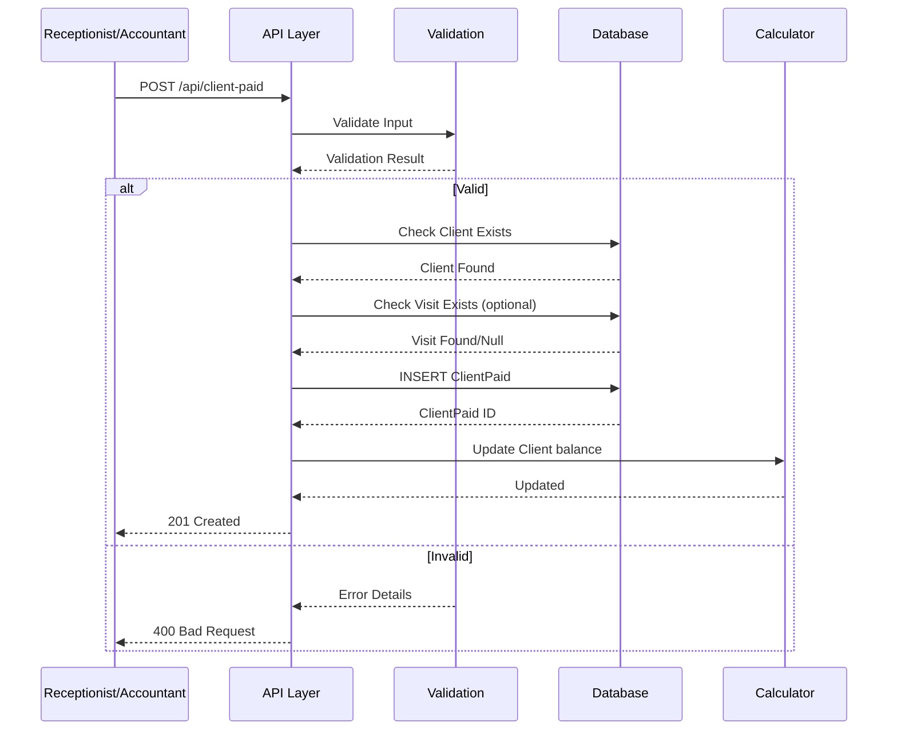
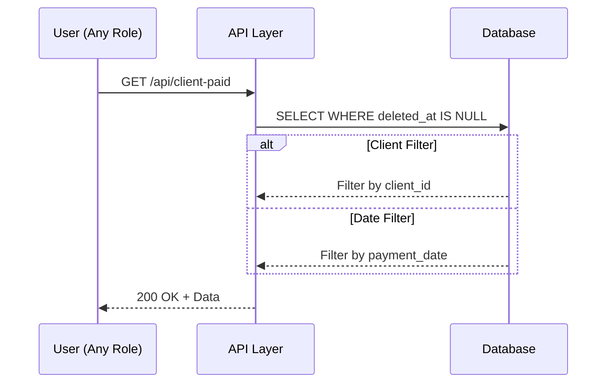
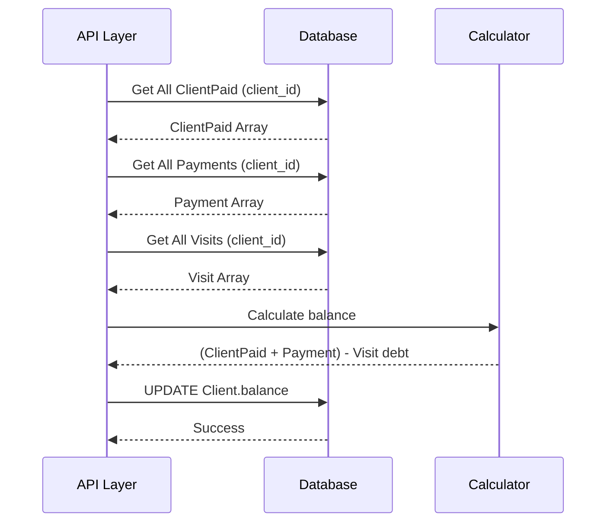
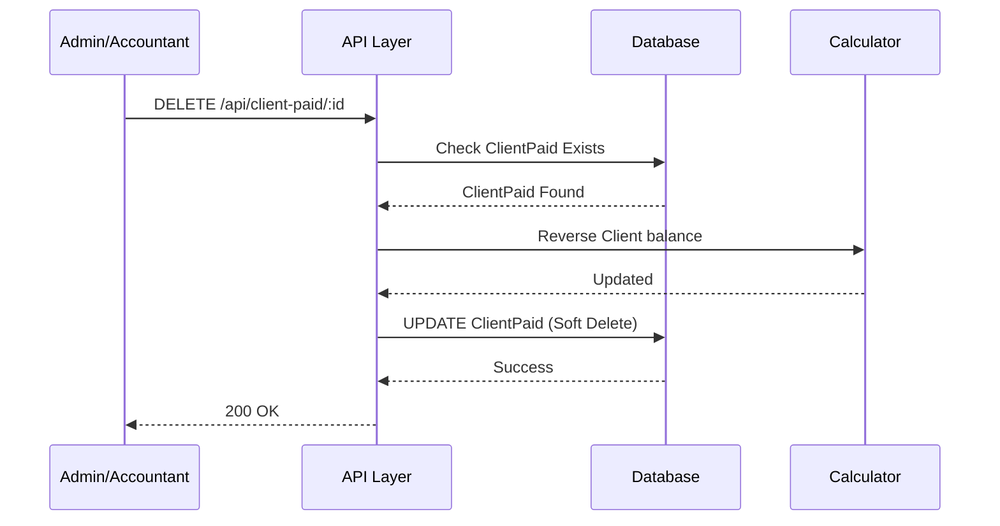

# 📄 FAYL: `15-client-paid-management.md`

# 15. Mijoz Oldindan To'lovlari Boshqaruvi (ClientPaid Management)

---

## 📋 UMUMIY MA'LUMOT

| Maydon | Qiymat |
|--------|--------|
| **Flow ID** | 15 |
| **Phase** | 2B - Finance |
| **Model** | `ClientPaid` |
| **Status** | Draft |
| **Yaratilgan Sana** | 2024-01-15 |
| **Oxirgi Yangilanish** | 2024-01-15 |
| **Mas'ul** | Senior Backend Developer |
| **Bog'liq Modellar** | `Client` (RFC-009), `Visit` (RFC-013), `User` (RFC-002) |

---

## 🎯 MAQSAD

Mijozlar tomonidan amalga oshirilgan oldindan to'lovlarni (depozit, avans) boshqarish. Mijoz balance ini avtomatik yangilash, oldindan to'lovlarni kelajakdagi visitlar uchun ishlatish imkoniyatini yaratish va moliyaviy hisobotlar uchun asos yaratish (Reference: `Klinika.md` 3.5, 4.2).

---

## 👥 MAS'UL ROLLAR

| Rol | Create | Read | Update | Delete | Tavsif |
|-----|--------|------|--------|--------|--------|
| **Admin** | ✅ | ✅ | ✅ | ✅ | To'liq huquq - barcha operatsiyalar |
| **Doctor** | ❌ | ✅ | ❌ | ❌ | Faqat ko'rish (o'z mijozlari oldindan to'lovlari) |
| **Nurse** | ❌ | ✅ | ❌ | ❌ | Faqat ko'rish |
| **Receptionist** | ✅ | ✅ | ✅ | ❌ | Oldindan to'lov qabul qilish va qaytarish |
| **Accountant** | ✅ | ✅ | ✅ | ✅ | Moliyaviy operatsiyalar boshqaruvi |

---

## 📊 PRISMA MODEL (Reference: `klinika_prisma.txt`)

### ClientPaid Model Schema

```prisma
model ClientPaid {
  id           Int         @id @default(autoincrement())
  client_id    Int?        @map("client_id")
  visit_id     Int?        @map("visit_id")
  amount       Decimal     @default(0) @db.Decimal(15, 2)
  description  String?     @db.Text
  payment_date Timestamptz @default(now()) @map("payment_date")
  created_at   Timestamptz @default(now())
  updated_at   Timestamptz @updatedAt
  deleted_at   Timestamptz?
  registered_by Int?       @map("registered_by")
  modified_by  Int?        @map("modified_by")

  // Relations
  client       Client?     @relation("fk_client_paid_client", fields: [client_id], references: [id], onDelete: SetNull, onUpdate: Cascade)
  visit        Visit?      @relation("fk_client_paid_visit", fields: [visit_id], references: [id], onDelete: SetNull, onUpdate: Cascade)
  register_user User?      @relation("fk_client_paid_registered_by", fields: [registered_by], references: [id], onDelete: SetNull, onUpdate: Cascade)
  modify_user  User?       @relation("fk_client_paid_modified_by", fields: [modified_by], references: [id], onDelete: SetNull, onUpdate: Cascade)

  @@index([client_id])
  @@index([visit_id])
  @@index([payment_date])
  @@index([deleted_at])
  @@index([client_id, payment_date])
  @@index([visit_id, payment_date])
  @@map("client_paid")
}
```

### Model Maydonlari Tafsiloti

| Maydon | Tip | Majburiy | Default | DB Tip | Izoh/Tavsif |
|--------|-----|----------|---------|--------|-------------|
| `id` | Int | ✅ | autoincrement | SERIAL | **Primary Key**. Unikal identifikator, avtomatik oshib boradi |
| `client_id` | Int | ✅ | - | INTEGER | **Foreign Key**. Client jadvaliga bog'lanish. Qaysi mijoz oldindan to'lov qilganligi (Reference: `Klinika.md` 3.2) |
| `visit_id` | Int | ❌ | null | INTEGER | **Foreign Key**. Visit jadvaliga bog'lanish. Qaysi visit uchun oldindan to'lov (optional - umumiy depozit bo'lishi mumkin) |
| `amount` | Decimal | ✅ | 0 | DECIMAL(15,2) | **To'lov summasi**. So'mda ifodalanadi. 2 kasr belgigacha. Moliyaviy hisob-kitob uchun muhim (Reference: `Klinika.md` 9.2) |
| `description` | String | ❌ | null | TEXT | **Qo'shimcha tavsif**. To'lov haqida qo'shimcha ma'lumot (to'lov turi, izoh va h.k.) |
| `payment_date` | Timestamptz | ✅ | now() | TIMESTAMPTZ | **To'lov sanasi**. Qachon to'lov amalga oshirilganligi. Hisobotlar uchun muhim |
| `created_at` | Timestamptz | ✅ | now() | TIMESTAMPTZ | **Yaratilgan vaqt**. Avtomatik to'ldiriladi, UTC timezone. Audit uchun (Reference: `Klinika.md` 5.2) |
| `updated_at` | Timestamptz | ✅ | now() | TIMESTAMPTZ | **Oxirgi o'zgarish**. Har bir update da avtomatik yangilanadi (Prisma @updatedAt) |
| `deleted_at` | Timestamptz | ❌ | null | TIMESTAMPTZ | **Soft Delete**. NULL = aktiv, qiymat bor = o'chirilgan. Fizik delete qilinmaydi (Reference: `Klinika.md` 8.1) |
| `registered_by` | Int | ❌ | null | INTEGER | **Foreign Key**. Kim yaratgan (User ID). SetNull cascade. Audit uchun (Reference: `Klinika.md` 5.2) |
| `modified_by` | Int | ❌ | null | INTEGER | **Foreign Key**. Kim oxirgi o'zgartirgan (User ID). SetNull cascade. Audit uchun |

### Indexlar (Reference: `klinika_prisma.txt`)

| Index | Maydon(lar) | Maqsad |
|-------|-------------|--------|
| `@@index([client_id])` | client_id | Mijoz bo'yicha filter qilishni tezlashtirish |
| `@@index([visit_id])` | visit_id | Visit bo'yicha filter qilishni tezlashtirish |
| `@@index([payment_date])` | payment_date | Sana bo'yicha filter/sort qilish (hisobotlar uchun muhim) |
| `@@index([deleted_at])` | deleted_at | Soft delete filter uchun |
| `@@index([client_id, payment_date])` | client_id, payment_date | Qo'shma index - mijoz va sana bo'yicha (mijoz tarixi uchun) |
| `@@index([visit_id, payment_date])` | visit_id, payment_date | Qo'shma index - visit va sana bo'yicha |

### Relation'lar

| Relation | Model | Type | onDelete | onUpdate | Tavsif |
|----------|-------|------|----------|----------|--------|
| `fk_client_paid_client` | Client | N:1 | SetNull | Cascade | Mijoz o'chirilganda clientPaid.client_id NULL ga o'zgaradi. Moliyaviy tarix saqlanadi |
| `fk_client_paid_visit` | Visit | N:1 | SetNull | Cascade | Visit o'chirilganda clientPaid.visit_id NULL ga o'zgaradi. Moliyaviy tarix saqlanadi |
| `fk_client_paid_registered_by` | User | N:1 | SetNull | Cascade | User o'chirilganda registered_by NULL ga o'zgaradi. Audit tarixi saqlanadi |
| `fk_client_paid_modified_by` | User | N:1 | SetNull | Cascade | User o'chirilganda modified_by NULL ga o'zgaradi. Audit tarixi saqlanadi |

---

## 🔄 FLOW DIAGRAM

### 1. ClientPaid Yaratish Flow (Oldindan to'lov qabul qilish)



### 2. ClientPaid Ro'yxatini Olish Flow



### 3. Client Balance Hisoblash Flow



### 4. ClientPaid Bekor Qilish Flow (Refund)



---

## 📝 BOSQICHMA-BOSQICH JARAYON

### BOSQICH 1: ClientPaid Yaratish (Oldindan to'lov)

#### 1.1. Input Ma'lumotlari

```typescript
interface CreateClientPaidDto {
  client_id: number;      // Mavjud Client ID
  visit_id?: number;      // Mavjud Visit ID (optional - qaysi visit uchun)
  amount: number;         // To'lov summasi (musbat)
  payment_date?: Date;    // To'lov sanasi (default: now)
  description?: string;   // To'lov tavsifi
}
```

#### 1.2. Validatsiya Qoidalari

```typescript
// Amount validatsiya
{
  type: 'decimal',
  precision: 15,
  scale: 2,
  min: 1,  // Musbat son bo'lishi kerak
  required: true
}

// Client validatsiya
{
  type: 'number',
  mustExist: true,  // Client jadvalida mavjud bo'lishi kerak
  required: true
}

// Visit validatsiya
{
  type: 'number',
  mustExist: true,  // Agar kiritilgan bo'lsa, Visit jadvalida mavjud bo'lishi kerak
  required: false
}

// Payment Date validatsiya
{
  type: 'date',
  max: new Date(),  // Kelajak sana bo'lmasligi kerak
  required: false,
  default: now()
}

// Description validatsiya
{
  minLength: 0,
  maxLength: 1000,
  required: false
}
```

#### 1.3. Biznes Logika

```typescript
// client-paid.service.ts
async create(createClientPaidDto: CreateClientPaidDto, userId: number): Promise<ClientPaid> {
  // 1. Client mavjudligini tekshirish
  const client = await this.prisma.client.findUnique({
    where: { id: createClientPaidDto.client_id }
  });

  if (!client || client.deleted_at) {
    throw new NotFoundException('CP_001');
  }

  // 2. Visit mavjudligini tekshirish (agar kiritilgan bo'lsa)
  if (createClientPaidDto.visit_id) {
    const visit = await this.prisma.visit.findUnique({
      where: { id: createClientPaidDto.visit_id }
    });

    if (!visit || visit.deleted_at) {
      throw new NotFoundException('CP_002');
    }

    // 3. Visit client_id bilan ClientPaid client_id mosligini tekshirish
    if (visit.client_id !== createClientPaidDto.client_id) {
      throw new BadRequestException('CP_003');
    }
  }

  // 4. Amount validatsiya (musbat son)
  if (createClientPaidDto.amount <= 0) {
    throw new BadRequestException('CP_004');
  }

  // 5. ClientPaid yaratish
  const clientPaid = await this.prisma.clientPaid.create({
     {
      client_id: createClientPaidDto.client_id,
      visit_id: createClientPaidDto.visit_id,
      amount: createClientPaidDto.amount,
      payment_date: createClientPaidDto.payment_date || new Date(),
      description: createClientPaidDto.description,
      created_at: new Date(),
      updated_at: new Date(),
      registered_by: userId
    },
    include: {
      client: { select: { id: true, full_name: true, balance: true } },
      visit: { select: { id: true, total_amount: true, paid_amount: true, debt_amount: true } }
    }
  });

  // 6. Client balance ni yangilash
  await this.updateClientBalance(createClientPaidDto.client_id);

  return clientPaid;
}

// Client balance ni yangilash
private async updateClientBalance(clientId: number): Promise<void> {
  // Barcha visitlarning debt_amount yig'indisi
  const visits = await this.prisma.visit.aggregate({
    where: { client_id: clientId, deleted_at: null },
    _sum: { debt_amount: true }
  });

  // Barcha ClientPaid yozuvlarining amount yig'indisi
  const clientPaid = await this.prisma.clientPaid.aggregate({
    where: { client_id: clientId, deleted_at: null },
    _sum: { amount: true }
  });

  // Barcha Payment (INCOME) yozuvlarining amount yig'indisi
  const payments = await this.prisma.payment.aggregate({
    where: { client_id: clientId, deleted_at: null, payment_type: 'INCOME' },
    _sum: { amount: true }
  });

  const totalDebt = visits._sum.debt_amount || 0;
  const totalPrepaid = clientPaid._sum.amount || 0;
  const totalPaid = payments._sum.amount || 0;
  
  // Balance formulasi: (Oldindan to'lov + To'lovlar) - Qarz
  const balance = (totalPrepaid + totalPaid) - totalDebt;

  // Client yangilash
  await this.prisma.client.update({
    where: { id: clientId },
     {
      balance,
      updated_at: new Date()
    }
  });
}
```

#### 1.4. Database Query

```prisma
-- ClientPaid yaratish
INSERT INTO client_paid (
  client_id,
  visit_id,
  amount,
  payment_date,
  description,
  created_at,
  updated_at,
  registered_by
) VALUES (
  1,
  null,
  500000,
  NOW(),
  'Depozit - kelajakdagi xizmatlar uchun',
  NOW(),
  NOW(),
  2
);

-- Client balance yangilash
UPDATE clients
SET 
  balance = (
    (SELECT COALESCE(SUM(amount), 0) FROM client_paid WHERE client_id = 1 AND deleted_at IS NULL) +
    (SELECT COALESCE(SUM(amount), 0) FROM payments WHERE client_id = 1 AND deleted_at IS NULL AND payment_type = 'INCOME') -
    (SELECT COALESCE(SUM(debt_amount), 0) FROM visits WHERE client_id = 1 AND deleted_at IS NULL)
  ),
  updated_at = NOW()
WHERE id = 1;
```

---

### BOSQICH 2: ClientPaid Ro'yxatini Olish

#### 2.1. Query Parametrlari

```typescript
interface GetClientPaidQuery {
  page?: number;        // Default: 1
  limit?: number;       // Default: 20
  client_id?: number;   // Mijoz bo'yicha filter
  visit_id?: number;    // Visit bo'yicha filter
  date_from?: Date;     // Sana oralig'i (boshlanishi)
  date_to?: Date;       // Sana oralig'i (tugashi)
  sortBy?: string;      // Default: payment_date
  sortOrder?: string;   // Default: desc
}
```

#### 2.2. Biznes Logika

```typescript
async findAll(query: GetClientPaidQuery): Promise<PaginatedResult<ClientPaid>> {
  const where: any = { deleted_at: null };

  // Client filter
  if (query.client_id) {
    where.client_id = query.client_id;
  }

  // Visit filter
  if (query.visit_id) {
    where.visit_id = query.visit_id;
  }

  // Date range filter
  if (query.date_from || query.date_to) {
    where.payment_date = {
      gte: query.date_from ? new Date(query.date_from) : undefined,
      lt: query.date_to ? new Date(new Date(query.date_to).setHours(23, 59, 59, 999)) : undefined
    };
  }

  // Pagination (Reference: Klinika.md 9.1)
  const skip = (query.page - 1) * query.limit;
  const take = Math.min(query.limit, 100);

  // Sorting
  const orderBy = {
    [query.sortBy || 'payment_date']: query.sortOrder || 'desc'
  };

  const [data, total] = await Promise.all([
    this.prisma.clientPaid.findMany({
      where,
      skip,
      take,
      orderBy,
      include: {
        client: { select: { id: true, full_name: true, phone: true } },
        visit: { select: { id: true, total_amount: true, paid_amount: true, debt_amount: true } },
        user: { select: { id: true, full_name: true } }
      }
    }),
    this.prisma.clientPaid.count({ where })
  ]);

  return {
    data,
    pagination: {
      page: query.page,
      limit: take,
      total,
      totalPages: Math.ceil(total / take),
      hasNextPage: skip + take < total,
      hasPrevPage: query.page > 1
    }
  };
}
```

#### 2.3. Database Query

```prisma
SELECT 
  id,
  client_id,
  visit_id,
  amount,
  description,
  payment_date,
  created_at,
  updated_at,
  deleted_at,
  registered_by,
  modified_by
FROM client_paid
WHERE deleted_at IS NULL
  AND client_id = 1
ORDER BY payment_date DESC
LIMIT 20 OFFSET 0;
```

---

### BOSQICH 3: ClientPaid Yangilash

#### 3.1. Input Ma'lumotlari

```typescript
interface UpdateClientPaidDto {
  amount?: number;        // Yangi summa
  description?: string;   // Yangi tavsif
  payment_date?: Date;    // Yangi sana
}
```

#### 3.2. Biznes Logika

```typescript
async update(id: number, updateClientPaidDto: UpdateClientPaidDto, userId: number): Promise<ClientPaid> {
  // 1. ClientPaid mavjudligini tekshirish
  const clientPaid = await this.prisma.clientPaid.findUnique({
    where: { id }
  });

  if (!clientPaid || clientPaid.deleted_at) {
    throw new NotFoundException('CP_005');
  }

  // 2. Amount validatsiya (agar o'zgarayotgan bo'lsa)
  if (updateClientPaidDto.amount !== undefined && updateClientPaidDto.amount <= 0) {
    throw new BadRequestException('CP_004');
  }

  // 3. ClientPaid yangilash
  const updated = await this.prisma.clientPaid.update({
    where: { id },
     {
      ...updateClientPaidDto,
      updated_at: new Date(),
      modified_by: userId
    },
    include: {
      client: { select: { id: true, full_name: true, balance: true } }
    }
  });

  // 4. Client balance ni qayta hisoblash
  if (updateClientPaidDto.amount !== undefined) {
    await this.updateClientBalance(clientPaid.client_id);
  }

  return updated;
}
```

---

### BOSQICH 4: ClientPaid Bekor Qilish (Refund)

#### 4.1. Biznes Logika

```typescript
async refund(id: number, userId: number): Promise<ClientPaid> {
  // 1. ClientPaid mavjudligini tekshirish
  const clientPaid = await this.prisma.clientPaid.findUnique({
    where: { id }
  });

  if (!clientPaid || clientPaid.deleted_at) {
    throw new NotFoundException('CP_005');
  }

  // 2. Faqat Admin yoki Accountant refund qilish huquqiga ega
  // (Role check middleware orqali amalga oshiriladi)

  // 3. Client balance ni qayta hisoblash
  if (clientPaid.client_id) {
    await this.updateClientBalance(clientPaid.client_id);
  }

  // 4. Soft Delete
  const refunded = await this.prisma.clientPaid.update({
    where: { id },
     {
      deleted_at: new Date(),
      modified_by: userId,
      updated_at: new Date()
    }
  });

  return refunded;
}
```

#### 4.2. Database Query

```prisma
-- ClientPaid soft delete
UPDATE client_paid
SET 
  deleted_at = NOW(),
  modified_by = 2,
  updated_at = NOW()
WHERE id = 1;

-- Client balance qayta hisoblash (refund dan keyin)
UPDATE clients
SET 
  balance = (
    (SELECT COALESCE(SUM(amount), 0) FROM client_paid WHERE client_id = 1 AND deleted_at IS NULL) +
    (SELECT COALESCE(SUM(amount), 0) FROM payments WHERE client_id = 1 AND deleted_at IS NULL AND payment_type = 'INCOME') -
    (SELECT COALESCE(SUM(debt_amount), 0) FROM visits WHERE client_id = 1 AND deleted_at IS NULL)
  ),
  updated_at = NOW()
WHERE id = 1;
```

---

### BOSQICH 5: Mijoz Balance Hisoblash

#### 5.1. Balance Formulasi

```typescript
/**
 * Client Balance Hisoblash Formulasi:
 * 
 * balance = (ClientPaid + Payment INCOME) - Visit debt_amount
 * 
 * Qayerda:
 * - ClientPaid: Mijoz oldindan to'lovlari yig'indisi
 * - Payment INCOME: Mijozdan olingan to'lovlar yig'indisi
 * - Visit debt_amount: Mijoz qarzlarining yig'indisi
 * 
 * Natija:
 * - Musbat balance = Mijozda oldindan to'lov bor
 * - Manfiy balance = Mijoz qarzдор
 * - 0 = Hisob teng
 */
```

#### 5.2. Biznes Logika

```typescript
async getClientBalance(clientId: number): Promise<ClientBalance> {
  // Barcha visitlarning debt_amount yig'indisi
  const visits = await this.prisma.visit.aggregate({
    where: { client_id: clientId, deleted_at: null },
    _sum: { 
      debt_amount: true,
      total_amount: true,
      paid_amount: true
    }
  });

  // Barcha ClientPaid yozuvlarining amount yig'indisi
  const clientPaid = await this.prisma.clientPaid.aggregate({
    where: { client_id: clientId, deleted_at: null },
    _sum: { amount: true },
    _count: { id: true }
  });

  // Barcha Payment (INCOME) yozuvlarining amount yig'indisi
  const payments = await this.prisma.payment.aggregate({
    where: { client_id: clientId, deleted_at: null, payment_type: 'INCOME' },
    _sum: { amount: true },
    _count: { id: true }
  });

  const totalDebt = visits._sum.debt_amount || 0;
  const totalPrepaid = clientPaid._sum.amount || 0;
  const totalPaid = payments._sum.amount || 0;
  const balance = (totalPrepaid + totalPaid) - totalDebt;

  return {
    clientId,
    totalPrepaid,
    totalPaid,
    totalDebt,
    balance,
    prepaidCount: clientPaid._count.id,
    paymentCount: payments._count.id
  };
}
```

---

## 🔌 API ENDPOINT'LAR

### 1. ClientPaid Yaratish

| Parametr | Qiymat |
|----------|--------|
| **Method** | POST |
| **Endpoint** | `/api/v1/client-paid` |
| **Auth** | ✅ JWT Required |
| **Rol** | Admin, Receptionist, Accountant |
| **Content-Type** | application/json |

**Request Body:**
```json
{
  "client_id": 1,
  "visit_id": null,
  "amount": 500000,
  "payment_date": "2024-01-15T10:00:00.000Z",
  "description": "Depozit - kelajakdagi xizmatlar uchun"
}
```

**Response (201 Created):**
```json
{
  "success": true,
  "message": "Oldindan to'lov muvaffaqiyatli yaratildi",
  "data": {
    "id": 1,
    "client": { "id": 1, "full_name": "John Doe", "balance": 500000 },
    "visit": null,
    "amount": 500000,
    "payment_date": "2024-01-15T10:00:00.000Z",
    "description": "Depozit - kelajakdagi xizmatlar uchun",
    "created_at": "2024-01-15T10:00:00.000Z",
    "updated_at": "2024-01-15T10:00:00.000Z",
    "deleted_at": null
  }
}
```

---

### 2. ClientPaid Ro'yxatini Olish

| Parametr | Qiymat |
|----------|--------|
| **Method** | GET |
| **Endpoint** | `/api/v1/client-paid` |
| **Auth** | ✅ JWT Required |
| **Rol** | Barchasi |

**Query Params:**
```
GET /api/v1/client-paid?page=1&limit=20&client_id=1&date_from=2024-01-01&date_to=2024-01-31
```

**Response (200 OK):**
```json
{
  "success": true,
  "data": [
    {
      "id": 1,
      "client": { "id": 1, "full_name": "John Doe", "phone": "+998901234567" },
      "visit": null,
      "amount": 500000,
      "payment_date": "2024-01-15T10:00:00.000Z",
      "description": "Depozit"
    },
    {
      "id": 2,
      "client": { "id": 1, "full_name": "John Doe", "phone": "+998901234567" },
      "visit": { "id": 1, "total_amount": 250000, "paid_amount": 0, "debt_amount": 250000 },
      "amount": 300000,
      "payment_date": "2024-01-16T10:00:00.000Z",
      "description": "1-sonli visit uchun oldindan to'lov"
    }
  ],
  "pagination": {
    "page": 1,
    "limit": 20,
    "total": 50,
    "totalPages": 3,
    "hasNextPage": true,
    "hasPrevPage": false
  }
}
```

---

### 3. Mijoz Oldindan To'lovlari (Client bo'yicha)

| Parametr | Qiymat |
|----------|--------|
| **Method** | GET |
| **Endpoint** | `/api/v1/clients/:clientId/client-paid` |
| **Auth** | ✅ JWT Required |
| **Rol** | Barchasi |

**Response (200 OK):**
```json
{
  "success": true,
  "data": [
    {
      "id": 1,
      "amount": 500000,
      "payment_date": "2024-01-15T10:00:00.000Z",
      "description": "Depozit",
      "visit": null
    }
  ],
  "summary": {
    "total_amount": 500000,
    "count": 1
  }
}
```

---

### 4. ClientPaid Yangilash

| Parametr | Qiymat |
|----------|--------|
| **Method** | PUT |
| **Endpoint** | `/api/v1/client-paid/:id` |
| **Auth** | ✅ JWT Required |
| **Rol** | Admin, Accountant |

**Request Body:**
```json
{
  "amount": 600000,
  "description": "Yangilangan depozit"
}
```

**Response (200 OK):**
```json
{
  "success": true,
  "message": "Oldindan to'lov muvaffaqiyatli yangilandi",
  "data": {
    "id": 1,
    "amount": 600000,
    "description": "Yangilangan depozit",
    "updated_at": "2024-01-15T12:00:00.000Z"
  }
}
```

---

### 5. ClientPaid Bekor Qilish (Refund)

| Parametr | Qiymat |
|----------|--------|
| **Method** | DELETE |
| **Endpoint** | `/api/v1/client-paid/:id` |
| **Auth** | ✅ JWT Required |
| **Rol** | Admin, Accountant |

**Response (200 OK):**
```json
{
  "success": true,
  "message": "Oldindan to'lov muvaffaqiyatli bekor qilindi",
  "data": {
    "id": 1,
    "amount": 500000,
    "deleted_at": "2024-01-15T14:00:00.000Z"
  }
}
```

---

### 6. Mijoz Balance Olish

| Parametr | Qiymat |
|----------|--------|
| **Method** | GET |
| **Endpoint** | `/api/v1/clients/:clientId/balance` |
| **Auth** | ✅ JWT Required |
| **Rol** | Barchasi |

**Response (200 OK):**
```json
{
  "success": true,
  "data": {
    "clientId": 1,
    "totalPrepaid": 500000,
    "totalPaid": 250000,
    "totalDebt": 250000,
    "balance": 500000,
    "prepaidCount": 2,
    "paymentCount": 1
  }
}
```

---

## ⚠️ XATOLIKLAR VA HANDLING

| Kod | HTTP Status | Xabar | Sabab | Yechim |
|-----|-------------|-------|-------|--------|
| `CP_001` | 404 Not Found | Mijoz topilmadi | Client ID not exists | Client ID ni tekshiring |
| `CP_002` | 404 Not Found | Visit topilmadi | Visit ID not exists | Visit ID ni tekshiring |
| `CP_003` | 400 Bad Request | Mijoz va Visit mos kelmadi | client_id mismatch | Client va Visit mosligini tekshiring |
| `CP_004` | 400 Bad Request | Summa noto'g'ri | amount <= 0 | Musbat son kiriting |
| `CP_005` | 404 Not Found | Oldindan to'lov topilmadi | ClientPaid ID not exists | ClientPaid ID ni tekshiring |
| `CP_006` | 403 Forbidden | Ruxsat yo'q | Insufficient permissions | Rol tekshirilsin (Reference: `Klinika.md` 6.1) |
| `CP_007` | 400 Bad Request | Sana noto'g'ri | Date format yoki kelajak sana | Date format tekshirilsin |
| `CP_008` | 400 Bad Request | Tavsif juda uzun | Validation failed | Max 1000 belgi |

---

## 📦 SEED DATA

```typescript
// seed/client-paid.seed.ts
export async function seedClientPaid(prisma: PrismaClient) {
  // Test ClientPaid yaratish
  const clientPaid = [
    {
      client_id: 1,
      visit_id: null,
      amount: 500000,
      description: 'Depozit - kelajakdagi xizmatlar uchun',
      payment_date: new Date('2024-01-10T10:00:00Z')
    },
    {
      client_id: 1,
      visit_id: 1,
      amount: 300000,
      description: '1-sonli visit uchun oldindan to''lov',
      payment_date: new Date('2024-01-12T10:00:00Z')
    },
    {
      client_id: 2,
      visit_id: null,
      amount: 1000000,
      description: 'VIP mijoz depoziti',
      payment_date: new Date('2024-01-15T10:00:00Z')
    }
  ];

  for (const paid of clientPaid) {
    await prisma.clientPaid.create({  paid });
  }

  console.log(`✅ ClientPaid seeded successfully (${clientPaid.length} records)`);
}
```

### Seed Script Ishga Tushirish

```bash
# Development
npm run seed

# Production (ehtiyotkorlik bilan)
npm run seed:prod

# Faqat ClientPaid
npm run seed:client-paid
```

---

## 🔐 XAVFSIZLIK TALABLARI (Reference: `Klinika.md` 8)

### 1. Autentifikatsiya
- ✅ Barcha endpoint'lar JWT token talab qiladi
- ✅ Token expiry: 24 soat

### 2. Avtorizatsiya (RBAC) (Reference: `Klinika.md` 6.1)

| Endpoint | Admin | Doctor | Nurse | Receptionist | Accountant |
|----------|-------|--------|-------|--------------|------------|
| POST /client-paid | ✅ | ❌ | ❌ | ✅ | ✅ |
| GET /client-paid | ✅ | ✅ | ✅ | ✅ | ✅ |
| GET /clients/:id/client-paid | ✅ | ✅ | ✅ | ✅ | ✅ |
| PUT /client-paid/:id | ✅ | ❌ | ❌ | ❌ | ✅ |
| DELETE /client-paid/:id | ✅ | ❌ | ❌ | ❌ | ✅ |
| GET /clients/:id/balance | ✅ | ✅ | ✅ | ✅ | ✅ |

### 3. Audit (Reference: `Klinika.md` 5.2)
| Maydon | Tavsif | Avtomatik |
|--------|--------|-----------|
| `created_at` | Yaratilgan vaqt | ✅ Prisma @default(now()) |
| `updated_at` | Oxirgi o'zgarish | ✅ Prisma @updatedAt |
| `deleted_at` | Soft delete vaqti | ❌ Manual set |
| `registered_by` | Kim yaratdi (User ID) | ✅ Manual set |
| `modified_by` | Kim o'zgartirdi (User ID) | ✅ Manual set |

### 4. Moliyaviy Xavfsizlik (Reference: `Klinika.md` 8.1, 9.2)
- ✅ Barcha summalar Decimal(15,2) formatda
- ✅ To'lov miqdori musbat bo'lishi kerak
- ✅ Client balance avtomatik yangilanadi
- ✅ Moliyaviy operatsiyalar audit qilinadi
- ✅ Refund faqat Admin/Accountant tomonidan amalga oshiriladi

---

## 📝 ESLATMALAR

1. **ClientPaid vs Payment** - ClientPaid oldindan to'lov (kelajakdagi xizmatlar uchun), Payment joriy visit to'lovi (Reference: `Klinika.md` 3.5)
2. **Automatic Balance Calculation** - Client balance avtomatik hisoblanadi va yangilanadi
3. **Visit Bog'liqlik** - visit_id optional (null = umumiy depozit, number = konkret visit uchun)
4. **Soft Delete** - ClientPaid o'chirilganda `deleted_at` set bo'ladi, fizik delete qilinmaydi (Reference: `Klinika.md` 8.1)
5. **Cascade Rules** - Client/Visit o'chirilganda ClientPaid SetNull (moliyaviy tarix saqlanadi)
6. **Balance Formula** - balance = (ClientPaid + Payment INCOME) - Visit debt_amount
7. **Audit Trail** - Har bir o'zgarish qayd etiladi (registered_by, modified_by) (Reference: `Klinika.md` 5.2)
8. **Refund** - Oldindan to'lovni bekor qilish faqat Admin/Accountant huquqiga ega
9. **Decimal Precision** - Barcha summalar Decimal(15,2) formatda saqlanadi (Reference: `Klinika.md` 9.2)

---

## ✅ QABUL QILISH MEZONLARI (ACCEPTANCE CRITERIA)

### Functional Requirements
- [ ] ClientPaid yaratish mijoz bilan bog'lanishi
- [ ] ClientPaid visitga bog'lanishi (optional)
- [ ] ClientPaid summasi musbat bo'lishi
- [ ] Client balance avtomatik yangilanadi
- [ ] Soft delete ishlaydi (deleted_at set bo'ladi)
- [ ] Faqat Admin/Accountant refund qilish huquqiga ega
- [ ] Receptionist oldindan to'lov qabul qilish huquqiga ega
- [ ] Barcha rollar ClientPaid ro'yxatini ko'ra oladi
- [ ] Mijoz balance olish ishlaydi
- [ ] Pagination va filterlash ishlaydi
- [ ] Xatoliklar to'g'ri HTTP status va kod bilan qaytariladi
- [ ] Audit maydonlari (registered_by, modified_by) to'ldiriladi
- [ ] Cascade rules ishlaydi (SetNull)
- [ ] Balance formulasi to'g'ri ishlaydi

### Non-Functional Requirements (Reference: `Klinika.md` 9.1)
- [ ] API response time < 200ms
- [ ] Database query time < 100ms
- [ ] Unit test coverage ≥ 90%
- [ ] E2E test coverage ≥ 70%
- [ ] Security audit o'tkazildi
- [ ] Documentation to'liq
- [ ] Concurrent users 50+ qo'llab-quvvatlanadi
- [ ] Data retention 5 yil

---

**Hujjat Versiyasi:** 1.0
**Status:** Draft
**Tasdiqlagan:** _______________
**Sana:** _______________
