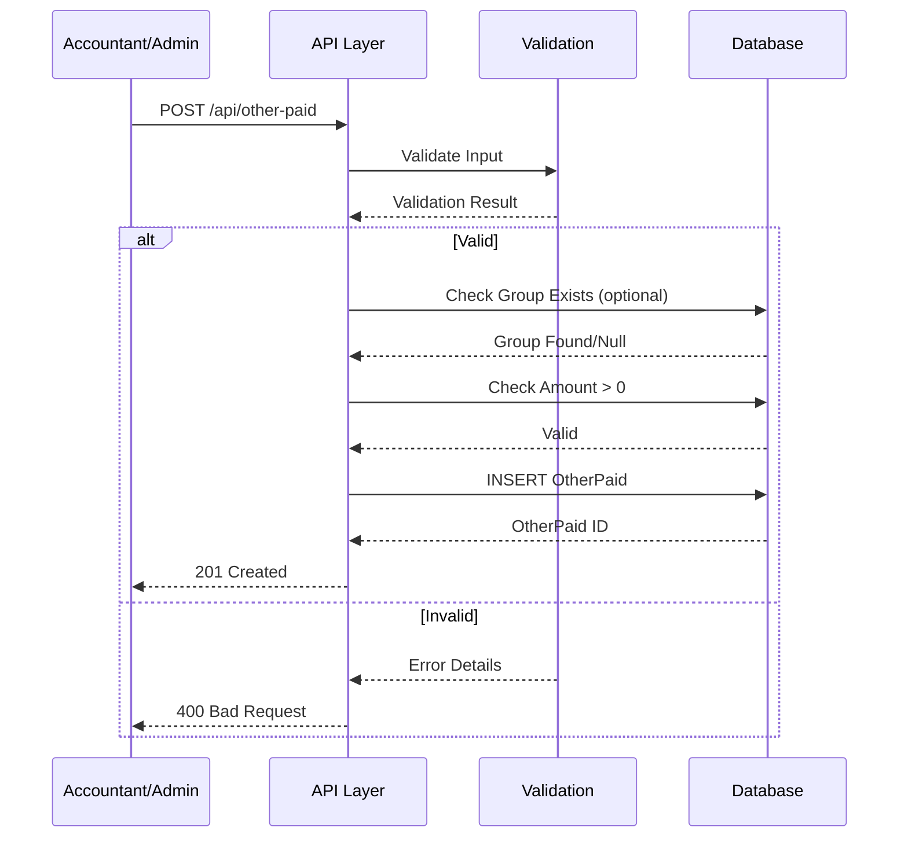
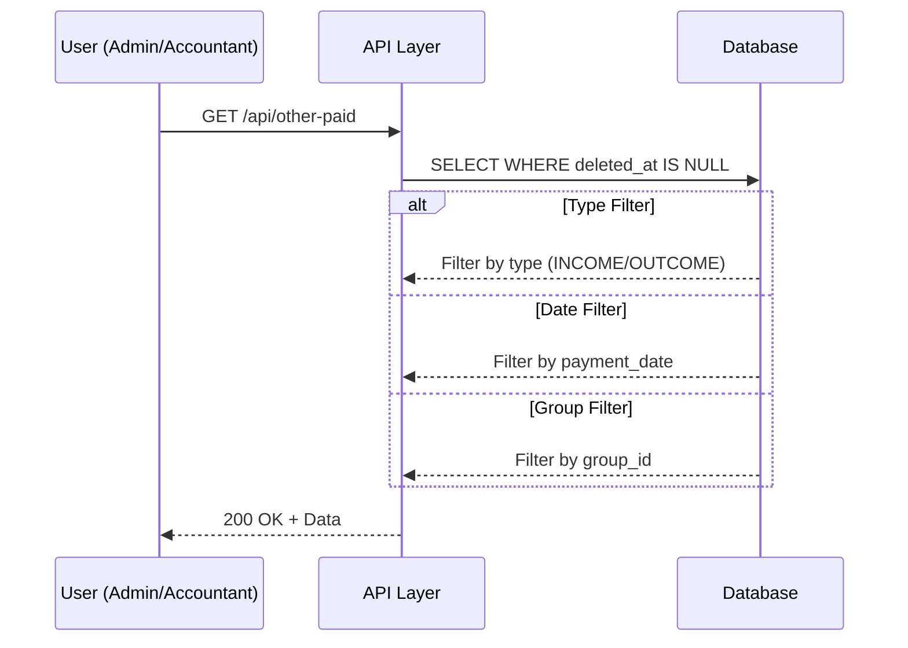
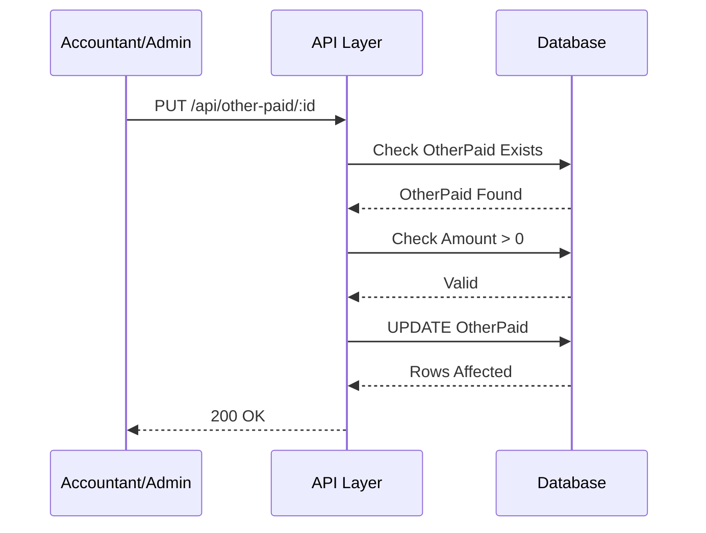
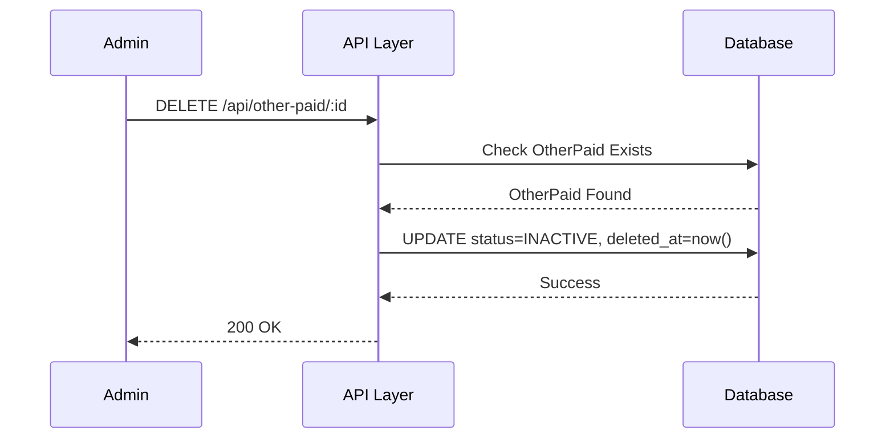
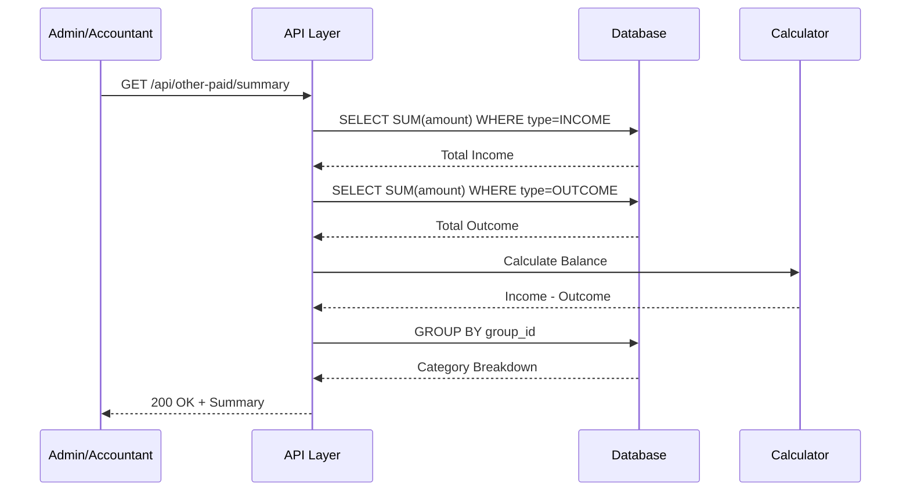

# 📄 FAYL: `17-other-paid-management.md`

```markdown
# 17. Boshqa Kirim/Chiqimlar Boshqaruvi (OtherPaid Management)

---

## 📋 UMUMIY MA'LUMOT

| Maydon | Qiymat |
|--------|--------|
| **Flow ID** | 17 |
| **Phase** | 2B - Finance |
| **Model** | `OtherPaid`, `OtherPaidGroup` |
| **Status** | Draft |
| **Yaratilgan Sana** | 2024-01-15 |
| **Oxirgi Yangilanish** | 2024-01-15 |
| **Mas'ul** | Senior Backend Developer |
| **Bog'liq Modellar** | `OtherPaidGroup` (RFC-016), `User` (RFC-002) |

---

## 🎯 MAQSAD

Klinikaning boshqa kirim va chiqimlarini (mijoz to'lovlari bilan bog'liq bo'lmagan) boshqarish. Kommunal to'lovlar, ijaralar, maoshlar, soliq to'lovlari va boshqa xarajatlarni hisobga olish, kategoriyalash va moliyaviy hisobotlar uchun asos yaratish (Reference: `Klinika.md` 3.5, 4.2, 7.1).

---

## 👥 MAS'UL ROLLAR

| Rol | Create | Read | Update | Delete | Tavsif |
|-----|--------|------|--------|--------|--------|
| **Admin** | ✅ | ✅ | ✅ | ✅ | To'liq huquq - barcha operatsiyalar |
| **Doctor** | ❌ | ❌ | ❌ | ❌ | Ruxsat yo'q (moliyaviy ma'lumot) |
| **Nurse** | ❌ | ❌ | ❌ | ❌ | Ruxsat yo'q (moliyaviy ma'lumot) |
| **Receptionist** | ❌ | ❌ | ❌ | ❌ | Ruxsat yo'q (moliyaviy ma'lumot) |
| **Accountant** | ✅ | ✅ | ✅ | ❌ | Moliyaviy operatsiyalar boshqaruvi (delete faqat Admin) |

---

## 📊 PRISMA MODEL (Reference: `klinika_prisma.txt`)

### OtherPaid Model Schema

```prisma
model OtherPaid {
  id           Int          @id @default(autoincrement())
  group_id     Int?         @map("group_id")
  type         PaymentType
  amount       Decimal      @default(0) @db.Decimal(15, 2)
  description  String?      @db.Text
  payment_date Timestamptz  @default(now()) @map("payment_date")
  created_at   Timestamptz  @default(now())
  updated_at   Timestamptz  @updatedAt
  deleted_at   Timestamptz?
  registered_by Int?        @map("registered_by")
  modified_by  Int?         @map("modified_by")

  // Relations
  group        OtherPaidGroup? @relation("fk_other_paid_group", fields: [group_id], references: [id], onDelete: SetNull, onUpdate: Cascade)
  register_user User?        @relation("fk_other_paid_registered_by", fields: [registered_by], references: [id], onDelete: SetNull, onUpdate: Cascade)
  modify_user  User?         @relation("fk_other_paid_modified_by", fields: [modified_by], references: [id], onDelete: SetNull, onUpdate: Cascade)

  @@index([group_id])
  @@index([type])
  @@index([payment_date])
  @@index([deleted_at])
  @@index([type, payment_date])
  @@map("other_paid")
}
```

### Model Maydonlari Tafsiloti

| Maydon | Tip | Majburiy | Default | DB Tip | Izoh/Tavsif |
|--------|-----|----------|---------|--------|-------------|
| `id` | Int | ✅ | autoincrement | SERIAL | **Primary Key**. Unikal identifikator, avtomatik oshib boradi |
| `group_id` | Int | ❌ | null | INTEGER | **Foreign Key**. OtherPaidGroup jadvaliga bog'lanish. Chiqim kategoriyasi (Reference: `Klinika.md` 3.5) |
| `type` | Enum | ✅ | - | PaymentType | **To'lov turi**. INCOME (kirim), OUTCOME (chiqim). Moliyaviy oqimni aniqlash uchun |
| `amount` | Decimal | ✅ | 0 | DECIMAL(15,2) | **Summa**. So'mda ifodalanadi. 2 kasr belgigacha. Moliyaviy hisob-kitob uchun muhim (Reference: `Klinika.md` 9.2) |
| `description` | String | ❌ | null | TEXT | **Qo'shimcha tavsif**. 0-255 belgi, to'lov haqida qo'shimcha ma'lumot |
| `payment_date` | Timestamptz | ✅ | now() | TIMESTAMPTZ | **To'lov sanasi**. Qachon to'lov amalga oshirilganligi. Hisobotlar uchun muhim |
| `created_at` | Timestamptz | ✅ | now() | TIMESTAMPTZ | **Yaratilgan vaqt**. Avtomatik to'ldiriladi, UTC timezone. Audit uchun (Reference: `Klinika.md` 5.2) |
| `updated_at` | Timestamptz | ✅ | now() | TIMESTAMPTZ | **Oxirgi o'zgarish**. Har bir update da avtomatik yangilanadi (Prisma @updatedAt) |
| `deleted_at` | Timestamptz | ❌ | null | TIMESTAMPTZ | **Soft Delete**. NULL = aktiv, qiymat bor = o'chirilgan. Fizik delete qilinmaydi (Reference: `Klinika.md` 8.1) |
| `registered_by` | Int | ❌ | null | INTEGER | **Foreign Key**. Kim yaratgan (User ID). SetNull cascade. Audit uchun (Reference: `Klinika.md` 5.2) |
| `modified_by` | Int | ❌ | null | INTEGER | **Foreign Key**. Kim oxirgi o'zgartirgan (User ID). SetNull cascade. Audit uchun |

### PaymentType Enum (Reference: `klinika_prisma.txt`)

```prisma
enum PaymentType {
  INCOME   // ✅ Kirim (Klinika daromadi)
  OUTCOME  // 💸 Chiqim (Klinika xarajati)
}
```

| Type | Tavsif | Misol |
|------|--------|-------|
| `INCOME` | Klinikaga kelib tushadigan mablag'lar | Foiz daromadi, sotuvdan tushum, boshqa kirimlar |
| `OUTCOME` | Klinikadan chiqadigan mablag'lar | Maoshlar, kommunal to'lovlar, ijaralar, soliqlar |

### Indexlar (Reference: `klinika_prisma.txt`)

| Index | Maydon(lar) | Maqsad |
|-------|-------------|--------|
| `@@index([group_id])` | group_id | Guruh bo'yicha filter qilishni tezlashtirish |
| `@@index([type])` | type | To'lov turi bo'yicha filter qilishni tezlashtirish (kirim/chiqim) |
| `@@index([payment_date])` | payment_date | Sana bo'yicha filter/sort qilish (hisobotlar uchun muhim) |
| `@@index([deleted_at])` | deleted_at | Soft delete filter uchun |
| `@@index([type, payment_date])` | type, payment_date | Qo'shma index - to'lov turi va sana bo'yicha (hisobotlar uchun eng muhim) |

### Relation'lar

| Relation | Model | Type | onDelete | onUpdate | Tavsif |
|----------|-------|------|----------|----------|--------|
| `fk_other_paid_group` | OtherPaidGroup | N:1 | SetNull | Cascade | Guruh o'chirilganda otherPaid.group_id NULL ga o'zgaradi. Moliyaviy tarix saqlanadi |
| `fk_other_paid_registered_by` | User | N:1 | SetNull | Cascade | User o'chirilganda registered_by NULL ga o'zgaradi. Audit tarixi saqlanadi |
| `fk_other_paid_modified_by` | User | N:1 | SetNull | Cascade | User o'chirilganda modified_by NULL ga o'zgaradi. Audit tarixi saqlanadi |

---

## 🔄 FLOW DIAGRAM

### 1. OtherPaid Yaratish Flow (Kirim/Chiqim qo'shish)



### 2. OtherPaid Ro'yxatini Olish Flow



### 3. OtherPaid Yangilash Flow



### 4. OtherPaid O'chirish (Soft Delete) Flow



### 5. Moliyaviy Hisobot (Summary) Flow



---

## 📝 BOSQICHMA-BOSQICH JARAYON

### BOSQICH 1: OtherPaid Yaratish (Kirim/Chiqim qo'shish)

#### 1.1. Input Ma'lumotlari

```typescript
interface CreateOtherPaidDto {
  group_id?: number;      // Mavjud OtherPaidGroup ID (optional)
  type: PaymentType;      // INCOME/OUTCOME
  amount: number;         // Summa (musbat)
  payment_date?: Date;    // To'lov sanasi (default: now)
  description?: string;   // To'lov tavsifi (0-255 belgi)
}
```

#### 1.2. Validatsiya Qoidalari

```typescript
// Type validatsiya
{
  enum: ['INCOME', 'OUTCOME'],
  required: true
}

// Amount validatsiya
{
  type: 'decimal',
  precision: 15,
  scale: 2,
  min: 0.01,  // Musbat son bo'lishi kerak
  required: true
}

// Group validatsiya
{
  type: 'number',
  mustExist: true,  // Agar kiritilgan bo'lsa, OtherPaidGroup jadvalida mavjud bo'lishi kerak
  required: false
}

// Payment Date validatsiya
{
  type: 'date',
  max: new Date(),  // Kelajak sana bo'lmasligi kerak
  required: false,
  default: now()
}

// Description validatsiya
{
  minLength: 0,
  maxLength: 255,
  required: false
}
```

#### 1.3. Biznes Logika

```typescript
// other-paid.service.ts
async create(createOtherPaidDto: CreateOtherPaidDto, userId: number): Promise<OtherPaid> {
  // 1. Group mavjudligini tekshirish (agar kiritilgan bo'lsa)
  if (createOtherPaidDto.group_id) {
    const group = await this.prisma.otherPaidGroup.findUnique({
      where: { id: createOtherPaidDto.group_id }
    });

    if (!group || group.deleted_at) {
      throw new NotFoundException('OP_001');
    }
  }

  // 2. Amount validatsiya (musbat son)
  if (createOtherPaidDto.amount <= 0) {
    throw new BadRequestException('OP_002');
  }

  // 3. OtherPaid yaratish
  const otherPaid = await this.prisma.otherPaid.create({
     {
      group_id: createOtherPaidDto.group_id,
      type: createOtherPaidDto.type,
      amount: createOtherPaidDto.amount,
      payment_date: createOtherPaidDto.payment_date || new Date(),
      description: createOtherPaidDto.description,
      created_at: new Date(),
      updated_at: new Date(),
      registered_by: userId
    },
    include: {
      group: { select: { id: true, name: true } }
    }
  });

  return otherPaid;
}
```

#### 1.4. Database Query

```prisma
-- Kirim qo'shish (INCOME)
INSERT INTO other_paid (
  group_id,
  type,
  amount,
  payment_date,
  description,
  created_at,
  updated_at,
  registered_by
) VALUES (
  1,
  'INCOME',
  500000,
  NOW(),
  'Foiz daromadi',
  NOW(),
  NOW(),
  2
);

-- Chiqim qo'shish (OUTCOME)
INSERT INTO other_paid (
  group_id,
  type,
  amount,
  payment_date,
  description,
  created_at,
  updated_at,
  registered_by
) VALUES (
  2,
  'OUTCOME',
  1500000,
  NOW(),
  'Yanvar oyi kommunal to''lovlar',
  NOW(),
  NOW(),
  2
);
```

---

### BOSQICH 2: OtherPaid Ro'yxatini Olish

#### 2.1. Query Parametrlari

```typescript
interface GetOtherPaidQuery {
  page?: number;        // Default: 1
  limit?: number;       // Default: 20
  type?: PaymentType;   // Filter by type (INCOME/OUTCOME)
  group_id?: number;    // Guruh bo'yicha filter
  date_from?: Date;     // Sana oralig'i (boshlanishi)
  date_to?: Date;       // Sana oralig'i (tugashi)
  sortBy?: string;      // Default: payment_date
  sortOrder?: string;   // Default: desc
}
```

#### 2.2. Biznes Logika

```typescript
async findAll(query: GetOtherPaidQuery): Promise<PaginatedResult<OtherPaid>> {
  const where: any = { deleted_at: null };

  // Type filter
  if (query.type) {
    where.type = query.type;
  }

  // Group filter
  if (query.group_id) {
    where.group_id = query.group_id;
  }

  // Date range filter
  if (query.date_from || query.date_to) {
    where.payment_date = {
      gte: query.date_from ? new Date(query.date_from) : undefined,
      lt: query.date_to ? new Date(new Date(query.date_to).setHours(23, 59, 59, 999)) : undefined
    };
  }

  // Pagination (Reference: Klinika.md 9.1)
  const skip = (query.page - 1) * query.limit;
  const take = Math.min(query.limit, 100);

  // Sorting
  const orderBy = {
    [query.sortBy || 'payment_date']: query.sortOrder || 'desc'
  };

  const [data, total] = await Promise.all([
    this.prisma.otherPaid.findMany({
      where,
      skip,
      take,
      orderBy,
      include: {
        group: { select: { id: true, name: true } },
        user: { select: { id: true, full_name: true } }
      }
    }),
    this.prisma.otherPaid.count({ where })
  ]);

  return {
    data,
    pagination: {
      page: query.page,
      limit: take,
      total,
      totalPages: Math.ceil(total / take),
      hasNextPage: skip + take < total,
      hasPrevPage: query.page > 1
    }
  };
}
```

#### 2.3. Database Query

```prisma
SELECT 
  id,
  group_id,
  type,
  amount,
  description,
  payment_date,
  created_at,
  updated_at,
  deleted_at,
  registered_by,
  modified_by
FROM other_paid
WHERE deleted_at IS NULL
  AND type = 'OUTCOME'
ORDER BY payment_date DESC
LIMIT 20 OFFSET 0;
```

---

### BOSQICH 3: OtherPaid Yangilash

#### 3.1. Input Ma'lumotlari

```typescript
interface UpdateOtherPaidDto {
  group_id?: number;      // Yangi guruh
  amount?: number;        // Yangi summa
  description?: string;   // Yangi tavsif
  payment_date?: Date;    // Yangi sana
}
```

#### 3.2. Biznes Logika

```typescript
async update(id: number, updateOtherPaidDto: UpdateOtherPaidDto, userId: number): Promise<OtherPaid> {
  // 1. OtherPaid mavjudligini tekshirish
  const otherPaid = await this.prisma.otherPaid.findUnique({
    where: { id }
  });

  if (!otherPaid || otherPaid.deleted_at) {
    throw new NotFoundException('OP_003');
  }

  // 2. Group mavjudligini tekshirish (agar o'zgarayotgan bo'lsa)
  if (updateOtherPaidDto.group_id) {
    const group = await this.prisma.otherPaidGroup.findUnique({
      where: { id: updateOtherPaidDto.group_id }
    });

    if (!group || group.deleted_at) {
      throw new NotFoundException('OP_001');
    }
  }

  // 3. Amount validatsiya (agar o'zgarayotgan bo'lsa)
  if (updateOtherPaidDto.amount !== undefined && updateOtherPaidDto.amount <= 0) {
    throw new BadRequestException('OP_002');
  }

  // 4. OtherPaid yangilash
  const updated = await this.prisma.otherPaid.update({
    where: { id },
     {
      ...updateOtherPaidDto,
      updated_at: new Date(),
      modified_by: userId
    },
    include: {
      group: { select: { id: true, name: true } }
    }
  });

  return updated;
}
```

#### 3.3. Database Query

```prisma
UPDATE other_paid
SET 
  group_id = 2,
  amount = 2000000,
  description = 'Yangilangan kommunal to''lovlar',
  updated_at = NOW(),
  modified_by = 2
WHERE id = 1
  AND deleted_at IS NULL;
```

---

### BOSQICH 4: OtherPaid O'chirish (Soft Delete)

#### 4.1. Biznes Logika

```typescript
async remove(id: number, userId: number): Promise<OtherPaid> {
  // 1. OtherPaid mavjudligini tekshirish
  const otherPaid = await this.prisma.otherPaid.findUnique({
    where: { id }
  });

  if (!otherPaid || otherPaid.deleted_at) {
    throw new NotFoundException('OP_003');
  }

  // 2. Soft Delete (faqat Admin)
  return this.prisma.otherPaid.update({
    where: { id },
     {
      deleted_at: new Date(),
      modified_by: userId,
      updated_at: new Date()
    }
  });
}
```

#### 4.2. Database Query

```prisma
UPDATE other_paid
SET 
  deleted_at = NOW(),
  modified_by = 1,
  updated_at = NOW()
WHERE id = 1;
```

---

### BOSQICH 5: Moliyaviy Hisobot (Summary)

#### 5.1. Biznes Logika

```typescript
async getSummary(dateFrom: Date, dateTo: Date): Promise<OtherPaidSummary> {
  // Kirim yig'indisi
  const income = await this.prisma.otherPaid.aggregate({
    where: {
      deleted_at: null,
      type: 'INCOME',
      payment_date: {
        gte: dateFrom,
        lt: new Date(dateTo.setHours(23, 59, 59, 999))
      }
    },
    _sum: { amount: true },
    _count: { id: true }
  });

  // Chiqim yig'indisi
  const outcome = await this.prisma.otherPaid.aggregate({
    where: {
      deleted_at: null,
      type: 'OUTCOME',
      payment_date: {
        gte: dateFrom,
        lt: new Date(dateTo.setHours(23, 59, 59, 999))
      }
    },
    _sum: { amount: true },
    _count: { id: true }
  });

  // Kategoriya bo'yicha taqsimot
  const byCategory = await this.prisma.otherPaid.groupBy({
    by: ['group_id', 'type'],
    _sum: { amount: true },
    _count: { id: true },
    where: {
      deleted_at: null,
      payment_date: {
        gte: dateFrom,
        lt: new Date(dateTo.setHours(23, 59, 59, 999))
      }
    }
  });

  // Guruh nomlarini olish
  const groupIds = byCategory
    .filter(item => item.group_id !== null)
    .map(item => item.group_id!);

  const groups = await this.prisma.otherPaidGroup.findMany({
    where: { id: { in: groupIds } },
    select: { id: true, name: true }
  });

  const totalIncome = income._sum.amount || 0;
  const totalOutcome = outcome._sum.amount || 0;
  const balance = totalIncome - totalOutcome;

  return {
    period: {
      from: dateFrom,
      to: dateTo
    },
    income: {
      total: totalIncome,
      count: income._count.id
    },
    outcome: {
      total: totalOutcome,
      count: outcome._count.id
    },
    balance,
    byCategory: byCategory.map(item => ({
      group_id: item.group_id,
      group_name: groups.find(g => g.id === item.group_id)?.name || 'Kategoriyasiz',
      type: item.type,
      total: item._sum.amount || 0,
      count: item._count.id
    }))
  };
}
```

---

## 🔌 API ENDPOINT'LAR

### 1. OtherPaid Yaratish

| Parametr | Qiymat |
|----------|--------|
| **Method** | POST |
| **Endpoint** | `/api/v1/other-paid` |
| **Auth** | ✅ JWT Required |
| **Rol** | Admin, Accountant |
| **Content-Type** | application/json |

**Request Body:**
```json
{
  "group_id": 2,
  "type": "OUTCOME",
  "amount": 1500000,
  "payment_date": "2024-01-15T10:00:00.000Z",
  "description": "Yanvar oyi kommunal to'lovlar"
}
```

**Response (201 Created):**
```json
{
  "success": true,
  "message": "Boshqa to'lov muvaffaqiyatli yaratildi",
  "data": {
    "id": 1,
    "group": { "id": 2, "name": "Kommunal to'lovlar" },
    "type": "OUTCOME",
    "amount": 1500000,
    "payment_date": "2024-01-15T10:00:00.000Z",
    "description": "Yanvar oyi kommunal to'lovlar",
    "created_at": "2024-01-15T10:00:00.000Z",
    "updated_at": "2024-01-15T10:00:00.000Z",
    "deleted_at": null
  }
}
```

---

### 2. OtherPaid Ro'yxatini Olish

| Parametr | Qiymat |
|----------|--------|
| **Method** | GET |
| **Endpoint** | `/api/v1/other-paid` |
| **Auth** | ✅ JWT Required |
| **Rol** | Admin, Accountant |

**Query Params:**
```
GET /api/v1/other-paid?page=1&limit=20&type=OUTCOME&date_from=2024-01-01&date_to=2024-01-31
```

**Response (200 OK):**
```json
{
  "success": true,
  "data": [
    {
      "id": 1,
      "group": { "id": 2, "name": "Kommunal to'lovlar" },
      "type": "OUTCOME",
      "amount": 1500000,
      "payment_date": "2024-01-15T10:00:00.000Z",
      "description": "Yanvar oyi kommunal to'lovlar"
    },
    {
      "id": 2,
      "group": { "id": 1, "name": "Maoshlar" },
      "type": "OUTCOME",
      "amount": 5000000,
      "payment_date": "2024-01-31T10:00:00.000Z",
      "description": "Yanvar oyi maoshlar"
    }
  ],
  "pagination": {
    "page": 1,
    "limit": 20,
    "total": 50,
    "totalPages": 3,
    "hasNextPage": true,
    "hasPrevPage": false
  }
}
```

---

### 3. Moliyaviy Hisobot (Summary)

| Parametr | Qiymat |
|----------|--------|
| **Method** | GET |
| **Endpoint** | `/api/v1/other-paid/summary` |
| **Auth** | ✅ JWT Required |
| **Rol** | Admin, Accountant |

**Query Params:**
```
GET /api/v1/other-paid/summary?date_from=2024-01-01&date_to=2024-01-31
```

**Response (200 OK):**
```json
{
  "success": true,
  "data": {
    "period": {
      "from": "2024-01-01",
      "to": "2024-01-31"
    },
    "income": {
      "total": 2000000,
      "count": 5
    },
    "outcome": {
      "total": 8000000,
      "count": 25
    },
    "balance": -6000000,
    "byCategory": [
      {
        "group_id": 1,
        "group_name": "Maoshlar",
        "type": "OUTCOME",
        "total": 5000000,
        "count": 10
      },
      {
        "group_id": 2,
        "group_name": "Kommunal to'lovlar",
        "type": "OUTCOME",
        "total": 1500000,
        "count": 5
      },
      {
        "group_id": 3,
        "group_name": "Ijara",
        "type": "OUTCOME",
        "total": 1000000,
        "count": 2
      }
    ]
  }
}
```

---

### 4. OtherPaid Yangilash

| Parametr | Qiymat |
|----------|--------|
| **Method** | PUT |
| **Endpoint** | `/api/v1/other-paid/:id` |
| **Auth** | ✅ JWT Required |
| **Rol** | Admin, Accountant |

**Request Body:**
```json
{
  "group_id": 2,
  "amount": 2000000,
  "description": "Yangilangan kommunal to'lovlar"
}
```

**Response (200 OK):**
```json
{
  "success": true,
  "message": "Boshqa to'lov muvaffaqiyatli yangilandi",
  "data": {
    "id": 1,
    "group": { "id": 2, "name": "Kommunal to'lovlar" },
    "amount": 2000000,
    "updated_at": "2024-01-15T12:00:00.000Z"
  }
}
```

---

### 5. OtherPaid O'chirish (Soft Delete)

| Parametr | Qiymat |
|----------|--------|
| **Method** | DELETE |
| **Endpoint** | `/api/v1/other-paid/:id` |
| **Auth** | ✅ JWT Required |
| **Rol** | Admin |

**Response (200 OK):**
```json
{
  "success": true,
  "message": "Boshqa to'lov muvaffaqiyatli o'chirildi",
  "data": {
    "id": 1,
    "type": "OUTCOME",
    "amount": 1500000,
    "deleted_at": "2024-01-15T14:00:00.000Z"
  }
}
```

---

## ⚠️ XATOLIKLAR VA HANDLING

| Kod | HTTP Status | Xabar | Sabab | Yechim |
|-----|-------------|-------|-------|--------|
| `OP_001` | 404 Not Found | To'lov guruhi topilmadi | OtherPaidGroup ID not exists | Group ID ni tekshiring |
| `OP_002` | 400 Bad Request | Summa noto'g'ri | amount <= 0 | Musbat son kiriting |
| `OP_003` | 404 Not Found | Boshqa to'lov topilmadi | OtherPaid ID not exists | ID ni tekshiring |
| `OP_004` | 403 Forbidden | Ruxsat yo'q | Insufficient permissions | Rol tekshirilsin (Reference: `Klinika.md` 6.1) |
| `OP_005` | 400 Bad Request | To'lov turi noto'g'ri | Validation failed | INCOME/OUTCOME |
| `OP_006` | 400 Bad Request | Sana noto'g'ri | Date format yoki kelajak sana | Date format tekshirilsin |
| `OP_007` | 400 Bad Request | Tavsif juda uzun | Validation failed | Max 255 belgi |

---

## 📦 SEED DATA

```typescript
// seed/other-paid.seed.ts
export async function seedOtherPaid(prisma: PrismaClient) {
  // Test OtherPaid yaratish (Chiqimlar)
  const outcomes = [
    {
      group_id: 1,  // Maoshlar
      type: 'OUTCOME' as const,
      amount: 5000000,
      description: 'Yanvar oyi maoshlar',
      payment_date: new Date('2024-01-31T10:00:00Z')
    },
    {
      group_id: 2,  // Kommunal to'lovlar
      type: 'OUTCOME' as const,
      amount: 1500000,
      description: 'Yanvar oyi kommunal to''lovlar',
      payment_date: new Date('2024-01-25T10:00:00Z')
    },
    {
      group_id: 3,  // Ijara
      type: 'OUTCOME' as const,
      amount: 1000000,
      description: 'Yanvar oyi ijara to''lovi',
      payment_date: new Date('2024-01-01T10:00:00Z')
    },
    {
      group_id: 4,  // Soliqlar
      type: 'OUTCOME' as const,
      amount: 800000,
      description: 'Chorak soliq to''lovi',
      payment_date: new Date('2024-01-15T10:00:00Z')
    }
  ];

  // Test OtherPaid yaratish (Kirimlar)
  const incomes = [
    {
      group_id: 10,  // Foiz daromadi
      type: 'INCOME' as const,
      amount: 500000,
      description: 'Bank foiz daromadi',
      payment_date: new Date('2024-01-31T10:00:00Z')
    },
    {
      group_id: 11,  // Sotuvdan tushum
      type: 'INCOME' as const,
      amount: 1500000,
      description: 'Dori-darmon sotuvidan tushum',
      payment_date: new Date('2024-01-20T10:00:00Z')
    }
  ];

  const allOtherPaid = [...outcomes, ...incomes];

  for (const otherPaid of allOtherPaid) {
    await prisma.otherPaid.create({  otherPaid });
  }

  console.log(`✅ OtherPaid seeded successfully (${allOtherPaid.length} records)`);
}
```

### Seed Script Ishga Tushirish

```bash
# Development
npm run seed

# Production (ehtiyotkorlik bilan)
npm run seed:prod

# Faqat OtherPaid
npm run seed:other-paid
```

---

## 🔐 XAVFSIZLIK TALABLARI (Reference: `Klinika.md` 8)

### 1. Autentifikatsiya
- ✅ Barcha endpoint'lar JWT token talab qiladi (Reference: `Klinika.md` 8.1)
- ✅ Token expiry: 24 soat
- ✅ Token validatsiyasi har bir so'rovda

### 2. Avtorizatsiya (RBAC) (Reference: `Klinika.md` 6.1)

| Endpoint | Admin | Doctor | Nurse | Receptionist | Accountant |
|----------|-------|--------|-------|--------------|------------|
| POST /other-paid | ✅ | ❌ | ❌ | ❌ | ✅ |
| GET /other-paid | ✅ | ❌ | ❌ | ❌ | ✅ |
| GET /other-paid/:id | ✅ | ❌ | ❌ | ❌ | ✅ |
| PUT /other-paid/:id | ✅ | ❌ | ❌ | ❌ | ✅ |
| DELETE /other-paid/:id | ✅ | ❌ | ❌ | ❌ | ❌ |
| GET /other-paid/summary | ✅ | ❌ | ❌ | ❌ | ✅ |

### 3. Audit (Reference: `Klinika.md` 5.2)
| Maydon | Tavsif | Avtomatik |
|--------|--------|-----------|
| `created_at` | Yaratilgan vaqt | ✅ Prisma @default(now()) |
| `updated_at` | Oxirgi o'zgarish | ✅ Prisma @updatedAt |
| `deleted_at` | Soft delete vaqti | ❌ Manual set |
| `registered_by` | Kim yaratdi (User ID) | ✅ Manual set |
| `modified_by` | Kim o'zgartirdi (User ID) | ✅ Manual set |

### 4. Moliyaviy Xavfsizlik (Reference: `Klinika.md` 8.1, 9.2)
- ✅ Barcha summalar Decimal(15,2) formatda (Reference: `Klinika.md` 9.2)
- ✅ Summa musbat bo'lishi kerak
- ✅ Moliyaviy operatsiyalar audit qilinadi
- ✅ Delete faqat Admin tomonidan amalga oshiriladi
- ✅ Payment type (INCOME/OUTCOME) validatsiya qilinadi
- ✅ Moliyaviy ma'lumotlar konfidensial (Doctor/Nurse/Receptionist kirish huquqi yo'q)

---

## 📝 ESLATMALAR

1. **Payment Type** - INCOME (kirim) yoki OUTCOME (chiqim) (Reference: `Klinika.md` 3.5)
2. **Group Bog'liqlik** - group_id optional (null = kategoriyasiz)
3. **Soft Delete** - OtherPaid o'chirilganda `deleted_at` set bo'ladi, fizik delete qilinmaydi (Reference: `Klinika.md` 8.1)
4. **Cascade Rules** - OtherPaidGroup o'chirilganda otherPaid.group_id NULL ga o'zgaradi (SetNull)
5. **Moliyaviy Tarix** - Barcha yozuvlar saqlanib qoladi, faqat deleted_at set bo'ladi
6. **Audit Trail** - Har bir o'zgarish qayd etiladi (registered_by, modified_by) (Reference: `Klinika.md` 5.2)
7. **RBAC** - Faqat Admin va Accountant OtherPaid boshqarish huquqiga ega (Reference: `Klinika.md` 6.1)
8. **Seed Data** - Standart kategoriyalar bilan yuklanadi (Maoshlar, Kommunal, Ijara, Soliqlar)
9. **Summary Endpoint** - Kirim/chiqim taqsimoti va balance hisoblash uchun
10. **Decimal Precision** - Barcha summalar Decimal(15,2) formatda saqlanadi (Reference: `Klinika.md` 9.2)

---

## ✅ QABUL QILISH MEZONLARI (ACCEPTANCE CRITERIA)

### Functional Requirements
- [ ] OtherPaid yaratish guruh bilan bog'lanishi (optional)
- [ ] Payment type INCOME/OUTCOME qiymat qabul qilishi (Reference: `Klinika.md` 3.5)
- [ ] Summa musbat bo'lishi
- [ ] Soft delete ishlaydi (deleted_at set bo'ladi) (Reference: `Klinika.md` 8.1)
- [ ] Faqat Admin/Accountant OtherPaid yaratish/o'zgartirish huquqiga ega (Reference: `Klinika.md` 6.1)
- [ ] Faqat Admin OtherPaid o'chirish huquqiga ega
- [ ] Barcha moliyaviy rollar OtherPaid ro'yxatini ko'ra oladi
- [ ] Moliyaviy hisobot (summary) ishlaydi (Reference: `Klinika.md` 7.1)
- [ ] Kategoriya bo'yicha filterlash ishlaydi
- [ ] Pagination va filterlash ishlaydi
- [ ] Xatoliklar to'g'ri HTTP status va kod bilan qaytariladi
- [ ] Audit maydonlari (registered_by, modified_by) to'ldiriladi (Reference: `Klinika.md` 5.2)
- [ ] Cascade rules ishlaydi (SetNull)
- [ ] Date range filter ishlaydi

### Non-Functional Requirements (Reference: `Klinika.md` 9.1)
- [ ] API response time < 200ms
- [ ] Database query time < 100ms
- [ ] Unit test coverage ≥ 90%
- [ ] E2E test coverage ≥ 70%
- [ ] Security audit o'tkazildi (Reference: `Klinika.md` 8)
- [ ] Documentation to'liq
- [ ] Concurrent users 50+ qo'llab-quvvatlanadi
- [ ] Data retention 5 yil
