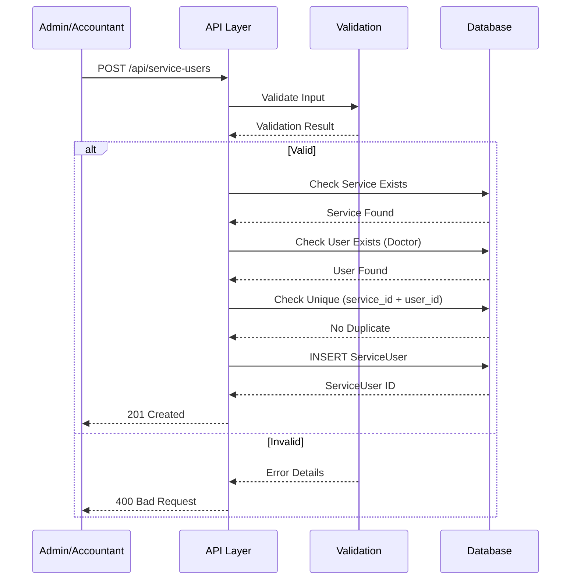
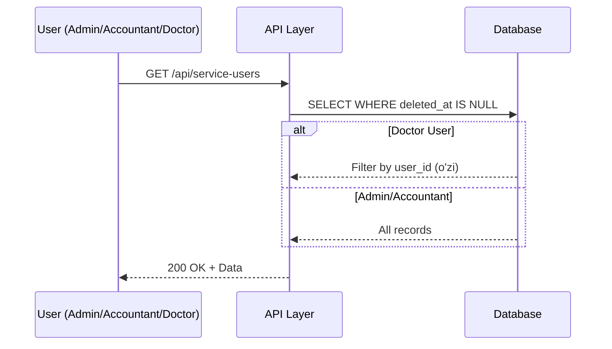
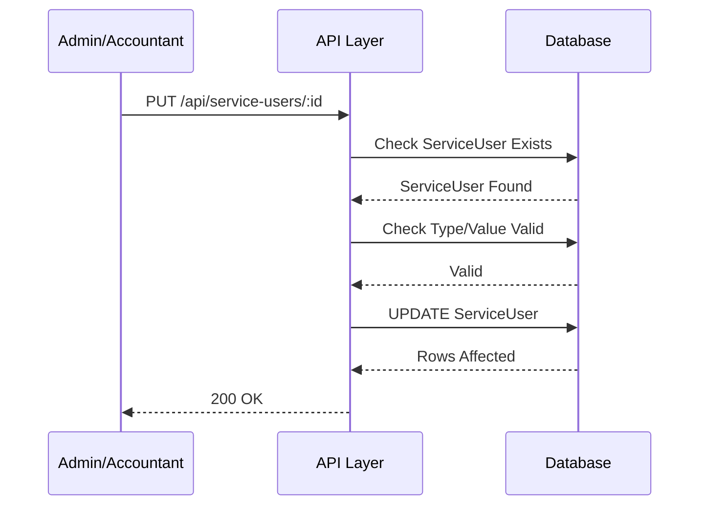
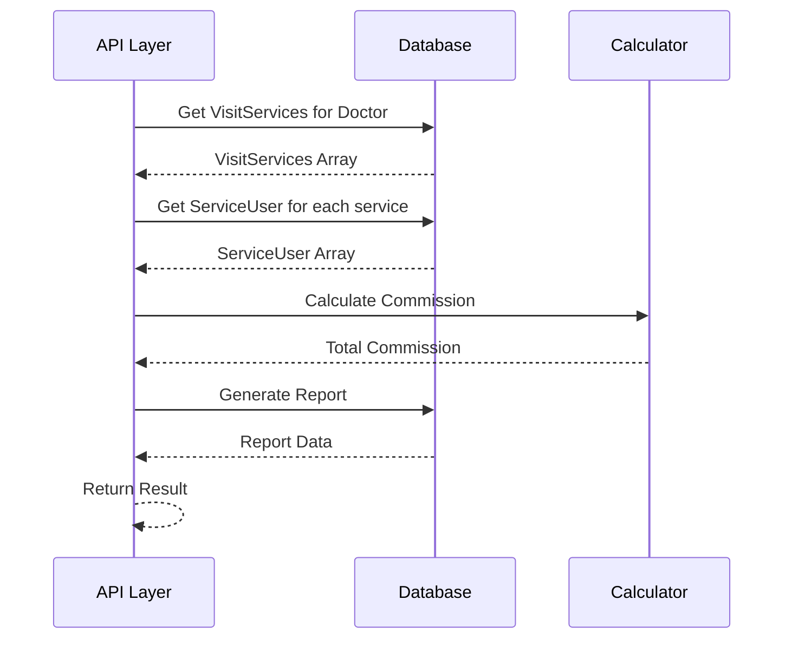

# 📄 FAYL: `18-service-user-management.md`

# 18. Shifokor Stavkalari Boshqaruvi (ServiceUser Management)

---

## 📋 UMUMIY MA'LUMOT

| Maydon | Qiymat |
|--------|--------|
| **Flow ID** | 18 |
| **Phase** | 2B - Finance |
| **Model** | `ServiceUser` |
| **Status** | Draft |
| **Yaratilgan Sana** | 2024-01-15 |
| **Oxirgi Yangilanish** | 2024-01-15 |
| **Mas'ul** | Senior Backend Developer |
| **Bog'liq Modellar** | `Service` (RFC-011), `User` (RFC-002) |

---

## 🎯 MAQSAD

Shifokorlarga xizmatlar bo'yicha stavkalarni (komissiya) belgilash va boshqarish. Har bir shifokor uchun har bir xizmat bo'yicha FIXED (fiksatsiya) yoki PERCENT (foiz) tipida stavka belgilash, shifokor daromadini hisoblash va moliyaviy hisobotlar uchun asos yaratish (Reference: `Klinika.md` 3.4, 4.3, 7.1).

---

## 👥 MAS'UL ROLLAR

| Rol | Create | Read | Update | Delete | Tavsif |
|-----|--------|------|--------|--------|--------|
| **Admin** | ✅ | ✅ | ✅ | ✅ | To'liq huquq - barcha operatsiyalar |
| **Doctor** | ❌ | ✅ (faqat o'zi) | ❌ | ❌ | Faqat o'z stavkalarini ko'rish |
| **Nurse** | ❌ | ❌ | ❌ | ❌ | Ruxsat yo'q |
| **Receptionist** | ❌ | ❌ | ❌ | ❌ | Ruxsat yo'q |
| **Accountant** | ✅ | ✅ | ✅ | ❌ | Stavka boshqaruvi (delete faqat Admin) |

---

## 📊 PRISMA MODEL (Reference: `klinika_prisma.txt`)

### ServiceUser Model Schema

```prisma
model ServiceUser {
  id           Int             @id @default(autoincrement())
  service_id   Int?            @map("service_id")
  user_id      Int?            @map("user_id")
  type         ServiceUserType
  value        Decimal         @default(0) @db.Decimal(10, 2)
  status       RecordStatus    @default(ACTIVE)
  created_at   Timestamptz     @default(now())
  updated_at   Timestamptz     @updatedAt
  deleted_at   Timestamptz?
  registered_by Int?           @map("registered_by")
  modified_by  Int?            @map("modified_by")

  // Relations
  service      Service?        @relation("fk_service_user_service", fields: [service_id], references: [id], onDelete: Cascade, onUpdate: Cascade)
  user         User?           @relation("fk_service_user_user", fields: [user_id], references: [id], onDelete: Cascade, onUpdate: Cascade)
  register_user User?          @relation("fk_service_user_registered_by", fields: [registered_by], references: [id], onDelete: SetNull, onUpdate: Cascade)
  modify_user  User?           @relation("fk_service_user_modified_by", fields: [modified_by], references: [id], onDelete: SetNull, onUpdate: Cascade)

  @@index([service_id])
  @@index([user_id])
  @@index([status])
  @@index([deleted_at])
  @@index([service_id, user_id])
  @@unique([service_id, user_id])
  @@map("service_users")
}
```

### Model Maydonlari Tafsiloti

| Maydon | Tip | Majburiy | Default | DB Tip | Izoh/Tavsif |
|--------|-----|----------|---------|--------|-------------|
| `id` | Int | ✅ | autoincrement | SERIAL | **Primary Key**. Unikal identifikator, avtomatik oshib boradi |
| `service_id` | Int | ✅ | - | INTEGER | **Foreign Key**. Service jadvaliga bog'lanish. Qaysi xizmat uchun stavka belgilanganligi (Reference: `Klinika.md` 3.4) |
| `user_id` | Int | ✅ | - | INTEGER | **Foreign Key**. User jadvaliga bog'lanish (Doctor roli). Qaysi shifokor uchun stavka belgilanganligi |
| `type` | Enum | ✅ | - | ServiceUserType | **Stavka turi**. FIXED (fiksatsiya summa), PERCENT (foiz). Shifokor daromadini hisoblash usuli (Reference: `Klinika.md` 3.4) |
| `value` | Decimal | ✅ | 0 | DECIMAL(10,2) | **Stavka qiymati**. FIXED uchun so'mda, PERCENT uchun foizda. 2 kasr belgigacha. Moliyaviy hisob-kitob uchun muhim (Reference: `Klinika.md` 9.2) |
| `status` | Enum | ✅ | ACTIVE | RecordStatus | **Holat**. ACTIVE (faol), INACTIVE (nofaol), ARCHIVED (arxiv). Yangi stavka yaratilganda default ACTIVE |
| `created_at` | Timestamptz | ✅ | now() | TIMESTAMPTZ | **Yaratilgan vaqt**. Avtomatik to'ldiriladi, UTC timezone. Audit uchun (Reference: `Klinika.md` 5.2) |
| `updated_at` | Timestamptz | ✅ | now() | TIMESTAMPTZ | **Oxirgi o'zgarish**. Har bir update da avtomatik yangilanadi (Prisma @updatedAt) |
| `deleted_at` | Timestamptz | ❌ | null | TIMESTAMPTZ | **Soft Delete**. NULL = aktiv, qiymat bor = o'chirilgan. Fizik delete qilinmaydi (Reference: `Klinika.md` 8.1) |
| `registered_by` | Int | ❌ | null | INTEGER | **Foreign Key**. Kim yaratgan (User ID). SetNull cascade. Audit uchun (Reference: `Klinika.md` 5.2) |
| `modified_by` | Int | ❌ | null | INTEGER | **Foreign Key**. Kim oxirgi o'zgartirgan (User ID). SetNull cascade. Audit uchun |

### ServiceUserType Enum (Reference: `klinika_prisma.txt`)

```prisma
enum ServiceUserType {
  FIXED    // ✅ Fiksatsiya summa (so'mda)
  PERCENT  // 💯 Foiz (xizmat narxidan %)
}
```

| Type | Tavsif | Misol | Hisoblash |
|------|--------|-------|-----------|
| `FIXED` | Fiksatsiya summa | 50,000 so'm har bir xizmat | Shifokor daromadi = value |
| `PERCENT` | Foiz | 30% xizmat narxidan | Shifokor daromadi = service.price × (value / 100) |

### Indexlar (Reference: `klinika_prisma.txt`)

| Index | Maydon(lar) | Maqsad |
|-------|-------------|--------|
| `@@index([service_id])` | service_id | Xizmat bo'yicha filter qilishni tezlashtirish |
| `@@index([user_id])` | user_id | Shifokor bo'yicha filter qilishni tezlashtirish |
| `@@index([status])` | status | Status bo'yicha filter qilishni tezlashtirish (faqat aktiv stavkalar) |
| `@@index([deleted_at])` | deleted_at | Soft delete filter uchun |
| `@@index([service_id, user_id])` | service_id, user_id | Qo'shma index - xizmat va shifokor bo'yicha (eng ko'p ishlatiladigan query) |
| `@@unique([service_id, user_id])` | service_id, user_id | Bir xizmat uchun bir shifokor - bitta stavka (duplicate oldini olish) |

### Relation'lar

| Relation | Model | Type | onDelete | onUpdate | Tavsif |
|----------|-------|------|----------|----------|--------|
| `fk_service_user_service` | Service | N:1 | Cascade | Cascade | Service o'chirilganda ServiceUser yozuvlari o'chiriladi (stavka mavjud emas) |
| `fk_service_user_user` | User | N:1 | Cascade | Cascade | User (Doctor) o'chirilganda ServiceUser yozuvlari o'chiriladi |
| `fk_service_user_registered_by` | User | N:1 | SetNull | Cascade | User o'chirilganda registered_by NULL ga o'zgaradi. Audit tarixi saqlanadi |
| `fk_service_user_modified_by` | User | N:1 | SetNull | Cascade | User o'chirilganda modified_by NULL ga o'zgaradi. Audit tarixi saqlanadi |

---

## 🔄 FLOW DIAGRAM

### 1. Stavka Yaratish Flow (Admin/Accountant tomonidan)



### 2. Stavka Ro'yxatini Olish Flow



### 3. Stavka Yangilash Flow



### 4. Shifokor Daromadini Hisoblash Flow



---

## 📝 BOSQICHMA-BOSQICH JARAYON

### BOSQICH 1: Stavka Yaratish

#### 1.1. Input Ma'lumotlari

```typescript
interface CreateServiceUserDto {
  service_id: number;     // Mavjud Service ID
  user_id: number;        // Mavjud User ID (Doctor roli)
  type: ServiceUserType;  // FIXED/PERCENT
  value: number;          // Stavka qiymati (so'm yoki foiz)
  status?: string;        // ACTIVE/INACTIVE/ARCHIVED
}
```

#### 1.2. Validatsiya Qoidalari

```typescript
// Service validatsiya
{
  type: 'number',
  mustExist: true,  // Service jadvalida mavjud bo'lishi kerak
  required: true
}

// User validatsiya
{
  type: 'number',
  mustExist: true,  // User jadvalida mavjud bo'lishi kerak
  role: 'Doctor',   // Doctor roli bo'lishi kerak
  required: true
}

// Type validatsiya
{
  enum: ['FIXED', 'PERCENT'],
  required: true
}

// Value validatsiya
{
  type: 'decimal',
  precision: 10,
  scale: 2,
  min: 0,  // Manfiy bo'lmasligi kerak
  max: 100, // PERCENT uchun max 100
  required: true
}

// Unique constraint
{
  fields: ['service_id', 'user_id'],
  message: 'Bu xizmat uchun shifokor allaqachon stavka belgilagan'
}
```

#### 1.3. Biznes Logika

```typescript
// service-user.service.ts
async create(createServiceUserDto: CreateServiceUserDto, userId: number): Promise<ServiceUser> {
  // 1. Service mavjudligini tekshirish
  const service = await this.prisma.service.findUnique({
    where: { id: createServiceUserDto.service_id }
  });

  if (!service || service.deleted_at) {
    throw new NotFoundException('SU_001');
  }

  // 2. User mavjudligini va Doctor roli ekanligini tekshirish
  const user = await this.prisma.user.findUnique({
    where: { id: createServiceUserDto.user_id },
    include: { role: true }
  });

  if (!user || user.deleted_at || user.role?.name !== 'Doctor') {
    throw new NotFoundException('SU_002');
  }

  // 3. Unique constraint tekshiruvi (service_id + user_id)
  const existing = await this.prisma.serviceUser.findFirst({
    where: {
      service_id: createServiceUserDto.service_id,
      user_id: createServiceUserDto.user_id,
      deleted_at: null
    }
  });

  if (existing) {
    throw new ConflictException('SU_003');
  }

  // 4. Value validatsiya (PERCENT uchun max 100)
  if (createServiceUserDto.type === 'PERCENT' && createServiceUserDto.value > 100) {
    throw new BadRequestException('SU_004');
  }

  // 5. Stavka yaratish
  const serviceUser = await this.prisma.serviceUser.create({
     {
      service_id: createServiceUserDto.service_id,
      user_id: createServiceUserDto.user_id,
      type: createServiceUserDto.type,
      value: createServiceUserDto.value,
      status: createServiceUserDto.status || 'ACTIVE',
      created_at: new Date(),
      updated_at: new Date(),
      registered_by: userId
    },
    include: {
      service: { select: { id: true, name: true, price: true } },
      user: { select: { id: true, full_name: true } }
    }
  });

  return serviceUser;
}
```

#### 1.4. Database Query

```prisma
-- Stavka yaratish (FIXED)
INSERT INTO service_users (
  service_id,
  user_id,
  type,
  value,
  status,
  created_at,
  updated_at,
  registered_by
) VALUES (
  1,
  2,
  'FIXED',
  50000,
  'ACTIVE',
  NOW(),
  NOW(),
  1
);

-- Stavka yaratish (PERCENT)
INSERT INTO service_users (
  service_id,
  user_id,
  type,
  value,
  status,
  created_at,
  updated_at,
  registered_by
) VALUES (
  1,
  3,
  'PERCENT',
  30,
  'ACTIVE',
  NOW(),
  NOW(),
  1
);
```

---

### BOSQICH 2: Stavka Ro'yxatini Olish

#### 2.1. Query Parametrlari

```typescript
interface GetServiceUsersQuery {
  page?: number;        // Default: 1
  limit?: number;       // Default: 20
  service_id?: number;  // Xizmat bo'yicha filter
  user_id?: number;     // Shifokor bo'yicha filter
  type?: ServiceUserType; // Stavka turi bo'yicha filter
  status?: string;      // Status bo'yicha filter
  sortBy?: string;      // Default: created_at
  sortOrder?: string;   // Default: desc
}
```

#### 2.2. Biznes Logika

```typescript
async findAll(query: GetServiceUsersQuery, currentUserId: number, currentUserRole: string): Promise<PaginatedResult<ServiceUser>> {
  const where: any = { deleted_at: null };

  // Doctor bo'lsa, faqat o'z stavkalarini ko'radi
  if (currentUserRole !== 'Admin' && currentUserRole !== 'Accountant') {
    where.user_id = currentUserId;
  }

  // Service filter
  if (query.service_id) {
    where.service_id = query.service_id;
  }

  // User filter (Admin/Accountant uchun)
  if (query.user_id && (currentUserRole === 'Admin' || currentUserRole === 'Accountant')) {
    where.user_id = query.user_id;
  }

  // Type filter
  if (query.type) {
    where.type = query.type;
  }

  // Status filter
  if (query.status) {
    where.status = query.status;
  }

  // Pagination (Reference: Klinika.md 9.1)
  const skip = (query.page - 1) * query.limit;
  const take = Math.min(query.limit, 100);

  // Sorting
  const orderBy = {
    [query.sortBy || 'created_at']: query.sortOrder || 'desc'
  };

  const [data, total] = await Promise.all([
    this.prisma.serviceUser.findMany({
      where,
      skip,
      take,
      orderBy,
      include: {
        service: { select: { id: true, name: true, price: true } },
        user: { select: { id: true, full_name: true } }
      }
    }),
    this.prisma.serviceUser.count({ where })
  ]);

  return {
    data,
    pagination: {
      page: query.page,
      limit: take,
      total,
      totalPages: Math.ceil(total / take),
      hasNextPage: skip + take < total,
      hasPrevPage: query.page > 1
    }
  };
}
```

#### 2.3. Database Query

```prisma
SELECT 
  id,
  service_id,
  user_id,
  type,
  value,
  status,
  created_at,
  updated_at,
  deleted_at,
  registered_by,
  modified_by
FROM service_users
WHERE deleted_at IS NULL
  AND status = 'ACTIVE'
ORDER BY created_at DESC
LIMIT 20 OFFSET 0;
```

---

### BOSQICH 3: Stavka Yangilash

#### 3.1. Input Ma'lumotlari

```typescript
interface UpdateServiceUserDto {
  type?: ServiceUserType;   // Yangi stavka turi
  value?: number;           // Yangi stavka qiymati
  status?: string;          // Yangi status
}
```

#### 3.2. Biznes Logika

```typescript
async update(id: number, updateServiceUserDto: UpdateServiceUserDto, userId: number): Promise<ServiceUser> {
  // 1. ServiceUser mavjudligini tekshirish
  const serviceUser = await this.prisma.serviceUser.findUnique({
    where: { id }
  });

  if (!serviceUser || serviceUser.deleted_at) {
    throw new NotFoundException('SU_005');
  }

  // 2. Value validatsiya (agar o'zgarayotgan bo'lsa)
  if (updateServiceUserDto.value !== undefined) {
    if (updateServiceUserDto.value < 0) {
      throw new BadRequestException('SU_006');
    }

    if (updateServiceUserDto.type === 'PERCENT' && updateServiceUserDto.value > 100) {
      throw new BadRequestException('SU_004');
    }
  }

  // 3. Stavka yangilash
  const updated = await this.prisma.serviceUser.update({
    where: { id },
     {
      ...updateServiceUserDto,
      updated_at: new Date(),
      modified_by: userId
    },
    include: {
      service: { select: { id: true, name: true, price: true } },
      user: { select: { id: true, full_name: true } }
    }
  });

  return updated;
}
```

#### 3.3. Database Query

```prisma
UPDATE service_users
SET 
  type = 'PERCENT',
  value = 35,
  status = 'ACTIVE',
  updated_at = NOW(),
  modified_by = 1
WHERE id = 1
  AND deleted_at IS NULL;
```

---

### BOSQICH 4: Shifokor Daromadini Hisoblash

#### 4.1. Biznes Logika

```typescript
async calculateDoctorCommission(
  doctorId: number, 
  dateFrom: Date, 
  dateTo: Date
): Promise<DoctorCommissionReport> {
  // 1. Doctorning VisitService yozuvlarini olish
  const visitServices = await this.prisma.visitService.findMany({
    where: {
      deleted_at: null,
      visit: {
        doctor_id: doctorId,
        deleted_at: null,
        visit_date: {
          gte: dateFrom,
          lt: new Date(dateTo.setHours(23, 59, 59, 999))
        }
      }
    },
    include: {
      service: { select: { id: true, name: true, price: true } },
      visit: { select: { id: true, visit_date: true, status: true } }
    }
  });

  // 2. Har bir xizmat uchun stavkani olish
  const commissionDetails = await Promise.all(
    visitServices.map(async (vs) => {
      const serviceUser = await this.prisma.serviceUser.findFirst({
        where: {
          service_id: vs.service_id,
          user_id: doctorId,
          status: 'ACTIVE',
          deleted_at: null
        }
      });

      // 3. Komissiya hisoblash
      let commission = 0;
      if (serviceUser) {
        if (serviceUser.type === 'FIXED') {
          commission = serviceUser.value.toNumber();
        } else if (serviceUser.type === 'PERCENT') {
          commission = vs.service.price.toNumber() * (serviceUser.value.toNumber() / 100);
        }
      }

      return {
        visitServiceId: vs.id,
        serviceName: vs.service.name,
        servicePrice: vs.service.price.toNumber(),
        quantity: vs.quantity,
        commissionType: serviceUser?.type || 'NONE',
        commissionValue: serviceUser?.value.toNumber() || 0,
        commission: commission * vs.quantity,
        visitDate: vs.visit.visit_date
      };
    })
  );

  // 4. Jami komissiya hisoblash
  const totalCommission = commissionDetails.reduce((sum, item) => sum + item.commission, 0);

  return {
    doctorId,
    period: {
      from: dateFrom,
      to: dateTo
    },
    details: commissionDetails,
    totalCommission,
    serviceCount: commissionDetails.length
  };
}
```

---

## 🔌 API ENDPOINT'LAR

### 1. Stavka Yaratish

| Parametr | Qiymat |
|----------|--------|
| **Method** | POST |
| **Endpoint** | `/api/v1/service-users` |
| **Auth** | ✅ JWT Required |
| **Rol** | Admin, Accountant |
| **Content-Type** | application/json |

**Request Body:**
```json
{
  "service_id": 1,
  "user_id": 2,
  "type": "PERCENT",
  "value": 30,
  "status": "ACTIVE"
}
```

**Response (201 Created):**
```json
{
  "success": true,
  "message": "Stavka muvaffaqiyatli yaratildi",
  "data": {
    "id": 1,
    "service": { "id": 1, "name": "Terapevt ko'rigi", "price": 100000 },
    "user": { "id": 2, "full_name": "Dr. John Smith" },
    "type": "PERCENT",
    "value": 30,
    "status": "ACTIVE",
    "created_at": "2024-01-15T10:00:00.000Z",
    "updated_at": "2024-01-15T10:00:00.000Z",
    "deleted_at": null
  }
}
```

---

### 2. Stavkalar Ro'yxatini Olish

| Parametr | Qiymat |
|----------|--------|
| **Method** | GET |
| **Endpoint** | `/api/v1/service-users` |
| **Auth** | ✅ JWT Required |
| **Rol** | Admin, Accountant, Doctor (faqat o'zi) |

**Query Params:**
```
GET /api/v1/service-users?page=1&limit=20&service_id=1&user_id=2&type=PERCENT&status=ACTIVE
```

**Response (200 OK):**
```json
{
  "success": true,
  "data": [
    {
      "id": 1,
      "service": { "id": 1, "name": "Terapevt ko'rigi", "price": 100000 },
      "user": { "id": 2, "full_name": "Dr. John Smith" },
      "type": "PERCENT",
      "value": 30,
      "status": "ACTIVE",
      "created_at": "2024-01-15T10:00:00.000Z"
    },
    {
      "id": 2,
      "service": { "id": 2, "name": "UZI tekshiruvi", "price": 150000 },
      "user": { "id": 2, "full_name": "Dr. John Smith" },
      "type": "FIXED",
      "value": 50000,
      "status": "ACTIVE",
      "created_at": "2024-01-15T11:00:00.000Z"
    }
  ],
  "pagination": {
    "page": 1,
    "limit": 20,
    "total": 50,
    "totalPages": 3,
    "hasNextPage": true,
    "hasPrevPage": false
  }
}
```

---

### 3. Shifokor Stavkalarini Olish (Doctor uchun)

| Parametr | Qiymat |
|----------|--------|
| **Method** | GET |
| **Endpoint** | `/api/v1/service-users/my` |
| **Auth** | ✅ JWT Required |
| **Rol** | Doctor |

**Response (200 OK):**
```json
{
  "success": true,
  "data": [
    {
      "id": 1,
      "service": { "id": 1, "name": "Terapevt ko'rigi", "price": 100000 },
      "type": "PERCENT",
      "value": 30,
      "status": "ACTIVE"
    },
    {
      "id": 2,
      "service": { "id": 2, "name": "UZI tekshiruvi", "price": 150000 },
      "type": "FIXED",
      "value": 50000,
      "status": "ACTIVE"
    }
  ]
}
```

---

### 4. Shifokor Daromad Hisoboti

| Parametr | Qiymat |
|----------|--------|
| **Method** | GET |
| **Endpoint** | `/api/v1/service-users/commission/:doctorId` |
| **Auth** | ✅ JWT Required |
| **Rol** | Admin, Accountant, Doctor (faqat o'zi) |

**Query Params:**
```
GET /api/v1/service-users/commission/2?date_from=2024-01-01&date_to=2024-01-31
```

**Response (200 OK):**
```json
{
  "success": true,
  "data": {
    "doctorId": 2,
    "doctor": { "id": 2, "full_name": "Dr. John Smith" },
    "period": {
      "from": "2024-01-01",
      "to": "2024-01-31"
    },
    "details": [
      {
        "visitServiceId": 1,
        "serviceName": "Terapevt ko'rigi",
        "servicePrice": 100000,
        "quantity": 1,
        "commissionType": "PERCENT",
        "commissionValue": 30,
        "commission": 30000,
        "visitDate": "2024-01-15T10:00:00.000Z"
      },
      {
        "visitServiceId": 2,
        "serviceName": "UZI tekshiruvi",
        "servicePrice": 150000,
        "quantity": 1,
        "commissionType": "FIXED",
        "commissionValue": 50000,
        "commission": 50000,
        "visitDate": "2024-01-16T10:00:00.000Z"
      }
    ],
    "totalCommission": 80000,
    "serviceCount": 2
  }
}
```

---

### 5. Stavka Yangilash

| Parametr | Qiymat |
|----------|--------|
| **Method** | PUT |
| **Endpoint** | `/api/v1/service-users/:id` |
| **Auth** | ✅ JWT Required |
| **Rol** | Admin, Accountant |

**Request Body:**
```json
{
  "type": "PERCENT",
  "value": 35,
  "status": "ACTIVE"
}
```

**Response (200 OK):**
```json
{
  "success": true,
  "message": "Stavka muvaffaqiyatli yangilandi",
  "data": {
    "id": 1,
    "type": "PERCENT",
    "value": 35,
    "status": "ACTIVE",
    "updated_at": "2024-01-15T12:00:00.000Z"
  }
}
```

---

### 6. Stavka O'chirish (Soft Delete)

| Parametr | Qiymat |
|----------|--------|
| **Method** | DELETE |
| **Endpoint** | `/api/v1/service-users/:id` |
| **Auth** | ✅ JWT Required |
| **Rol** | Admin |

**Response (200 OK):**
```json
{
  "success": true,
  "message": "Stavka muvaffaqiyatli o'chirildi",
  "data": {
    "id": 1,
    "type": "PERCENT",
    "value": 30,
    "status": "INACTIVE",
    "deleted_at": "2024-01-15T14:00:00.000Z"
  }
}
```

---

## ⚠️ XATOLIKLAR VA HANDLING

| Kod | HTTP Status | Xabar | Sabab | Yechim |
|-----|-------------|-------|-------|--------|
| `SU_001` | 404 Not Found | Xizmat topilmadi | Service ID not exists | Service ID ni tekshiring |
| `SU_002` | 404 Not Found | Shifokor topilmadi | User ID not exists yoki role !== Doctor | User ID va rolni tekshiring |
| `SU_003` | 409 Conflict | Bu xizmat uchun shifokor allaqachon stavka belgilagan | Unique constraint (service_id + user_id) | Mavjud stavkani yangilang |
| `SU_004` | 400 Bad Request | Foiz 100 dan oshmasligi kerak | PERCENT type value > 100 | 0-100 orasida qiymat kiriting |
| `SU_005` | 404 Not Found | Stavka topilmadi | ServiceUser ID not exists | ID ni tekshiring |
| `SU_006` | 400 Bad Request | Stavka qiymati manfiy bo'lishi mumkin emas | value < 0 | Musbat son kiriting |
| `SU_007` | 403 Forbidden | Ruxsat yo'q | Insufficient permissions | Rol tekshirilsin (Reference: `Klinika.md` 6.1) |

---

## 📦 SEED DATA

```typescript
// seed/service-user.seed.ts
export async function seedServiceUsers(prisma: PrismaClient) {
  // Test ServiceUser yaratish
  const serviceUsers = [
    {
      service_id: 1,  // Terapevt ko'rigi
      user_id: 2,     // Dr. John Smith
      type: 'PERCENT' as const,
      value: 30,      // 30%
      status: 'ACTIVE' as const
    },
    {
      service_id: 2,  // UZI tekshiruvi
      user_id: 2,     // Dr. John Smith
      type: 'FIXED' as const,
      value: 50000,   // 50,000 so'm
      status: 'ACTIVE' as const
    },
    {
      service_id: 1,  // Terapevt ko'rigi
      user_id: 3,     // Dr. Jane Doe
      type: 'PERCENT' as const,
      value: 25,      // 25%
      status: 'ACTIVE' as const
    },
    {
      service_id: 3,  // Stomatolog ko'rigi
      user_id: 4,     // Dr. Bob Johnson
      type: 'FIXED' as const,
      value: 60000,   // 60,000 so'm
      status: 'ACTIVE' as const
    }
  ];

  for (const serviceUser of serviceUsers) {
    await prisma.serviceUser.create({  serviceUser });
  }

  console.log(`✅ ServiceUsers seeded successfully (${serviceUsers.length} records)`);
}
```

### Seed Script Ishga Tushirish

```bash
# Development
npm run seed

# Production (ehtiyotkorlik bilan)
npm run seed:prod

# Faqat ServiceUser
npm run seed:service-users
```

---

## 🔐 XAVFSIZLIK TALABLARI (Reference: `Klinika.md` 8)

### 1. Autentifikatsiya
- ✅ Barcha endpoint'lar JWT token talab qiladi (Reference: `Klinika.md` 8.1)
- ✅ Token expiry: 24 soat
- ✅ Token validatsiyasi har bir so'rovda

### 2. Avtorizatsiya (RBAC) (Reference: `Klinika.md` 6.1)

| Endpoint | Admin | Doctor | Nurse | Receptionist | Accountant |
|----------|-------|--------|-------|--------------|------------|
| POST /service-users | ✅ | ❌ | ❌ | ❌ | ✅ |
| GET /service-users | ✅ | ✅ (o'zi) | ❌ | ❌ | ✅ |
| GET /service-users/my | ❌ | ✅ | ❌ | ❌ | ❌ |
| GET /service-users/commission/:id | ✅ | ✅ (o'zi) | ❌ | ❌ | ✅ |
| PUT /service-users/:id | ✅ | ❌ | ❌ | ❌ | ✅ |
| DELETE /service-users/:id | ✅ | ❌ | ❌ | ❌ | ❌ |

### 3. Audit (Reference: `Klinika.md` 5.2)
| Maydon | Tavsif | Avtomatik |
|--------|--------|-----------|
| `created_at` | Yaratilgan vaqt | ✅ Prisma @default(now()) |
| `updated_at` | Oxirgi o'zgarish | ✅ Prisma @updatedAt |
| `deleted_at` | Soft delete vaqti | ❌ Manual set |
| `registered_by` | Kim yaratdi (User ID) | ✅ Manual set |
| `modified_by` | Kim o'zgartirdi (User ID) | ✅ Manual set |

### 4. Moliyaviy Xavfsizlik (Reference: `Klinika.md` 8.1, 9.2)
- ✅ Barcha summalar Decimal(10,2) formatda (Reference: `Klinika.md` 9.2)
- ✅ Stavka qiymati musbat bo'lishi kerak
- ✅ PERCENT type uchun max 100
- ✅ Moliyaviy operatsiyalar audit qilinadi
- ✅ Delete faqat Admin tomonidan amalga oshiriladi
- ✅ Doctor faqat o'z stavkalarini ko'ra oladi

---

## 📝 ESLATMALAR

1. **Unique Constraint** - Bir xizmat uchun bir shifokor bitta stavkaga ega bo'lishi mumkin (service_id + user_id unique)
2. **Type Tushunchasi** - FIXED (so'mda) yoki PERCENT (foizda) (Reference: `Klinika.md` 3.4)
3. **Soft Delete** - Stavka o'chirilganda `deleted_at` set bo'ladi, fizik delete qilinmaydi (Reference: `Klinika.md` 8.1)
4. **Cascade Rules** - Service yoki User o'chirilganda ServiceUser Cascade delete qilinadi
5. **Commission Calculation** - Shifokor daromadi VisitService orqali hisoblanadi
6. **Audit Trail** - Har bir o'zgarish qayd etiladi (registered_by, modified_by) (Reference: `Klinika.md` 5.2)
7. **RBAC** - Faqat Admin/Accountant stavka boshqarish huquqiga ega, Doctor faqat ko'rish (Reference: `Klinika.md` 6.1)
8. **Value Range** - PERCENT uchun 0-100, FIXED uchun 0+
9. **Decimal Precision** - Barcha summalar Decimal(10,2) formatda saqlanadi (Reference: `Klinika.md` 9.2)
10. **Doctor Filter** - Doctor faqat o'z stavkalarini ko'ra oladi (security)

---

## ✅ QABUL QILISH MEZONLARI (ACCEPTANCE CRITERIA)

### Functional Requirements
- [ ] Stavka yaratish service va user bilan bog'lanishi
- [ ] ServiceUser type FIXED/PERCENT qiymat qabul qilishi (Reference: `Klinika.md` 3.4)
- [ ] Stavka qiymati musbat bo'lishi
- [ ] PERCENT type uchun max 100
- [ ] Unique constraint (service_id + user_id) ishlashi
- [ ] Soft delete ishlaydi (deleted_at set bo'ladi) (Reference: `Klinika.md` 8.1)
- [ ] Faqat Admin/Accountant stavka yaratish/o'zgartirish huquqiga ega (Reference: `Klinika.md` 6.1)
- [ ] Faqat Admin stavka o'chirish huquqiga ega
- [ ] Doctor faqat o'z stavkalarini ko'ra oladi
- [ ] Shifokor daromad hisoboti ishlaydi (Reference: `Klinika.md` 7.1)
- [ ] Pagination va filterlash ishlaydi
- [ ] Xatoliklar to'g'ri HTTP status va kod bilan qaytariladi
- [ ] Audit maydonlari (registered_by, modified_by) to'ldiriladi (Reference: `Klinika.md` 5.2)
- [ ] Cascade rules ishlaydi

### Non-Functional Requirements (Reference: `Klinika.md` 9.1)
- [ ] API response time < 200ms
- [ ] Database query time < 100ms
- [ ] Unit test coverage ≥ 90%
- [ ] E2E test coverage ≥ 70%
- [ ] Security audit o'tkazildi (Reference: `Klinika.md` 8)
- [ ] Documentation to'liq
- [ ] Concurrent users 50+ qo'llab-quvvatlanadi
- [ ] Data retention 5 yil
- [ ] Commission calculation time < 500ms

---