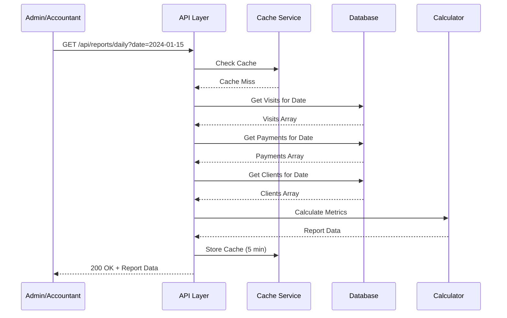
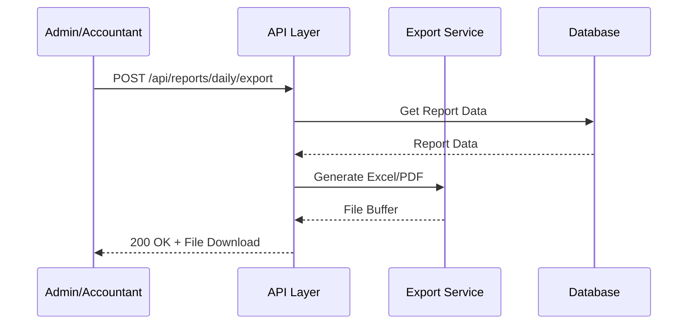
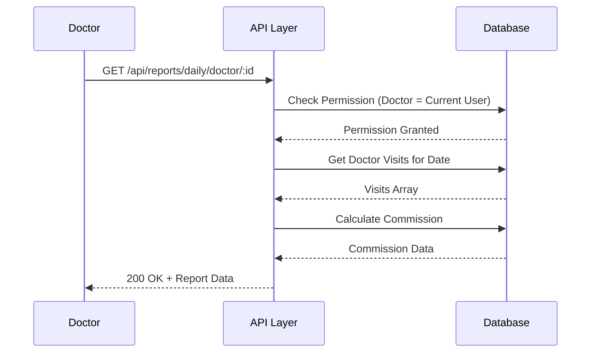

# 📄 FAYL: `19-daily-report-flow.md`

# 19. Kunlik Hisobot Boshqaruvi (Daily Report Management)

## 📋 UMUMIY MA'LUMOT

| Maydon | Qiymat |
|--------|--------|
| **Flow ID** | 19 |
| **Phase** | 3 - Reports & Analytics |
| **Model** | `Report` (Virtual - mavjud ma'lumotlardan hosil qilinadi) |
| **Status** | Draft |
| **Yaratilgan Sana** | 2024-01-15 |
| **Oxirgi Yangilanish** | 2024-01-15 |
| **Mas'ul** | Senior Backend Developer |
| **Bog'liq Modellar** | `Visit` (RFC-013), `Payment` (RFC-014), `Client` (RFC-009), `Service` (RFC-011), `User` (RFC-002) |

---

## 🎯 MAQSAD

Klinikani kunlik operatsiyalarini kuzatish va tahlil qilish uchun kunlik hisobotlarni shakllantirish. Kunlik visitlar soni, kirim summasi, shifokorlar yuklamasi, xona bandligi va yangi mijozlar statistikasini taqdim etish. Boshqaruv qarorlarini qabul qilish uchun tezkor ma'lumotlar bazasini yaratish (Reference: `Klinika.md` 7.1, 7.2).

---

## 👥 MAS'UL ROLLAR

| Rol | View | Export | Tavsif |
|-----|------|--------|--------|
| **Admin** | ✅ | ✅ | To'liq huquq - barcha kunlik hisobotlar |
| **Doctor** | ✅ (faqat o'zi) | ❌ | Faqat o'z kunlik ko'rsatkichlarini ko'rish |
| **Nurse** | ❌ | ❌ | Ruxsat yo'q |
| **Receptionist** | ✅ | ✅ | Kunlik operatsion hisobotlar |
| **Accountant** | ✅ | ✅ | Kunlik moliyaviy hisobotlar |

---

## 📊 HISOBOT TUZILISHI (Reference: `Klinika.md` 7.1, 7.2)

### Kunlik Hisobot Metrikalari

```

┌─────────────────────────────────────────────────────────────┐
│                    KUNLIK HISOBOT                           │
│                    (Daily Report)                           │
├─────────────────────────────────────────────────────────────┤
│  📊 ASOSIY KO'RSATKICHLAR                                   │
│  • Kunlik Visit Soni                                        │
│  • Kunlik Kirim Summasi                                     │
│  • O'rtacha Check (Average Bill)                            │
│  • Yangi Mijozlar Soni                                      │
│  • Qarzдор Mijozlar Soni                                    │
├─────────────────────────────────────────────────────────────┤
│  👨‍⚕️ SHIFOKOR YUKLAMASI                                      │
│  • Har bir shifokor visit soni                              │
│  • Har bir shifokor daromadi                                │
│  • Eng ko'p qabul qilgan shifokor                           │
├─────────────────────────────────────────────────────────────┤
│  🚪 XONA BANDLIGI                                           │
│  • Ishlatilgan xonalar soni                                 │
│  • Bandlik foizi (Occupancy Rate)                           │
│  • Eng ko'p ishlatilgan xonalar                             │
├─────────────────────────────────────────────────────────────┤
│  💰 MOLIYAVIY KO'RSATKICHLAR                                │
│  • Naqd to'lovlar                                           │
│  • Oldindan to'lovlar                                       │
│  • Qarzga to'lovlar                                         │
│  • Umumiy qarzdorlik                                        │
└─────────────────────────────────────────────────────────────┘

```

---

## 🔄 FLOW DIAGRAM

### 1. Kunlik Hisobot Yaratish Flow



### 2. Kunlik Hisobot Export Flow



### 3. Shifokor Kunlik Hisobot Flow



---

## 📝 BOSQICHMA-BOSQICH JARAYON

### BOSQICH 1: Kunlik Visit Statistikasi

#### 1.1. Ma'lumot Manbalari

```typescript
// Visit ma'lumotlari
interface DailyVisitStats {
  totalVisits: number;        // Jami visitlar
  completedVisits: number;    // Yakunlangan visitlar
  scheduledVisits: number;    // Rejalashtirilgan visitlar
  cancelledVisits: number;    // Bekor qilingan visitlar
  noShowVisits: number;       // Kelmagan mijozlar
  inProgressVisits: number;   // Jarayondagi visitlar
}
```

#### 1.2. Biznes Logika

```typescript
// daily-report.service.ts
async getDailyVisitStats(date: Date): Promise<DailyVisitStats> {
  const startOfDay = new Date(date.setHours(0, 0, 0, 0));
  const endOfDay = new Date(date.setHours(23, 59, 59, 999));

  // Jami visitlar
  const totalVisits = await this.prisma.visit.count({
    where: {
      visit_date: {
        gte: startOfDay,
        lt: endOfDay
      },
      deleted_at: null
    }
  });

  // Status bo'yicha visitlar
  const visitsByStatus = await this.prisma.visit.groupBy({
    by: ['status'],
    _count: { id: true },
    where: {
      visit_date: {
        gte: startOfDay,
        lt: endOfDay
      },
      deleted_at: null
    }
  });

  const stats: DailyVisitStats = {
    totalVisits,
    completedVisits: 0,
    scheduledVisits: 0,
    cancelledVisits: 0,
    noShowVisits: 0,
    inProgressVisits: 0
  };

  visitsByStatus.forEach(item => {
    switch (item.status) {
      case 'COMPLETED':
      case 'DONE':
        stats.completedVisits = item._count.id;
        break;
      case 'SCHEDULED':
        stats.scheduledVisits = item._count.id;
        break;
      case 'CANCELLED':
        stats.cancelledVisits = item._count.id;
        break;
      case 'NO_SHOW':
        stats.noShowVisits = item._count.id;
        break;
      case 'IN_PROGRESS':
        stats.inProgressVisits = item._count.id;
        break;
    }
  });

  return stats;
}
```

---

### BOSQICH 2: Kunlik Moliyaviy Statistikasi

#### 2.1. Ma'lumot Manbalari

```typescript
// Moliyaviy ma'lumotlar
interface DailyFinancialStats {
  totalIncome: number;        // Umumiy kirim
  totalPayment: number;       // To'lovlar yig'indisi
  totalPrepaid: number;       // Oldindan to'lovlar
  averageCheck: number;       // O'rtacha check
  totalDebt: number;          // Umumiy qarzdorlik
}
```

#### 2.2. Biznes Logika

```typescript
async getDailyFinancialStats(date: Date): Promise<DailyFinancialStats> {
  const startOfDay = new Date(date.setHours(0, 0, 0, 0));
  const endOfDay = new Date(date.setHours(23, 59, 59, 999));

  // Payment yig'indisi (INCOME)
  const paymentStats = await this.prisma.payment.aggregate({
    where: {
      payment_date: {
        gte: startOfDay,
        lt: endOfDay
      },
      payment_type: 'INCOME',
      deleted_at: null
    },
    _sum: { amount: true },
    _count: { id: true }
  });

  // ClientPaid yig'indisi
  const prepaidStats = await this.prisma.clientPaid.aggregate({
    where: {
      payment_date: {
        gte: startOfDay,
        lt: endOfDay
      },
      deleted_at: null
    },
    _sum: { amount: true }
  });

  // Visit yig'indisi
  const visitStats = await this.prisma.visit.aggregate({
    where: {
      visit_date: {
        gte: startOfDay,
        lt: endOfDay
      },
      deleted_at: null
    },
    _sum: { 
      total_amount: true,
      paid_amount: true,
      debt_amount: true
    },
    _count: { id: true }
  });

  const totalIncome = (paymentStats._sum.amount || 0) + (prepaidStats._sum.amount || 0);
  const totalPayment = paymentStats._sum.amount || 0;
  const totalPrepaid = prepaidStats._sum.amount || 0;
  const averageCheck = visitStats._count.id > 0 
    ? (visitStats._sum.total_amount || 0) / visitStats._count.id 
    : 0;
  const totalDebt = visitStats._sum.debt_amount || 0;

  return {
    totalIncome,
    totalPayment,
    totalPrepaid,
    averageCheck,
    totalDebt
  };
}
```

---

### BOSQICH 3: Shifokor Yuklamasi Statistikasi

#### 3.1. Ma'lumot Manbalari

```typescript
// Shifokor statistikasi
interface DoctorLoadStats {
  doctorId: number;
  doctorName: string;
  visitCount: number;
  totalAmount: number;
  commission: number;
}
```

#### 3.2. Biznes Logika

```typescript
async getDailyDoctorLoadStats(date: Date): Promise<DoctorLoadStats[]> {
  const startOfDay = new Date(date.setHours(0, 0, 0, 0));
  const endOfDay = new Date(date.setHours(23, 59, 59, 999));

  // Shifokorlar bo'yicha visitlar
  const doctorVisits = await this.prisma.visit.groupBy({
    by: ['doctor_id'],
    _count: { id: true },
    _sum: { total_amount: true },
    where: {
      visit_date: {
        gte: startOfDay,
        lt: endOfDay
      },
      deleted_at: null,
      doctor_id: { not: null }
    }
  });

  // Har bir shifokor uchun ma'lumotlarni olish
  const stats = await Promise.all(
    doctorVisits.map(async (item) => {
      const doctor = await this.prisma.user.findUnique({
        where: { id: item.doctor_id! },
        select: { id: true, full_name: true }
      });

      // Shifokor komissiyasini hisoblash
      const commission = await this.calculateDoctorCommission(
        item.doctor_id!,
        startOfDay,
        endOfDay
      );

      return {
        doctorId: item.doctor_id!,
        doctorName: doctor?.full_name || 'Noma\'lum',
        visitCount: item._count.id,
        totalAmount: item._sum.total_amount || 0,
        commission
      };
    })
  );

  // Visit soni bo'yicha sort
  return stats.sort((a, b) => b.visitCount - a.visitCount);
}

// Shifokor komissiyasini hisoblash
private async calculateDoctorCommission(
  doctorId: number, 
  startOfDay: Date, 
  endOfDay: Date
): Promise<number> {
  const visitServices = await this.prisma.visitService.findMany({
    where: {
      visit: {
        doctor_id: doctorId,
        visit_date: {
          gte: startOfDay,
          lt: endOfDay
        },
        deleted_at: null
      },
      deleted_at: null
    },
    include: {
      service: true
    }
  });

  let totalCommission = 0;

  for (const vs of visitServices) {
    const serviceUser = await this.prisma.serviceUser.findFirst({
      where: {
        service_id: vs.service_id,
        user_id: doctorId,
        status: 'ACTIVE',
        deleted_at: null
      }
    });

    if (serviceUser) {
      if (serviceUser.type === 'FIXED') {
        totalCommission += serviceUser.value.toNumber() * vs.quantity;
      } else if (serviceUser.type === 'PERCENT') {
        totalCommission += vs.service.price.toNumber() * (serviceUser.value.toNumber() / 100) * vs.quantity;
      }
    }
  }

  return totalCommission;
}
```

---

### BOSQICH 4: Xona Bandligi Statistikasi

#### 4.1. Ma'lumot Manbalari

```typescript
// Xona bandligi
interface RoomOccupancyStats {
  totalRooms: number;         // Jami xonalar
  usedRooms: number;          // Ishlatilgan xonalar
  occupancyRate: number;      // Bandlik foizi
  roomUsage: RoomUsage[];     // Har bir xona ishlatilishi
}

interface RoomUsage {
  roomId: number;
  roomName: string;
  usageCount: number;
  totalMinutes: number;
}
```

#### 4.2. Biznes Logika

```typescript
async getDailyRoomOccupancyStats(date: Date): Promise<RoomOccupancyStats> {
  const startOfDay = new Date(date.setHours(0, 0, 0, 0));
  const endOfDay = new Date(date.setHours(23, 59, 59, 999));

  // Jami aktiv xonalar
  const totalRooms = await this.prisma.room.count({
    where: {
      record_status: 'ACTIVE',
      deleted_at: null
    }
  });

  // Ishlatilgan xonalar (VisitRoom orqali)
  const roomUsage = await this.prisma.visitRoom.groupBy({
    by: ['room_id'],
    _count: { id: true },
    where: {
      created_at: {
        gte: startOfDay,
        lt: endOfDay
      },
      deleted_at: null
    }
  });

  const usedRooms = roomUsage.length;
  const occupancyRate = totalRooms > 0 ? (usedRooms / totalRooms) * 100 : 0;

  // Har bir xona ma'lumotlari
  const roomUsageDetails = await Promise.all(
    roomUsage.map(async (item) => {
      const room = await this.prisma.room.findUnique({
        where: { id: item.room_id! },
        select: { id: true, name: true }
      });

      return {
        roomId: item.room_id!,
        roomName: room?.name || 'Noma\'lum',
        usageCount: item._count.id,
        totalMinutes: 0 // VisitRoom.started_at va ended_at orqali hisoblash mumkin
      };
    })
  );

  return {
    totalRooms,
    usedRooms,
    occupancyRate,
    roomUsage: roomUsageDetails.sort((a, b) => b.usageCount - a.usageCount)
  };
}
```

---

### BOSQICH 5: Yangi Mijozlar Statistikasi

#### 5.1. Ma'lumot Manbalari

```typescript
// Yangi mijozlar
interface NewClientStats {
  totalNewClients: number;    // Jami yangi mijozlar
  bySource: SourceStats[];    // Manba bo'yicha
  byGender: GenderStats[];    // Jinsi bo'yicha
}

interface SourceStats {
  sourceId: number;
  sourceName: string;
  count: number;
}

interface GenderStats {
  gender: ClientGender;
  count: number;
}
```

#### 5.2. Biznes Logika

```typescript
async getDailyNewClientStats(date: Date): Promise<NewClientStats> {
  const startOfDay = new Date(date.setHours(0, 0, 0, 0));
  const endOfDay = new Date(date.setHours(23, 59, 59, 999));

  // Jami yangi mijozlar
  const totalNewClients = await this.prisma.client.count({
    where: {
      created_at: {
        gte: startOfDay,
        lt: endOfDay
      },
      deleted_at: null
    }
  });

  // Manba bo'yicha
  const bySource = await this.prisma.client.groupBy({
    by: ['source_id'],
    _count: { id: true },
    where: {
      created_at: {
        gte: startOfDay,
        lt: endOfDay
      },
      deleted_at: null,
      source_id: { not: null }
    }
  });

  // Jinsi bo'yicha
  const byGender = await this.prisma.client.groupBy({
    by: ['gender'],
    _count: { id: true },
    where: {
      created_at: {
        gte: startOfDay,
        lt: endOfDay
      },
      deleted_at: null
    }
  });

  // Source nomlarini olish
  const sourceDetails = await Promise.all(
    bySource.map(async (item) => {
      const source = await this.prisma.source.findUnique({
        where: { id: item.source_id! },
        select: { id: true, name: true }
      });

      return {
        sourceId: item.source_id!,
        sourceName: source?.name || 'Noma\'lum',
        count: item._count.id
      };
    })
  );

  const genderDetails = byGender.map(item => ({
    gender: item.gender,
    count: item._count.id
  }));

  return {
    totalNewClients,
    bySource: sourceDetails,
    byGender: genderDetails
  };
}
```

---

## 🔌 API ENDPOINT'LAR

### 1. Kunlik Hisobotni Olish

| Parametr | Qiymat |
|----------|--------|
| **Method** | GET |
| **Endpoint** | `/api/v1/reports/daily` |
| **Auth** | ✅ JWT Required |
| **Rol** | Admin, Accountant, Receptionist |
| **Query Params** | `date` (YYYY-MM-DD format) |

**Request Example:**

```http
GET /api/v1/reports/daily?date=2024-01-15
```

**Response (200 OK):**

```json
{
  "success": true,
  "data": {
    "date": "2024-01-15",
    "visitStats": {
      "totalVisits": 45,
      "completedVisits": 38,
      "scheduledVisits": 5,
      "cancelledVisits": 2,
      "noShowVisits": 0,
      "inProgressVisits": 0
    },
    "financialStats": {
      "totalIncome": 15000000,
      "totalPayment": 12000000,
      "totalPrepaid": 3000000,
      "averageCheck": 333333,
      "totalDebt": 2500000
    },
    "doctorLoadStats": [
      {
        "doctorId": 2,
        "doctorName": "Dr. John Smith",
        "visitCount": 15,
        "totalAmount": 5000000,
        "commission": 1500000
      },
      {
        "doctorId": 3,
        "doctorName": "Dr. Jane Doe",
        "visitCount": 12,
        "totalAmount": 4000000,
        "commission": 1200000
      }
    ],
    "roomOccupancyStats": {
      "totalRooms": 10,
      "usedRooms": 8,
      "occupancyRate": 80,
      "roomUsage": [
        {
          "roomId": 1,
          "roomName": "Terapiya Kabineti 1",
          "usageCount": 5,
          "totalMinutes": 150
        }
      ]
    },
    "newClientStats": {
      "totalNewClients": 8,
      "bySource": [
        {
          "sourceId": 1,
          "sourceName": "Instagram",
          "count": 3
        },
        {
          "sourceId": 2,
          "sourceName": "Telegram",
          "count": 2
        }
      ],
      "byGender": [
        { "gender": "MALE", "count": 5 },
        { "gender": "FEMALE", "count": 3 }
      ]
    }
  }
}
```

---

### 2. Kunlik Hisobot Export (Excel)

| Parametr | Qiymat |
|----------|--------|
| **Method** | POST |
| **Endpoint** | `/api/v1/reports/daily/export` |
| **Auth** | ✅ JWT Required |
| **Rol** | Admin, Accountant |
| **Content-Type** | application/json |

**Request Body:**

```json
{
  "date": "2024-01-15",
  "format": "excel"
}
```

**Response:** File Download (application/vnd.openxmlformats-officedocument.spreadsheetml.sheet)

---

### 3. Shifokor Kunlik Hisoboti

| Parametr | Qiymat |
|----------|--------|
| **Method** | GET |
| **Endpoint** | `/api/v1/reports/daily/doctor/:doctorId` |
| **Auth** | ✅ JWT Required |
| **Rol** | Admin, Doctor (faqat o'zi) |

**Response (200 OK):**

```json
{
  "success": true,
  "data": {
    "doctorId": 2,
    "doctorName": "Dr. John Smith",
    "date": "2024-01-15",
    "visitCount": 15,
    "totalAmount": 5000000,
    "commission": 1500000,
    "visits": [
      {
        "visitId": 1,
        "clientName": "John Doe",
        "status": "COMPLETED",
        "totalAmount": 300000,
        "commission": 90000
      }
    ]
  }
}
```

---

### 4. Kunlik Hisobot Trendi (Solishtirma)

| Parametr | Qiymat |
|----------|--------|
| **Method** | GET |
| **Endpoint** | `/api/v1/reports/daily/trend` |
| **Auth** | ✅ JWT Required |
| **Rol** | Admin, Accountant |

**Query Params:**

```
GET /api/v1/reports/daily/trend?date=2024-01-15&compare_days=7
```

**Response (200 OK):**

```json
{
  "success": true,
  "data": {
    "currentDate": "2024-01-15",
    "previousDate": "2024-01-08",
    "visitChange": {
      "current": 45,
      "previous": 40,
      "change": 5,
      "changePercent": 12.5
    },
    "incomeChange": {
      "current": 15000000,
      "previous": 13000000,
      "change": 2000000,
      "changePercent": 15.4
    }
  }
}
```

---

## ⚠️ XATOLIKLAR VA HANDLING

| Kod | HTTP Status | Xabar | Sabab | Yechim |
|-----|-------------|-------|-------|--------|
| `RPT_001` | 400 Bad Request | Sana formati noto'g'ri | Invalid date format | YYYY-MM-DD format kiriting |
| `RPT_002` | 400 Bad Request | Sana kelajakda bo'lmasligi kerak | Future date not allowed | O'tgan kun tanlang |
| `RPT_003` | 403 Forbidden | Ruxsat yo'q | Insufficient permissions | Rol tekshirilsin |
| `RPT_004` | 404 Not Found | Hisobot ma'lumotlari topilmadi | No data for date | Boshqa sana tanlang |
| `RPT_005` | 500 Internal Server Error | Hisobot yaratishda xatolik | Calculation error | Admin bilan bog'laning |

---

## 📦 CACHE STRATEGY (Reference: `Klinika.md` 9.1)

### Caching Configuration

| Data | Cache | TTL | Invalidation |
|------|-------|-----|--------------|
| Daily Report | Redis | 5 daqiqa | Visit create/update/delete |
| Doctor Stats | Redis | 10 daqiqa | Visit complete |
| Financial Stats | Redis | 5 daqiqa | Payment create/update |
| Room Occupancy | Redis | 5 daqiqa | VisitRoom create/update |

### Cache Implementation

```typescript
// Cache service
async getDailyReport(date: Date): Promise<DailyReport> {
  const cacheKey = `daily_report:${date.toISOString().split('T')[0]}`;
  
  // Cache dan olish
  const cached = await this.cacheService.get(cacheKey);
  if (cached) {
    return cached;
  }
  
  // DB dan hisoblash
  const report = await this.calculateDailyReport(date);
  
  // Cache ga saqlash (5 daqiqa)
  await this.cacheService.set(cacheKey, report, { ttl: 300 });
  
  return report;
}

// Cache invalidation
async invalidateDailyReportCache(date: Date): Promise<void> {
  const cacheKey = `daily_report:${date.toISOString().split('T')[0]}`;
  await this.cacheService.del(cacheKey);
}
```

---

## 🔐 XAVFSIZLIK TALABLARI (Reference: `Klinika.md` 8)

### 1. Autentifikatsiya

- ✅ Barcha endpoint'lar JWT token talab qiladi
- ✅ Token expiry: 24 soat

### 2. Avtorizatsiya (RBAC) (Reference: `Klinika.md` 6.1)

| Endpoint | Admin | Doctor | Nurse | Receptionist | Accountant |
|----------|-------|--------|-------|--------------|------------|
| GET /reports/daily | ✅ | ❌ | ❌ | ✅ | ✅ |
| POST /reports/daily/export | ✅ | ❌ | ❌ | ❌ | ✅ |
| GET /reports/daily/doctor/:id | ✅ | ✅ (o'zi) | ❌ | ❌ | ✅ |
| GET /reports/daily/trend | ✅ | ❌ | ❌ | ❌ | ✅ |

### 3. Audit (Reference: `Klinika.md` 5.2)

- ✅ Hisobot ko'rish harakati log qilinadi
- ✅ Export harakati log qilinadi
- ✅ Kim, qachon, qaysi hisobotni ko'rganligi saqlanadi

### 4. Ma'lumotlar Xavfsizligi (Reference: `Klinika.md` 8.1)

- ✅ Doctor faqat o'z hisobotini ko'ra oladi
- ✅ Moliyaviy ma'lumotlar faqat Admin/Accountant uchun
- ✅ Export fayllar vaqtinchalik saqlanadi (24 soat)

---

## 📝 ESLATMALAR

1. **Virtual Report** - Kunlik hisobot alohida jadvalda saqlanmaydi, mavjud ma'lumotlardan real-time hosil qilinadi
2. **Cache** - Hisobot ma'lumotlari 5 daqiqa cache qilinadi (performance uchun)
3. **Date Range** - Kelajak sana uchun hisobot yaratish mumkin emas
4. **RBAC** - Har bir rol faqat o'ziga tegishli ma'lumotlarni ko'ra oladi
5. **Export** - Excel/PDF export 24 soat davomida yuklab olish mumkin
6. **Timezone** - Barcha vaqtlar UTC timezone da saqlanadi, lokal vaqtga konvertatsiya qilinadi
7. **Decimal Precision** - Barcha moliyaviy summalar Decimal(15,2) formatda
8. **Performance** - Hisobot yaratish vaqti < 5 soniya bo'lishi kerak

---

## ✅ QABUL QILISH MEZONLARI (ACCEPTANCE CRITERIA)

### Functional Requirements

- [ ] Kunlik visit statistikasi to'g'ri hisoblanishi
- [ ] Kunlik moliyaviy statistika to'g'ri hisoblanishi
- [ ] Shifokor yuklamasi to'g'ri hisoblanishi
- [ ] Xona bandligi to'g'ri hisoblanishi
- [ ] Yangi mijozlar statistikasi to'g'ri hisoblanishi
- [ ] Cache strategiyasi ishlashi (5 daqiqa TTL)
- [ ] Export funksiyasi ishlashi (Excel/PDF)
- [ ] RBAC to'g'ri ishlashi (Doctor faqat o'zi)
- [ ] Sana validatsiyasi ishlashi (kelajak sana taqiqlangan)
- [ ] Xatoliklar to'g'ri HTTP status va kod bilan qaytarilishi

### Non-Functional Requirements (Reference: `Klinika.md` 9.1)

- [ ] API response time < 5 seconds (hisobot yaratish)
- [ ] Cache hit rate > 80%
- [ ] Export generation time < 10 seconds
- [ ] Concurrent users 50+ qo'llab-quvvatlanadi
- [ ] Data accuracy 100%
