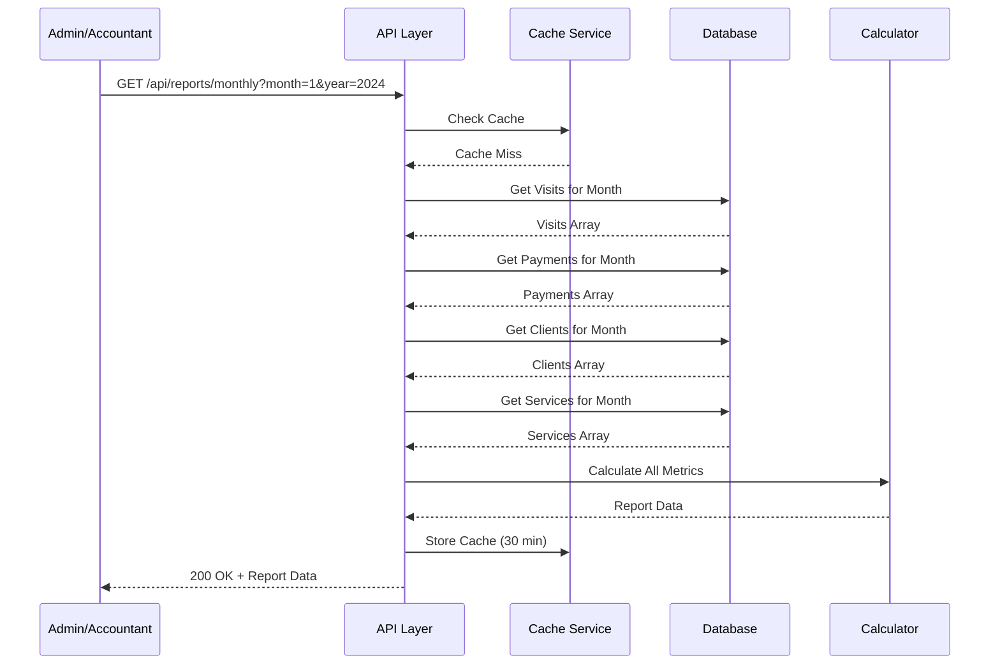
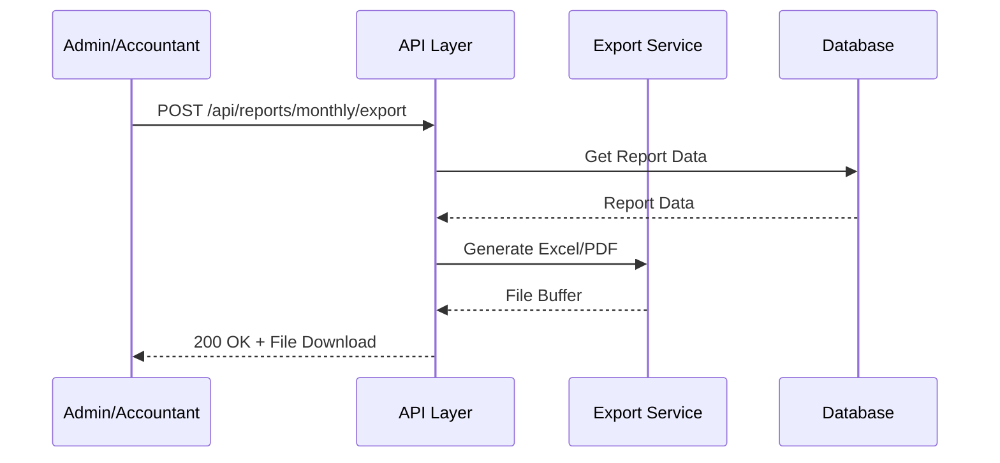
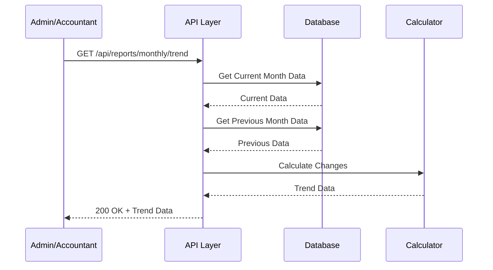
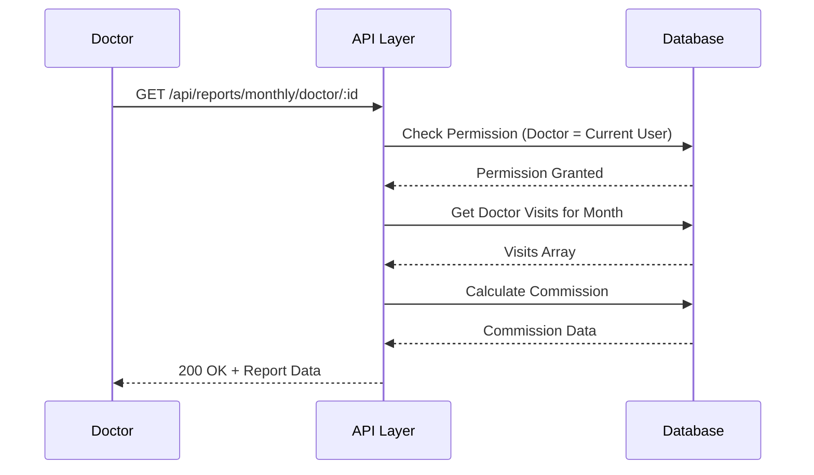

# 📄 FAYL: `20-monthly-report-management.md`

# 20. Oylik Hisobot Boshqaruvi (Monthly Report Management)

## 📋 UMUMIY MA'LUMOT

| Maydon | Qiymat |
|--------|--------|
| **Flow ID** | 20 |
| **Phase** | 3 - Reports & Analytics |
| **Model** | `Report` (Virtual - mavjud ma'lumotlardan hosil qilinadi) |
| **Status** | Draft |
| **Yaratilgan Sana** | 2024-01-15 |
| **Oxirgi Yangilanish** | 2024-01-15 |
| **Mas'ul** | Senior Backend Developer |
| **Bog'liq Modellar** | `Visit` (RFC-013), `Payment` (RFC-014), `Client` (RFC-009), `Service` (RFC-011), `User` (RFC-002) |

---

## 🎯 MAQSAD

Klinikani oylik operatsiyalarini kuzatish va tahlil qilish uchun oylik hisobotlarni shakllantirish. Oylik visitlar soni, kirim summasi, shifokorlar yuklamasi, xona bandligi va yangi mijozlar statistikasini taqdim etish. Strategik boshqaruv qarorlarini qabul qilish uchun oylik ma'lumotlar bazasini yaratish (Reference: `Klinika.md` 7.1, 7.2).

---

## 👥 MAS'UL ROLLAR

| Rol | View | Export | Tavsif |
|-----|------|--------|--------|
| **Admin** | ✅ | ✅ | To'liq huquq - barcha oylik hisobotlar |
| **Doctor** | ✅ (faqat o'zi) | ❌ | Faqat o'z oylik ko'rsatkichlarini ko'rish |
| **Nurse** | ❌ | ❌ | Ruxsat yo'q |
| **Receptionist** | ❌ | ❌ | Ruxsat yo'q |
| **Accountant** | ✅ | ✅ | Oylik moliyaviy hisobotlar |

---

## 📊 HISOBOT TUZILISHI (Reference: `Klinika.md` 7.1, 7.2)

### Oylik Hisobot Metrikalari

```
┌─────────────────────────────────────────────────────────────┐
│                    OYLIK HISOBOT                            │
│                   (Monthly Report)                          │
├─────────────────────────────────────────────────────────────┤
│  📊 ASOSIY KO'RSATKICHLAR                                   │
│  • Oylik Visit Soni                                         │
│  • Oylik Kirim Summasi                                      │
│  • O'rtacha Check (Average Bill)                            │
│  • Yangi Mijozlar Soni                                      │
│  • Mijoz Qaytish Foizi (Retention Rate)                     │
│  • Qarzдор Mijozlar Soni                                    │
├─────────────────────────────────────────────────────────────┤
│  👨‍⚕️ SHIFOKOR YUKLAMASI                                      │
│  • Har bir shifokor visit soni                              │
│  • Har bir shifokor daromadi                                │
│  • Har bir shifokor komissiyasi                             │
│  • Eng ko'p qabul qilgan shifokor                           │
├─────────────────────────────────────────────────────────────┤
│  🚪 XONA BANDLIGI                                           │
│  • Ishlatilgan xonalar soni                                 │
│  • Bandlik foizi (Occupancy Rate)                           │
│  • Eng ko'p ishlatilgan xonalar                             │
├─────────────────────────────────────────────────────────────┤
│  💰 MOLIYAVIY KO'RSATKICHLAR                                │
│  • Naqd to'lovlar                                           │
│  • Oldindan to'lovlar                                       │
│  • Boshqa kirimlar                                          │
│  • Chiqimlar (OtherPaid OUTCOME)                            │
│  • Foyda (Income - Outcome)                                 │
│  • Umumiy qarzdorlik                                        │
├─────────────────────────────────────────────────────────────┤
│  🏥 XIZMATLAR STATISTIKASI                                  │
│  • Eng talabgir xizmatlar                                   │
│  • Har bir xizmat dan daromad                               │
│  • Xizmatlar ulushi (%)                                     │
├─────────────────────────────────────────────────────────────┤
│  📈 SOLISHTIRMA (TREND)                                     │
│  • Oldingi oy bilan solishtirma                             │
│  • O'sish foizi (%)                                         │
│  • Trend (o'sish/_pasayish)                                 │
└─────────────────────────────────────────────────────────────┘
```

---

## 🔄 FLOW DIAGRAM

### 1. Oylik Hisobot Yaratish Flow



### 2. Oylik Hisobot Export Flow



### 3. Oylik Trend Hisobot Flow



### 4. Shifokor Oylik Hisobot Flow



---

## 📝 BOSQICHMA-BOSQICH JARAYON

### BOSQICH 1: Oylik Visit Statistikasi

#### 1.1. Ma'lumot Manbalari

```typescript
// Visit ma'lumotlari
interface MonthlyVisitStats {
  totalVisits: number;        // Jami visitlar
  completedVisits: number;    // Yakunlangan visitlar
  scheduledVisits: number;    // Rejalashtirilgan visitlar
  cancelledVisits: number;    // Bekor qilingan visitlar
  noShowVisits: number;       // Kelmagan mijozlar
  inProgressVisits: number;   // Jarayondagi visitlar
  averageVisitsPerDay: number; // Kunlik o'rtacha
}
```

#### 1.2. Biznes Logika

```typescript
// monthly-report.service.ts
async getMonthlyVisitStats(month: number, year: number): Promise<MonthlyVisitStats> {
  const startDate = new Date(year, month - 1, 1);
  const endDate = new Date(year, month, 0, 23, 59, 59, 999);
  const daysInMonth = endDate.getDate();

  // Jami visitlar
  const totalVisits = await this.prisma.visit.count({
    where: {
      visit_date: {
        gte: startDate,
        lt: endDate
      },
      deleted_at: null
    }
  });

  // Status bo'yicha visitlar
  const visitsByStatus = await this.prisma.visit.groupBy({
    by: ['status'],
    _count: { id: true },
    where: {
      visit_date: {
        gte: startDate,
        lt: endDate
      },
      deleted_at: null
    }
  });

  const stats: MonthlyVisitStats = {
    totalVisits,
    completedVisits: 0,
    scheduledVisits: 0,
    cancelledVisits: 0,
    noShowVisits: 0,
    inProgressVisits: 0,
    averageVisitsPerDay: 0
  };

  visitsByStatus.forEach(item => {
    switch (item.status) {
      case 'COMPLETED':
      case 'DONE':
        stats.completedVisits = item._count.id;
        break;
      case 'SCHEDULED':
        stats.scheduledVisits = item._count.id;
        break;
      case 'CANCELLED':
        stats.cancelledVisits = item._count.id;
        break;
      case 'NO_SHOW':
        stats.noShowVisits = item._count.id;
        break;
      case 'IN_PROGRESS':
        stats.inProgressVisits = item._count.id;
        break;
    }
  });

  stats.averageVisitsPerDay = daysInMonth > 0 
    ? Math.round((totalVisits / daysInMonth) * 10) / 10 
    : 0;

  return stats;
}
```

---

### BOSQICH 2: Oylik Moliyaviy Statistikasi

#### 2.1. Ma'lumot Manbalari

```typescript
// Moliyaviy ma'lumotlar
interface MonthlyFinancialStats {
  totalIncome: number;        // Umumiy kirim
  totalPayment: number;       // To'lovlar yig'indisi
  totalPrepaid: number;       // Oldindan to'lovlar
  totalOutcome: number;       // Umumiy chiqim
  averageCheck: number;       // O'rtacha check
  totalDebt: number;          // Umumiy qarzdorlik
  profit: number;             // Foyda (Income - Outcome)
}
```

#### 2.2. Biznes Logika

```typescript
async getMonthlyFinancialStats(month: number, year: number): Promise<MonthlyFinancialStats> {
  const startDate = new Date(year, month - 1, 1);
  const endDate = new Date(year, month, 0, 23, 59, 59, 999);

  // Payment yig'indisi (INCOME)
  const paymentStats = await this.prisma.payment.aggregate({
    where: {
      payment_date: {
        gte: startDate,
        lt: endDate
      },
      payment_type: 'INCOME',
      deleted_at: null
    },
    _sum: { amount: true },
    _count: { id: true }
  });

  // ClientPaid yig'indisi
  const prepaidStats = await this.prisma.clientPaid.aggregate({
    where: {
      payment_date: {
        gte: startDate,
        lt: endDate
      },
      deleted_at: null
    },
    _sum: { amount: true }
  });

  // OtherPaid OUTCOME yig'indisi
  const outcomeStats = await this.prisma.otherPaid.aggregate({
    where: {
      payment_date: {
        gte: startDate,
        lt: endDate
      },
      type: 'OUTCOME',
      deleted_at: null
    },
    _sum: { amount: true }
  });

  // Visit yig'indisi
  const visitStats = await this.prisma.visit.aggregate({
    where: {
      visit_date: {
        gte: startDate,
        lt: endDate
      },
      deleted_at: null
    },
    _sum: { 
      total_amount: true,
      paid_amount: true,
      debt_amount: true
    },
    _count: { id: true }
  });

  const totalIncome = (paymentStats._sum.amount || 0) + (prepaidStats._sum.amount || 0);
  const totalPayment = paymentStats._sum.amount || 0;
  const totalPrepaid = prepaidStats._sum.amount || 0;
  const totalOutcome = outcomeStats._sum.amount || 0;
  const averageCheck = visitStats._count.id > 0 
    ? Math.round(((visitStats._sum.total_amount || 0) / visitStats._count.id) * 100) / 100
    : 0;
  const totalDebt = visitStats._sum.debt_amount || 0;
  const profit = totalIncome - totalOutcome;

  return {
    totalIncome,
    totalPayment,
    totalPrepaid,
    totalOutcome,
    averageCheck,
    totalDebt,
    profit
  };
}
```

---

### BOSQICH 3: Shifokor Yuklamasi Statistikasi

#### 3.1. Ma'lumot Manbalari

```typescript
// Shifokor statistikasi
interface DoctorLoadStats {
  doctorId: number;
  doctorName: string;
  visitCount: number;
  totalAmount: number;
  commission: number;
  averagePerVisit: number;
}
```

#### 3.2. Biznes Logika

```typescript
async getMonthlyDoctorLoadStats(month: number, year: number): Promise<DoctorLoadStats[]> {
  const startDate = new Date(year, month - 1, 1);
  const endDate = new Date(year, month, 0, 23, 59, 59, 999);

  // Shifokorlar bo'yicha visitlar
  const doctorVisits = await this.prisma.visit.groupBy({
    by: ['doctor_id'],
    _count: { id: true },
    _sum: { total_amount: true },
    where: {
      visit_date: {
        gte: startDate,
        lt: endDate
      },
      deleted_at: null,
      doctor_id: { not: null }
    }
  });

  // Har bir shifokor uchun ma'lumotlarni olish
  const stats = await Promise.all(
    doctorVisits.map(async (item) => {
      const doctor = await this.prisma.user.findUnique({
        where: { id: item.doctor_id! },
        select: { id: true, full_name: true }
      });

      // Shifokor komissiyasini hisoblash
      const commission = await this.calculateDoctorCommission(
        item.doctor_id!,
        startDate,
        endDate
      );

      const averagePerVisit = item._count.id > 0
        ? Math.round((item._sum.total_amount! / item._count.id) * 100) / 100
        : 0;

      return {
        doctorId: item.doctor_id!,
        doctorName: doctor?.full_name || 'Noma\'lum',
        visitCount: item._count.id,
        totalAmount: item._sum.total_amount || 0,
        commission,
        averagePerVisit
      };
    })
  );

  // Visit soni bo'yicha sort
  return stats.sort((a, b) => b.visitCount - a.visitCount);
}

// Shifokor komissiyasini hisoblash
private async calculateDoctorCommission(
  doctorId: number, 
  startDate: Date, 
  endDate: Date
): Promise<number> {
  const visitServices = await this.prisma.visitService.findMany({
    where: {
      visit: {
        doctor_id: doctorId,
        visit_date: {
          gte: startDate,
          lt: endDate
        },
        deleted_at: null
      },
      deleted_at: null
    },
    include: {
      service: true
    }
  });

  let totalCommission = 0;

  for (const vs of visitServices) {
    const serviceUser = await this.prisma.serviceUser.findFirst({
      where: {
        service_id: vs.service_id,
        user_id: doctorId,
        status: 'ACTIVE',
        deleted_at: null
      }
    });

    if (serviceUser) {
      if (serviceUser.type === 'FIXED') {
        totalCommission += serviceUser.value.toNumber() * vs.quantity;
      } else if (serviceUser.type === 'PERCENT') {
        totalCommission += vs.service.price.toNumber() * (serviceUser.value.toNumber() / 100) * vs.quantity;
      }
    }
  }

  return totalCommission;
}
```

---

### BOSQICH 4: Xona Bandligi Statistikasi

#### 4.1. Ma'lumot Manbalari

```typescript
// Xona bandligi
interface RoomOccupancyStats {
  totalRooms: number;         // Jami xonalar
  totalUsage: number;         // Jami ishlatilish
  averageOccupancyRate: number; // O'rtacha bandlik foizi
  roomUsage: RoomUsage[];     // Har bir xona ishlatilishi
}

interface RoomUsage {
  roomId: number;
  roomName: string;
  usageCount: number;
  totalMinutes: number;
  occupancyRate: number;
}
```

#### 4.2. Biznes Logika

```typescript
async getMonthlyRoomOccupancyStats(month: number, year: number): Promise<RoomOccupancyStats> {
  const startDate = new Date(year, month - 1, 1);
  const endDate = new Date(year, month, 0, 23, 59, 59, 999);
  const daysInMonth = endDate.getDate();
  const totalMinutesInMonth = daysInMonth * 24 * 60;

  // Jami aktiv xonalar
  const totalRooms = await this.prisma.room.count({
    where: {
      record_status: 'ACTIVE',
      deleted_at: null
    }
  });

  // Xona ishlatilishi (VisitRoom orqali)
  const roomUsage = await this.prisma.visitRoom.groupBy({
    by: ['room_id'],
    _count: { id: true },
    where: {
      created_at: {
        gte: startDate,
        lt: endDate
      },
      deleted_at: null
    }
  });

  const totalUsage = roomUsage.reduce((sum, item) => sum + item._count.id, 0);
  const averageOccupancyRate = totalRooms > 0 
    ? Math.round((totalUsage / (totalRooms * daysInMonth)) * 100 * 10) / 10
    : 0;

  // Har bir xona ma'lumotlari
  const roomUsageDetails = await Promise.all(
    roomUsage.map(async (item) => {
      const room = await this.prisma.room.findUnique({
        where: { id: item.room_id! },
        select: { id: true, name: true }
      });

      // Xona ishlatilish vaqtini hisoblash
      const visitRooms = await this.prisma.visitRoom.findMany({
        where: {
          room_id: item.room_id!,
          created_at: {
            gte: startDate,
            lt: endDate
          },
          deleted_at: null
        },
        select: {
          started_at: true,
          ended_at: true
        }
      });

      const totalMinutes = visitRooms.reduce((sum, vr) => {
        if (vr.started_at && vr.ended_at) {
          return sum + (new Date(vr.ended_at).getTime() - new Date(vr.started_at).getTime()) / 60000;
        }
        return sum;
      }, 0);

      const occupancyRate = totalMinutesInMonth > 0
        ? Math.round((totalMinutes / totalMinutesInMonth) * 100 * 10) / 10
        : 0;

      return {
        roomId: item.room_id!,
        roomName: room?.name || 'Noma\'lum',
        usageCount: item._count.id,
        totalMinutes: Math.round(totalMinutes),
        occupancyRate
      };
    })
  );

  return {
    totalRooms,
    totalUsage,
    averageOccupancyRate,
    roomUsage: roomUsageDetails.sort((a, b) => b.usageCount - a.usageCount)
  };
}
```

---

### BOSQICH 5: Yangi Mijozlar Statistikasi

#### 5.1. Ma'lumot Manbalari

```typescript
// Yangi mijozlar
interface NewClientStats {
  totalNewClients: number;    // Jami yangi mijozlar
  totalActiveClients: number; // Jami aktiv mijozlar
  retentionRate: number;      // Qaytish foizi
  bySource: SourceStats[];    // Manba bo'yicha
  byGender: GenderStats[];    // Jinsi bo'yicha
}

interface SourceStats {
  sourceId: number;
  sourceName: string;
  count: number;
  percentage: number;
}

interface GenderStats {
  gender: ClientGender;
  count: number;
  percentage: number;
}
```

#### 5.2. Biznes Logika

```typescript
async getMonthlyNewClientStats(month: number, year: number): Promise<NewClientStats> {
  const startDate = new Date(year, month - 1, 1);
  const endDate = new Date(year, month, 0, 23, 59, 59, 999);

  // Jami yangi mijozlar
  const totalNewClients = await this.prisma.client.count({
    where: {
      created_at: {
        gte: startDate,
        lt: endDate
      },
      deleted_at: null
    }
  });

  // Jami aktiv mijozlar
  const totalActiveClients = await this.prisma.client.count({
    where: {
      deleted_at: null,
      status: 'ACTIVE'
    }
  });

  // Manba bo'yicha
  const bySource = await this.prisma.client.groupBy({
    by: ['source_id'],
    _count: { id: true },
    where: {
      created_at: {
        gte: startDate,
        lt: endDate
      },
      deleted_at: null,
      source_id: { not: null }
    }
  });

  // Jinsi bo'yicha
  const byGender = await this.prisma.client.groupBy({
    by: ['gender'],
    _count: { id: true },
    where: {
      created_at: {
        gte: startDate,
        lt: endDate
      },
      deleted_at: null
    }
  });

  // Source nomlarini olish
  const sourceDetails = await Promise.all(
    bySource.map(async (item) => {
      const source = await this.prisma.source.findUnique({
        where: { id: item.source_id! },
        select: { id: true, name: true }
      });

      const percentage = totalNewClients > 0
        ? Math.round((item._count.id / totalNewClients) * 100 * 10) / 10
        : 0;

      return {
        sourceId: item.source_id!,
        sourceName: source?.name || 'Noma\'lum',
        count: item._count.id,
        percentage
      };
    })
  );

  const genderDetails = byGender.map(item => {
    const percentage = totalNewClients > 0
      ? Math.round((item._count.id / totalNewClients) * 100 * 10) / 10
      : 0;

    return {
      gender: item.gender,
      count: item._count.id,
      percentage
    };
  });

  // Retention rate hisoblash (oldingi oy mijozlari qanchasi qaytdi)
  const retentionRate = await this.calculateRetentionRate(startDate, endDate);

  return {
    totalNewClients,
    totalActiveClients,
    retentionRate,
    bySource: sourceDetails.sort((a, b) => b.count - a.count),
    byGender: genderDetails.sort((a, b) => b.count - a.count)
  };
}

// Retention rate hisoblash
private async calculateRetentionRate(startDate: Date, endDate: Date): Promise<number> {
  // Oldingi oy mijozlari
  const previousMonthStart = new Date(startDate);
  previousMonthStart.setMonth(previousMonthStart.getMonth() - 1);
  const previousMonthEnd = new Date(startDate);
  previousMonthEnd.setDate(0);

  const previousClients = await this.prisma.client.findMany({
    where: {
      created_at: {
        gte: previousMonthStart,
        lt: previousMonthEnd
      },
      deleted_at: null
    },
    select: { id: true }
  });

  // Joriy oyda qaytgan mijozlar
  const returnedClients = await this.prisma.visit.count({
    where: {
      visit_date: {
        gte: startDate,
        lt: endDate
      },
      client_id: {
        in: previousClients.map(c => c.id)
      },
      deleted_at: null
    },
    distinct: ['client_id']
  });

  return previousClients.length > 0
    ? Math.round((returnedClients / previousClients.length) * 100 * 10) / 10
    : 0;
}
```

---

### BOSQICH 6: Xizmatlar Statistikasi

#### 6.1. Ma'lumot Manbalari

```typescript
// Xizmatlar statistikasi
interface ServiceStats {
  serviceId: number;
  serviceName: string;
  count: number;
  totalAmount: number;
  percentage: number;
  averagePrice: number;
}
```

#### 6.2. Biznes Logika

```typescript
async getMonthlyServiceStats(month: number, year: number): Promise<ServiceStats[]> {
  const startDate = new Date(year, month - 1, 1);
  const endDate = new Date(year, month, 0, 23, 59, 59, 999);

  // Xizmatlar bo'yicha guruhlash
  const serviceStats = await this.prisma.visitService.groupBy({
    by: ['service_id'],
    _count: { id: true },
    _sum: { total: true },
    where: {
      created_at: {
        gte: startDate,
        lt: endDate
      },
      deleted_at: null
    }
  });

  // Jami summa
  const totalAmount = serviceStats.reduce((sum, item) => sum + (item._sum.total || 0), 0);

  // Har bir xizmat ma'lumotlari
  const stats = await Promise.all(
    serviceStats.map(async (item) => {
      const service = await this.prisma.service.findUnique({
        where: { id: item.service_id! },
        select: { id: true, name: true, price: true }
      });

      const percentage = totalAmount > 0
        ? Math.round(((item._sum.total || 0) / totalAmount) * 100 * 10) / 10
        : 0;

      const averagePrice = item._count.id > 0
        ? Math.round(((item._sum.total || 0) / item._count.id) * 100) / 100
        : 0;

      return {
        serviceId: item.service_id!,
        serviceName: service?.name || 'Noma\'lum',
        count: item._count.id,
        totalAmount: item._sum.total || 0,
        percentage,
        averagePrice
      };
    })
  );

  return stats.sort((a, b) => b.totalAmount - a.totalAmount);
}
```

---

### BOSQICH 7: Qarzdorlik Statistikasi

#### 7.1. Ma'lumot Manbalari

```typescript
// Qarzdorlik statistikasi
interface DebtStats {
  totalDebt: number;          // Umumiy qarzdorlik
  overdueDebt: number;        // Muddati o'tgan qarz
  debtRate: number;           // Qarzdorlik foizi
  topDebtors: DebtorStats[];  // Eng ko'p qarzдор mijozlar
  debtByAge: DebtAgeStats[];  // Qarz yoshi bo'yicha
}

interface DebtorStats {
  clientId: number;
  clientName: string;
  phone: string;
  debtAmount: number;
  daysOverdue: number;
  visitCount: number;
}

interface DebtAgeStats {
  age: string;
  amount: number;
  percentage: number;
}
```

#### 7.2. Biznes Logika

```typescript
async getMonthlyDebtStats(month: number, year: number): Promise<DebtStats> {
  const startDate = new Date(year, month - 1, 1);
  const endDate = new Date(year, month, 0, 23, 59, 59, 999);

  // Umumiy qarzdorlik
  const debtStats = await this.prisma.visit.aggregate({
    where: {
      visit_date: {
        gte: startDate,
        lt: endDate
      },
      deleted_at: null,
      debt_amount: { gt: 0 }
    },
    _sum: { debt_amount: true },
    _count: { id: true }
  });

  const totalDebt = debtStats._sum.debt_amount || 0;
  const totalAmount = await this.prisma.visit.aggregate({
    where: {
      visit_date: {
        gte: startDate,
        lt: endDate
      },
      deleted_at: null
    },
    _sum: { total_amount: true }
  });

  const debtRate = (totalAmount._sum.total_amount || 0) > 0
    ? Math.round((totalDebt / (totalAmount._sum.total_amount || 0)) * 100 * 10) / 10
    : 0;

  // Eng ko'p qarzдор mijozlar
  const topDebtors = await this.getTopDebtors(startDate, endDate);

  // Qarz yoshi bo'yicha
  const debtByAge = await this.getDebtByAge(startDate, endDate);

  // Muddati o'tgan qarz (30 kundan oshgan)
  const overdueDebt = await this.calculateOverdueDebt(endDate);

  return {
    totalDebt,
    overdueDebt,
    debtRate,
    topDebtors,
    debtByAge
  };
}

// Eng ko'p qarzдор mijozlar
private async getTopDebtors(startDate: Date, endDate: Date): Promise<DebtorStats[]> {
  const debtors = await this.prisma.client.findMany({
    where: {
      deleted_at: null,
      visits: {
        some: {
          visit_date: {
            gte: startDate,
            lt: endDate
          },
          debt_amount: { gt: 0 },
          deleted_at: null
        }
      }
    },
    select: {
      id: true,
      full_name: true,
      phone: true,
      visits: {
        where: {
          visit_date: {
            gte: startDate,
            lt: endDate
          },
          debt_amount: { gt: 0 },
          deleted_at: null
        },
        select: {
          debt_amount: true,
          visit_date: true
        }
      }
    },
    take: 10
  });

  return debtors.map(client => {
    const totalDebt = client.visits.reduce((sum, v) => sum + v.debt_amount.toNumber(), 0);
    const oldestVisit = client.visits.reduce((oldest, v) => 
      new Date(v.visit_date) < new Date(oldest) ? v.visit_date : oldest
    , client.visits[0].visit_date);
    
    const daysOverdue = Math.floor((new Date().getTime() - new Date(oldestVisit).getTime()) / (1000 * 60 * 60 * 24));

    return {
      clientId: client.id,
      clientName: client.full_name,
      phone: client.phone || '',
      debtAmount: totalDebt,
      daysOverdue,
      visitCount: client.visits.length
    };
  }).sort((a, b) => b.debtAmount - a.debtAmount);
}

// Qarz yoshi bo'yicha
private async getDebtByAge(startDate: Date, endDate: Date): Promise<DebtAgeStats[]> {
  const now = new Date();
  
  const debtByAge = [
    { age: '0-30 kun', min: 0, max: 30, amount: 0 },
    { age: '31-60 kun', min: 31, max: 60, amount: 0 },
    { age: '60+ kun', min: 61, max: 9999, amount: 0 }
  ];

  const debts = await this.prisma.visit.findMany({
    where: {
      visit_date: {
        gte: startDate,
        lt: endDate
      },
      debt_amount: { gt: 0 },
      deleted_at: null
    },
    select: {
      debt_amount: true,
      visit_date: true
    }
  });

  debts.forEach(debt => {
    const daysOld = Math.floor((now.getTime() - new Date(debt.visit_date).getTime()) / (1000 * 60 * 60 * 24));
    const ageGroup = debtByAge.find(group => daysOld >= group.min && daysOld <= group.max);
    if (ageGroup) {
      ageGroup.amount += debt.debt_amount.toNumber();
    }
  });

  const totalDebt = debtByAge.reduce((sum, group) => sum + group.amount, 0);

  return debtByAge.map(group => ({
    age: group.age,
    amount: group.amount,
    percentage: totalDebt > 0
      ? Math.round((group.amount / totalDebt) * 100 * 10) / 10
      : 0
  }));
}

// Muddati o'tgan qarz
private async calculateOverdueDebt(endDate: Date): Promise<number> {
  const overdueDate = new Date(endDate);
  overdueDate.setDate(overdueDate.getDate() - 30);

  const overdueStats = await this.prisma.visit.aggregate({
    where: {
      visit_date: {
        lt: overdueDate
      },
      debt_amount: { gt: 0 },
      deleted_at: null
    },
    _sum: { debt_amount: true }
  });

  return overdueStats._sum.debt_amount || 0;
}
```

---

### BOSQICH 8: Oylik Solishtirma (Trend)

#### 8.1. Biznes Logika

```typescript
async getMonthlyComparison(month: number, year: number): Promise<MonthlyComparison> {
  // Oldingi oy
  const previousMonth = month === 1 ? 12 : month - 1;
  const previousYear = month === 1 ? year - 1 : year;
  
  // Joriy oy hisoboti
  const currentReport = await this.getMonthlyReport(month, year, false);
  
  // Oldingi oy hisoboti
  const previousReport = await this.getMonthlyReport(previousMonth, previousYear, false);
  
  return {
    previousMonth,
    previousYear,
    visitChange: this.calculateChange(
      currentReport.visitStats.totalVisits,
      previousReport.visitStats.totalVisits
    ),
    incomeChange: this.calculateChange(
      currentReport.financialStats.totalIncome,
      previousReport.financialStats.totalIncome
    ),
    clientChange: this.calculateChange(
      currentReport.newClientStats.totalNewClients,
      previousReport.newClientStats.totalNewClients
    ),
    averageCheckChange: this.calculateChange(
      currentReport.financialStats.averageCheck,
      previousReport.financialStats.averageCheck
    )
  };
}

private calculateChange(current: number, previous: number): ChangeMetric {
  const change = current - previous;
  const changePercent = previous > 0 
    ? Math.round((change / previous) * 100 * 100) / 100 
    : 0;
  
  return {
    current,
    previous,
    change,
    changePercent
  };
}
```

---

## 🔌 API ENDPOINT'LAR

### 1. Oylik Hisobotni Olish

| Parametr | Qiymat |
|----------|--------|
| **Method** | GET |
| **Endpoint** | `/api/v1/reports/monthly` |
| **Auth** | ✅ JWT Required |
| **Rol** | Admin, Accountant |
| **Query Params** | `month`, `year`, `compare` |

**Request Example:**
```http
GET /api/v1/reports/monthly?month=1&year=2024&compare=true
```

**Response (200 OK):**
```json
{
  "success": true,
  "data": {
    "month": 1,
    "year": 2024,
    "period": {
      "from": "2024-01-01T00:00:00.000Z",
      "to": "2024-01-31T23:59:59.999Z"
    },
    "visitStats": {
      "totalVisits": 1350,
      "completedVisits": 1140,
      "scheduledVisits": 150,
      "cancelledVisits": 45,
      "noShowVisits": 15,
      "averageVisitsPerDay": 43.5
    },
    "financialStats": {
      "totalIncome": 450000000,
      "totalPayment": 400000000,
      "totalPrepaid": 90000000,
      "totalOutcome": 180000000,
      "averageCheck": 333333,
      "totalDebt": 75000000,
      "profit": 270000000
    },
    "doctorLoadStats": [...],
    "roomOccupancyStats": {...},
    "newClientStats": {...},
    "serviceStats": [...],
    "debtStats": {...},
    "comparison": {...}
  },
  "generatedAt": "2024-02-01T10:00:00.000Z",
  "cached": true
}
```

---

### 2. Oylik Hisobot Export (Excel/PDF)

| Parametr | Qiymat |
|----------|--------|
| **Method** | POST |
| **Endpoint** | `/api/v1/reports/monthly/export` |
| **Auth** | ✅ JWT Required |
| **Rol** | Admin, Accountant |

**Request Body:**
```json
{
  "month": 1,
  "year": 2024,
  "format": "excel",
  "includeDetails": true
}
```

**Response:** File Download

---

### 3. Shifokor Oylik Hisoboti

| Parametr | Qiymat |
|----------|--------|
| **Method** | GET |
| **Endpoint** | `/api/v1/reports/monthly/doctor/:doctorId` |
| **Auth** | ✅ JWT Required |
| **Rol** | Admin, Doctor (faqat o'zi), Accountant |

---

### 4. Oylik Trend Hisoboti

| Parametr | Qiymat |
|----------|--------|
| **Method** | GET |
| **Endpoint** | `/api/v1/reports/monthly/trend` |
| **Auth** | ✅ JWT Required |
| **Rol** | Admin, Accountant |

---

### 5. Xizmatlar Oylik Statistikasi

| Parametr | Qiymat |
|----------|--------|
| **Method** | GET |
| **Endpoint** | `/api/v1/reports/monthly/services` |
| **Auth** | ✅ JWT Required |
| **Rol** | Admin, Accountant |

---

### 6. Qarzdorlik Oylik Hisoboti

| Parametr | Qiymat |
|----------|--------|
| **Method** | GET |
| **Endpoint** | `/api/v1/reports/monthly/debt` |
| **Auth** | ✅ JWT Required |
| **Rol** | Admin, Accountant |

---

## ⚠️ XATOLIKLAR VA HANDLING

| Kod | HTTP Status | Xabar | Sabab | Yechim |
|-----|-------------|-------|-------|--------|
| `RPT_007` | 400 Bad Request | Oy noto'g'ri | Invalid month | 1-12 oralig'ida |
| `RPT_008` | 400 Bad Request | Yil noto'g'ri | Invalid year | 2020-2100 oralig'ida |
| `RPT_001` | 400 Bad Request | Sana formati noto'g'ri | Invalid date format | YYYY-MM-DD format |
| `RPT_002` | 400 Bad Request | Kelajak sana bo'lmasligi kerak | Future date | O'tgan oy tanlang |
| `RPT_003` | 403 Forbidden | Ruxsat yo'q | Insufficient permissions | Rol tekshirilsin |
| `RPT_005` | 404 Not Found | Hisobot ma'lumotlari topilmadi | No data for period | Boshqa period tanlang |
| `RPT_006` | 400 Bad Request | Export formati noto'g'ri | Invalid format | excel/pdf tanlang |
| `RPT_009` | 500 Internal Server Error | Hisobot yaratishda xatolik | Calculation error | Admin bilan bog'laning |

---

## 📦 CACHE STRATEGY (Reference: `Klinika.md` 9.1)

### Caching Configuration

| Data | Cache | TTL | Invalidation |
|------|-------|-----|--------------|
| Monthly Report | Redis | 30 daqiqa | Visit create/update/delete |
| Doctor Monthly Stats | Redis | 1 soat | Visit complete |
| Financial Monthly Stats | Redis | 30 daqiqa | Payment create/update |
| Export File | Redis | 24 soat | Automatic expiry |

### Cache Implementation

```typescript
async getMonthlyReport(month: number, year: number): Promise<MonthlyReport> {
  const cacheKey = `monthly_report:${year}-${month.toString().padStart(2, '0')}`;
  
  // Cache dan olish
  const cached = await this.cacheService.get(cacheKey);
  if (cached) {
    return { ...cached, cached: true };
  }
  
  // DB dan hisoblash
  const report = await this.calculateMonthlyReport(month, year);
  
  // Cache ga saqlash (30 daqiqa)
  await this.cacheService.set(cacheKey, report, { ttl: 1800 });
  
  return { ...report, cached: false };
}
```

---

## 🔐 XAVFSIZLIK TALABLARI (Reference: `Klinika.md` 8)

### 1. Autentifikatsiya
- ✅ Barcha endpoint'lar JWT token talab qiladi
- ✅ Token expiry: 24 soat

### 2. Avtorizatsiya (RBAC) (Reference: `Klinika.md` 6.1)

| Endpoint | Admin | Doctor | Nurse | Receptionist | Accountant |
|----------|-------|--------|-------|--------------|------------|
| GET /reports/monthly | ✅ | ❌ | ❌ | ❌ | ✅ |
| POST /reports/monthly/export | ✅ | ❌ | ❌ | ❌ | ✅ |
| GET /reports/monthly/doctor/:id | ✅ | ✅ (o'zi) | ❌ | ❌ | ✅ |
| GET /reports/monthly/trend | ✅ | ❌ | ❌ | ❌ | ✅ |
| GET /reports/monthly/services | ✅ | ❌ | ❌ | ❌ | ✅ |
| GET /reports/monthly/debt | ✅ | ❌ | ❌ | ❌ | ✅ |

### 3. Audit (Reference: `Klinika.md` 5.2)
- ✅ Hisobot ko'rish harakati log qilinadi
- ✅ Export harakati log qilinadi
- ✅ Kim, qachon, qaysi hisobotni ko'rganligi saqlanadi

### 4. Ma'lumotlar Xavfsizligi (Reference: `Klinika.md` 8.1)
- ✅ Doctor faqat o'z hisobotini ko'ra oladi
- ✅ Moliyaviy ma'lumotlar faqat Admin/Accountant uchun
- ✅ Export fayllar vaqtinchalik saqlanadi (24 soat)

---

## 📝 ESLATMALAR

1. **Virtual Report** - Oylik hisobot alohida jadvalda saqlanmaydi, mavjud ma'lumotlardan real-time hosil qilinadi
2. **Cache** - Hisobot ma'lumotlari 30 daqiqa cache qilinadi (performance uchun)
3. **Date Range** - Kelajak sana uchun hisobot yaratish mumkin emas
4. **RBAC** - Har bir rol faqat o'ziga tegishli ma'lumotlarni ko'ra oladi
5. **Export** - Excel/PDF export 24 soat davomida yuklab olish mumkin
6. **Timezone** - Barcha vaqtlar UTC timezone da saqlanadi, lokal vaqtga konvertatsiya qilinadi
7. **Decimal Precision** - Barcha moliyaviy summalar Decimal(15,2) formatda
8. **Performance** - Hisobot yaratish vaqti < 10 soniya bo'lishi kerak
9. **Comparison** - Oldingi oy bilan solishtirma avtomatik hisoblanadi
10. **Retention Rate** - Mijoz qaytish foizi oldingi oy mijozlari asosida hisoblanadi

---

## ✅ QABUL QILISH MEZONLARI (ACCEPTANCE CRITERIA)

### Functional Requirements
- [ ] Oylik visit statistikasi to'g'ri hisoblanishi
- [ ] Oylik moliyaviy statistika to'g'ri hisoblanishi
- [ ] Shifokor yuklamasi to'g'ri hisoblanishi
- [ ] Xona bandligi to'g'ri hisoblanishi
- [ ] Yangi mijozlar statistikasi to'g'ri hisoblanishi
- [ ] Xizmatlar statistikasi to'g'ri hisoblanishi
- [ ] Qarzdorlik statistikasi to'g'ri hisoblanishi
- [ ] Cache strategiyasi ishlashi (30 daqiqa TTL)
- [ ] Export funksiyasi ishlashi (Excel/PDF)
- [ ] RBAC to'g'ri ishlashi (Doctor faqat o'zi)
- [ ] Oy validatsiyasi ishlashi (1-12)
- [ ] Yil validatsiyasi ishlashi (2020-2100)
- [ ] Trend solishtirma ishlashi
- [ ] Xatoliklar to'g'ri HTTP status va kod bilan qaytarilishi

### Non-Functional Requirements (Reference: `Klinika.md` 9.1)
- [ ] API response time < 10 seconds (hisobot yaratish)
- [ ] API response time < 500ms (cached)
- [ ] Cache hit rate > 80%
- [ ] Export generation time < 15 seconds
- [ ] Unit test coverage ≥ 90%
- [ ] E2E test coverage ≥ 70%
- [ ] Security audit o'tkazildi
- [ ] Documentation to'liq
- [ ] Concurrent users 50+ qo'llab-quvvatlanadi
- [ ] Data retention 5 yil

---
