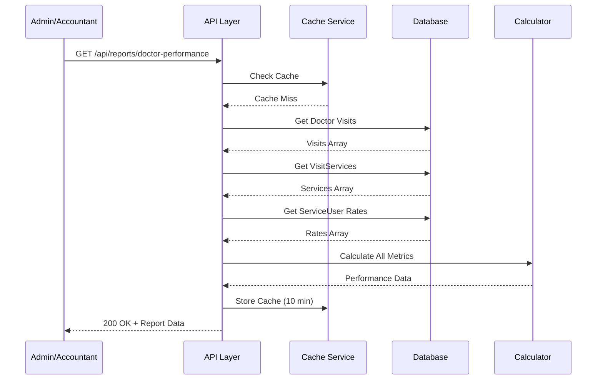
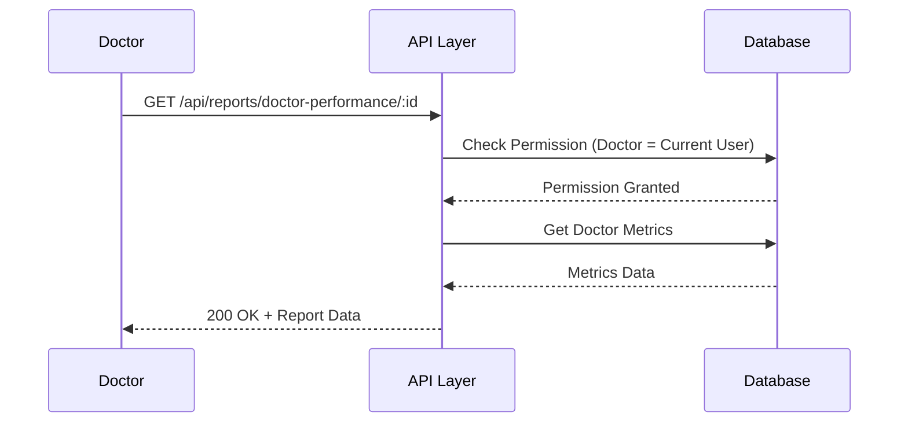
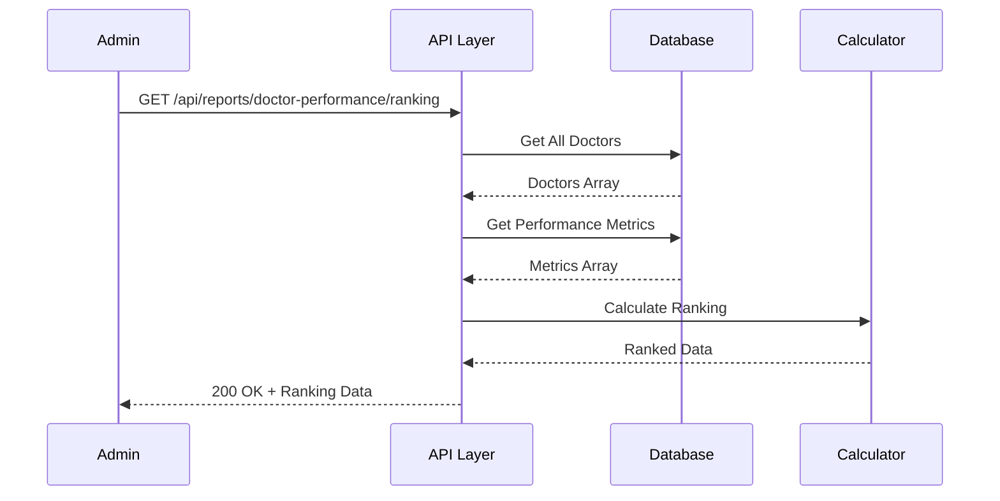
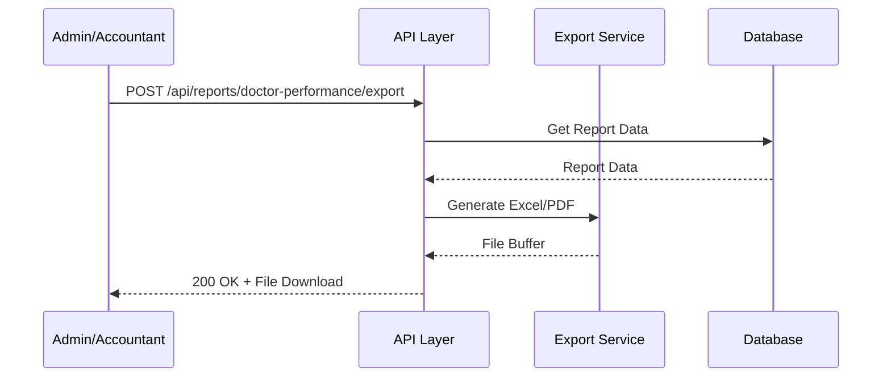

# 📄 FAYL: `21-doctor-performance-management.md`

# 21. Shifokor Ish Ko'rsatkichlari Boshqaruvi (Doctor Performance Management)

## 📋 UMUMIY MA'LUMOT

| Maydon | Qiymat |
|--------|--------|
| **Flow ID** | 21 |
| **Phase** | 3 - Reports & Analytics |
| **Model** | `Report` (Virtual - mavjud ma'lumotlardan hosil qilinadi) |
| **Status** | Draft |
| **Yaratilgan Sana** | 2024-01-15 |
| **Oxirgi Yangilanish** | 2024-01-15 |
| **Mas'ul** | Senior Backend Developer |
| **Bog'liq Modellar** | `User` (RFC-002), `Visit` (RFC-013), `ServiceUser` (RFC-018), `VisitService` |

---

## 🎯 MAQSAD

Shifokorlarning ish ko'rsatkichlarini kuzatish, tahlil qilish va hisobot qilish. Har bir shifokor uchun qabul qilingan bemorlar soni, ko'rsatilgan xizmatlar, daromad, komissiya va boshqa metrikalarni hisoblash. Shifokorlar yuklamasini optimallashtirish va rag'batlantirish tizimini yaratish (Reference: `Klinika.md` 7.1, 7.2).

---

## 👥 MAS'UL ROLLAR

| Rol | View | Export | Tavsif |
|-----|------|--------|--------|
| **Admin** | ✅ (barcha shifokorlar) | ✅ | To'liq huquq - barcha shifokor hisobotlari |
| **Doctor** | ✅ (faqat o'zi) | ❌ | Faqat o'z ko'rsatkichlarini ko'rish |
| **Nurse** | ❌ | ❌ | Ruxsat yo'q |
| **Receptionist** | ❌ | ❌ | Ruxsat yo'q |
| **Accountant** | ✅ (barcha shifokorlar) | ✅ | Moliyaviy hisobotlar uchun |

---

## 📊 HISOBOT TUZILISHI (Reference: `Klinika.md` 7.1, 7.2)

### Shifokor Ko'rsatkichlari Metrikalari

```
┌─────────────────────────────────────────────────────────────┐
│              SHIFOKOR ISH KO'RSATKICHLARI                   │
│              (Doctor Performance Metrics)                   │
├─────────────────────────────────────────────────────────────┤
│  📊 ASOSIY KO'RSATKICHLAR                                   │
│  • Qabul Qilingan Bemorlar Soni                            │
│  • Ko'rsatilgan Xizmatlar Soni                             │
│  • Jami Daromad (Total Revenue)                            │
│  • Shifokor Komissiyasi                                    │
│  • O'rtacha Check (Per Patient)                            │
│  • O'rtacha Qabul Vaqti                                    │
├─────────────────────────────────────────────────────────────┤
│  📈 VAQT BO'YICHA TAQSIMOT                                  │
│  • Kunlik Ko'rsatkichlar                                   │
│  • Haftalik Ko'rsatkichlar                                 │
│  • Oylik Ko'rsatkichlar                                    │
│  • Yillik Ko'rsatkichlar                                   │
├─────────────────────────────────────────────────────────────┤
│  🏥 XIZMATLAR BO'YICHA                                      │
│  • Eng Ko'p Ko'rsatilgan Xizmatlar                         │
│  • Har Bir Xizmat Dan Daromad                              │
│  • Xizmatlar Tuzilishi (%)                                 │
├─────────────────────────────────────────────────────────────┤
│  ⏰ VAQT METRIKALARI                                        │
│  • O'rtacha Qabul Davomiyligi                              │
│  • Ish Soatlari Samaradorligi                              │
│  • Bekor Qilingan Qabullar Foizi                           │
│  • No-Show Foizi                                           │
├─────────────────────────────────────────────────────────────┤
│  📊 SOLISHTIRMA (TREND)                                     │
│  • Oldingi Davr Bilan Solishtirma                          │
│  • O'sish/Pasayish Foizi                                   │
│  • Reyting (Boshqa Shifokorlar Bilan)                      │
└─────────────────────────────────────────────────────────────┘
```

---

## 🔄 FLOW DIAGRAM

### 1. Shifokor Ko'rsatkichlarini Hisoblash Flow



### 2. Bitta Shifokor Hisoboti Flow



### 3. Shifokorlar Reytingi Flow



### 4. Shifokor Hisoboti Export Flow



---

## 📝 BOSQICHMA-BOSQICH JARAYON

### BOSQICH 1: Shifokor Asosiy Ko'rsatkichlari

#### 1.1. Ma'lumot Manbalari

```typescript
// Shifokor ko'rsatkichlari
interface DoctorPerformanceMetrics {
  doctorId: number;
  doctorName: string;
  period: {
    from: Date;
    to: Date;
  };
  basicMetrics: BasicMetrics;
  financialMetrics: FinancialMetrics;
  serviceMetrics: ServiceMetrics;
  timeMetrics: TimeMetrics;
  visitStatusMetrics: VisitStatusMetrics;
}

interface BasicMetrics {
  totalVisits: number;        // Jami qabullar
  completedVisits: number;    // Yakunlangan qabullar
  cancelledVisits: number;    // Bekor qilingan
  noShowVisits: number;       // Kelmagan mijozlar
  totalPatients: number;      // Jami bemorlar (unikal)
  newPatients: number;        // Yangi bemorlar
  returningPatients: number;  // Qaytgan bemorlar
}

interface FinancialMetrics {
  totalRevenue: number;       // Jami daromad
  commission: number;         // Shifokor komissiyasi
  averageCheck: number;       // O'rtacha check
  averageCommission: number;  // O'rtacha komissiya
}

interface ServiceMetrics {
  totalServices: number;      // Jami xizmatlar
  topServices: TopService[];  // Eng ko'p xizmatlar
}

interface TimeMetrics {
  averageVisitDuration: number;  // O'rtacha qabul vaqti (daqiqa)
  workingHours: number;          // Ish soatlari
  efficiency: number;            // Samaradorlik foizi
}

interface VisitStatusMetrics {
  completionRate: number;   // Yakunlash foizi
  cancellationRate: number; // Bekor qilish foizi
  noShowRate: number;       // No-show foizi
}

interface TopService {
  serviceId: number;
  serviceName: string;
  count: number;
  revenue: number;
  commission: number;
}
```

#### 1.2. Biznes Logika

```typescript
// doctor-performance.service.ts
async getDoctorPerformance(
  doctorId: number,
  startDate: Date,
  endDate: Date,
  currentUserId: number,
  currentUserRole: string
): Promise<DoctorPerformanceMetrics> {
  // 1. RBAC tekshiruvi (Reference: Klinika.md 6.1)
  if (currentUserRole !== 'Admin' && currentUserRole !== 'Accountant' && currentUserId !== doctorId) {
    throw new ForbiddenException('DR_001');
  }

  // 2. Shifokor mavjudligini tekshirish
  const doctor = await this.prisma.user.findUnique({
    where: { id: doctorId },
    include: { role: true }
  });

  if (!doctor || doctor.deleted_at || doctor.role?.name !== 'Doctor') {
    throw new NotFoundException('DR_002');
  }

  // 3. Visitlarni olish
  const visits = await this.prisma.visit.findMany({
    where: {
      doctor_id: doctorId,
      visit_date: {
        gte: startDate,
        lt: endDate
      },
      deleted_at: null
    },
    include: {
      client: {
        select: {
          id: true,
          created_at: true
        }
      },
      visit_services: {
        include: {
          service: true
        }
      }
    }
  });

  // 4. Asosiy metrikalarni hisoblash
  const basicMetrics = await this.calculateBasicMetrics(visits, doctorId, startDate, endDate);
  
  // 5. Moliyaviy metrikalarni hisoblash
  const financialMetrics = await this.calculateFinancialMetrics(visits, doctorId, startDate, endDate);
  
  // 6. Xizmat metrikalarni hisoblash
  const serviceMetrics = await this.calculateServiceMetrics(visits);
  
  // 7. Vaqt metrikalarni hisoblash
  const timeMetrics = await this.calculateTimeMetrics(visits);
  
  // 8. Visit status metrikalarni hisoblash
  const visitStatusMetrics = this.calculateVisitStatusMetrics(visits);

  return {
    doctorId,
    doctorName: doctor.full_name,
    period: {
      from: startDate,
      to: endDate
    },
    basicMetrics,
    financialMetrics,
    serviceMetrics,
    timeMetrics,
    visitStatusMetrics
  };
}

// Asosiy metrikalarni hisoblash
private async calculateBasicMetrics(
  visits: Visit[],
  doctorId: number,
  startDate: Date,
  endDate: Date
): Promise<BasicMetrics> {
  const totalVisits = visits.length;
  
  const completedVisits = visits.filter(v => 
    v.status === 'COMPLETED' || v.status === 'DONE'
  ).length;
  
  const cancelledVisits = visits.filter(v => v.status === 'CANCELLED').length;
  const noShowVisits = visits.filter(v => v.status === 'NO_SHOW').length;
  
  // Unikal bemorlar
  const uniquePatients = new Set(visits.map(v => v.client_id));
  const totalPatients = uniquePatients.size;
  
  // Yangi bemorlar (shifokorda birinchi marta)
  const newPatients = await this.prisma.visit.count({
    where: {
      doctor_id: doctorId,
      client_id: {
        in: Array.from(uniquePatients)
      },
      visit_date: {
        lt: startDate
      },
      deleted_at: null
    },
    distinct: ['client_id']
  });
  
  const returningPatients = totalPatients - newPatients;

  return {
    totalVisits,
    completedVisits,
    cancelledVisits,
    noShowVisits,
    totalPatients,
    newPatients,
    returningPatients
  };
}

// Moliyaviy metrikalarni hisoblash
private async calculateFinancialMetrics(
  visits: Visit[],
  doctorId: number,
  startDate: Date,
  endDate: Date
): Promise<FinancialMetrics> {
  const totalRevenue = visits.reduce((sum, v) => sum + v.total_amount.toNumber(), 0);
  
  // Komissiyani hisoblash
  let commission = 0;
  
  for (const visit of visits) {
    for (const vs of visit.visit_services) {
      const serviceUser = await this.prisma.serviceUser.findFirst({
        where: {
          service_id: vs.service_id,
          user_id: doctorId,
          status: 'ACTIVE',
          deleted_at: null
        }
      });
      
      if (serviceUser) {
        if (serviceUser.type === 'FIXED') {
          commission += serviceUser.value.toNumber() * vs.quantity;
        } else if (serviceUser.type === 'PERCENT') {
          commission += vs.service.price.toNumber() * (serviceUser.value.toNumber() / 100) * vs.quantity;
        }
      }
    }
  }
  
  const averageCheck = visits.length > 0 
    ? Math.round((totalRevenue / visits.length) * 100) / 100
    : 0;
  
  const averageCommission = visits.length > 0
    ? Math.round((commission / visits.length) * 100) / 100
    : 0;

  return {
    totalRevenue,
    commission,
    averageCheck,
    averageCommission
  };
}

// Xizmat metrikalarni hisoblash
private async calculateServiceMetrics(visits: Visit[]): Promise<ServiceMetrics> {
  const serviceStats = new Map<number, {
    count: number;
    revenue: number;
    commission: number;
  }>();
  
  for (const visit of visits) {
    for (const vs of visit.visit_services) {
      if (!serviceStats.has(vs.service_id)) {
        serviceStats.set(vs.service_id, { count: 0, revenue: 0, commission: 0 });
      }
      
      const stat = serviceStats.get(vs.service_id)!;
      stat.count += vs.quantity;
      stat.revenue += vs.total.toNumber();
    }
  }
  
  // Top 5 xizmatlar
  const topServices = Array.from(serviceStats.entries())
    .sort((a, b) => b[1].count - a[1].count)
    .slice(0, 5)
    .map(async ([serviceId, stat]) => {
      const service = await this.prisma.service.findUnique({
        where: { id: serviceId },
        select: { id: true, name: true }
      });
      
      return {
        serviceId,
        serviceName: service?.name || 'Noma\'lum',
        count: stat.count,
        revenue: stat.revenue,
        commission: 0 // Komissiya alohida hisoblanadi
      };
    });

  return {
    totalServices: visits.reduce((sum, v) => sum + v.visit_services.length, 0),
    topServices: await Promise.all(topServices)
  };
}

// Vaqt metrikalarni hisoblash
private async calculateTimeMetrics(visits: Visit[]): Promise<TimeMetrics> {
  // VisitRoom orqali qabul davomiyligini hisoblash
  const visitRooms = await this.prisma.visitRoom.findMany({
    where: {
      visit_id: {
        in: visits.map(v => v.id)
      },
      deleted_at: null
    },
    select: {
      started_at: true,
      ended_at: true
    }
  });
  
  let totalMinutes = 0;
  let validRooms = 0;
  
  for (const room of visitRooms) {
    if (room.started_at && room.ended_at) {
      const duration = (new Date(room.ended_at).getTime() - new Date(room.started_at).getTime()) / 60000;
      totalMinutes += duration;
      validRooms++;
    }
  }
  
  const averageVisitDuration = validRooms > 0
    ? Math.round((totalMinutes / validRooms) * 10) / 10
    : 0;
  
  // Ish soatlari (taxminiy - 8 soat kuniga)
  const workingDays = this.getWorkingDaysBetween(visits[0]?.visit_date, visits[visits.length - 1]?.visit_date);
  const workingHours = workingDays * 8;
  
  // Samaradorlik (foydali vaqt / ish vaqti)
  const efficiency = workingHours > 0
    ? Math.round((totalMinutes / 60 / workingHours) * 100 * 10) / 10
    : 0;

  return {
    averageVisitDuration,
    workingHours,
    efficiency: Math.min(efficiency, 100) // Max 100%
  };
}

// Visit status metrikalarni hisoblash
private calculateVisitStatusMetrics(visits: Visit[]): VisitStatusMetrics {
  const total = visits.length;
  
  const completed = visits.filter(v => 
    v.status === 'COMPLETED' || v.status === 'DONE'
  ).length;
  
  const cancelled = visits.filter(v => v.status === 'CANCELLED').length;
  const noShow = visits.filter(v => v.status === 'NO_SHOW').length;
  
  return {
    completionRate: total > 0 
      ? Math.round((completed / total) * 100 * 10) / 10 
      : 0,
    cancellationRate: total > 0 
      ? Math.round((cancelled / total) * 100 * 10) / 10 
      : 0,
    noShowRate: total > 0 
      ? Math.round((noShow / total) * 100 * 10) / 10 
      : 0
  };
}
```

---

### BOSQICH 2: Shifokorlar Reytingi

#### 2.1. Ma'lumot Manbalari

```typescript
// Shifokorlar reytingi
interface DoctorRanking {
  period: {
    from: Date;
    to: Date;
  };
  rankings: DoctorRank[];
}

interface DoctorRank {
  rank: number;
  doctorId: number;
  doctorName: string;
  totalVisits: number;
  totalRevenue: number;
  commission: number;
  completionRate: number;
  score: number;  // Umumiy ball
}
```

#### 2.2. Biznes Logika

```typescript
async getDoctorRanking(
  startDate: Date,
  endDate: Date,
  currentUserId: number,
  currentUserRole: string
): Promise<DoctorRanking> {
  // 1. RBAC tekshiruvi
  if (currentUserRole !== 'Admin' && currentUserRole !== 'Accountant') {
    throw new ForbiddenException('DR_001');
  }

  // 2. Barcha shifokorlarni olish
  const doctors = await this.prisma.user.findMany({
    where: {
      role: {
        name: 'Doctor'
      },
      deleted_at: null
    },
    select: {
      id: true,
      full_name: true
    }
  });

  // 3. Har bir shifokor uchun metrikalarni hisoblash
  const rankings = await Promise.all(
    doctors.map(async (doctor) => {
      const performance = await this.getDoctorPerformance(
        doctor.id,
        startDate,
        endDate,
        currentUserId,
        currentUserRole
      );

      // 4. Ball hisoblash (weighted score)
      const score = this.calculateDoctorScore(performance);

      return {
        doctorId: doctor.id,
        doctorName: doctor.full_name,
        totalVisits: performance.basicMetrics.totalVisits,
        totalRevenue: performance.financialMetrics.totalRevenue,
        commission: performance.financialMetrics.commission,
        completionRate: performance.visitStatusMetrics.completionRate,
        score
      };
    })
  );

  // 5. Reyting bo'yicha sort
  rankings.sort((a, b) => b.score - a.score);

  // 6. Rank qo'shish
  const rankedData = rankings.map((item, index) => ({
    ...item,
    rank: index + 1
  }));

  return {
    period: {
      from: startDate,
      to: endDate
    },
    rankings: rankedData
  };
}

// Shifokor ballini hisoblash
private calculateDoctorScore(performance: DoctorPerformanceMetrics): number {
  // Weighted scoring system
  const weights = {
    visits: 0.3,        // Qabullar soni (30%)
    revenue: 0.3,       // Daromad (30%)
    completion: 0.2,    // Yakunlash foizi (20%)
    efficiency: 0.2     // Samaradorlik (20%)
  };

  // Normalize metrics (0-100 scale)
  const visitScore = Math.min(performance.basicMetrics.totalVisits / 10, 100);
  const revenueScore = Math.min(performance.financialMetrics.totalRevenue / 10000000, 100);
  const completionScore = performance.visitStatusMetrics.completionRate;
  const efficiencyScore = performance.timeMetrics.efficiency;

  const score = 
    (visitScore * weights.visits) +
    (revenueScore * weights.revenue) +
    (completionScore * weights.completion) +
    (efficiencyScore * weights.efficiency);

  return Math.round(score * 10) / 10;
}
```

---

### BOSQICH 3: Shifokor Ko'rsatkichlari Trendi

#### 3.1. Biznes Logika

```typescript
async getDoctorPerformanceTrend(
  doctorId: number,
  startDate: Date,
  endDate: Date,
  interval: 'day' | 'week' | 'month',
  currentUserId: number,
  currentUserRole: string
): Promise<DoctorPerformanceTrend> {
  // 1. RBAC tekshiruvi
  if (currentUserRole !== 'Admin' && currentUserRole !== 'Accountant' && currentUserId !== doctorId) {
    throw new ForbiddenException('DR_001');
  }

  // 2. Intervallar bo'yicha guruhlash
  const intervals = this.generateIntervals(startDate, endDate, interval);
  
  // 3. Har bir interval uchun metrikalarni hisoblash
  const trend = await Promise.all(
    intervals.map(async (interval) => {
      const performance = await this.getDoctorPerformance(
        doctorId,
        interval.from,
        interval.to,
        currentUserId,
        currentUserRole
      );

      return {
        period: interval,
        visits: performance.basicMetrics.totalVisits,
        revenue: performance.financialMetrics.totalRevenue,
        commission: performance.financialMetrics.commission,
        completionRate: performance.visitStatusMetrics.completionRate
      };
    })
  );

  // 4. O'zgarishlarni hisoblash
  const changes = this.calculateTrendChanges(trend);

  return {
    doctorId,
    interval,
    trend,
    changes
  };
}

// Trend o'zgarishlarini hisoblash
private calculateTrendChanges(trend: TrendData[]): TrendChanges {
  if (trend.length < 2) {
    return {
      visitsChange: 0,
      revenueChange: 0,
      commissionChange: 0
    };
  }

  const first = trend[0];
  const last = trend[trend.length - 1];

  return {
    visitsChange: first.visits > 0
      ? Math.round(((last.visits - first.visits) / first.visits) * 100 * 10) / 10
      : 0,
    revenueChange: first.revenue > 0
      ? Math.round(((last.revenue - first.revenue) / first.revenue) * 100 * 10) / 10
      : 0,
    commissionChange: first.commission > 0
      ? Math.round(((last.commission - first.commission) / first.commission) * 100 * 10) / 10
      : 0
  };
}
```

---

## 🔌 API ENDPOINT'LAR

### 1. Shifokor Ko'rsatkichlarini Olish

| Parametr | Qiymat |
|----------|--------|
| **Method** | GET |
| **Endpoint** | `/api/v1/reports/doctor-performance/:doctorId` |
| **Auth** | ✅ JWT Required |
| **Rol** | Admin, Doctor (faqat o'zi), Accountant |
| **Query Params** | `start_date`, `end_date` |

**Request Example:**

```http
GET /api/v1/reports/doctor-performance/2?start_date=2024-01-01&end_date=2024-01-31
```

**Response (200 OK):**

```json
{
  "success": true,
  "data": {
    "doctorId": 2,
    "doctorName": "Dr. John Smith",
    "period": {
      "from": "2024-01-01T00:00:00.000Z",
      "to": "2024-01-31T23:59:59.999Z"
    },
    "basicMetrics": {
      "totalVisits": 150,
      "completedVisits": 135,
      "cancelledVisits": 10,
      "noShowVisits": 5,
      "totalPatients": 120,
      "newPatients": 45,
      "returningPatients": 75
    },
    "financialMetrics": {
      "totalRevenue": 45000000,
      "commission": 13500000,
      "averageCheck": 300000,
      "averageCommission": 90000
    },
    "serviceMetrics": {
      "totalServices": 300,
      "topServices": [
        {
          "serviceId": 1,
          "serviceName": "Terapevt ko'rigi",
          "count": 80,
          "revenue": 24000000,
          "commission": 7200000
        }
      ]
    },
    "timeMetrics": {
      "averageVisitDuration": 25.5,
      "workingHours": 160,
      "efficiency": 78.5
    },
    "visitStatusMetrics": {
      "completionRate": 90.0,
      "cancellationRate": 6.7,
      "noShowRate": 3.3
    }
  }
}
```

---

### 2. Shifokorlar Reytingi

| Parametr | Qiymat |
|----------|--------|
| **Method** | GET |
| **Endpoint** | `/api/v1/reports/doctor-performance/ranking` |
| **Auth** | ✅ JWT Required |
| **Rol** | Admin, Accountant |
| **Query Params** | `start_date`, `end_date`, `limit` |

**Request Example:**

```http
GET /api/v1/reports/doctor-performance/ranking?start_date=2024-01-01&end_date=2024-01-31&limit=10
```

**Response (200 OK):**

```json
{
  "success": true,
  "data": {
    "period": {
      "from": "2024-01-01T00:00:00.000Z",
      "to": "2024-01-31T23:59:59.999Z"
    },
    "rankings": [
      {
        "rank": 1,
        "doctorId": 2,
        "doctorName": "Dr. John Smith",
        "totalVisits": 150,
        "totalRevenue": 45000000,
        "commission": 13500000,
        "completionRate": 90.0,
        "score": 87.5
      },
      {
        "rank": 2,
        "doctorId": 3,
        "doctorName": "Dr. Jane Doe",
        "totalVisits": 140,
        "totalRevenue": 42000000,
        "commission": 12600000,
        "completionRate": 88.5,
        "score": 85.2
      }
    ]
  }
}
```

---

### 3. Shifokor Ko'rsatkichlari Trendi

| Parametr | Qiymat |
|----------|--------|
| **Method** | GET |
| **Endpoint** | `/api/v1/reports/doctor-performance/:doctorId/trend` |
| **Auth** | ✅ JWT Required |
| **Rol** | Admin, Doctor (faqat o'zi), Accountant |
| **Query Params** | `start_date`, `end_date`, `interval` |

**Request Example:**

```http
GET /api/v1/reports/doctor-performance/2/trend?start_date=2024-01-01&end_date=2024-03-31&interval=month
```

**Response (200 OK):**

```json
{
  "success": true,
  "data": {
    "doctorId": 2,
    "interval": "month",
    "trend": [
      {
        "period": {
          "from": "2024-01-01T00:00:00.000Z",
          "to": "2024-01-31T23:59:59.999Z"
        },
        "visits": 150,
        "revenue": 45000000,
        "commission": 13500000,
        "completionRate": 90.0
      },
      {
        "period": {
          "from": "2024-02-01T00:00:00.000Z",
          "to": "2024-02-29T23:59:59.999Z"
        },
        "visits": 160,
        "revenue": 48000000,
        "commission": 14400000,
        "completionRate": 91.5
      }
    ],
    "changes": {
      "visitsChange": 6.7,
      "revenueChange": 6.7,
      "commissionChange": 6.7
    }
  }
}
```

---

### 4. Shifokor Hisoboti Export (Excel/PDF)

| Parametr | Qiymat |
|----------|--------|
| **Method** | POST |
| **Endpoint** | `/api/v1/reports/doctor-performance/export` |
| **Auth** | ✅ JWT Required |
| **Rol** | Admin, Accountant |

**Request Body:**

```json
{
  "doctorId": 2,
  "start_date": "2024-01-01",
  "end_date": "2024-01-31",
  "format": "excel"
}
```

**Response:** File Download

---

## ⚠️ XATOLIKLAR VA HANDLING

| Kod | HTTP Status | Xabar | Sabab | Yechim |
|-----|-------------|-------|-------|--------|
| `DR_001` | 403 Forbidden | Ruxsat yo'q | Insufficient permissions | Rol tekshirilsin |
| `DR_002` | 404 Not Found | Shifokor topilmadi | Doctor ID not exists | Doctor ID ni tekshiring |
| `DR_003` | 400 Bad Request | Sana formati noto'g'ri | Invalid date format | YYYY-MM-DD format |
| `DR_004` | 400 Bad Request | Intervallar noto'g'ri | Invalid interval | day/week/month tanlang |
| `DR_005` | 500 Internal Server Error | Hisobot yaratishda xatolik | Calculation error | Admin bilan bog'laning |

---

## 📦 CACHE STRATEGY (Reference: `Klinika.md` 9.1)

### Caching Configuration

| Data | Cache | TTL | Invalidation |
|------|-------|-----|--------------|
| Doctor Performance | Redis | 10 daqiqa | Visit create/update/delete |
| Doctor Ranking | Redis | 30 daqiqa | Visit complete |
| Doctor Trend | Redis | 15 daqiqa | Visit create/update |
| Export File | Redis | 24 soat | Automatic expiry |

### Cache Implementation

```typescript
async getDoctorPerformance(
  doctorId: number,
  startDate: Date,
  endDate: Date
): Promise<DoctorPerformanceMetrics> {
  const cacheKey = `doctor_performance:${doctorId}:${startDate.toISOString()}:${endDate.toISOString()}`;
  
  // Cache dan olish
  const cached = await this.cacheService.get(cacheKey);
  if (cached) {
    return cached;
  }
  
  // DB dan hisoblash
  const performance = await this.calculateDoctorPerformance(doctorId, startDate, endDate);
  
  // Cache ga saqlash (10 daqiqa)
  await this.cacheService.set(cacheKey, performance, { ttl: 600 });
  
  return performance;
}
```

---

## 🔐 XAVFSIZLIK TALABLARI (Reference: `Klinika.md` 8)

### 1. Autentifikatsiya

- ✅ Barcha endpoint'lar JWT token talab qiladi
- ✅ Token expiry: 24 soat

### 2. Avtorizatsiya (RBAC) (Reference: `Klinika.md` 6.1)

| Endpoint | Admin | Doctor | Nurse | Receptionist | Accountant |
|----------|-------|--------|-------|--------------|------------|
| GET /doctor-performance/:id | ✅ | ✅ (o'zi) | ❌ | ❌ | ✅ |
| GET /doctor-performance/ranking | ✅ | ❌ | ❌ | ❌ | ✅ |
| GET /doctor-performance/:id/trend | ✅ | ✅ (o'zi) | ❌ | ❌ | ✅ |
| POST /doctor-performance/export | ✅ | ❌ | ❌ | ❌ | ✅ |

### 3. Audit (Reference: `Klinika.md` 5.2)

- ✅ Hisobot ko'rish harakati log qilinadi
- ✅ Export harakati log qilinadi
- ✅ Kim, qachon, qaysi hisobotni ko'rganligi saqlanadi

### 4. Ma'lumotlar Xavfsizligi (Reference: `Klinika.md` 8.1)

- ✅ Doctor faqat o'z hisobotini ko'ra oladi
- ✅ Moliyaviy ma'lumotlar faqat Admin/Accountant uchun
- ✅ Export fayllar vaqtinchalik saqlanadi (24 soat)

---

## 📝 ESLATMALAR

1. **Virtual Report** - Shifokor ko'rsatkichlari alohida jadvalda saqlanmaydi, real-time hisoblanadi
2. **Cache** - Hisobot ma'lumotlari 10 daqiqa cache qilinadi (performance uchun)
3. **RBAC** - Doctor faqat o'z ko'rsatkichlarini ko'ra oladi
4. **Weighted Scoring** - Reyting tizimi weighted scoring asosida ishlaydi
5. **Trend Analysis** - Trend hisobotlari kun/hafta/oy intervalida mavjud
6. **Export** - Excel/PDF export 24 soat davomida yuklab olish mumkin
7. **Timezone** - Barcha vaqtlar UTC timezone da saqlanadi
8. **Decimal Precision** - Barcha moliyaviy summalar Decimal(15,2) formatda
9. **Performance** - Hisobot yaratish vaqti < 5 soniya bo'lishi kerak
10. **Commission** - Komissiya ServiceUser jadvalidan avtomatik hisoblanadi

---

## ✅ QABUL QILISH MEZONLARI (ACCEPTANCE CRITERIA)

### Functional Requirements

- [ ] Shifokor asosiy ko'rsatkichlari to'g'ri hisoblanishi
- [ ] Moliyaviy ko'rsatkichlar to'g'ri hisoblanishi
- [ ] Xizmat metrikalari to'g'ri hisoblanishi
- [ ] Vaqt metrikalari to'g'ri hisoblanishi
- [ ] Visit status metrikalari to'g'ri hisoblanishi
- [ ] Shifokorlar reytingi to'g'ri hisoblanishi
- [ ] Trend tahlili to'g'ri ishlashi
- [ ] Cache strategiyasi ishlashi (10 daqiqa TTL)
- [ ] Export funksiyasi ishlashi (Excel/PDF)
- [ ] RBAC to'g'ri ishlashi (Doctor faqat o'zi)
- [ ] Sana validatsiyasi ishlashi
- [ ] Xatoliklar to'g'ri HTTP status va kod bilan qaytarilishi

### Non-Functional Requirements (Reference: `Klinika.md` 9.1)

- [ ] API response time < 5 seconds (hisobot yaratish)
- [ ] API response time < 500ms (cached)
- [ ] Cache hit rate > 80%
- [ ] Export generation time < 15 seconds
- [ ] Unit test coverage ≥ 90%
- [ ] E2E test coverage ≥ 70%
- [ ] Security audit o'tkazildi
- [ ] Documentation to'liq
- [ ] Concurrent users 50+ qo'llab-quvvatlanadi
- [ ] Data retention 5 yil

---

**Hujjat Versiyasi:** 1.0
**Status:** Draft
**Tasdiqlagan:** _______________
**Sana:** _______________

```

---

# 📋 KEYINGI QADAM

**21-Doctor Performance Management Flow** hujjati tayyor.

**Savol:**
1. ✅ Bu flowni tasdiqlaysizmi?
2. ✅ Keyin **RFC-021** (Doctor Performance uchun texnik specifikatsiya) yozaylikmi?
3. ✅ Yoki keyingi hisobot turiga o'tamizmi? (Client Report / Service Report / Debt Report)
