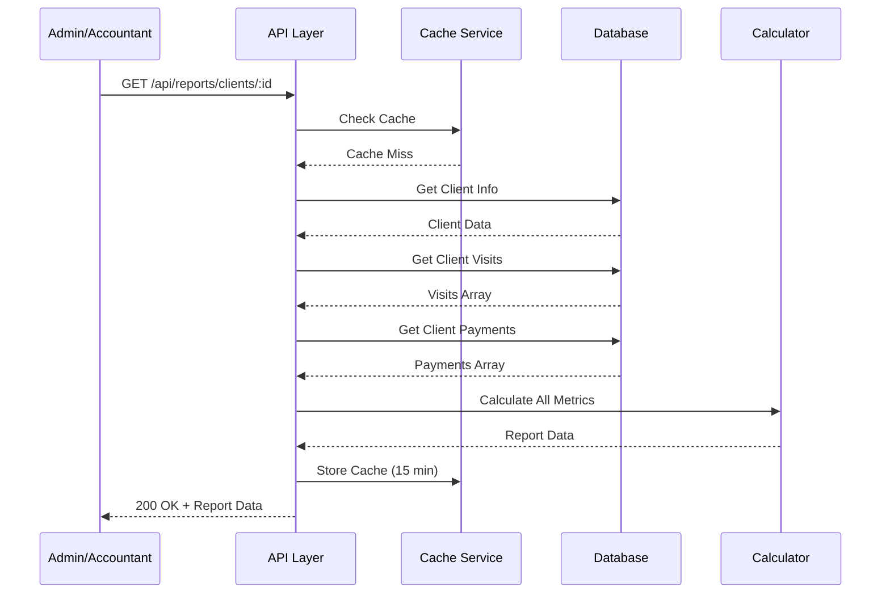
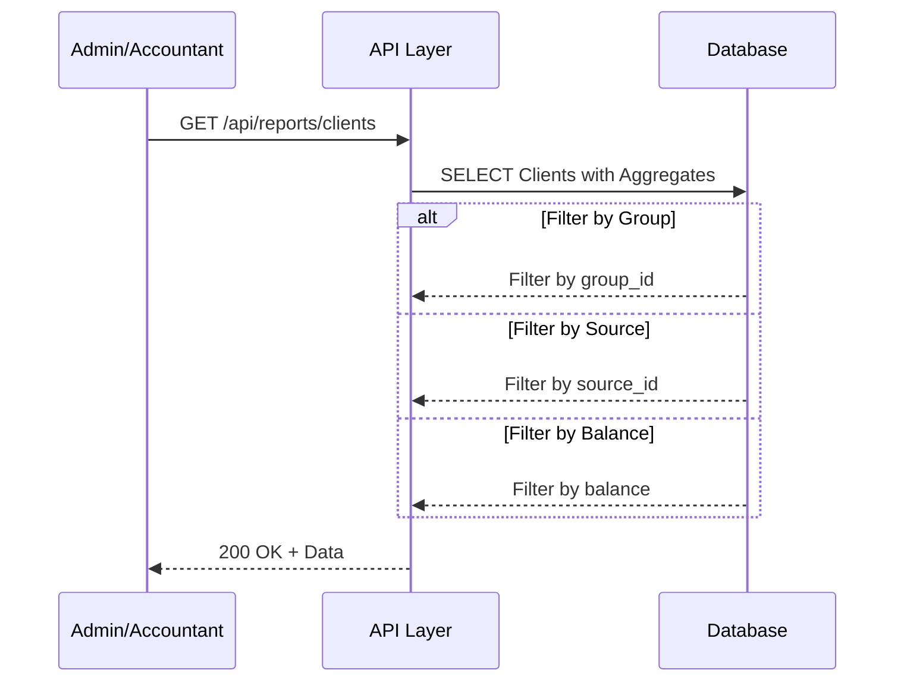
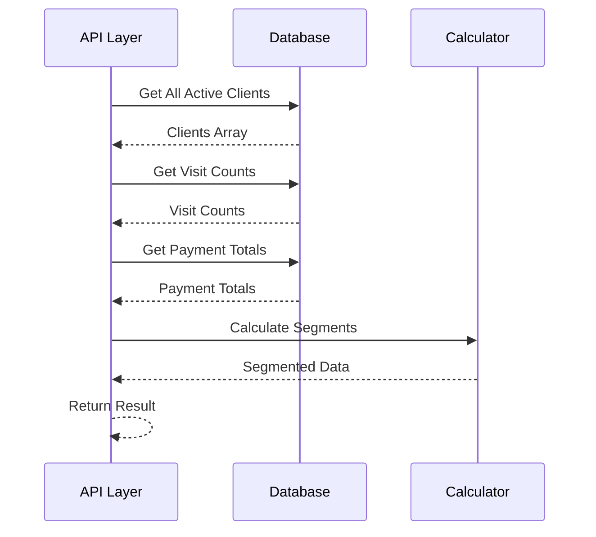
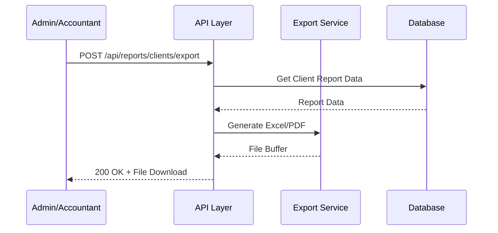

# 📄 FAYL: `22-client-report-management.md`

# 22. Mijoz Hisoboti Boshqaruvi (Client Report Management)


## 📋 UMUMIY MA'LUMOT

| Maydon | Qiymat |
|--------|--------|
| **Flow ID** | 22 |
| **Phase** | 3 - Reports & Analytics |
| **Model** | `Report` (Virtual - mavjud ma'lumotlardan hosil qilinadi) |
| **Status** | Draft |
| **Yaratilgan Sana** | 2024-01-15 |
| **Oxirgi Yangilanish** | 2024-01-15 |
| **Mas'ul** | Senior Backend Developer |
| **Bog'liq Modellar** | `Client` (RFC-009), `Visit` (RFC-013), `Payment` (RFC-014), `ClientPaid` (RFC-015) |

---

## 🎯 MAQSAD

Mijozlar faoliyatini kuzatish, tahlil qilish va hisobot qilish. Har bir mijoz uchun tashriflar tarixi, to'lovlar, qarzdorlik, xizmatlar va boshqa metrikalarni hisoblash. Mijoz segmentatsiyasi va loyalitet dasturlari uchun asos yaratish (Reference: `Klinika.md` 7.1, 7.2).

---

## 👥 MAS'UL ROLLAR

| Rol | View | Export | Tavsif |
|-----|------|--------|--------|
| **Admin** | ✅ (barcha mijozlar) | ✅ | To'liq huquq - barcha mijoz hisobotlari |
| **Doctor** | ✅ (o'z mijozlari) | ❌ | Faqat o'z qabul qilgan mijozlarini ko'rish |
| **Nurse** | ❌ | ❌ | Ruxsat yo'q |
| **Receptionist** | ✅ (barcha mijozlar) | ❌ | Mijoz ma'lumotlarini ko'rish |
| **Accountant** | ✅ (barcha mijozlar) | ✅ | Moliyaviy hisobotlar uchun |

---

## 📊 HISOBOT TUZILISHI (Reference: `Klinika.md` 7.1, 7.2)

### Mijoz Hisoboti Metrikalari

```
┌─────────────────────────────────────────────────────────────┐
│                    MIJOZ HISOBOTI                           │
│                   (Client Report)                           │
├─────────────────────────────────────────────────────────────┤
│  📊 ASOSIY MA'LUMOTLAR                                      │
│  • Mijoz F.I.O.                                             │
│  • Telefon raqam                                            │
│  • Ro'yxatdan o'tgan sana                                   │
│  • Oxirgi tashrif                                           │
│  • Jami tashriflar soni                                     │
├─────────────────────────────────────────────────────────────┤
│  💰 MOLIYAVIY KO'RSATKICHLAR                                │
│  • Jami to'lovlar                                           │
│  • Jami qarzdorlik                                          │
│  • Oldindan to'lovlar                                       │
│  • O'rtacha check                                           │
│  • To'lov tarixi                                            │
├─────────────────────────────────────────────────────────────┤
│  🏥 TASHRIFLAR TARIXI                                       │
│  • Barcha visitlar ro'yxati                                 │
│  • Har bir visit ma'lumotlari                               │
│  • Ko'rsatilgan xizmatlar                                   │
│  • Shifokorlar                                              │
├─────────────────────────────────────────────────────────────┤
│  📈 MIJOZ SEGMENTATSIYASI                                   │
│  • Mijoz guruhi (VIP, Oddiy, Korporativ)                    │
│  • Mijoz manbai (Instagram, Telegram, Tavsiya)              │
│  • Loyalitet darajasi                                       │
│  • Qaytish foizi                                            │
├─────────────────────────────────────────────────────────────┤
│  📊 STATISTIKA                                              │
│  • Birinchi va oxirgi visit                                 │
│  • O'rtacha visit davomiyligi                               │
│  • Eng ko'p ko'rsatilgan xizmatlar                          │
│  • Eng ko'p qabul qilgan shifokor                           │
└─────────────────────────────────────────────────────────────┘
```

---

## 🔄 FLOW DIAGRAM

### 1. Mijoz Hisobotini Yaratish Flow



### 2. Mijozlar Ro'yxati Hisobot Flow



### 3. Mijoz Segmentatsiyasi Flow



### 4. Mijoz Hisoboti Export Flow



---

## 📝 BOSQICHMA-BOSQICH JARAYON

### BOSQICH 1: Bitta Mijoz Hisobotini Olish

#### 1.1. Ma'lumot Manbalari

```typescript
// Mijoz hisoboti
interface ClientReport {
  clientId: number;
  clientInfo: ClientInfo;
  visitStats: VisitStats;
  financialStats: FinancialStats;
  serviceStats: ServiceStats;
  doctorStats: DoctorStats;
  visitHistory: VisitHistory[];
  paymentHistory: PaymentHistory[];
}

interface ClientInfo {
  fullName: string;
  phone: string;
  gender: ClientGender;
  dateOfBirth: Date | null;
  region: string | null;
  district: string | null;
  address: string | null;
  group: string | null;
  source: string | null;
  registeredAt: Date;
  lastVisitAt: Date | null;
}

interface VisitStats {
  totalVisits: number;
  completedVisits: number;
  cancelledVisits: number;
  noShowVisits: number;
  firstVisitDate: Date | null;
  lastVisitDate: Date | null;
  averageVisitsPerMonth: number;
}

interface FinancialStats {
  totalSpent: number;        // Jami sarflangan
  totalPaid: number;         // Jami to'langan
  totalDebt: number;         // Jami qarz
  totalPrepaid: number;      // Jami oldindan to'lov
  averageCheck: number;      // O'rtacha check
  lastPaymentDate: Date | null;
}

interface ServiceStats {
  totalServices: number;
  topServices: TopService[];
}

interface TopService {
  serviceId: number;
  serviceName: string;
  count: number;
  totalAmount: number;
}

interface DoctorStats {
  totalDoctors: number;
  topDoctors: TopDoctor[];
}

interface TopDoctor {
  doctorId: number;
  doctorName: string;
  visitCount: number;
}

interface VisitHistory {
  visitId: number;
  visitDate: Date;
  status: VisitStatus;
  totalAmount: number;
  paidAmount: number;
  debtAmount: number;
  doctorName: string;
  services: VisitServiceItem[];
}

interface VisitServiceItem {
  serviceId: number;
  serviceName: string;
  price: number;
  quantity: number;
  total: number;
}

interface PaymentHistory {
  paymentId: number;
  paymentDate: Date;
  amount: number;
  paymentType: PaymentType;
  description: string | null;
}
```

#### 1.2. Biznes Logika

```typescript
// client-report.service.ts
async getClientReport(
  clientId: number,
  currentUserId: number,
  currentUserRole: string
): Promise<ClientReport> {
  // 1. RBAC tekshiruvi (Reference: Klinika.md 6.1)
  if (currentUserRole !== 'Admin' && currentUserRole !== 'Accountant') {
    // Doctor faqat o'z mijozlarini ko'ra oladi
    if (currentUserRole === 'Doctor') {
      const hasVisit = await this.prisma.visit.findFirst({
        where: {
          client_id: clientId,
          doctor_id: currentUserId,
          deleted_at: null
        }
      });
      
      if (!hasVisit) {
        throw new ForbiddenException('CR_001');
      }
    } else {
      throw new ForbiddenException('CR_001');
    }
  }

  // 2. Mijoz ma'lumotlarini olish
  const client = await this.prisma.client.findUnique({
    where: { id: clientId },
    include: {
      group: { select: { id: true, name: true } },
      source: { select: { id: true, name: true } },
      region: { select: { id: true, name: true } },
      district: { select: { id: true, name: true } }
    }
  });

  if (!client || client.deleted_at) {
    throw new NotFoundException('CR_002');
  }

  // 3. Visit statistikasini hisoblash
  const visitStats = await this.calculateVisitStats(clientId);

  // 4. Moliyaviy statistikasini hisoblash
  const financialStats = await this.calculateFinancialStats(clientId);

  // 5. Xizmat statistikasini hisoblash
  const serviceStats = await this.calculateServiceStats(clientId);

  // 6. Shifokor statistikasini hisoblash
  const doctorStats = await this.calculateDoctorStats(clientId);

  // 7. Visit tarixini olish
  const visitHistory = await this.getVisitHistory(clientId);

  // 8. To'lov tarixini olish
  const paymentHistory = await this.getPaymentHistory(clientId);

  // 9. Mijoz ma'lumotlarini formatlash
  const clientInfo: ClientInfo = {
    fullName: client.full_name,
    phone: client.phone,
    gender: client.gender,
    dateOfBirth: client.date_of_birth,
    region: client.region?.name || null,
    district: client.district?.name || null,
    address: client.address,
    group: client.group?.name || null,
    source: client.source?.name || null,
    registeredAt: client.created_at,
    lastVisitAt: visitStats.lastVisitDate
  };

  return {
    clientId,
    clientInfo,
    visitStats,
    financialStats,
    serviceStats,
    doctorStats,
    visitHistory,
    paymentHistory
  };
}

// Visit statistikasini hisoblash
private async calculateVisitStats(clientId: number): Promise<VisitStats> {
  const visits = await this.prisma.visit.findMany({
    where: {
      client_id: clientId,
      deleted_at: null
    },
    select: {
      id: true,
      status: true,
      visit_date: true,
      created_at: true
    },
    orderBy: {
      visit_date: 'asc'
    }
  });

  const totalVisits = visits.length;
  const completedVisits = visits.filter(v => 
    v.status === 'COMPLETED' || v.status === 'DONE'
  ).length;
  const cancelledVisits = visits.filter(v => v.status === 'CANCELLED').length;
  const noShowVisits = visits.filter(v => v.status === 'NO_SHOW').length;

  const firstVisitDate = visits.length > 0 ? visits[0].visit_date : null;
  const lastVisitDate = visits.length > 0 ? visits[visits.length - 1].visit_date : null;

  // O'rtacha visitlar soni oyiga
  let averageVisitsPerMonth = 0;
  if (firstVisitDate && lastVisitDate) {
    const monthsDiff = Math.max(1, Math.ceil(
      (lastVisitDate.getTime() - firstVisitDate.getTime()) / (1000 * 60 * 60 * 24 * 30)
    ));
    averageVisitsPerMonth = Math.round((totalVisits / monthsDiff) * 10) / 10;
  }

  return {
    totalVisits,
    completedVisits,
    cancelledVisits,
    noShowVisits,
    firstVisitDate,
    lastVisitDate,
    averageVisitsPerMonth
  };
}

// Moliyaviy statistikasini hisoblash
private async calculateFinancialStats(clientId: number): Promise<FinancialStats> {
  // Visitlardan jami summa
  const visitStats = await this.prisma.visit.aggregate({
    where: {
      client_id: clientId,
      deleted_at: null
    },
    _sum: {
      total_amount: true,
      paid_amount: true,
      debt_amount: true
    },
    _count: {
      id: true
    }
  });

  // ClientPaid yig'indisi
  const prepaidStats = await this.prisma.clientPaid.aggregate({
    where: {
      client_id: clientId,
      deleted_at: null
    },
    _sum: {
      amount: true
    }
  });

  // Payment yig'indisi
  const paymentStats = await this.prisma.payment.aggregate({
    where: {
      client_id: clientId,
      payment_type: 'INCOME',
      deleted_at: null
    },
    _sum: {
      amount: true
    },
    _max: {
      payment_date: true
    }
  });

  const totalSpent = visitStats._sum.total_amount || 0;
  const totalPaid = (visitStats._sum.paid_amount || 0) + (paymentStats._sum.amount || 0);
  const totalDebt = visitStats._sum.debt_amount || 0;
  const totalPrepaid = prepaidStats._sum.amount || 0;
  const averageCheck = visitStats._count.id > 0
    ? Math.round((totalSpent / visitStats._count.id) * 100) / 100
    : 0;

  return {
    totalSpent,
    totalPaid,
    totalDebt,
    totalPrepaid,
    averageCheck,
    lastPaymentDate: paymentStats._max.payment_date
  };
}

// Xizmat statistikasini hisoblash
private async calculateServiceStats(clientId: number): Promise<ServiceStats> {
  const serviceStats = await this.prisma.visitService.groupBy({
    by: ['service_id'],
    _count: {
      id: true
    },
    _sum: {
      total: true
    },
    where: {
      visit: {
        client_id: clientId,
        deleted_at: null
      },
      deleted_at: null
    },
    orderBy: {
      _count: {
        id: 'desc'
      }
    },
    take: 10
  });

  const topServices = await Promise.all(
    serviceStats.map(async (item) => {
      const service = await this.prisma.service.findUnique({
        where: { id: item.service_id! },
        select: { id: true, name: true }
      });

      return {
        serviceId: item.service_id!,
        serviceName: service?.name || 'Noma\'lum',
        count: item._count.id,
        totalAmount: item._sum.total || 0
      };
    })
  );

  return {
    totalServices: serviceStats.reduce((sum, item) => sum + item._count.id, 0),
    topServices
  };
}

// Shifokor statistikasini hisoblash
private async calculateDoctorStats(clientId: number): Promise<DoctorStats> {
  const doctorStats = await this.prisma.visit.groupBy({
    by: ['doctor_id'],
    _count: {
      id: true
    },
    where: {
      client_id: clientId,
      deleted_at: null,
      doctor_id: { not: null }
    },
    orderBy: {
      _count: {
        id: 'desc'
      }
    },
    take: 5
  });

  const topDoctors = await Promise.all(
    doctorStats.map(async (item) => {
      const doctor = await this.prisma.user.findUnique({
        where: { id: item.doctor_id! },
        select: { id: true, full_name: true }
      });

      return {
        doctorId: item.doctor_id!,
        doctorName: doctor?.full_name || 'Noma\'lum',
        visitCount: item._count.id
      };
    })
  );

  return {
    totalDoctors: doctorStats.length,
    topDoctors
  };
}

// Visit tarixini olish
private async getVisitHistory(clientId: number, limit: number = 20): Promise<VisitHistory[]> {
  const visits = await this.prisma.visit.findMany({
    where: {
      client_id: clientId,
      deleted_at: null
    },
    include: {
      doctor: {
        select: {
          id: true,
          full_name: true
        }
      },
      visit_services: {
        include: {
          service: {
            select: {
              id: true,
              name: true
            }
          }
        }
      }
    },
    orderBy: {
      visit_date: 'desc'
    },
    take: limit
  });

  return visits.map(visit => ({
    visitId: visit.id,
    visitDate: visit.visit_date,
    status: visit.status,
    totalAmount: visit.total_amount.toNumber(),
    paidAmount: visit.paid_amount.toNumber(),
    debtAmount: visit.debt_amount.toNumber(),
    doctorName: visit.doctor?.full_name || 'Noma\'lum',
    services: visit.visit_services.map(vs => ({
      serviceId: vs.service_id!,
      serviceName: vs.service.name,
      price: vs.price.toNumber(),
      quantity: vs.quantity,
      total: vs.total.toNumber()
    }))
  }));
}

// To'lov tarixini olish
private async getPaymentHistory(clientId: number, limit: number = 20): Promise<PaymentHistory[]> {
  const payments = await this.prisma.payment.findMany({
    where: {
      client_id: clientId,
      deleted_at: null
    },
    orderBy: {
      payment_date: 'desc'
    },
    take: limit
  });

  return payments.map(payment => ({
    paymentId: payment.id,
    paymentDate: payment.payment_date,
    amount: payment.amount.toNumber(),
    paymentType: payment.payment_type,
    description: payment.description
  }));
}
```

---

### BOSQICH 2: Mijozlar Ro'yxati Hisoboti

#### 2.1. Ma'lumot Manbalari

```typescript
// Mijozlar ro'yxati
interface ClientListReport {
  period: {
    from: Date;
    to: Date;
  };
  totalClients: number;
  activeClients: number;
  newClients: number;
  clientsWithDebt: number;
  clients: ClientListItem[];
}

interface ClientListItem {
  clientId: number;
  fullName: string;
  phone: string;
  group: string | null;
  source: string | null;
  totalVisits: number;
  lastVisitDate: Date | null;
  totalSpent: number;
  totalDebt: number;
  balance: number;
  registeredAt: Date;
}
```

#### 2.2. Biznes Logika

```typescript
async getClientListReport(
  startDate: Date,
  endDate: Date,
  filters: ClientListFilters
): Promise<ClientListReport> {
  // 1. Mijozlarni olish
  const clients = await this.prisma.client.findMany({
    where: {
      deleted_at: null,
      created_at: {
        gte: startDate,
        lt: endDate
      },
      ...(filters.group_id && { group_id: filters.group_id }),
      ...(filters.source_id && { source_id: filters.source_id }),
      ...(filters.min_balance !== undefined && {
        balance: { gte: filters.min_balance }
      }),
      ...(filters.has_debt && {
        visits: {
          some: {
            debt_amount: { gt: 0 },
            deleted_at: null
          }
        }
      })
    },
    include: {
      group: { select: { id: true, name: true } },
      source: { select: { id: true, name: true } },
      _count: {
        select: {
          visits: {
            where: {
              deleted_at: null,
              visit_date: {
                gte: startDate,
                lt: endDate
              }
            }
          }
        }
      },
      visits: {
        where: {
          deleted_at: null
        },
        orderBy: {
          visit_date: 'desc'
        },
        take: 1,
        select: {
          visit_date: true
        }
      }
    }
  });

  // 2. Moliyaviy ma'lumotlarni hisoblash
  const clientsWithFinancials = await Promise.all(
    clients.map(async (client) => {
      const financialStats = await this.calculateFinancialStats(client.id);
      
      return {
        clientId: client.id,
        fullName: client.full_name,
        phone: client.phone,
        group: client.group?.name || null,
        source: client.source?.name || null,
        totalVisits: client._count.visits,
        lastVisitDate: client.visits[0]?.visit_date || null,
        totalSpent: financialStats.totalSpent,
        totalDebt: financialStats.totalDebt,
        balance: client.balance.toNumber(),
        registeredAt: client.created_at
      };
    })
  );

  // 3. Statistika hisoblash
  const totalClients = clients.length;
  const activeClients = clients.filter(c => c.status === 'ACTIVE').length;
  const newClients = clients.filter(c => 
    c.created_at >= startDate && c.created_at < endDate
  ).length;
  const clientsWithDebt = clientsWithFinancials.filter(c => c.totalDebt > 0).length;

  return {
    period: {
      from: startDate,
      to: endDate
    },
    totalClients,
    activeClients,
    newClients,
    clientsWithDebt,
    clients: clientsWithFinancials
  };
}
```

---

### BOSQICH 3: Mijoz Segmentatsiyasi

#### 3.1. Biznes Logika

```typescript
async getClientSegmentation(): Promise<ClientSegmentation> {
  // 1. Barcha aktiv mijozlarni olish
  const clients = await this.prisma.client.findMany({
    where: {
      deleted_at: null,
      status: 'ACTIVE'
    },
    select: {
      id: true,
      full_name: true,
      group_id: true,
      source_id: true
    }
  });

  // 2. Guruh bo'yicha segmentatsiya
  const byGroup = await this.prisma.client.groupBy({
    by: ['group_id'],
    _count: {
      id: true
    },
    where: {
      deleted_at: null,
      status: 'ACTIVE',
      group_id: { not: null }
    }
  });

  // 3. Manba bo'yicha segmentatsiya
  const bySource = await this.prisma.client.groupBy({
    by: ['source_id'],
    _count: {
      id: true
    },
    where: {
      deleted_at: null,
      status: 'ACTIVE',
      source_id: { not: null }
    }
  });

  // 4. Loyalitet darajasi bo'yicha segmentatsiya
  const byLoyalty = await this.calculateLoyaltySegments(clients);

  // 5. Guruh nomlarini olish
  const groupDetails = await Promise.all(
    byGroup.map(async (item) => {
      const group = await this.prisma.clientGroup.findUnique({
        where: { id: item.group_id! },
        select: { id: true, name: true }
      });

      return {
        groupId: item.group_id!,
        groupName: group?.name || 'Noma\'lum',
        count: item._count.id,
        percentage: Math.round((item._count.id / clients.length) * 100 * 10) / 10
      };
    })
  );

  // 6. Manba nomlarini olish
  const sourceDetails = await Promise.all(
    bySource.map(async (item) => {
      const source = await this.prisma.source.findUnique({
        where: { id: item.source_id! },
        select: { id: true, name: true }
      });

      return {
        sourceId: item.source_id!,
        sourceName: source?.name || 'Noma\'lum',
        count: item._count.id,
        percentage: Math.round((item._count.id / clients.length) * 100 * 10) / 10
      };
    })
  );

  return {
    totalClients: clients.length,
    byGroup: groupDetails,
    bySource: sourceDetails,
    byLoyalty
  };
}

// Loyalitet segmentlarini hisoblash
private async calculateLoyaltySegments(clients: Client[]): Promise<LoyaltySegment[]> {
  const segments: LoyaltySegment[] = [
    { name: 'Yangi (0-3 oy)', count: 0, percentage: 0 },
    { name: 'Doimiy (3-12 oy)', count: 0, percentage: 0 },
    { name: 'Sodiq (1+ yil)', count: 0, percentage: 0 },
    { name: 'Yo\'qolgan (6+ oy)', count: 0, percentage: 0 }
  ];

  const now = new Date();

  for (const client of clients) {
    // Oxirgi visitni olish
    const lastVisit = await this.prisma.visit.findFirst({
      where: {
        client_id: client.id,
        deleted_at: null
      },
      orderBy: {
        visit_date: 'desc'
      },
      select: {
        visit_date: true
      }
    });

    const monthsSinceLastVisit = lastVisit
      ? Math.floor((now.getTime() - lastVisit.visit_date.getTime()) / (1000 * 60 * 60 * 24 * 30))
      : 999;

    const monthsSinceRegistration = Math.floor(
      (now.getTime() - client.created_at.getTime()) / (1000 * 60 * 60 * 24 * 30)
    );

    if (monthsSinceLastVisit > 6) {
      segments[3].count++;
    } else if (monthsSinceRegistration <= 3) {
      segments[0].count++;
    } else if (monthsSinceRegistration <= 12) {
      segments[1].count++;
    } else {
      segments[2].count++;
    }
  }

  // Percentages hisoblash
  segments.forEach(segment => {
    segment.percentage = Math.round((segment.count / clients.length) * 100 * 10) / 10;
  });

  return segments;
}
```

---

## 🔌 API ENDPOINT'LAR

### 1. Bitta Mijoz Hisobotini Olish

| Parametr | Qiymat |
|----------|--------|
| **Method** | GET |
| **Endpoint** | `/api/v1/reports/clients/:clientId` |
| **Auth** | ✅ JWT Required |
| **Rol** | Admin, Doctor (o'z mijozlari), Accountant |

**Request Example:**
```http
GET /api/v1/reports/clients/1
```

**Response (200 OK):**
```json
{
  "success": true,
  "data": {
    "clientId": 1,
    "clientInfo": {
      "fullName": "John Doe",
      "phone": "+998901234567",
      "gender": "MALE",
      "dateOfBirth": "1990-01-01",
      "region": "Toshkent viloyati",
      "district": "Mirobod tumani",
      "address": "Toshkent shahar",
      "group": "VIP",
      "source": "Instagram",
      "registeredAt": "2024-01-01T10:00:00.000Z",
      "lastVisitAt": "2024-01-15T10:00:00.000Z"
    },
    "visitStats": {
      "totalVisits": 15,
      "completedVisits": 14,
      "cancelledVisits": 1,
      "noShowVisits": 0,
      "firstVisitDate": "2024-01-01T10:00:00.000Z",
      "lastVisitDate": "2024-01-15T10:00:00.000Z",
      "averageVisitsPerMonth": 5.0
    },
    "financialStats": {
      "totalSpent": 4500000,
      "totalPaid": 4000000,
      "totalDebt": 500000,
      "totalPrepaid": 200000,
      "averageCheck": 300000,
      "lastPaymentDate": "2024-01-15T12:00:00.000Z"
    },
    "serviceStats": {
      "totalServices": 30,
      "topServices": [
        {
          "serviceId": 1,
          "serviceName": "Terapevt ko'rigi",
          "count": 10,
          "totalAmount": 3000000
        }
      ]
    },
    "doctorStats": {
      "totalDoctors": 3,
      "topDoctors": [
        {
          "doctorId": 2,
          "doctorName": "Dr. John Smith",
          "visitCount": 10
        }
      ]
    },
    "visitHistory": [...],
    "paymentHistory": [...]
  }
}
```

---

### 2. Mijozlar Ro'yxati Hisoboti

| Parametr | Qiymat |
|----------|--------|
| **Method** | GET |
| **Endpoint** | `/api/v1/reports/clients` |
| **Auth** | ✅ JWT Required |
| **Rol** | Admin, Accountant |
| **Query Params** | `start_date`, `end_date`, `group_id`, `source_id`, `has_debt` |

**Request Example:**
```http
GET /api/v1/reports/clients?start_date=2024-01-01&end_date=2024-01-31&group_id=1&has_debt=true
```

**Response (200 OK):**
```json
{
  "success": true,
  "data": {
    "period": {
      "from": "2024-01-01T00:00:00.000Z",
      "to": "2024-01-31T23:59:59.999Z"
    },
    "totalClients": 150,
    "activeClients": 140,
    "newClients": 25,
    "clientsWithDebt": 30,
    "clients": [
      {
        "clientId": 1,
        "fullName": "John Doe",
        "phone": "+998901234567",
        "group": "VIP",
        "source": "Instagram",
        "totalVisits": 15,
        "lastVisitDate": "2024-01-15T10:00:00.000Z",
        "totalSpent": 4500000,
        "totalDebt": 500000,
        "balance": 200000,
        "registeredAt": "2024-01-01T10:00:00.000Z"
      }
    ]
  }
}
```

---

### 3. Mijoz Segmentatsiyasi

| Parametr | Qiymat |
|----------|--------|
| **Method** | GET |
| **Endpoint** | `/api/v1/reports/clients/segmentation` |
| **Auth** | ✅ JWT Required |
| **Rol** | Admin, Accountant |

**Response (200 OK):**
```json
{
  "success": true,
  "data": {
    "totalClients": 500,
    "byGroup": [
      {
        "groupId": 1,
        "groupName": "VIP",
        "count": 50,
        "percentage": 10.0
      },
      {
        "groupId": 2,
        "groupName": "Oddiy",
        "count": 400,
        "percentage": 80.0
      }
    ],
    "bySource": [
      {
        "sourceId": 1,
        "sourceName": "Instagram",
        "count": 200,
        "percentage": 40.0
      },
      {
        "sourceId": 2,
        "sourceName": "Telegram",
        "count": 150,
        "percentage": 30.0
      }
    ],
    "byLoyalty": [
      {
        "name": "Yangi (0-3 oy)",
        "count": 100,
        "percentage": 20.0
      },
      {
        "name": "Doimiy (3-12 oy)",
        "count": 200,
        "percentage": 40.0
      },
      {
        "name": "Sodiq (1+ yil)",
        "count": 150,
        "percentage": 30.0
      },
      {
        "name": "Yo'qolgan (6+ oy)",
        "count": 50,
        "percentage": 10.0
      }
    ]
  }
}
```

---

### 4. Mijoz Hisoboti Export (Excel/PDF)

| Parametr | Qiymat |
|----------|--------|
| **Method** | POST |
| **Endpoint** | `/api/v1/reports/clients/export` |
| **Auth** | ✅ JWT Required |
| **Rol** | Admin, Accountant |

**Request Body:**
```json
{
  "clientId": 1,
  "format": "excel",
  "includeHistory": true
}
```

**Response:** File Download

---

## ⚠️ XATOLIKLAR VA HANDLING

| Kod | HTTP Status | Xabar | Sabab | Yechim |
|-----|-------------|-------|-------|--------|
| `CR_001` | 403 Forbidden | Ruxsat yo'q | Insufficient permissions | Rol tekshirilsin |
| `CR_002` | 404 Not Found | Mijoz topilmadi | Client ID not exists | Client ID ni tekshiring |
| `CR_003` | 400 Bad Request | Sana formati noto'g'ri | Invalid date format | YYYY-MM-DD format |
| `CR_004` | 500 Internal Server Error | Hisobot yaratishda xatolik | Calculation error | Admin bilan bog'laning |

---

## 📦 CACHE STRATEGY (Reference: `Klinika.md` 9.1)

### Caching Configuration

| Data | Cache | TTL | Invalidation |
|------|-------|-----|--------------|
| Client Report | Redis | 15 daqiqa | Visit create/update/delete |
| Client List | Redis | 30 daqiqa | Client create/update |
| Client Segmentation | Redis | 1 soat | Client create/update/delete |
| Export File | Redis | 24 soat | Automatic expiry |

### Cache Implementation

```typescript
async getClientReport(clientId: number): Promise<ClientReport> {
  const cacheKey = `client_report:${clientId}`;
  
  // Cache dan olish
  const cached = await this.cacheService.get(cacheKey);
  if (cached) {
    return cached;
  }
  
  // DB dan hisoblash
  const report = await this.calculateClientReport(clientId);
  
  // Cache ga saqlash (15 daqiqa)
  await this.cacheService.set(cacheKey, report, { ttl: 900 });
  
  return report;
}
```

---

## 🔐 XAVFSIZLIK TALABLARI (Reference: `Klinika.md` 8)

### 1. Autentifikatsiya
- ✅ Barcha endpoint'lar JWT token talab qiladi
- ✅ Token expiry: 24 soat

### 2. Avtorizatsiya (RBAC) (Reference: `Klinika.md` 6.1)

| Endpoint | Admin | Doctor | Nurse | Receptionist | Accountant |
|----------|-------|--------|-------|--------------|------------|
| GET /clients/:id | ✅ | ✅ (o'zi) | ❌ | ✅ | ✅ |
| GET /clients | ✅ | ❌ | ❌ | ✅ | ✅ |
| GET /clients/segmentation | ✅ | ❌ | ❌ | ❌ | ✅ |
| POST /clients/export | ✅ | ❌ | ❌ | ❌ | ✅ |

### 3. Audit (Reference: `Klinika.md` 5.2)
- ✅ Hisobot ko'rish harakati log qilinadi
- ✅ Export harakati log qilinadi
- ✅ Kim, qachon, qaysi hisobotni ko'rganligi saqlanadi

### 4. Ma'lumotlar Xavfsizligi (Reference: `Klinika.md` 8.1)
- ✅ Doctor faqat o'z mijozlarini ko'ra oladi
- ✅ Moliyaviy ma'lumotlar faqat Admin/Accountant uchun
- ✅ Export fayllar vaqtinchalik saqlanadi (24 soat)
- ✅ Mijoz ma'lumotlari konfidensial

---

## 📝 ESLATMALAR

1. **Virtual Report** - Mijoz hisoboti alohida jadvalda saqlanmaydi, real-time hosil qilinadi
2. **Cache** - Hisobot ma'lumotlari 15 daqiqa cache qilinadi (performance uchun)
3. **RBAC** - Doctor faqat o'z qabul qilgan mijozlarini ko'ra oladi
4. **Segmentation** - Mijozlar guruh, manba va loyalitet bo'yicha segmentatsiya qilinadi
5. **Export** - Excel/PDF export 24 soat davomida yuklab olish mumkin
6. **Timezone** - Barcha vaqtlar UTC timezone da saqlanadi
7. **Decimal Precision** - Barcha moliyaviy summalar Decimal(15,2) formatda
8. **Performance** - Hisobot yaratish vaqti < 5 soniya bo'lishi kerak
9. **Privacy** - Mijoz ma'lumotlari konfidensial, faqat ruxsat berilgan rollar ko'ra oladi
10. **History Limit** - Visit va payment tarixi limit bilan qaytariladi (default 20)

---

## ✅ QABUL QILISH MEZONLARI (ACCEPTANCE CRITERIA)

### Functional Requirements
- [ ] Mijoz ma'lumotlari to'g'ri ko'rsatilishi
- [ ] Visit statistikasi to'g'ri hisoblanishi
- [ ] Moliyaviy ko'rsatkichlar to'g'ri hisoblanishi
- [ ] Xizmat statistikasi to'g'ri hisoblanishi
- [ ] Shifokor statistikasi to'g'ri hisoblanishi
- [ ] Visit tarixi to'g'ri ko'rsatilishi
- [ ] To'lov tarixi to'g'ri ko'rsatilishi
- [ ] Mijoz segmentatsiyasi to'g'ri ishlashi
- [ ] Cache strategiyasi ishlashi (15 daqiqa TTL)
- [ ] Export funksiyasi ishlashi (Excel/PDF)
- [ ] RBAC to'g'ri ishlashi (Doctor faqat o'zi)
- [ ] Xatoliklar to'g'ri HTTP status va kod bilan qaytarilishi

### Non-Functional Requirements (Reference: `Klinika.md` 9.1)
- [ ] API response time < 5 seconds (hisobot yaratish)
- [ ] API response time < 500ms (cached)
- [ ] Cache hit rate > 80%
- [ ] Export generation time < 15 seconds
- [ ] Unit test coverage ≥ 90%
- [ ] E2E test coverage ≥ 70%
- [ ] Security audit o'tkazildi
- [ ] Documentation to'liq
- [ ] Concurrent users 50+ qo'llab-quvvatlanadi
- [ ] Data retention 5 yil
