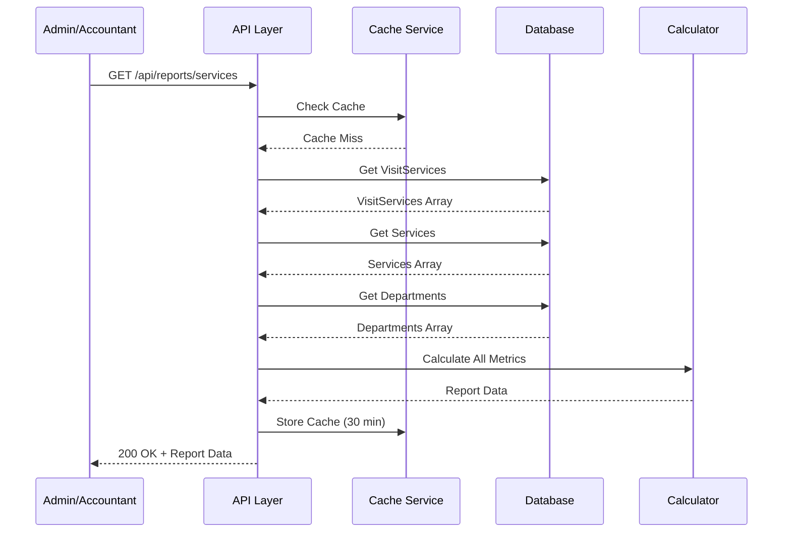
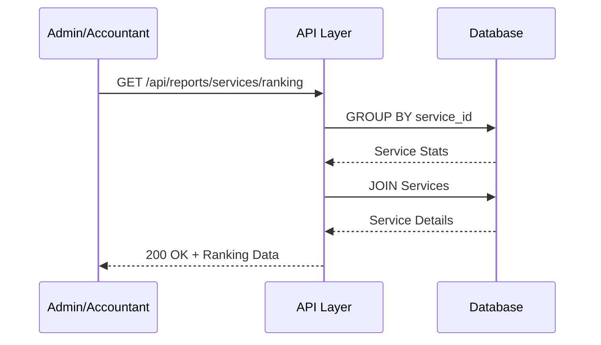
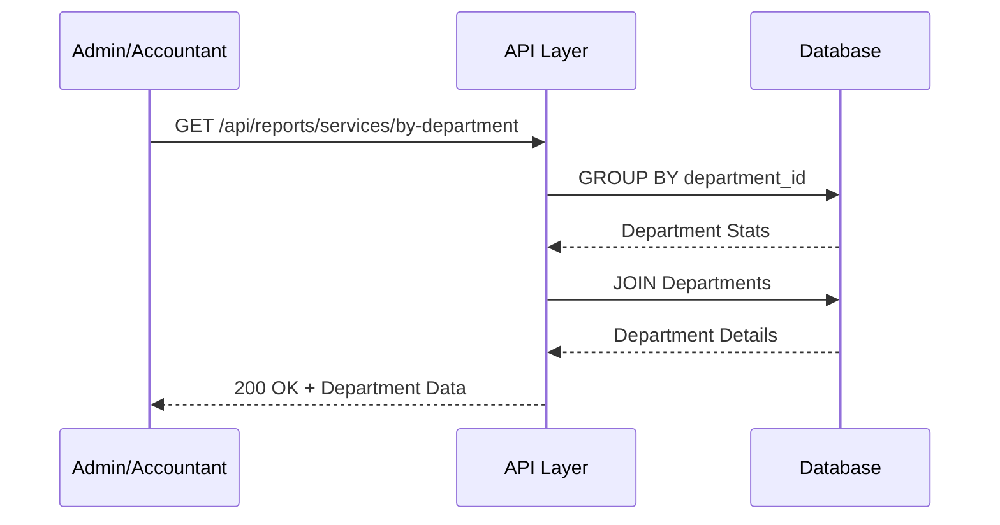
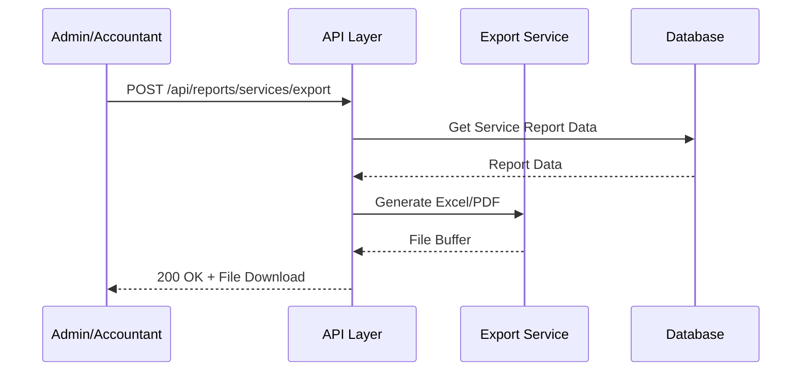

# 📄 FAYL: `23-service-report-management.md`

# 23. Xizmatlar Hisoboti Boshqaruvi (Service Report Management)

## 📋 UMUMIY MA'LUMOT

| Maydon | Qiymat |
|--------|--------|
| **Flow ID** | 23 |
| **Phase** | 3 - Reports & Analytics |
| **Model** | `Report` (Virtual - mavjud ma'lumotlardan hosil qilinadi) |
| **Status** | Draft |
| **Yaratilgan Sana** | 2024-01-15 |
| **Oxirgi Yangilanish** | 2024-01-15 |
| **Mas'ul** | Senior Backend Developer |
| **Bog'liq Modellar** | `Service` (RFC-011), `VisitService` (RFC-013), `Department` (RFC-007), `Visit` (RFC-013) |

---

## 🎯 MAQSAD

Klinikada ko'rsatilgan xizmatlar bo'yicha batafsil hisobotlar tayyorlash, tahlil qilish va statistikani shakllantirish. Eng talabgir xizmatlar, xizmatlardan olingan daromad, bo'limlar kesimida xizmatlar va boshqa metrikalarni hisoblash. Xizmat narxlarini optimallashtirish va marketing strategiyasini rejalashtirish uchun asos yaratish (Reference: `Klinika.md` 7.1, 7.2).

---

## 👥 MAS'UL ROLLAR

| Rol | View | Export | Tavsif |
|-----|------|--------|--------|
| **Admin** | ✅ (barcha xizmatlar) | ✅ | To'liq huquq - barcha xizmat hisobotlari |
| **Doctor** | ✅ (o'z xizmatlari) | ❌ | Faqat o'zi ko'rsatgan xizmatlarni ko'rish |
| **Nurse** | ❌ | ❌ | Ruxsat yo'q |
| **Receptionist** | ✅ (faqat ko'rish) | ❌ | Xizmat narxlarini ko'rish |
| **Accountant** | ✅ (barcha xizmatlar) | ✅ | Moliyaviy hisobotlar uchun |

---

## 📊 HISOBOT TUZILISHI (Reference: `Klinika.md` 7.1, 7.2)

### Xizmatlar Hisoboti Metrikalari

```
┌─────────────────────────────────────────────────────────────┐
│                   XIZMATLAR HISOBOTI                        │
│                  (Service Report)                           │
├─────────────────────────────────────────────────────────────┤
│  📊 ASOSIY KO'RSATKICHLAR                                   │
│  • Jami ko'rsatilgan xizmatlar soni                         │
│  • Xizmatlardan olingan daromad                             │
│  • O'rtacha xizmat narxi                                    │
│  • Eng talabgir xizmatlar (Top 10)                          │
│  • Eng kam talab qilingan xizmatlar                         │
├─────────────────────────────────────────────────────────────┤
│  🏥 BO'LIMLAR KESIMIDA                                      │
│  • Har bir bo'lim xizmatlari                                │
│  • Bo'limlar daromadi                                       │
│  • Bo'limlar bo'yicha xizmatlar soni                        │
├─────────────────────────────────────────────────────────────┤
│  💰 MOLIYAVIY KO'RSATKICHLAR                                │
│  • Xizmatlar bo'yicha daromad                               │
│  • Xizmatlar bo'yicha shifokor komissiyasi                  │
│  • Narx o'zgarishlari tarixi                                │
├─────────────────────────────────────────────────────────────┤
│  📈 VAQT BO'YICHA TAQSIMOT                                  │
│  • Kunlik xizmatlar statistikasi                            │
│  • Oylik xizmatlar statistikasi                             │
│  • Mavsumiy o'zgarishlar                                    │
├─────────────────────────────────────────────────────────────┤
│  👨‍⚕️ SHIFOKORLAR KESIMIDA                                    │
│  • Har bir shifokor ko'rsatgan xizmatlar                    │
│  • Shifokorlar bo'yicha xizmatlar soni                      │
│  • Shifokorlar bo'yicha daromad                             │
└─────────────────────────────────────────────────────────────┘
```

---

## 🔄 FLOW DIAGRAM

### 1. Xizmatlar Hisobotini Yaratish Flow



### 2. Xizmatlar Reytingi Flow



### 3. Bo'limlar Kesimida Hisobot Flow



### 4. Xizmat Hisoboti Export Flow



---

## 📝 BOSQICHMA-BOSQICH JARAYON

### BOSQICH 1: Xizmatlar Umumiy Statistikasi

#### 1.1. Ma'lumot Manbalari

```typescript
// Xizmatlar hisoboti
interface ServiceReport {
  period: {
    from: Date;
    to: Date;
  };
  summary: ServiceSummary;
  topServices: TopServiceStats[];
  lowServices: LowServiceStats[];
  byDepartment: DepartmentServiceStats[];
  byDoctor: DoctorServiceStats[];
  trendData: ServiceTrendData[];
}

interface ServiceSummary {
  totalServices: number;         // Jami ko'rsatilgan xizmatlar
  totalRevenue: number;          // Xizmatlardan daromad
  averagePrice: number;          // O'rtacha xizmat narxi
  averagePerDay: number;         // Kunlik o'rtacha
  uniqueServices: number;        // Unikal xizmatlar soni
  totalCommission: number;       // Shifokor komissiyasi
}

interface TopServiceStats {
  serviceId: number;
  serviceName: string;
  departmentName: string;
  count: number;
  revenue: number;
  percentage: number;
  averagePrice: number;
}

interface LowServiceStats {
  serviceId: number;
  serviceName: string;
  count: number;
  lastUsedDate: Date | null;
}

interface DepartmentServiceStats {
  departmentId: number;
  departmentName: string;
  serviceCount: number;
  revenue: number;
  percentage: number;
  services: ServiceInDepartment[];
}

interface ServiceInDepartment {
  serviceId: number;
  serviceName: string;
  count: number;
  revenue: number;
}

interface DoctorServiceStats {
  doctorId: number;
  doctorName: string;
  serviceCount: number;
  revenue: number;
  commission: number;
  topServices: ServiceForDoctor[];
}

interface ServiceForDoctor {
  serviceId: number;
  serviceName: string;
  count: number;
}

interface ServiceTrendData {
  date: Date;
  serviceCount: number;
  revenue: number;
  averagePrice: number;
}
```

#### 1.2. Biznes Logika

```typescript
// service-report.service.ts
async getServiceReport(
  startDate: Date,
  endDate: Date,
  currentUserId: number,
  currentUserRole: string
): Promise<ServiceReport> {
  // 1. RBAC tekshiruvi (Reference: Klinika.md 6.1)
  if (currentUserRole === 'Doctor') {
    // Doctor faqat o'z xizmatlarini ko'ra oladi
    // Visit orqali doctor_id filter qilinadi
  } else if (currentUserRole !== 'Admin' && currentUserRole !== 'Accountant') {
    throw new ForbiddenException('SR_001');
  }

  // 2. VisitServices ma'lumotlarini olish
  const visitServices = await this.prisma.visitService.findMany({
    where: {
      created_at: {
        gte: startDate,
        lt: endDate
      },
      deleted_at: null,
      visit: currentUserRole === 'Doctor' ? {
        doctor_id: currentUserId,
        deleted_at: null
      } : {
        deleted_at: null
      }
    },
    include: {
      service: {
        select: {
          id: true,
          name: true,
          price: true,
          department_id: true,
          department: {
            select: {
              id: true,
              name: true
            }
          }
        }
      },
      visit: {
        select: {
          id: true,
          doctor_id: true,
          visit_date: true,
          doctor: {
            select: {
              id: true,
              full_name: true
            }
          }
        }
      }
    }
  });

  // 3. Umumiy statistika hisoblash
  const summary = this.calculateServiceSummary(visitServices);

  // 4. Eng talabgir xizmatlar
  const topServices = await this.getTopServices(visitServices, startDate, endDate);

  // 5. Eng kam talab qilingan xizmatlar
  const lowServices = await this.getLowServices(visitServices, startDate, endDate);

  // 6. Bo'limlar kesimida
  const byDepartment = await this.getServicesByDepartment(visitServices, startDate, endDate);

  // 7. Shifokorlar kesimida
  const byDoctor = await this.getServicesByDoctor(visitServices, startDate, endDate);

  // 8. Vaqt bo'yicha trend
  const trendData = await this.getServiceTrend(visitServices, startDate, endDate);

  return {
    period: {
      from: startDate,
      to: endDate
    },
    summary,
    topServices,
    lowServices,
    byDepartment,
    byDoctor,
    trendData
  };
}

// Umumiy statistika hisoblash
private calculateServiceSummary(visitServices: any[]): ServiceSummary {
  const totalServices = visitServices.reduce((sum, vs) => sum + vs.quantity, 0);
  const totalRevenue = visitServices.reduce((sum, vs) => sum + vs.total.toNumber(), 0);
  const uniqueServices = new Set(visitServices.map(vs => vs.service_id)).size;
  
  const daysDiff = Math.max(1, Math.ceil(
    (new Date().getTime() - new Date().getTime()) / (1000 * 60 * 60 * 24)
  ));
  
  const averagePerDay = Math.round((totalServices / daysDiff) * 10) / 10;
  const averagePrice = totalServices > 0 
    ? Math.round((totalRevenue / totalServices) * 100) / 100
    : 0;

  // Komissiyani hisoblash (ServiceUser orqali)
  const totalCommission = visitServices.reduce((sum, vs) => {
    // ServiceUser mavjud bo'lsa komissiya hisoblanadi
    return sum; // ServiceUser ma'lumotlari alohida olinadi
  }, 0);

  return {
    totalServices,
    totalRevenue,
    averagePrice,
    averagePerDay,
    uniqueServices,
    totalCommission
  };
}

// Eng talabgir xizmatlar
private async getTopServices(
  visitServices: any[],
  startDate: Date,
  endDate: Date
): Promise<TopServiceStats[]> {
  // Xizmatlar bo'yicha guruhlash
  const serviceStats = new Map<number, {
    count: number;
    revenue: number;
    serviceName: string;
    departmentName: string;
  }>();

  for (const vs of visitServices) {
    if (!serviceStats.has(vs.service_id)) {
      serviceStats.set(vs.service_id, {
        count: 0,
        revenue: 0,
        serviceName: vs.service.name,
        departmentName: vs.service.department?.name || 'Noma\'lum'
      });
    }

    const stat = serviceStats.get(vs.service_id)!;
    stat.count += vs.quantity;
    stat.revenue += vs.total.toNumber();
  }

  // Top 10 xizmatlar
  const topServices = Array.from(serviceStats.entries())
    .sort((a, b) => b[1].count - a[1].count)
    .slice(0, 10)
    .map(([serviceId, stat]) => {
      const totalRevenue = visitServices
        .filter(vs => vs.service_id === serviceId)
        .reduce((sum, vs) => sum + vs.total.toNumber(), 0);
      
      const totalRevenueAll = visitServices
        .reduce((sum, vs) => sum + vs.total.toNumber(), 0);
      
      const percentage = totalRevenueAll > 0
        ? Math.round((stat.revenue / totalRevenueAll) * 100 * 10) / 10
        : 0;

      const averagePrice = stat.count > 0
        ? Math.round((stat.revenue / stat.count) * 100) / 100
        : 0;

      return {
        serviceId,
        serviceName: stat.serviceName,
        departmentName: stat.departmentName,
        count: stat.count,
        revenue: stat.revenue,
        percentage,
        averagePrice
      };
    });

  return topServices;
}

// Eng kam talab qilingan xizmatlar
private async getLowServices(
  visitServices: any[],
  startDate: Date,
  endDate: Date
): Promise<LowServiceStats[]> {
  // Barcha aktiv xizmatlarni olish
  const allServices = await this.prisma.service.findMany({
    where: {
      status: 'ACTIVE',
      deleted_at: null
    },
    select: {
      id: true,
      name: true
    }
  });

  // Ishlatilgan xizmatlar
  const usedServiceIds = new Set(visitServices.map(vs => vs.service_id));

  // Ishlatilmagan xizmatlar
  const lowServices = allServices
    .filter(service => !usedServiceIds.has(service.id))
    .slice(0, 10)
    .map(service => ({
      serviceId: service.id,
      serviceName: service.name,
      count: 0,
      lastUsedDate: null
    }));

  return lowServices;
}

// Bo'limlar kesimida
private async getServicesByDepartment(
  visitServices: any[],
  startDate: Date,
  endDate: Date
): Promise<DepartmentServiceStats[]> {
  const departmentStats = new Map<number, {
    serviceCount: number;
    revenue: number;
    departmentName: string;
    services: Map<number, { count: number; revenue: number; name: string }>;
  }>();

  for (const vs of visitServices) {
    const deptId = vs.service.department_id;
    if (!deptId) continue;

    if (!departmentStats.has(deptId)) {
      departmentStats.set(deptId, {
        serviceCount: 0,
        revenue: 0,
        departmentName: vs.service.department?.name || 'Noma\'lum',
        services: new Map()
      });
    }

    const dept = departmentStats.get(deptId)!;
    dept.serviceCount += vs.quantity;
    dept.revenue += vs.total.toNumber();

    if (!dept.services.has(vs.service_id)) {
      dept.services.set(vs.service_id, {
        count: 0,
        revenue: 0,
        name: vs.service.name
      });
    }

    const service = dept.services.get(vs.service_id)!;
    service.count += vs.quantity;
    service.revenue += vs.total.toNumber();
  }

  const totalRevenue = visitServices.reduce((sum, vs) => sum + vs.total.toNumber(), 0);

  return Array.from(departmentStats.entries())
    .map(([deptId, stat]) => ({
      departmentId: deptId,
      departmentName: stat.departmentName,
      serviceCount: stat.serviceCount,
      revenue: stat.revenue,
      percentage: totalRevenue > 0
        ? Math.round((stat.revenue / totalRevenue) * 100 * 10) / 10
        : 0,
      services: Array.from(stat.services.entries()).map(([serviceId, service]) => ({
        serviceId,
        serviceName: service.name,
        count: service.count,
        revenue: service.revenue
      }))
    }))
    .sort((a, b) => b.revenue - a.revenue);
}

// Shifokorlar kesimida
private async getServicesByDoctor(
  visitServices: any[],
  startDate: Date,
  endDate: Date
): Promise<DoctorServiceStats[]> {
  const doctorStats = new Map<number, {
    serviceCount: number;
    revenue: number;
    doctorName: string;
    services: Map<number, { count: number; name: string }>;
  }>();

  for (const vs of visitServices) {
    const doctorId = vs.visit.doctor_id;
    if (!doctorId) continue;

    if (!doctorStats.has(doctorId)) {
      doctorStats.set(doctorId, {
        serviceCount: 0,
        revenue: 0,
        doctorName: vs.visit.doctor?.full_name || 'Noma\'lum',
        services: new Map()
      });
    }

    const doctor = doctorStats.get(doctorId)!;
    doctor.serviceCount += vs.quantity;
    doctor.revenue += vs.total.toNumber();

    if (!doctor.services.has(vs.service_id)) {
      doctor.services.set(vs.service_id, {
        count: 0,
        name: vs.service.name
      });
    }

    const service = doctor.services.get(vs.service_id)!;
    service.count += vs.quantity;
  }

  return Array.from(doctorStats.entries())
    .map(([doctorId, stat]) => ({
      doctorId,
      doctorName: stat.doctorName,
      serviceCount: stat.serviceCount,
      revenue: stat.revenue,
      commission: 0, // ServiceUser orqali hisoblanadi
      topServices: Array.from(stat.services.entries())
        .sort((a, b) => b[1].count - a[1].count)
        .slice(0, 5)
        .map(([serviceId, service]) => ({
          serviceId,
          serviceName: service.name,
          count: service.count
        }))
    }))
    .sort((a, b) => b.revenue - a.revenue);
}

// Vaqt bo'yicha trend
private async getServiceTrend(
  visitServices: any[],
  startDate: Date,
  endDate: Date
): Promise<ServiceTrendData[]> {
  // Kunlar bo'yicha guruhlash
  const dailyStats = new Map<string, {
    serviceCount: number;
    revenue: number;
  }>();

  for (const vs of visitServices) {
    const dateKey = new Date(vs.visit.visit_date).toISOString().split('T')[0];
    
    if (!dailyStats.has(dateKey)) {
      dailyStats.set(dateKey, {
        serviceCount: 0,
        revenue: 0
      });
    }

    const stat = dailyStats.get(dateKey)!;
    stat.serviceCount += vs.quantity;
    stat.revenue += vs.total.toNumber();
  }

  return Array.from(dailyStats.entries())
    .map(([date, stat]) => ({
      date: new Date(date),
      serviceCount: stat.serviceCount,
      revenue: stat.revenue,
      averagePrice: stat.serviceCount > 0
        ? Math.round((stat.revenue / stat.serviceCount) * 100) / 100
        : 0
    }))
    .sort((a, b) => a.date.getTime() - b.date.getTime());
}
```

---

### BOSQICH 2: Xizmatlar Reytingi

#### 2.1. Ma'lumot Manbalari

```typescript
// Xizmatlar reytingi
interface ServiceRanking {
  period: {
    from: Date;
    to: Date;
  };
  rankings: ServiceRank[];
}

interface ServiceRank {
  rank: number;
  serviceId: number;
  serviceName: string;
  departmentName: string;
  count: number;
  revenue: number;
  percentage: number;
  averagePrice: number;
}
```

#### 2.2. Biznes Logika

```typescript
async getServiceRanking(
  startDate: Date,
  endDate: Date,
  limit: number = 10,
  currentUserId: number,
  currentUserRole: string
): Promise<ServiceRanking> {
  // 1. RBAC tekshiruvi
  if (currentUserRole !== 'Admin' && currentUserRole !== 'Accountant') {
    if (currentUserRole === 'Doctor') {
      // Doctor faqat o'z xizmatlarini ko'ra oladi
    } else {
      throw new ForbiddenException('SR_001');
    }
  }

  // 2. Xizmatlar statistikasini olish
  const serviceStats = await this.prisma.visitService.groupBy({
    by: ['service_id'],
    _count: {
      id: true
    },
    _sum: {
      total: true,
      quantity: true
    },
    where: {
      created_at: {
        gte: startDate,
        lt: endDate
      },
      deleted_at: null,
      visit: currentUserRole === 'Doctor' ? {
        doctor_id: currentUserId,
        deleted_at: null
      } : {
        deleted_at: null
      }
    },
    orderBy: {
      _sum: {
        total: 'desc'
      }
    },
    take: limit
  });

  // 3. Xizmat ma'lumotlarini qo'shish
  const rankings = await Promise.all(
    serviceStats.map(async (item, index) => {
      const service = await this.prisma.service.findUnique({
        where: { id: item.service_id! },
        include: {
          department: {
            select: {
              id: true,
              name: true
            }
          }
        }
      });

      const totalRevenue = serviceStats.reduce((sum, s) => 
        sum + (s._sum.total?.toNumber() || 0), 0
      );

      const percentage = totalRevenue > 0
        ? Math.round(((item._sum.total?.toNumber() || 0) / totalRevenue) * 100 * 10) / 10
        : 0;

      const averagePrice = (item._sum.quantity?.toNumber() || 0) > 0
        ? Math.round(((item._sum.total?.toNumber() || 0) / (item._sum.quantity?.toNumber() || 0)) * 100) / 100
        : 0;

      return {
        rank: index + 1,
        serviceId: item.service_id!,
        serviceName: service?.name || 'Noma\'lum',
        departmentName: service?.department?.name || 'Noma\'lum',
        count: item._sum.quantity?.toNumber() || 0,
        revenue: item._sum.total?.toNumber() || 0,
        percentage,
        averagePrice
      };
    })
  );

  return {
    period: {
      from: startDate,
      to: endDate
    },
    rankings
  };
}
```

---

### BOSQICH 3: Bo'limlar Kesimida Xizmatlar

#### 3.1. Biznes Logika

```typescript
async getServicesByDepartmentReport(
  startDate: Date,
  endDate: Date,
  currentUserId: number,
  currentUserRole: string
): Promise<DepartmentServiceReport> {
  // 1. Barcha aktiv bo'limlarni olish
  const departments = await this.prisma.department.findMany({
    where: {
      status: 'ACTIVE',
      deleted_at: null
    },
    select: {
      id: true,
      name: true
    }
  });

  // 2. Har bir bo'lim uchun xizmat statistikasi
  const departmentReports = await Promise.all(
    departments.map(async (dept) => {
      const serviceStats = await this.prisma.visitService.groupBy({
        by: ['service_id'],
        _count: {
          id: true
        },
        _sum: {
          total: true,
          quantity: true
        },
        where: {
          created_at: {
            gte: startDate,
            lt: endDate
          },
          deleted_at: null,
          service: {
            department_id: dept.id
          },
          visit: currentUserRole === 'Doctor' ? {
            doctor_id: currentUserId,
            deleted_at: null
          } : {
            deleted_at: null
          }
        }
      });

      const totalServiceCount = serviceStats.reduce((sum, s) => 
        sum + (s._sum.quantity?.toNumber() || 0), 0
      );
      
      const totalRevenue = serviceStats.reduce((sum, s) => 
        sum + (s._sum.total?.toNumber() || 0), 0
      );

      const services = await Promise.all(
        serviceStats.map(async (item) => {
          const service = await this.prisma.service.findUnique({
            where: { id: item.service_id! },
            select: {
              id: true,
              name: true,
              price: true
            }
          });

          return {
            serviceId: item.service_id!,
            serviceName: service?.name || 'Noma\'lum',
            count: item._sum.quantity?.toNumber() || 0,
            revenue: item._sum.total?.toNumber() || 0,
            averagePrice: service?.price.toNumber() || 0
          };
        })
      );

      return {
        departmentId: dept.id,
        departmentName: dept.name,
        serviceCount: totalServiceCount,
        revenue: totalRevenue,
        services: services.sort((a, b) => b.revenue - a.revenue)
      };
    })
  );

  // 3. Umumiy yig'indi
  const totalRevenue = departmentReports.reduce((sum, d) => sum + d.revenue, 0);

  return {
    period: {
      from: startDate,
      to: endDate
    },
    departments: departmentReports
      .sort((a, b) => b.revenue - a.revenue)
      .map(dept => ({
        ...dept,
        percentage: totalRevenue > 0
          ? Math.round((dept.revenue / totalRevenue) * 100 * 10) / 10
          : 0
      })),
    totalRevenue
  };
}
```

---

## 🔌 API ENDPOINT'LAR

### 1. Xizmatlar Hisobotini Olish

| Parametr | Qiymat |
|----------|--------|
| **Method** | GET |
| **Endpoint** | `/api/v1/reports/services` |
| **Auth** | ✅ JWT Required |
| **Rol** | Admin, Doctor (o'z xizmatlari), Accountant |
| **Query Params** | `start_date`, `end_date` |

**Request Example:**
```http
GET /api/v1/reports/services?start_date=2024-01-01&end_date=2024-01-31
```

**Response (200 OK):**
```json
{
  "success": true,
  "data": {
    "period": {
      "from": "2024-01-01T00:00:00.000Z",
      "to": "2024-01-31T23:59:59.999Z"
    },
    "summary": {
      "totalServices": 1500,
      "totalRevenue": 450000000,
      "averagePrice": 300000,
      "averagePerDay": 48.4,
      "uniqueServices": 45,
      "totalCommission": 135000000
    },
    "topServices": [
      {
        "serviceId": 1,
        "serviceName": "Terapevt ko'rigi",
        "departmentName": "Terapiya",
        "count": 450,
        "revenue": 135000000,
        "percentage": 30.0,
        "averagePrice": 300000
      }
    ],
    "lowServices": [...],
    "byDepartment": [...],
    "byDoctor": [...],
    "trendData": [...]
  }
}
```

---

### 2. Xizmatlar Reytingi

| Parametr | Qiymat |
|----------|--------|
| **Method** | GET |
| **Endpoint** | `/api/v1/reports/services/ranking` |
| **Auth** | ✅ JWT Required |
| **Rol** | Admin, Accountant |
| **Query Params** | `start_date`, `end_date`, `limit` |

**Request Example:**
```http
GET /api/v1/reports/services/ranking?start_date=2024-01-01&end_date=2024-01-31&limit=10
```

**Response (200 OK):**
```json
{
  "success": true,
  "data": {
    "period": {
      "from": "2024-01-01T00:00:00.000Z",
      "to": "2024-01-31T23:59:59.999Z"
    },
    "rankings": [
      {
        "rank": 1,
        "serviceId": 1,
        "serviceName": "Terapevt ko'rigi",
        "departmentName": "Terapiya",
        "count": 450,
        "revenue": 135000000,
        "percentage": 30.0,
        "averagePrice": 300000
      },
      {
        "rank": 2,
        "serviceId": 2,
        "serviceName": "UZI tekshiruvi",
        "departmentName": "Diagnostika",
        "count": 300,
        "revenue": 90000000,
        "percentage": 20.0,
        "averagePrice": 300000
      }
    ]
  }
}
```

---

### 3. Bo'limlar Kesimida Xizmatlar

| Parametr | Qiymat |
|----------|--------|
| **Method** | GET |
| **Endpoint** | `/api/v1/reports/services/by-department` |
| **Auth** | ✅ JWT Required |
| **Rol** | Admin, Accountant |
| **Query Params** | `start_date`, `end_date` |

**Response (200 OK):**
```json
{
  "success": true,
  "data": {
    "period": {
      "from": "2024-01-01T00:00:00.000Z",
      "to": "2024-01-31T23:59:59.999Z"
    },
    "departments": [
      {
        "departmentId": 1,
        "departmentName": "Terapiya",
        "serviceCount": 500,
        "revenue": 150000000,
        "percentage": 33.3,
        "services": [
          {
            "serviceId": 1,
            "serviceName": "Terapevt ko'rigi",
            "count": 450,
            "revenue": 135000000,
            "averagePrice": 300000
          }
        ]
      }
    ],
    "totalRevenue": 450000000
  }
}
```

---

### 4. Xizmat Hisoboti Export (Excel/PDF)

| Parametr | Qiymat |
|----------|--------|
| **Method** | POST |
| **Endpoint** | `/api/v1/reports/services/export` |
| **Auth** | ✅ JWT Required |
| **Rol** | Admin, Accountant |

**Request Body:**
```json
{
  "start_date": "2024-01-01",
  "end_date": "2024-01-31",
  "format": "excel",
  "includeDetails": true
}
```

**Response:** File Download

---

## ⚠️ XATOLIKLAR VA HANDLING

| Kod | HTTP Status | Xabar | Sabab | Yechim |
|-----|-------------|-------|-------|--------|
| `SR_001` | 403 Forbidden | Ruxsat yo'q | Insufficient permissions | Rol tekshirilsin |
| `SR_002` | 400 Bad Request | Sana formati noto'g'ri | Invalid date format | YYYY-MM-DD format |
| `SR_003` | 400 Bad Request | Tugash sana boshlanish sanadan keyin bo'lishi kerak | end_date < start_date | Sanalarni tekshiring |
| `SR_004` | 404 Not Found | Xizmat topilmadi | Service ID not exists | Service ID ni tekshiring |
| `SR_005` | 500 Internal Server Error | Hisobot yaratishda xatolik | Calculation error | Admin bilan bog'laning |

---

## 📦 CACHE STRATEGY (Reference: `Klinika.md` 9.1)

### Caching Configuration

| Data | Cache | TTL | Invalidation |
|------|-------|-----|--------------|
| Service Report | Redis | 30 daqiqa | VisitService create/update/delete |
| Service Ranking | Redis | 1 soat | VisitService create/update |
| Department Report | Redis | 1 soat | VisitService create/update |
| Export File | Redis | 24 soat | Automatic expiry |

### Cache Implementation

```typescript
async getServiceReport(startDate: Date, endDate: Date): Promise<ServiceReport> {
  const cacheKey = `service_report:${startDate.toISOString()}:${endDate.toISOString()}`;
  
  // Cache dan olish
  const cached = await this.cacheService.get(cacheKey);
  if (cached) {
    return cached;
  }
  
  // DB dan hisoblash
  const report = await this.calculateServiceReport(startDate, endDate);
  
  // Cache ga saqlash (30 daqiqa)
  await this.cacheService.set(cacheKey, report, { ttl: 1800 });
  
  return report;
}
```

---

## 🔐 XAVFSIZLIK TALABLARI (Reference: `Klinika.md` 8)

### 1. Autentifikatsiya
- ✅ Barcha endpoint'lar JWT token talab qiladi
- ✅ Token expiry: 24 soat

### 2. Avtorizatsiya (RBAC) (Reference: `Klinika.md` 6.1)

| Endpoint | Admin | Doctor | Nurse | Receptionist | Accountant |
|----------|-------|--------|-------|--------------|------------|
| GET /services | ✅ | ✅ (o'zi) | ❌ | ✅ | ✅ |
| GET /services/ranking | ✅ | ❌ | ❌ | ❌ | ✅ |
| GET /services/by-department | ✅ | ❌ | ❌ | ❌ | ✅ |
| POST /services/export | ✅ | ❌ | ❌ | ❌ | ✅ |

### 3. Audit (Reference: `Klinika.md` 5.2)
- ✅ Hisobot ko'rish harakati log qilinadi
- ✅ Export harakati log qilinadi

### 4. Ma'lumotlar Xavfsizligi (Reference: `Klinika.md` 8.1)
- ✅ Doctor faqat o'z xizmatlarini ko'ra oladi
- ✅ Moliyaviy ma'lumotlar faqat Admin/Accountant uchun
- ✅ Export fayllar vaqtinchalik saqlanadi (24 soat)

---

## 📝 ESLATMALAR

1. **Virtual Report** - Xizmat hisoboti alohida jadvalda saqlanmaydi, real-time hosil qilinadi
2. **Cache** - Hisobot ma'lumotlari 30 daqiqa cache qilinadi (performance uchun)
3. **RBAC** - Doctor faqat o'zi ko'rsatgan xizmatlarni ko'ra oladi
4. **ServiceUser** - Shifokor komissiyasi ServiceUser jadvalidan avtomatik hisoblanadi
5. **Export** - Excel/PDF export 24 soat davomida yuklab olish mumkin
6. **Timezone** - Barcha vaqtlar UTC timezone da saqlanadi
7. **Decimal Precision** - Barcha moliyaviy summalar Decimal(15,2) formatda
8. **Performance** - Hisobot yaratish vaqti < 5 soniya bo'lishi kerak
9. **Trend Analysis** - Vaqt bo'yicha trend kunlik ma'lumotlar asosida hisoblanadi
10. **Department Filter** - Bo'limlar kesimida hisobot Department modelidan foydalanadi

---

## ✅ QABUL QILISH MEZONLARI (ACCEPTANCE CRITERIA)

### Functional Requirements
- [ ] Xizmatlar umumiy statistikasi to'g'ri hisoblanishi
- [ ] Eng talabgir xizmatlar to'g'ri aniqlanishi
- [ ] Bo'limlar kesimida statistika to'g'ri ishlashi
- [ ] Shifokorlar kesimida statistika to'g'ri ishlashi
- [ ] Vaqt trendi to'g'ri hisoblanishi
- [ ] Xizmatlar reytingi to'g'ri ishlashi
- [ ] Cache strategiyasi ishlashi (30 daqiqa TTL)
- [ ] Export funksiyasi ishlashi (Excel/PDF)
- [ ] RBAC to'g'ri ishlashi (Doctor faqat o'zi)
- [ ] Sana validatsiyasi ishlashi
- [ ] Xatoliklar to'g'ri HTTP status va kod bilan qaytarilishi

### Non-Functional Requirements (Reference: `Klinika.md` 9.1)
- [ ] API response time < 5 seconds (hisobot yaratish)
- [ ] API response time < 500ms (cached)
- [ ] Cache hit rate > 80%
- [ ] Export generation time < 15 seconds
- [ ] Unit test coverage ≥ 90%
- [ ] E2E test coverage ≥ 70%
- [ ] Security audit o'tkazildi
- [ ] Documentation to'liq
- [ ] Concurrent users 50+ qo'llab-quvvatlanadi
- [ ] Data retention 5 yil

---