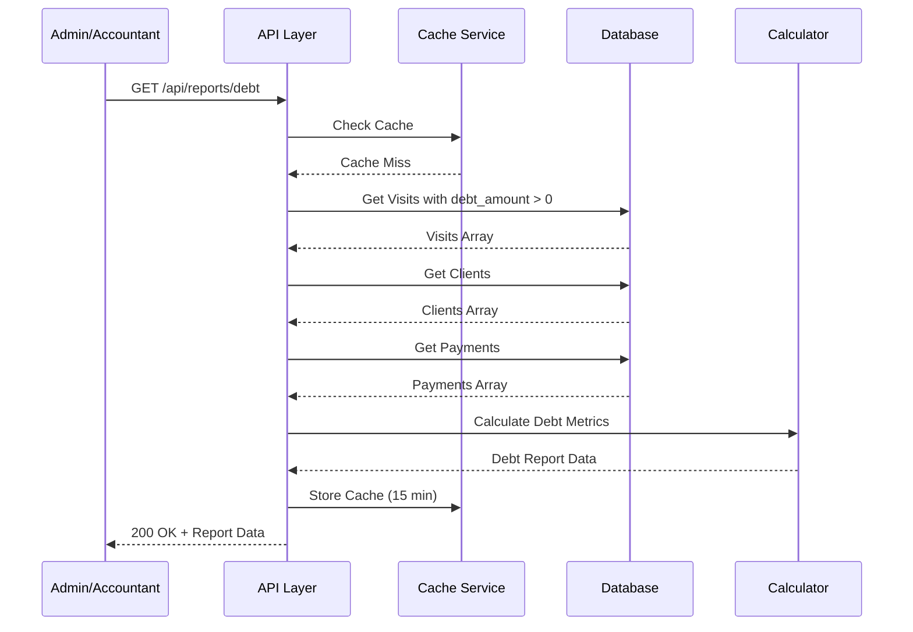
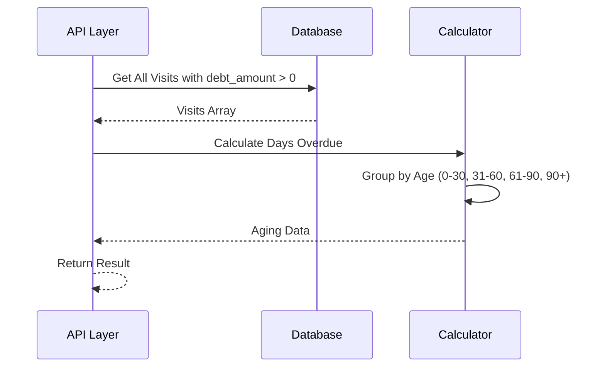
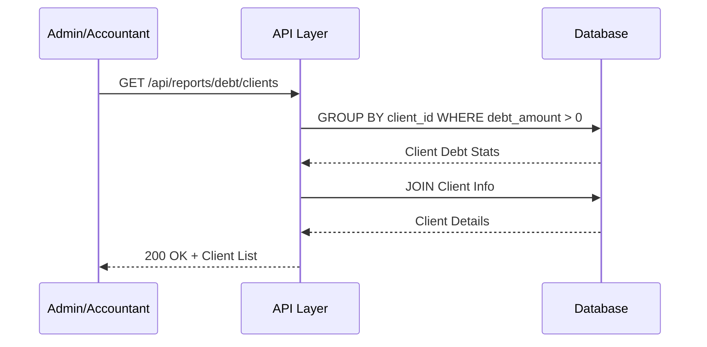
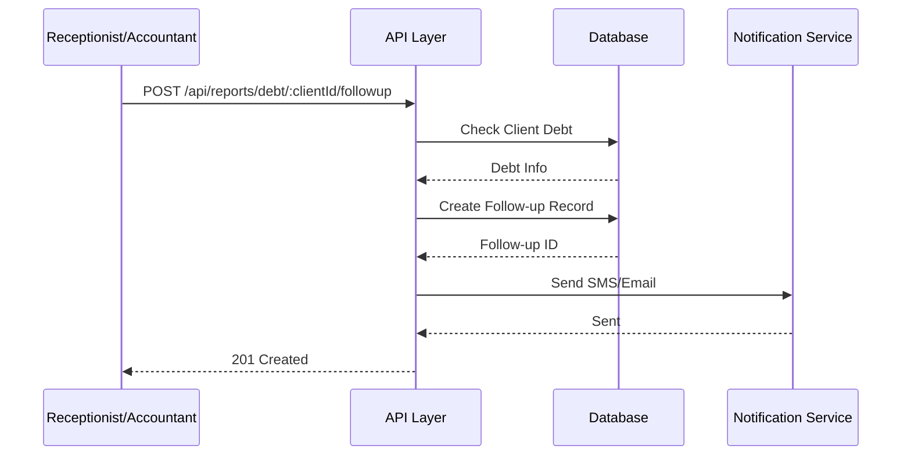

# 📄 FAYL: `24-debt-report-management.md`

# 24. Qarzdorlik Hisoboti Boshqaruvi (Debt Report Management)

## 📋 UMUMIY MA'LUMOT

| Maydon | Qiymat |
|--------|--------|
| **Flow ID** | 24 |
| **Phase** | 3 - Reports & Analytics |
| **Model** | `Report` (Virtual - mavjud ma'lumotlardan hosil qilinadi) |
| **Status** | Draft |
| **Yaratilgan Sana** | 2024-01-15 |
| **Oxirgi Yangilanish** | 2024-01-15 |
| **Mas'ul** | Senior Backend Developer |
| **Bog'liq Modellar** | `Visit` (RFC-013), `Client` (RFC-009), `Payment` (RFC-014), `ClientPaid` (RFC-015) |

---

## 🎯 MAQSAD

Klinikadagi qarzdorliklarni kuzatish, tahlil qilish va hisobot qilish. Mijozlar qarzdorligini aniqlash, muddati o'tgan qarzlarni monitoring qilish, qarzdorlik yoshi bo'yicha tahlil va to'lov undirish jarayonlarini boshqarish. Moliyaviy yo'qotishlarni kamaytirish va naqd oqimini yaxshilash uchun asos yaratish (Reference: `Klinika.md` 3.5, 7.1, 7.2).

---

## 👥 MAS'UL ROLLAR

| Rol | View | Export | Follow-up | Tavsif |
|-----|------|--------|-----------|--------|
| **Admin** | ✅ (barcha) | ✅ | ✅ | To'liq huquq - barcha qarzdorlik hisobotlari |
| **Doctor** | ❌ | ❌ | ❌ | Ruxsat yo'q |
| **Nurse** | ❌ | ❌ | ❌ | Ruxsat yo'q |
| **Receptionist** | ✅ (faqat ko'rish) | ❌ | ✅ | Mijozlar bilan ishlash |
| **Accountant** | ✅ (barcha) | ✅ | ✅ | Moliyaviy hisobotlar va undirish |

---

## 📊 HISOBOT TUZILISHI (Reference: `Klinika.md` 7.1, 7.2)

### Qarzdorlik Hisoboti Metrikalari

```
┌─────────────────────────────────────────────────────────────┐
│                   QARZDORLIK HISOBOTI                       │
│                   (Debt Report)                             │
├─────────────────────────────────────────────────────────────┤
│  📊 ASOSIY KO'RSATKICHLAR                                   │
│  • Umumiy qarzdorlik summasi                                │
│  • Qarzдор mijozlar soni                                    │
│  • Muddati o'tgan qarzdorlik                                │
│  • Qarzdorlik foizi (Debt Rate)                             │
│  • O'rtacha qarz summasi                                    │
├─────────────────────────────────────────────────────────────┤
│  📅 QARZ YOShI BO'YICHA (AGING)                             │
│  • 0-30 kun (Joriy)                                         │
│  • 31-60 kun (Kechikgan)                                    │
│  • 61-90 kun (Jiddiy kechikgan)                             │
│  • 90+ kun (Umidsiz)                                        │
├─────────────────────────────────────────────────────────────┤
│  👥 MIJOZLAR KESIMIDA                                       │
│  • Eng ko'p qarzдор mijozlar (Top 10)                       │
│  • Yangi qarzдорlar                                         │
│  • To'lov qilgan mijozlar                                   │
├─────────────────────────────────────────────────────────────┤
│  📈 VAQT BO'YICHA TAQSIMOT                                  │
│  • Kunlik qarz o'zgarishi                                   │
│  • Oylik qarz dinamikasi                                    │
│  • To'lov undirish foizi                                    │
├─────────────────────────────────────────────────────────────┤
│  📞 UNDIRISH CHORALARI                                      │
│  • SMS eslatmalar yuborilgan                                │
│  • Qo'ng'iroq qilingan                                      │
│  • Kelishilgan to'lov rejasi                                │
│  • Yuridik choralar                                         │
└─────────────────────────────────────────────────────────────┘
```

---

## 🔄 FLOW DIAGRAM

### 1. Qarzdorlik Hisobotini Yaratish Flow



### 2. Qarz Yoshi (Aging) Hisoblash Flow



### 3. Qarzдор Mijozlar Ro'yxati Flow



### 4. Qarz Undirish Follow-up Flow



---

## 📝 BOSQICHMA-BOSQICH JARAYON

### BOSQICH 1: Umumiy Qarzdorlik Statistikasi

#### 1.1. Ma'lumot Manbalari

```typescript
// Qarzdorlik hisoboti
interface DebtReport {
  period: {
    from: Date;
    to: Date;
  };
  summary: DebtSummary;
  aging: DebtAging[];
  topDebtors: TopDebtor[];
  trendData: DebtTrendData[];
  collectionStats: CollectionStats;
}

interface DebtSummary {
  totalDebt: number;           // Umumiy qarzdorlik
  totalClients: number;        // Qarzдор mijozlar soni
  averageDebt: number;         // O'rtacha qarz summasi
  debtRate: number;            // Qarzdorlik foizi
  overdueDebt: number;         // Muddati o'tgan qarz
  overdueClients: number;      // Muddati o'tgan qarzдор mijozlar
}

interface DebtAging {
  ageRange: string;            // "0-30 kun", "31-60 kun", etc.
  minDays: number;
  maxDays: number;
  amount: number;
  count: number;
  percentage: number;
}

interface TopDebtor {
  clientId: number;
  clientName: string;
  phone: string;
  totalDebt: number;
  visitCount: number;
  oldestDebtDate: Date;
  daysOverdue: number;
}

interface DebtTrendData {
  date: Date;
  debtAmount: number;
  collectedAmount: number;
  netDebt: number;
}

interface CollectionStats {
  totalCollected: number;
  collectionRate: number;
  followupCount: number;
  smsSent: number;
  callsMade: number;
}
```

#### 1.2. Biznes Logika

```typescript
// debt-report.service.ts
async getDebtReport(
  startDate: Date,
  endDate: Date,
  currentUserId: number,
  currentUserRole: string
): Promise<DebtReport> {
  // 1. RBAC tekshiruvi (Reference: Klinika.md 6.1)
  if (currentUserRole !== 'Admin' && currentUserRole !== 'Accountant') {
    throw new ForbiddenException('DR_001');
  }

  // 2. Qarzдор visitlarni olish
  const debtVisits = await this.prisma.visit.findMany({
    where: {
      debt_amount: { gt: 0 },
      visit_date: {
        gte: startDate,
        lt: endDate
      },
      deleted_at: null
    },
    include: {
      client: {
        select: {
          id: true,
          full_name: true,
          phone: true
        }
      }
    }
  });

  // 3. Umumiy statistika hisoblash
  const summary = await this.calculateDebtSummary(debtVisits, startDate, endDate);

  // 4. Qarz yoshi (aging) hisoblash
  const aging = await this.calculateDebtAging(debtVisits);

  // 5. Eng ko'p qarzдор mijozlar
  const topDebtors = await this.getTopDebtors(debtVisits);

  // 6. Vaqt bo'yicha trend
  const trendData = await this.getDebtTrend(debtVisits, startDate, endDate);

  // 7. Undirish statistikasi
  const collectionStats = await this.getCollectionStats(startDate, endDate);

  return {
    period: {
      from: startDate,
      to: endDate
    },
    summary,
    aging,
    topDebtors,
    trendData,
    collectionStats
  };
}

// Umumiy qarzdorlik statistikasi
private async calculateDebtSummary(
  debtVisits: any[],
  startDate: Date,
  endDate: Date
): Promise<DebtSummary> {
  // Umumiy qarzdorlik
  const totalDebt = debtVisits.reduce((sum, v) => sum + v.debt_amount.toNumber(), 0);
  
  // Qarzдор mijozlar soni (unikal)
  const uniqueClients = new Set(debtVisits.map(v => v.client_id));
  const totalClients = uniqueClients.size;
  
  // O'rtacha qarz
  const averageDebt = totalClients > 0 
    ? Math.round((totalDebt / totalClients) * 100) / 100
    : 0;
  
  // Jami visitlar va to'lovlar
  const allVisits = await this.prisma.visit.aggregate({
    where: {
      visit_date: {
        gte: startDate,
        lt: endDate
      },
      deleted_at: null
    },
    _sum: {
      total_amount: true,
      debt_amount: true
    }
  });
  
  // Qarzdorlik foizi
  const totalAmount = allVisits._sum.total_amount?.toNumber() || 0;
  const debtRate = totalAmount > 0
    ? Math.round((totalDebt / totalAmount) * 100 * 10) / 10
    : 0;
  
  // Muddati o'tgan qarz (30 kundan oshgan)
  const now = new Date();
  const overdueVisits = debtVisits.filter(v => {
    const daysOverdue = Math.floor((now.getTime() - v.visit_date.getTime()) / (1000 * 60 * 60 * 24));
    return daysOverdue > 30;
  });
  
  const overdueDebt = overdueVisits.reduce((sum, v) => sum + v.debt_amount.toNumber(), 0);
  const overdueClients = new Set(overdueVisits.map(v => v.client_id)).size;
  
  return {
    totalDebt,
    totalClients,
    averageDebt,
    debtRate,
    overdueDebt,
    overdueClients
  };
}

// Qarz yoshi (aging) hisoblash
private async calculateDebtAging(debtVisits: any[]): Promise<DebtAging[]> {
  const now = new Date();
  
  const aging: DebtAging[] = [
    { ageRange: '0-30 kun', minDays: 0, maxDays: 30, amount: 0, count: 0, percentage: 0 },
    { ageRange: '31-60 kun', minDays: 31, maxDays: 60, amount: 0, count: 0, percentage: 0 },
    { ageRange: '61-90 kun', minDays: 61, maxDays: 90, amount: 0, count: 0, percentage: 0 },
    { ageRange: '90+ kun', minDays: 91, maxDays: 9999, amount: 0, count: 0, percentage: 0 }
  ];
  
  const totalDebt = debtVisits.reduce((sum, v) => sum + v.debt_amount.toNumber(), 0);
  
  for (const visit of debtVisits) {
    const daysOverdue = Math.floor((now.getTime() - visit.visit_date.getTime()) / (1000 * 60 * 60 * 24));
    const debtAmount = visit.debt_amount.toNumber();
    
    const ageGroup = aging.find(a => daysOverdue >= a.minDays && daysOverdue <= a.maxDays);
    if (ageGroup) {
      ageGroup.amount += debtAmount;
      ageGroup.count += 1;
    }
  }
  
  // Percentages hisoblash
  aging.forEach(a => {
    a.percentage = totalDebt > 0
      ? Math.round((a.amount / totalDebt) * 100 * 10) / 10
      : 0;
  });
  
  return aging;
}

// Eng ko'p qarzдор mijozlar
private async getTopDebtors(debtVisits: any[], limit: number = 10): Promise<TopDebtor[]> {
  // Mijozlar bo'yicha guruhlash
  const clientDebts = new Map<number, {
    totalDebt: number;
    visitCount: number;
    oldestDate: Date;
    clientName: string;
    phone: string;
  }>();
  
  for (const visit of debtVisits) {
    if (!clientDebts.has(visit.client_id)) {
      clientDebts.set(visit.client_id, {
        totalDebt: 0,
        visitCount: 0,
        oldestDate: visit.visit_date,
        clientName: visit.client.full_name,
        phone: visit.client.phone
      });
    }
    
    const client = clientDebts.get(visit.client_id)!;
    client.totalDebt += visit.debt_amount.toNumber();
    client.visitCount += 1;
    
    if (visit.visit_date < client.oldestDate) {
      client.oldestDate = visit.visit_date;
    }
  }
  
  const now = new Date();
  
  return Array.from(clientDebts.entries())
    .map(([clientId, data]) => ({
      clientId,
      clientName: data.clientName,
      phone: data.phone,
      totalDebt: data.totalDebt,
      visitCount: data.visitCount,
      oldestDebtDate: data.oldestDate,
      daysOverdue: Math.floor((now.getTime() - data.oldestDate.getTime()) / (1000 * 60 * 60 * 24))
    }))
    .sort((a, b) => b.totalDebt - a.totalDebt)
    .slice(0, limit);
}

// Vaqt bo'yicha trend
private async getDebtTrend(
  debtVisits: any[],
  startDate: Date,
  endDate: Date
): Promise<DebtTrendData[]> {
  // Kunlar bo'yicha guruhlash
  const dailyStats = new Map<string, {
    debtAmount: number;
    collectedAmount: number;
  }>();
  
  for (const visit of debtVisits) {
    const dateKey = new Date(visit.visit_date).toISOString().split('T')[0];
    
    if (!dailyStats.has(dateKey)) {
      dailyStats.set(dateKey, {
        debtAmount: 0,
        collectedAmount: 0
      });
    }
    
    const stat = dailyStats.get(dateKey)!;
    stat.debtAmount += visit.debt_amount.toNumber();
    stat.collectedAmount += visit.paid_amount.toNumber();
  }
  
  return Array.from(dailyStats.entries())
    .map(([date, stat]) => ({
      date: new Date(date),
      debtAmount: stat.debtAmount,
      collectedAmount: stat.collectedAmount,
      netDebt: stat.debtAmount - stat.collectedAmount
    }))
    .sort((a, b) => a.date.getTime() - b.date.getTime());
}

// Undirish statistikasi
private async getCollectionStats(startDate: Date, endDate: Date): Promise<CollectionStats> {
  // To'langan summa
  const payments = await this.prisma.payment.aggregate({
    where: {
      payment_date: {
        gte: startDate,
        lt: endDate
      },
      payment_type: 'INCOME',
      deleted_at: null
    },
    _sum: {
      amount: true
    }
  });
  
  // Follow-up records
  const followupCount = await this.prisma.debtFollowup.count({
    where: {
      created_at: {
        gte: startDate,
        lt: endDate
      },
      deleted_at: null
    }
  });
  
  // SMS va qo'ng'iroqlar (kelajakda qo'shiladi)
  const smsSent = 0;
  const callsMade = 0;
  
  const totalCollected = payments._sum.amount?.toNumber() || 0;
  
  // Undirish foizi
  const totalDebt = await this.prisma.visit.aggregate({
    where: {
      visit_date: {
        gte: startDate,
        lt: endDate
      },
      deleted_at: null
    },
    _sum: {
      debt_amount: true
    }
  });
  
  const collectionRate = (totalDebt._sum.debt_amount?.toNumber() || 0) > 0
    ? Math.round((totalCollected / (totalDebt._sum.debt_amount?.toNumber() || 0)) * 100 * 10) / 10
    : 0;
  
  return {
    totalCollected,
    collectionRate,
    followupCount,
    smsSent,
    callsMade
  };
}
```

---

### BOSQICH 2: Qarzдор Mijozlar Ro'yxati

#### 2.1. Ma'lumot Manbalari

```typescript
// Qarzдор mijozlar ro'yxati
interface DebtClientList {
  period: {
    from: Date;
    to: Date;
  };
  totalClients: number;
  totalDebt: number;
  clients: DebtClient[];
  pagination: Pagination;
}

interface DebtClient {
  clientId: number;
  clientName: string;
  phone: string;
  totalDebt: number;
  visitCount: number;
  oldestDebtDate: Date;
  newestDebtDate: Date;
  daysOverdue: number;
  lastPaymentDate: Date | null;
  lastPaymentAmount: number;
  contactAttempts: number;
  status: 'NEW' | 'CONTACTED' | 'PROMISED' | 'LEGAL';
}
```

#### 2.2. Biznes Logika

```typescript
async getDebtClientList(
  startDate: Date,
  endDate: Date,
  page: number = 1,
  limit: number = 20,
  filters: DebtClientFilters,
  currentUserId: number,
  currentUserRole: string
): Promise<DebtClientList> {
  // 1. RBAC tekshiruvi
  if (currentUserRole !== 'Admin' && currentUserRole !== 'Accountant') {
    throw new ForbiddenException('DR_001');
  }

  // 2. Qarzдор visitlarni olish
  const debtVisits = await this.prisma.visit.findMany({
    where: {
      debt_amount: { gt: 0 },
      visit_date: {
        gte: startDate,
        lt: endDate
      },
      deleted_at: null,
      ...(filters.min_debt && {
        debt_amount: { gte: filters.min_debt }
      }),
      ...(filters.days_overdue && {
        visit_date: {
          lte: new Date(new Date().setDate(new Date().getDate() - filters.days_overdue))
        }
      })
    },
    include: {
      client: {
        select: {
          id: true,
          full_name: true,
          phone: true
        }
      },
      payments: {
        where: {
          deleted_at: null
        },
        orderBy: {
          payment_date: 'desc'
        },
        take: 1
      }
    }
  });

  // 3. Mijozlar bo'yicha guruhlash
  const clientDebts = new Map<number, DebtClient>();
  
  for (const visit of debtVisits) {
    if (!clientDebts.has(visit.client_id)) {
      clientDebts.set(visit.client_id, {
        clientId: visit.client_id,
        clientName: visit.client.full_name,
        phone: visit.client.phone,
        totalDebt: 0,
        visitCount: 0,
        oldestDebtDate: visit.visit_date,
        newestDebtDate: visit.visit_date,
        daysOverdue: 0,
        lastPaymentDate: visit.payments[0]?.payment_date || null,
        lastPaymentAmount: visit.payments[0]?.amount.toNumber() || 0,
        contactAttempts: 0,
        status: 'NEW'
      });
    }
    
    const client = clientDebts.get(visit.client_id)!;
    client.totalDebt += visit.debt_amount.toNumber();
    client.visitCount += 1;
    
    if (visit.visit_date < client.oldestDebtDate) {
      client.oldestDebtDate = visit.visit_date;
    }
    if (visit.visit_date > client.newestDebtDate) {
      client.newestDebtDate = visit.visit_date;
    }
  }
  
  // 4. Days overdue hisoblash
  const now = new Date();
  const clients = Array.from(clientDebts.values()).map(client => ({
    ...client,
    daysOverdue: Math.floor((now.getTime() - client.oldestDebtDate.getTime()) / (1000 * 60 * 60 * 24))
  }));
  
  // 5. Sort va pagination
  clients.sort((a, b) => {
    if (filters.sort_by === 'debt_amount') {
      return filters.sort_order === 'desc' ? b.totalDebt - a.totalDebt : a.totalDebt - b.totalDebt;
    } else if (filters.sort_by === 'days_overdue') {
      return filters.sort_order === 'desc' ? b.daysOverdue - a.daysOverdue : a.daysOverdue - b.daysOverdue;
    }
    return 0;
  });
  
  const totalClients = clients.length;
  const totalDebt = clients.reduce((sum, c) => sum + c.totalDebt, 0);
  
  const paginatedClients = clients.slice((page - 1) * limit, page * limit);
  
  return {
    period: {
      from: startDate,
      to: endDate
    },
    totalClients,
    totalDebt,
    clients: paginatedClients,
    pagination: {
      page,
      limit,
      total: totalClients,
      totalPages: Math.ceil(totalClients / limit),
      hasNextPage: page * limit < totalClients,
      hasPrevPage: page > 1
    }
  };
}
```

---

### BOSQICH 3: Qarz Undirish Follow-up

#### 3.1. Ma'lumot Manbalari

```typescript
// Follow-up yaratish
interface CreateFollowupDto {
  clientId: number;
  type: 'SMS' | 'CALL' | 'EMAIL' | 'VISIT' | 'LEGAL';
  description?: string;
  promisedAmount?: number;
  promisedDate?: Date;
  followupDate?: Date;
}

// Follow-up record
interface DebtFollowup {
  id: number;
  clientId: number;
  type: string;
  description: string | null;
  promisedAmount: number | null;
  promisedDate: Date | null;
  followupDate: Date | null;
  status: 'PENDING' | 'COMPLETED' | 'CANCELLED';
  created_at: Date;
  created_by: number;
}
```

#### 3.2. Biznes Logika

```typescript
async createFollowup(
  createFollowupDto: CreateFollowupDto,
  userId: number
): Promise<DebtFollowup> {
  // 1. Mijoz mavjudligini tekshirish
  const client = await this.prisma.client.findUnique({
    where: { id: createFollowupDto.clientId }
  });

  if (!client || client.deleted_at) {
    throw new NotFoundException('DR_002');
  }

  // 2. Mijozda qarz borligini tekshirish
  const debtVisits = await this.prisma.visit.findFirst({
    where: {
      client_id: createFollowupDto.clientId,
      debt_amount: { gt: 0 },
      deleted_at: null
    }
  });

  if (!debtVisits) {
    throw new BadRequestException('DR_003');
  }

  // 3. Follow-up yaratish
  const followup = await this.prisma.debtFollowup.create({
     {
      client_id: createFollowupDto.clientId,
      type: createFollowupDto.type,
      description: createFollowupDto.description,
      promised_amount: createFollowupDto.promisedAmount,
      promised_date: createFollowupDto.promisedDate,
      followup_date: createFollowupDto.followupDate,
      status: 'PENDING',
      created_at: new Date(),
      updated_at: new Date(),
      created_by: userId
    }
  });

  // 4. Agar SMS/Email bo'lsa, notification yuborish
  if (createFollowupDto.type === 'SMS' || createFollowupDto.type === 'EMAIL') {
    await this.sendNotification(createFollowupDto.clientId, createFollowupDto.type);
  }

  return followup;
}

// Notification yuborish
private async sendNotification(clientId: number, type: 'SMS' | 'EMAIL'): Promise<void> {
  const client = await this.prisma.client.findUnique({
    where: { id: clientId },
    select: {
      full_name: true,
      phone: true,
      email: true
    }
  });

  // Debt summasini hisoblash
  const debtStats = await this.prisma.visit.aggregate({
    where: {
      client_id: clientId,
      debt_amount: { gt: 0 },
      deleted_at: null
    },
    _sum: {
      debt_amount: true
    }
  });

  const totalDebt = debtStats._sum.debt_amount?.toNumber() || 0;

  if (type === 'SMS' && client?.phone) {
    // SMS yuborish (kelajakda SMS gateway integratsiyasi)
    await this.smsService.send({
      to: client.phone,
      message: `Hurmatli ${client.full_name}, klinikamizda qarzdorligingiz ${totalDebt} so'm. Iltimos, to'lovni amalga oshiring.`
    });
  }

  if (type === 'EMAIL' && client?.email) {
    // Email yuborish (kelajakda Email service integratsiyasi)
    await this.emailService.send({
      to: client.email,
      subject: 'Qarzdorlik bo\'yicha eslatma',
      body: `Hurmatli ${client.full_name}, ...`
    });
  }
}
```

---

## 🔌 API ENDPOINT'LAR

### 1. Qarzdorlik Hisobotini Olish

| Parametr | Qiymat |
|----------|--------|
| **Method** | GET |
| **Endpoint** | `/api/v1/reports/debt` |
| **Auth** | ✅ JWT Required |
| **Rol** | Admin, Accountant |
| **Query Params** | `start_date`, `end_date` |

**Request Example:**
```http
GET /api/v1/reports/debt?start_date=2024-01-01&end_date=2024-01-31
```

**Response (200 OK):**
```json
{
  "success": true,
  "data": {
    "period": {
      "from": "2024-01-01T00:00:00.000Z",
      "to": "2024-01-31T23:59:59.999Z"
    },
    "summary": {
      "totalDebt": 75000000,
      "totalClients": 30,
      "averageDebt": 2500000,
      "debtRate": 16.7,
      "overdueDebt": 25000000,
      "overdueClients": 10
    },
    "aging": [
      {
        "ageRange": "0-30 kun",
        "minDays": 0,
        "maxDays": 30,
        "amount": 30000000,
        "count": 15,
        "percentage": 40.0
      },
      {
        "ageRange": "31-60 kun",
        "minDays": 31,
        "maxDays": 60,
        "amount": 20000000,
        "count": 8,
        "percentage": 26.7
      },
      {
        "ageRange": "61-90 kun",
        "minDays": 61,
        "maxDays": 90,
        "amount": 15000000,
        "count": 5,
        "percentage": 20.0
      },
      {
        "ageRange": "90+ kun",
        "minDays": 91,
        "maxDays": 9999,
        "amount": 10000000,
        "count": 2,
        "percentage": 13.3
      }
    ],
    "topDebtors": [
      {
        "clientId": 1,
        "clientName": "John Doe",
        "phone": "+998901234567",
        "totalDebt": 5000000,
        "visitCount": 5,
        "oldestDebtDate": "2023-10-01T10:00:00.000Z",
        "daysOverdue": 107
      }
    ],
    "trendData": [...],
    "collectionStats": {
      "totalCollected": 50000000,
      "collectionRate": 66.7,
      "followupCount": 45,
      "smsSent": 30,
      "callsMade": 15
    }
  }
}
```

---

### 2. Qarzдор Mijozlar Ro'yxati

| Parametr | Qiymat |
|----------|--------|
| **Method** | GET |
| **Endpoint** | `/api/v1/reports/debt/clients` |
| **Auth** | ✅ JWT Required |
| **Rol** | Admin, Accountant |
| **Query Params** | `start_date`, `end_date`, `page`, `limit`, `min_debt`, `days_overdue`, `sort_by`, `sort_order` |

**Request Example:**
```http
GET /api/v1/reports/debt/clients?start_date=2024-01-01&end_date=2024-01-31&page=1&limit=20&min_debt=1000000&days_overdue=30
```

**Response (200 OK):**
```json
{
  "success": true,
  "data": {
    "period": {
      "from": "2024-01-01T00:00:00.000Z",
      "to": "2024-01-31T23:59:59.999Z"
    },
    "totalClients": 30,
    "totalDebt": 75000000,
    "clients": [
      {
        "clientId": 1,
        "clientName": "John Doe",
        "phone": "+998901234567",
        "totalDebt": 5000000,
        "visitCount": 5,
        "oldestDebtDate": "2023-10-01T10:00:00.000Z",
        "newestDebtDate": "2024-01-15T10:00:00.000Z",
        "daysOverdue": 107,
        "lastPaymentDate": "2024-01-10T12:00:00.000Z",
        "lastPaymentAmount": 1000000,
        "contactAttempts": 3,
        "status": "CONTACTED"
      }
    ],
    "pagination": {
      "page": 1,
      "limit": 20,
      "total": 30,
      "totalPages": 2,
      "hasNextPage": true,
      "hasPrevPage": false
    }
  }
}
```

---

### 3. Qarz Undirish Follow-up Yaratish

| Parametr | Qiymat |
|----------|--------|
| **Method** | POST |
| **Endpoint** | `/api/v1/reports/debt/:clientId/followup` |
| **Auth** | ✅ JWT Required |
| **Rol** | Admin, Accountant, Receptionist |

**Request Body:**
```json
{
  "type": "SMS",
  "description": "Qarzdorlik bo'yicha eslatma",
  "promisedAmount": 2000000,
  "promisedDate": "2024-02-15",
  "followupDate": "2024-02-10"
}
```

**Response (201 Created):**
```json
{
  "success": true,
  "message": "Follow-up muvaffaqiyatli yaratildi",
  "data": {
    "id": 1,
    "clientId": 1,
    "type": "SMS",
    "description": "Qarzdorlik bo'yicha eslatma",
    "promisedAmount": 2000000,
    "promisedDate": "2024-02-15",
    "followupDate": "2024-02-10",
    "status": "PENDING",
    "created_at": "2024-01-15T10:00:00.000Z",
    "created_by": 1
  }
}
```

---

### 4. Qarz Yoshi (Aging) Hisoboti

| Parametr | Qiymat |
|----------|--------|
| **Method** | GET |
| **Endpoint** | `/api/v1/reports/debt/aging` |
| **Auth** | ✅ JWT Required |
| **Rol** | Admin, Accountant |

**Response (200 OK):**
```json
{
  "success": true,
  "data": {
    "period": {
      "from": "2024-01-01T00:00:00.000Z",
      "to": "2024-01-31T23:59:59.999Z"
    },
    "aging": [
      {
        "ageRange": "0-30 kun",
        "amount": 30000000,
        "count": 15,
        "percentage": 40.0
      },
      {
        "ageRange": "31-60 kun",
        "amount": 20000000,
        "count": 8,
        "percentage": 26.7
      },
      {
        "ageRange": "61-90 kun",
        "amount": 15000000,
        "count": 5,
        "percentage": 20.0
      },
      {
        "ageRange": "90+ kun",
        "amount": 10000000,
        "count": 2,
        "percentage": 13.3
      }
    ],
    "totalDebt": 75000000,
    "totalClients": 30
  }
}
```

---

### 5. Qarzdorlik Hisoboti Export (Excel/PDF)

| Parametr | Qiymat |
|----------|--------|
| **Method** | POST |
| **Endpoint** | `/api/v1/reports/debt/export` |
| **Auth** | ✅ JWT Required |
| **Rol** | Admin, Accountant |

**Request Body:**
```json
{
  "start_date": "2024-01-01",
  "end_date": "2024-01-31",
  "format": "excel",
  "includeDetails": true
}
```

**Response:** File Download

---

## ⚠️ XATOLIKLAR VA HANDLING

| Kod | HTTP Status | Xabar | Sabab | Yechim |
|-----|-------------|-------|-------|--------|
| `DR_001` | 403 Forbidden | Ruxsat yo'q | Insufficient permissions | Rol tekshirilsin |
| `DR_002` | 404 Not Found | Mijoz topilmadi | Client ID not exists | Client ID ni tekshiring |
| `DR_003` | 400 Bad Request | Mijozda qarz yo'q | No debt for client | Qarzдорligini tekshiring |
| `DR_004` | 400 Bad Request | Sana formati noto'g'ri | Invalid date format | YYYY-MM-DD format |
| `DR_005` | 500 Internal Server Error | Hisobot yaratishda xatolik | Calculation error | Admin bilan bog'laning |

---

## 📦 CACHE STRATEGY (Reference: `Klinika.md` 9.1)

### Caching Configuration

| Data | Cache | TTL | Invalidation |
|------|-------|-----|--------------|
| Debt Report | Redis | 15 daqiqa | Payment create/update, Visit update |
| Debt Client List | Redis | 15 daqiqa | Payment create/update |
| Debt Aging | Redis | 30 daqiqa | Payment create/update |
| Export File | Redis | 24 soat | Automatic expiry |

### Cache Implementation

```typescript
async getDebtReport(startDate: Date, endDate: Date): Promise<DebtReport> {
  const cacheKey = `debt_report:${startDate.toISOString()}:${endDate.toISOString()}`;
  
  // Cache dan olish
  const cached = await this.cacheService.get(cacheKey);
  if (cached) {
    return cached;
  }
  
  // DB dan hisoblash
  const report = await this.calculateDebtReport(startDate, endDate);
  
  // Cache ga saqlash (15 daqiqa)
  await this.cacheService.set(cacheKey, report, { ttl: 900 });
  
  return report;
}
```

---

## 🔐 XAVFSIZLIK TALABLARI (Reference: `Klinika.md` 8)

### 1. Autentifikatsiya
- ✅ Barcha endpoint'lar JWT token talab qiladi
- ✅ Token expiry: 24 soat

### 2. Avtorizatsiya (RBAC) (Reference: `Klinika.md` 6.1)

| Endpoint | Admin | Doctor | Nurse | Receptionist | Accountant |
|----------|-------|--------|-------|--------------|------------|
| GET /debt | ✅ | ❌ | ❌ | ❌ | ✅ |
| GET /debt/clients | ✅ | ❌ | ❌ | ✅ | ✅ |
| POST /debt/:id/followup | ✅ | ❌ | ❌ | ✅ | ✅ |
| GET /debt/aging | ✅ | ❌ | ❌ | ❌ | ✅ |
| POST /debt/export | ✅ | ❌ | ❌ | ❌ | ✅ |

### 3. Audit (Reference: `Klinika.md` 5.2)
- ✅ Hisobot ko'rish harakati log qilinadi
- ✅ Follow-up yaratish log qilinadi
- ✅ Export harakati log qilinadi

### 4. Ma'lumotlar Xavfsizligi (Reference: `Klinika.md` 8.1)
- ✅ Moliyaviy ma'lumotlar faqat Admin/Accountant uchun
- ✅ Mijoz ma'lumotlari konfidensial
- ✅ Export fayllar vaqtinchalik saqlanadi (24 soat)
- ✅ Follow-up ma'lumotlari audit qilinadi

---

## 📝 ESLATMALAR

1. **Virtual Report** - Qarzdorlik hisoboti alohida jadvalda saqlanmaydi, real-time hosil qilinadi
2. **Cache** - Hisobot ma'lumotlari 15 daqiqa cache qilinadi (performance uchun)
3. **Debt Aging** - Qarz yoshi 4 ta kategoriya bo'yicha hisoblanadi (0-30, 31-60, 61-90, 90+)
4. **Follow-up** - Qarz undirish choralari DebtFollowup jadvalida saqlanadi
5. **RBAC** - Faqat Admin/Accountant to'liq huquqqa ega, Receptionist faqat follow-up qilishi mumkin
6. **Export** - Excel/PDF export 24 soat davomida yuklab olish mumkin
7. **Timezone** - Barcha vaqtlar UTC timezone da saqlanadi
8. **Decimal Precision** - Barcha moliyaviy summalar Decimal(15,2) formatda
9. **Performance** - Hisobot yaratish vaqti < 5 soniya bo'lishi kerak
10. **Notification** - SMS/Email eslatmalar kelajakda integratsiya qilinadi

---

## ✅ QABUL QILISH MEZONLARI (ACCEPTANCE CRITERIA)

### Functional Requirements
- [ ] Umumiy qarzdorlik statistikasi to'g'ri hisoblanishi
- [ ] Qarz yoshi (aging) to'g'ri hisoblanishi
- [ ] Qarzдор mijozlar ro'yxati to'g'ri ishlashi
- [ ] Follow-up yaratish ishlashi
- [ ] Vaqt trendi to'g'ri hisoblanishi
- [ ] Undirish statistikasi to'g'ri ishlashi
- [ ] Cache strategiyasi ishlashi (15 daqiqa TTL)
- [ ] Export funksiyasi ishlashi (Excel/PDF)
- [ ] RBAC to'g'ri ishlashi (Reference: `Klinika.md` 6.1)
- [ ] Sana validatsiyasi ishlashi
- [ ] Xatoliklar to'g'ri HTTP status va kod bilan qaytarilishi

### Non-Functional Requirements (Reference: `Klinika.md` 9.1)
- [ ] API response time < 5 seconds (hisobot yaratish)
- [ ] API response time < 500ms (cached)
- [ ] Cache hit rate > 80%
- [ ] Export generation time < 15 seconds
- [ ] Unit test coverage ≥ 90%
- [ ] E2E test coverage ≥ 70%
- [ ] Security audit o'tkazildi
- [ ] Documentation to'liq
- [ ] Concurrent users 50+ qo'llab-quvvatlanadi
- [ ] Data retention 5 yil

---