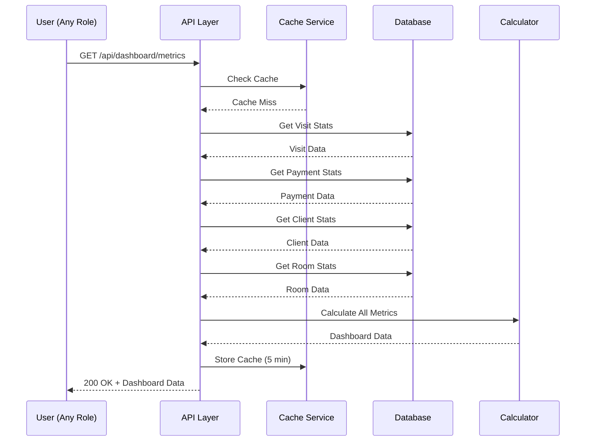
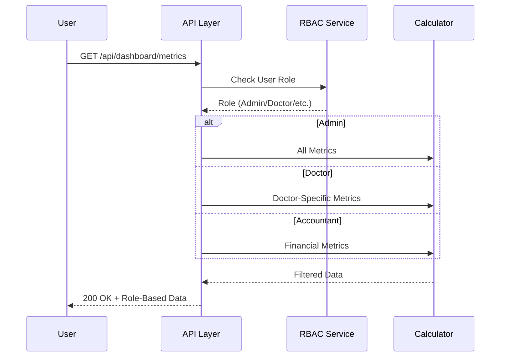
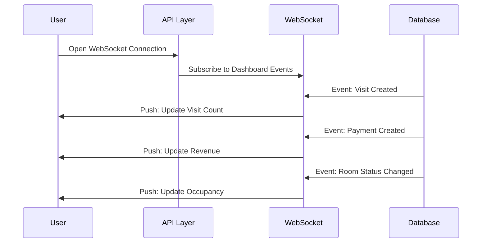

# 📄 FAYL: `25-dashboard-metrics-management.md`

# 25. Boshqaruv Paneli Metrikalari (Dashboard Metrics Management)

## 📋 UMUMIY MA'LUMOT

| Maydon | Qiymat |
|--------|--------|
| **Flow ID** | 25 |
| **Phase** | 3 - Reports & Analytics (Oxirgi) |
| **Model** | `Report` (Virtual - mavjud ma'lumotlardan hosil qilinadi) |
| **Status** | Draft |
| **Yaratilgan Sana** | 2024-01-15 |
| **Oxirgi Yangilanish** | 2024-01-15 |
| **Mas'ul** | Senior Backend Developer |
| **Bog'liq Modellar** | `Visit` (RFC-013), `Client` (RFC-009), `Payment` (RFC-014), `Service` (RFC-011), `Room` (RFC-010), `User` (RFC-002) |

---

## 🎯 MAQSAD

Klinika boshqaruv paneli (Dashboard) uchun asosiy metrikalarni taqdim etish. Kunlik, oylik va yillik ko'rsatkichlarni real-time kuzatish, tez qaror qabul qilish uchun vizual ma'lumotlar taqdim etish. Tizimning barcha modullaridan ma'lumotlarni agregatsiya qilish va foydalanuvchi roli bo'yicha filtrlash (Reference: `Klinika.md` 7.1, 7.2).

---

## 👥 MAS'UL ROLLAR

| Rol | View | Refresh | Export | Tavsif |
|-----|------|---------|--------|--------|
| **Admin** | ✅ (barcha) | ✅ | ✅ | To'liq dashboard, barcha metrikalar |
| **Doctor** | ✅ (o'z metrikalari) | ✅ | ❌ | Faqat o'z ko'rsatkichlari |
| **Nurse** | ❌ | ❌ | ❌ | Ruxsat yo'q |
| **Receptionist** | ✅ (operatsion) | ✅ | ❌ | Qabul va mijoz metrikalari |
| **Accountant** | ✅ (moliyaviy) | ✅ | ✅ | Moliyaviy metrikalar |

---

## 📊 DASHBOARD TUZILISHI (Reference: `Klinika.md` 7.1, 7.2)

### Asosiy Metrikalar

```
┌─────────────────────────────────────────────────────────────┐
│                    KLINIKA DASHBOARD                        │
├─────────────────────────────────────────────────────────────┤
│  📊 ASOSIY KO'RSATKICHLAR (KPI)                             │
│  • Kunlik Visit Soni                                        │
│  • O'rtacha Check (Average Bill)                            │
│  • Mijoz Qaytish Foizi (Retention Rate)                     │
│  • Shifokor Yuklamasi                                       │
│  • Xona Bandligi (Occupancy Rate)                           │
│  • Qarzdorlik Foizi (Debt Rate)                             │
├─────────────────────────────────────────────────────────────┤
│  📈 GRAFIKLAR VA DIAGRAMMALAR                               │
│  • Kunlik/haftalik/oylik dinamikasi                         │
│  • Xizmatlar taqsimoti                                      │
│  • Shifokorlar reytingi                                     │
│  • Moliyaviy oqimlar                                        │
├─────────────────────────────────────────────────────────────┤
│  🔔 TEZKOR XABARLAR                                         │
│  • Bugungi rejalashtirilgan visitlar                        │
│  • Qarzдор mijozlar                                         │
│  • Bo'sh xonalar                                            │
│  • Tugallanmagan to'lovlar                                  │
├─────────────────────────────────────────────────────────────┤
│  📅 VAQT FILTRLARI                                          │
│  • Bugun                                                    │
│  • Hafta                                                    │
│  • Oy                                                       │
│  • Yil                                                      │
│  • Custom range                                             │
└─────────────────────────────────────────────────────────────┘
```

---

## 🔄 FLOW DIAGRAM

### 1. Dashboard Metrikalarini Yig'ish Flow



### 2. Rol Bo'yicha Filterlash Flow



### 3. Real-Time Refresh Flow



---

## 📝 BOSQICHMA-BOSQICH JARAYON

### BOSQICH 1: Asosiy KPI Metrikalarini Hisoblash

#### 1.1. Ma'lumot Manbalari

```typescript
// Dashboard KPI metrikalari
interface DashboardMetrics {
  period: {
    from: Date;
    to: Date;
    type: 'today' | 'week' | 'month' | 'year' | 'custom';
  };
  kpis: KPIs;
  charts: Charts;
  alerts: Alerts;
  lastUpdated: Date;
}

interface KPIs {
  totalVisits: number;           // Jami visitlar
  completedVisits: number;       // Yakunlangan visitlar
  totalRevenue: number;          // Jami kirim
  averageCheck: number;          // O'rtacha check
  retentionRate: number;         // Mijoz qaytish foizi
  occupancyRate: number;         // Xona bandligi
  debtRate: number;              // Qarzdorlik foizi
  totalClients: number;          // Jami mijozlar
  newClients: number;            // Yangi mijozlar
  totalDoctors: number;          // Faol shifokorlar
}

interface Charts {
  visitTrend: VisitTrendData[];      // Visit trendi
  revenueTrend: RevenueTrendData[];  // Kirim trendi
  serviceDistribution: ServiceDist[]; // Xizmat taqsimoti
  doctorPerformance: DoctorPerf[];    // Shifokor ko'rsatkichlari
}

interface Alerts {
  scheduledVisits: number;       // Bugungi rejalashtirilgan
  debtClients: number;           // Qarzдор mijozlar
  availableRooms: number;        // Bo'sh xonalar
  pendingPayments: number;       // Tugallanmagan to'lovlar
}
```

#### 1.2. Biznes Logika

```typescript
// dashboard.service.ts
async getDashboardMetrics(
  periodType: 'today' | 'week' | 'month' | 'year' | 'custom',
  customRange?: { from: Date; to: Date },
  currentUserId: number,
  currentUserRole: string
): Promise<DashboardMetrics> {
  // 1. Vaqt oralig'ini aniqlash
  const { from, to } = this.getDateRange(periodType, customRange);

  // 2. Rol bo'yicha filter
  const filters = this.getRoleFilters(currentUserId, currentUserRole);

  // 3. Barcha metrikalarni parallel hisoblash
  const [
    kpis,
    charts,
    alerts
  ] = await Promise.all([
    this.calculateKPIs(from, to, filters),
    this.calculateCharts(from, to, filters),
    this.calculateAlerts(from, filters)
  ]);

  return {
    period: {
      from,
      to,
      type: periodType
    },
    kpis,
    charts,
    alerts,
    lastUpdated: new Date()
  };
}

// KPI metrikalarini hisoblash
private async calculateKPIs(
  from: Date,
  to: Date,
  filters: any
): Promise<KPIs> {
  const [
    visitStats,
    paymentStats,
    clientStats,
    roomStats,
    debtStats
  ] = await Promise.all([
    this.getVisitStats(from, to, filters),
    this.getPaymentStats(from, to, filters),
    this.getClientStats(from, to, filters),
    this.getRoomStats(from, to, filters),
    this.getDebtStats(from, to, filters)
  ]);

  // O'rtacha check
  const averageCheck = visitStats.totalVisits > 0
    ? Math.round((visitStats.totalRevenue / visitStats.totalVisits) * 100) / 100
    : 0;

  // Mijoz qaytish foizi (Retention Rate)
  const retentionRate = this.calculateRetentionRate(from, to, filters);

  // Xona bandligi (Occupancy Rate)
  const occupancyRate = roomStats.totalRooms > 0
    ? Math.round((roomStats.occupiedRooms / roomStats.totalRooms) * 100 * 10) / 10
    : 0;

  // Qarzdorlik foizi (Debt Rate)
  const debtRate = visitStats.totalRevenue > 0
    ? Math.round((debtStats.totalDebt / visitStats.totalRevenue) * 100 * 10) / 10
    : 0;

  return {
    totalVisits: visitStats.totalVisits,
    completedVisits: visitStats.completedVisits,
    totalRevenue: paymentStats.totalRevenue,
    averageCheck,
    retentionRate,
    occupancyRate,
    debtRate,
    totalClients: clientStats.totalClients,
    newClients: clientStats.newClients,
    totalDoctors: clientStats.activeDoctors
  };
}

// Vaqt oralig'ini aniqlash
private getDateRange(
  periodType: string,
  customRange?: { from: Date; to: Date }
): { from: Date; to: Date } {
  const now = new Date();
  let from = new Date();
  const to = now;

  switch (periodType) {
    case 'today':
      from.setHours(0, 0, 0, 0);
      break;
    case 'week':
      from.setDate(now.getDate() - 7);
      break;
    case 'month':
      from.setMonth(now.getMonth() - 1);
      break;
    case 'year':
      from.setFullYear(now.getFullYear() - 1);
      break;
    case 'custom':
      from = customRange?.from || from;
      break;
  }

  return { from, to };
}

// Rol bo'yicha filter
private getRoleFilters(userId: number, role: string): any {
  const filters: any = {};

  if (role === 'Doctor') {
    filters.doctor_id = userId;
  }

  return filters;
}

// Mijoz qaytish foizi
private async calculateRetentionRate(
  from: Date,
  to: Date,
  filters: any
): Promise<number> {
  // Oldingi davr mijozlari
  const previousFrom = new Date(from);
  previousFrom.setDate(previousFrom.getDate() - 30);
  
  const previousClients = await this.prisma.client.findMany({
    where: {
      created_at: {
        gte: previousFrom,
        lt: from
      },
      deleted_at: null,
      ...filters
    },
    select: { id: true }
  });

  // Joriy davrda qaytgan mijozlar
  const returnedClients = await this.prisma.visit.count({
    where: {
      visit_date: {
        gte: from,
        lt: to
      },
      client_id: {
        in: previousClients.map(c => c.id)
      },
      deleted_at: null,
      ...filters
    },
    distinct: ['client_id']
  });

  return previousClients.length > 0
    ? Math.round((returnedClients / previousClients.length) * 100 * 10) / 10
    : 0;
}
```

---

### BOSQICH 2: Grafiklar Va Diagrammalar

#### 2.1. Visit Trendi

```typescript
// Kunlik/haftalik/oylik visit trendi
private async getVisitTrend(
  from: Date,
  to: Date,
  filters: any
): Promise<VisitTrendData[]> {
  const visits = await this.prisma.visit.groupBy({
    by: ['visit_date'],
    _count: {
      id: true
    },
    _sum: {
      total_amount: true
    },
    where: {
      visit_date: {
        gte: from,
        lt: to
      },
      deleted_at: null,
      ...filters
    }
  });

  return visits.map(v => ({
    date: v.visit_date,
    count: v._count.id,
    revenue: v._sum.total_amount?.toNumber() || 0
  }));
}
```

#### 2.2. Xizmat Taqsimoti

```typescript
// Xizmatlar bo'yicha taqsimot
private async getServiceDistribution(
  from: Date,
  to: Date,
  filters: any
): Promise<ServiceDist[]> {
  const serviceStats = await this.prisma.visitService.groupBy({
    by: ['service_id'],
    _count: {
      id: true
    },
    _sum: {
      total: true
    },
    where: {
      created_at: {
        gte: from,
        lt: to
      },
      deleted_at: null,
      visit: filters
    }
  });

  const totalRevenue = serviceStats.reduce((sum, s) => 
    sum + (s._sum.total?.toNumber() || 0), 0
  );

  return await Promise.all(serviceStats.map(async s => {
    const service = await this.prisma.service.findUnique({
      where: { id: s.service_id! },
      select: { id: true, name: true }
    });

    return {
      serviceId: s.service_id!,
      serviceName: service?.name || 'Noma\'lum',
      count: s._count.id,
      revenue: s._sum.total?.toNumber() || 0,
      percentage: totalRevenue > 0
        ? Math.round(((s._sum.total?.toNumber() || 0) / totalRevenue) * 100 * 10) / 10
        : 0
    };
  }));
}
```

#### 2.3. Shifokor Ko'rsatkichlari

```typescript
// Shifokorlar performance
private async getDoctorPerformance(
  from: Date,
  to: Date,
  filters: any
): Promise<DoctorPerf[]> {
  const doctorStats = await this.prisma.visit.groupBy({
    by: ['doctor_id'],
    _count: {
      id: true
    },
    _sum: {
      total_amount: true
    },
    where: {
      visit_date: {
        gte: from,
        lt: to
      },
      deleted_at: null,
      doctor_id: { not: null },
      ...filters
    }
  });

  return await Promise.all(doctorStats.map(async d => {
    const doctor = await this.prisma.user.findUnique({
      where: { id: d.doctor_id! },
      select: { id: true, full_name: true }
    });

    return {
      doctorId: d.doctor_id!,
      doctorName: doctor?.full_name || 'Noma\'lum',
      visitCount: d._count.id,
      revenue: d._sum.total_amount?.toNumber() || 0
    };
  }));
}
```

---

### BOSQICH 3: Tezkor Xabarlar (Alerts)

#### 3.1. Bugungi Metrikalar

```typescript
// Tezkor xabarlar
private async calculateAlerts(
  from: Date,
  filters: any
): Promise<Alerts> {
  const now = new Date();
  const todayStart = new Date(now.setHours(0, 0, 0, 0));
  const todayEnd = new Date(now.setHours(23, 59, 59, 999));

  // Bugungi rejalashtirilgan visitlar
  const scheduledVisits = await this.prisma.visit.count({
    where: {
      visit_date: {
        gte: todayStart,
        lt: todayEnd
      },
      status: 'SCHEDULED',
      deleted_at: null,
      ...filters
    }
  });

  // Qarzдор mijozlar
  const debtClients = await this.prisma.client.count({
    where: {
      visits: {
        some: {
          debt_amount: { gt: 0 },
          deleted_at: null
        }
      },
      deleted_at: null,
      ...filters
    }
  });

  // Bo'sh xonalar
  const totalRooms = await this.prisma.room.count({
    where: {
      status: 'AVAILABLE',
      record_status: 'ACTIVE',
      deleted_at: null
    }
  });

  // Tugallanmagan to'lovlar
  const pendingPayments = await this.prisma.visit.count({
    where: {
      debt_amount: { gt: 0 },
      status: 'COMPLETED',
      deleted_at: null,
      ...filters
    }
  });

  return {
    scheduledVisits,
    debtClients,
    availableRooms: totalRooms,
    pendingPayments
  };
}
```

---

## 🔌 API ENDPOINT'LAR

### 1. Dashboard Metrikalarini Olish

| Parametr | Qiymat |
|----------|--------|
| **Method** | GET |
| **Endpoint** | `/api/v1/dashboard/metrics` |
| **Auth** | ✅ JWT Required |
| **Rol** | Barcha (rol bo'yicha filter) |
| **Query Params** | `period`, `from`, `to` |

**Request Example:**
```http
GET /api/v1/dashboard/metrics?period=month
```

**Response (200 OK):**
```json
{
  "success": true,
  "data": {
    "period": {
      "from": "2024-01-01T00:00:00.000Z",
      "to": "2024-01-31T23:59:59.999Z",
      "type": "month"
    },
    "kpis": {
      "totalVisits": 1350,
      "completedVisits": 1140,
      "totalRevenue": 450000000,
      "averageCheck": 333333,
      "retentionRate": 65.5,
      "occupancyRate": 75.0,
      "debtRate": 16.7,
      "totalClients": 1200,
      "newClients": 280,
      "totalDoctors": 15
    },
    "charts": {
      "visitTrend": [...],
      "revenueTrend": [...],
      "serviceDistribution": [...],
      "doctorPerformance": [...]
    },
    "alerts": {
      "scheduledVisits": 45,
      "debtClients": 30,
      "availableRooms": 3,
      "pendingPayments": 25
    },
    "lastUpdated": "2024-02-01T10:00:00.000Z"
  }
}
```

---

### 2. Dashboard Refresh (Manual)

| Parametr | Qiymat |
|----------|--------|
| **Method** | POST |
| **Endpoint** | `/api/v1/dashboard/refresh` |
| **Auth** | ✅ JWT Required |
| **Rol** | Admin, Accountant |

**Response (200 OK):**
```json
{
  "success": true,
  "message": "Dashboard ma'lumotlari yangilandi",
  "data": {
    "refreshedAt": "2024-02-01T10:00:00.000Z"
  }
}
```

---

### 3. Dashboard Export

| Parametr | Qiymat |
|----------|--------|
| **Method** | POST |
| **Endpoint** | `/api/v1/dashboard/export` |
| **Auth** | ✅ JWT Required |
| **Rol** | Admin, Accountant |

**Request Body:**
```json
{
  "period": "month",
  "format": "pdf",
  "includeCharts": true
}
```

**Response:** File Download

---

## ⚠️ XATOLIKLAR VA HANDLING

| Kod | HTTP Status | Xabar | Sabab | Yechim |
|-----|-------------|-------|-------|--------|
| `DB_001` | 403 Forbidden | Ruxsat yo'q | Insufficient permissions | Rol tekshirilsin |
| `DB_002` | 400 Bad Request | Period noto'g'ri | Invalid period type | today/week/month/year/custom tanlang |
| `DB_003` | 400 Bad Request | Sana oralig'i noto'g'ri | Invalid date range | from < to bo'lishi kerak |
| `DB_004` | 500 Internal Server Error | Dashboard ma'lumotlarini olishda xatolik | Calculation error | Admin bilan bog'laning |

---

## 📦 CACHE STRATEGY (Reference: `Klinika.md` 9.1)

### Caching Configuration

| Data | Cache | TTL | Invalidation |
|------|-------|-----|--------------|
| Dashboard Metrics | Redis | 5 daqiqa | Visit/Payment/Client create/update |
| KPI Metrics | Redis | 5 daqiqa | Real-time events |
| Chart Data | Redis | 10 daqiqa | Period change |
| Alert Data | Redis | 2 daqiqa | Real-time updates |

### Cache Implementation

```typescript
// Cache service
async getDashboardMetrics(
  periodType: string,
  userId: number,
  role: string
): Promise<DashboardMetrics> {
  const cacheKey = `dashboard:${periodType}:${userId}:${role}`;
  
  // 1. Cache dan olish
  const cached = await this.cacheService.get(cacheKey);
  if (cached) {
    return cached;
  }
  
  // 2. DB dan hisoblash
  const metrics = await this.calculateDashboardMetrics(periodType, userId, role);
  
  // 3. Cache ga saqlash (5 daqiqa)
  await this.cacheService.set(cacheKey, metrics, { ttl: 300 });
  
  return metrics;
}

// Cache invalidation
async invalidateDashboardCache(): Promise<void> {
  const pattern = 'dashboard:*';
  const keys = await this.cacheService.keys(pattern);
  
  if (keys.length > 0) {
    await this.cacheService.del(keys);
    this.logger.log(`Dashboard cache invalidated: ${keys.length} keys`);
  }
}

// Event-based invalidation
@Events('visit.created')
@Events('visit.updated')
@Events('payment.created')
@Events('client.created')
async onResourceChanged(): Promise<void> {
  await this.invalidateDashboardCache();
}
```

---

## 🔐 XAVFSIZLIK TALABLARI (Reference: `Klinika.md` 8)

### 1. Autentifikatsiya
- ✅ Barcha endpoint'lar JWT token talab qiladi
- ✅ Token expiry: 24 soat

### 2. Avtorizatsiya (RBAC) (Reference: `Klinika.md` 6.1)

| Endpoint | Admin | Doctor | Nurse | Receptionist | Accountant |
|----------|-------|--------|-------|--------------|------------|
| GET /dashboard/metrics | ✅ | ✅ (o'zi) | ❌ | ✅ (operatsion) | ✅ (moliyaviy) |
| POST /dashboard/refresh | ✅ | ❌ | ❌ | ❌ | ✅ |
| POST /dashboard/export | ✅ | ❌ | ❌ | ❌ | ✅ |

### 3. Audit (Reference: `Klinika.md` 5.2)
| Harakat | Log Qilinadi | Saqlash Muddati |
|--------|-------------|-----------------|
| Dashboard ko'rish | ✅ | 30 kun |
| Export qilish | ✅ | 5 yil |
| Cache access | ✅ | 7 kun |

### 4. Ma'lumotlar Xavfsizligi (Reference: `Klinika.md` 8.1)
- ✅ Rol bo'yicha ma'lumotlar filtrlanadi
- ✅ Moliyaviy ma'lumotlar faqat Admin/Accountant uchun
- ✅ Doctor faqat o'z metrikalarini ko'ra oladi
- ✅ Sensitive data maskalanadi

---

## 📝 ESLATMALAR

1. **Virtual Report** - Dashboard alohida jadvalda saqlanmaydi, real-time hisoblanadi
2. **Cache** - Dashboard ma'lumotlari 5 daqiqa cache qilinadi (performance uchun)
3. **RBAC** - Har bir rol faqat o'ziga tegishli metrikalarni ko'ra oladi
4. **Real-Time** - WebSocket orqali real-time yangilanish (kelajakda)
5. **Export** - PDF/Excel export 24 soat davomida yuklab olish mumkin
6. **Timezone** - Barcha vaqtlar UTC timezone da saqlanadi, lokal vaqtga konvertatsiya qilinadi
7. **Decimal Precision** - Barcha moliyaviy summalar Decimal(15,2) formatda
8. **Performance** - Dashboard yuklash vaqti < 2 soniya bo'lishi kerak
9. **Data Aggregation** - Barcha metrikalar mavjud jadvallardan agregatsiya qilinadi
10. **Role Filters** - Doctor faqat o'z visitlari, Accountant faqat moliyaviy metrikalar

---

## ✅ QABUL QILISH MEZONLARI (ACCEPTANCE CRITERIA)

### Functional Requirements
- [ ] Barcha KPI metrikalari to'g'ri hisoblanishi
- [ ] Grafiklar ma'lumotlari to'g'ri ishlashi
- [ ] Tezkor xabarlar to'g'ri ko'rsatilishi
- [ ] Rol bo'yicha filterlash ishlashi
- [ ] Vaqt oralig'i filtrlari ishlashi (today/week/month/year/custom)
- [ ] Cache strategiyasi ishlashi (5 daqiqa TTL)
- [ ] Export funksiyasi ishlashi (PDF/Excel)
- [ ] Dashboard refresh ishlashi
- [ ] Xatoliklar to'g'ri HTTP status va kod bilan qaytarilishi

### Non-Functional Requirements (Reference: `Klinika.md` 9.1)
- [ ] Dashboard load time < 2 seconds
- [ ] API response time < 500ms (cached)
- [ ] Cache hit rate > 80%
- [ ] Export generation time < 10 seconds
- [ ] Unit test coverage ≥ 90%
- [ ] E2E test coverage ≥ 70%
- [ ] Security audit o'tkazildi
- [ ] Documentation to'liq
- [ ] Concurrent users 50+ qo'llab-quvvatlanadi

---

**Hujjat Versiyasi:** 1.0
**Status:** Draft
**Tasdiqlagan:** _______________
**Sana:** _______________